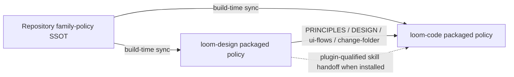

# Independently installable, composable loom plugins — brief

> **Phase**: brainstorming output (`brainstorming` → `writing-plans` handoff)
> **Date**: 2026-08-22
> **Author**: Codex with kouko

## Design-side on-ramp

not fired — this is an architecture refactor under existing behavioral coverage

## Queue relation

unqueued — the user directly authorized this refactor and there is no live `status: bet` entry for it

## Problem

When either loom plugin is installed outside the monkey-skills checkout, its operational instructions must remain resolvable without assuming the sibling plugin occupies a monorepo-relative path, so users can install either plugin alone and combine both without hidden filesystem coupling.

## Users

- Claude Code users — may install `loom-code`, `loom-design`, or both from a marketplace into separate versioned cache directories.
- Codex users — receive independently cached plugin skills and cannot rely on Claude-only dependency resolution.
- Plugin maintainers — need one reviewable source for shared family policy without editing divergent installed copies by hand.

## Smallest End State

Each plugin ships every policy and command it requires for its own standalone behavior. Cross-plugin cooperation uses only plugin-qualified skill names and public repository artifacts; no installed skill follows a relative path outside its own plugin root. A cold-start test assembles isolated plugin roots and proves standalone plus combined operation, while existing station behavior remains unchanged.

- BI-1 — Each loom plugin is operationally self-contained when installed alone.
- BI-2 — Installed loom plugins compose only through public skill names and artifact contracts.
- BI-3 — CI detects any filesystem reference that escapes a loom plugin root.
- BI-4 — CI exercises isolated standalone and combined plugin layouts.

## Current State Evidence

- **Forward**: `loom-design/skills/using-loom-design/SKILL.md` under `## §Intake` sends every design-side session through family reception and relay policy; `loom-design/skills/spec-expansion/SKILL.md` under `### Language policy — layered by artifact role` sends zh-Hant/ja output through adjudication-view.
- **Reverse**: `loom-code/hooks/family-reception.md` under `## Family map` is the current policy source consumed by design-side routers; `loom-code/hooks/family-relay.md` under `## Family relay discipline` is the current narration policy source.
- **Error**: `loom-code/scripts/check-skill-crossrefs.py` only validates paths against the monorepo checkout, while `docs/loom/backlog/2026-08-17-spec-expansion-skill-md-escapes-plugin-boundary-with-a-relative-path.md` records that the installed cache layout breaks the reference.
- **Data**: plugin manifests in `loom-code/.claude-plugin/plugin.json` and `loom-design/.claude-plugin/plugin.json` package separate `skills/` roots; the public handoff data is `PRINCIPLES.md`, `DESIGN.md`, `ui-flows.md`, and the loom change-folder.
- **Boundary**: `[FRAGILE]` Claude and Codex install plugins into separate versioned cache roots, demonstrated by `/Users/kouko/.codex/plugins/cache/monkey-skills/loom-code/0.96.1` and `/Users/kouko/.codex/plugins/cache/monkey-skills/loom-design/0.4.0`.
- **Evidence paths**:
  - `loom-design/skills/using-loom-design/SKILL.md` — `## §Intake`
  - `loom-design/skills/spec-expansion/SKILL.md` — `### Language policy — layered by artifact role`
  - `loom-code/hooks/family-reception.md` — `## Family map`
  - `loom-code/hooks/family-relay.md` — `## Family relay discipline`
  - `loom-code/scripts/check-skill-crossrefs.py` — `find_broken_crossrefs`
  - `docs/loom/backlog/2026-08-17-spec-expansion-skill-md-escapes-plugin-boundary-with-a-relative-path.md` — `The defect`
  - `docs/loom/backlog/2026-08-10-foreign-repo-cold-start-probe-for-plugin-shipped-mechanisms.md` — `Candidate mechanism`
  - `docs/loom/backlog/2026-08-12-loom-plugin-consolidation-needs-sync-cost-data.md` — `SHIPPED 2026-08-17`
  - `loom-code/.claude-plugin/plugin.json` — `name: loom-code`
  - `loom-design/.claude-plugin/plugin.json` — `name: loom-design`

## Decision

Keep `loom-code` and `loom-design` as separate release and installation units. Package a governed functional copy of shared family policy inside each plugin, generated from one repository source and protected by drift tests; replace every cross-plugin filesystem reference with a local policy reference, a plugin-qualified skill name, or a named artifact contract. Do not declare either plugin as a mandatory dependency of the other, because standalone installation is a required outcome. Add isolated-layout tests rather than treating source-tree resolution as delivery proof.

- BI-5 — Shared family policy has one repository source and one packaged copy per consuming plugin.
- BI-6 — Neither loom plugin declares the other as a mandatory installation dependency.

## Out of Scope

- Merging the two plugins into one package.
- Adding a third runtime `loom-core` plugin that users must install.
- Reworking station behavior, artifact schemas, or the loom pipeline sequence.
- Fixing the separate same-basename pytest collection limitation.
- Publishing, tagging, pushing, or merging a release.

## Alternatives Considered

| Alternative | Who ships it / source | Benefit | Why rejected |
|---|---|---|---|
| Mandatory plugin dependency with a version range | Claude Code official plugin dependency documentation: https://code.claude.com/docs/en/plugin-dependencies | Automatic installation and compatibility enforcement on Claude Code | Makes one plugin unable to stand alone and does not provide the same contract on Codex. |
| Bundle both plugins behind one installer | Claude Code official bundle documentation on the same page | One install command while retaining two internal plugins | Useful as an optional convenience later, but does not remove hidden internal paths and is not cross-host. |
| One repository SSOT with packaged functional copies | Existing `loom-code/scripts/distribute.py` and `verify-drift.py` pattern | Standalone runtime behavior, one edit source, testable drift | Chosen; adds a small generated-copy surface but directly satisfies the installation requirement. |

Japanese search note: searches for official Japanese documentation on plugin dependency and shared-package patterns returned no relevant first-party result; the implementation choice therefore relies on the current English Claude Code documentation plus this repository's already shipped functional-copy mechanism.

## What Becomes Obsolete

- BI-8 — Cross-plugin `../../../loom-code/...` filesystem links are removed.
- BI-9 — Design-side instructions that name `loom-code/hooks/*` as files to read at runtime are replaced by local packaged references.
- BI-10 — Source-tree-only cross-reference success is no longer accepted as proof of installability.

## Open Questions

N/A — no unresolved question: the user selected the separate-but-composable direction, and the remaining choices are checkable implementation details within that scope.

## Diagrams

The key boundary is that both plugins contain what they execute and share only named contracts.

