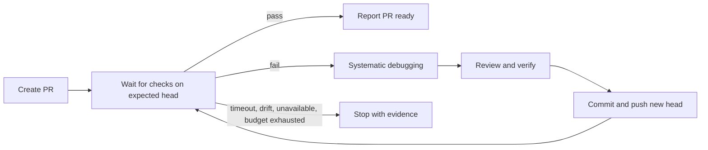

# Post-PR CI loop — brief

> **Phase**: brainstorming output (`brainstorming` → `writing-plans` handoff)
> **Date**: 2026-08-23
> **Author**: Codex, confirmed by kouko's instruction to implement

## Design-side on-ramp

not fired — this extends an existing close-out workflow without adding a product or interface surface

## Queue relation

unqueued — explicitly requested follow-up to the just-finished Loom workflow work; the queue has no live bet

## Problem

When Loom opens a pull request, the operator needs the same session to wait for CI and repair failures so that “PR ready” means the current PR head was actually checked, not merely pushed.

## Users

- Loom users closing a development branch in Claude Code or Codex — already have `git`, authenticated `gh`, and the existing review/debug/verification skills.
- Maintainers of repositories with one or more GitHub PR checks — need bounded waiting and must retain authority over merge.

## Smallest End State

After `gh pr create`, finishing waits for every check attached to the current PR head. A passing set reaches the existing PR-ready report; a failing set enters one bounded repair cycle through existing debugging, review, verification, commit, and push gates before waiting again. Timeout, head drift, missing checks, unavailable GitHub state, or an exhausted repair budget stop with an actionable report; merge remains human-only.

- BI-1 — Finishing waits for all checks attached to the PR's current head and classifies the terminal result deterministically.
- BI-2 — A failed result enters a bounded repair loop that reuses existing debugging, review, verification, commit, and push gates before checking the new head.
- BI-3 — Timeout, head drift, missing checks, operational errors, and repair-budget exhaustion stop safely with actionable evidence.

## Current State Evidence

- **Forward**: `loom-code/skills/finishing-a-development-branch/SKILL.md` §Default flow Step 11 currently ends after `gh pr create` and merge guidance; the final report therefore has no CI evidence.
- **Reverse**: `loom-code/skills/using-loom-code/references/continuous-mode.md` §Stop contract defines “PR-open reached” as the terminal, so the terminal must move to PR-open plus checked CI without weakening “never auto-merge”.
- **Error**: `loom-code/skills/finishing-a-development-branch/SKILL.md` §Default flow Step 5 currently routes local test failure to `tdd-iron-law` or `systematic-debugging`; the CI failure path can reuse that boundary.
- **Data**: `gh pr checks --json bucket,name,link,state,workflow` supplies PR-wide check state; `gh pr view --json headRefOid` supplies the PR head identity.
- **Boundary**: `[API] [ASYNC] [FRAGILE]` GitHub CLI reads asynchronous GitHub check state and may return unavailable, pending, cancelled, or incomplete data.
- **Evidence paths**:
  - `loom-code/skills/finishing-a-development-branch/SKILL.md` — `11. Open the PR — no ask`
  - `loom-code/skills/using-loom-code/references/continuous-mode.md` — `PR-open reached`
  - `loom-code/skills/systematic-debugging/SKILL.md` — `REPRODUCE → ISOLATE → HYPOTHESIZE → VERIFY`
  - GitHub CLI manual — `gh pr checks`, JSON `bucket`, exit code 8 for pending checks
  - GitHub Docs (JA) — workflow run history and failed-log inspection with `gh run view`

## Decision

Add one stdlib-only helper under `loom-code/scripts/` that polls PR-wide checks, binds every poll to the expected PR head, applies explicit timeout and no-check grace rules, and emits one JSON result plus stable exit codes. Extend `finishing-a-development-branch` with an internal post-PR CI phase that calls this helper, delegates failures to existing skills, and permits at most two automated repair attempts before stopping.

When SDD completes an approved autonomous plan, it enters this close-out flow automatically; `一站一站來` remains the opt-out. Do not add a new user-visible skill, a persistent bot, or automatic merge.

- BI-4 — The helper and finishing orchestration together own the post-PR CI loop without creating another skill entry point.
- BI-6 — Semantic CLI argument errors use the published argument-error exit code, and repair/PR-carrier ordering is explicit.
- BI-7 — An approved autonomous plan enters `finishing-a-development-branch` after its final task without a separate user prompt.

## Out of Scope

- Persistent GitHub App, webhook service, daemon, or work that continues after the current agent session ends.
- Automatic merge, deploy, force-push, workflow rerun, or changing repository branch-protection settings.
- Supporting CI providers whose results are not represented as GitHub PR checks.
- Guessing a fix from logs without entering `systematic-debugging`.

## Alternatives Considered

| Alternative | Who ships it / source | Why rejected |
|---|---|---|
| Direct `gh pr checks --watch --fail-fast` prose only | GitHub CLI manual (EN) | Has no bounded timeout or explicit PR-head drift contract and cannot normalize no-check/operational states for both hosts. |
| Watch individual workflow runs with `gh run watch` | GitHub CLI manual and GitHub Docs (JA) | A PR can have multiple workflow and non-Actions checks; selecting one run is narrower than PR readiness. |
| Persistent webhook bot | Common server-side CI automation pattern | Adds deployment, credentials, lifecycle, and concurrency infrastructure beyond the requested in-session Loom mechanism. |

## What Becomes Obsolete

- BI-5 — The current assumption that successful PR creation is the final PR-ready terminal is replaced by CI-verified readiness.

## Open Questions

N/A — no unresolved question: two repair attempts and a 30-minute default timeout are conservative bounded defaults exposed as helper flags.

## Diagrams

Read this as a bounded loop: every repair produces a new head and repeats the same CI gate.

