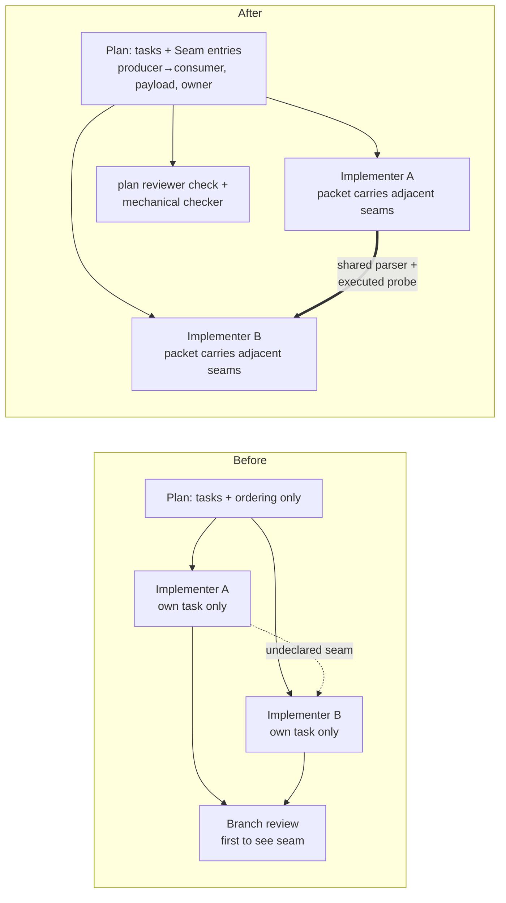

# Cross-task seam contracts — brief

> **Phase**: brainstorming output (`brainstorming` → `writing-plans` handoff)
> **Date**: 2026-08-25
> **Author**: Claude (Fable 5) with kouko — scope #1–#4 explicitly approved by kouko in-session; #5 (split-philosophy gate) explicitly deferred by kouko

## Design-side on-ramp

not fired — internal loom-code mechanism work (plan schema / agent contract / reviewer prompt), no product-shaped user-facing surface; row 1 additionally covered by standing direct (KICKOFF-DEFAULTS.md)

Loom-init offer: N/A — repo already has docs/loom/backlog/ store

## Queue relation

unqueued — no live `status: bet` entries exist; this arc advances the OPEN backlog entry `2026-08-24-planning-file-boundaries-vs-data-flow-boundaries` (its contract-layer half: seam declaration + mechanical check; its split-axis-decision half remains open, deferred as #5 by the user)

## Problem

When a loom plan splits work across parallel implementer subagents, the seam between two tasks — the data shape one task produces and a sibling consumes — is owned by no task. When two agents each satisfy their own RED test but disagree about the shared shape, integration fails.

- The plan schema records only ordering (`Dependencies`); each implementer sees only its own task; the first thing that can see the seam is the post-hoc whole-branch review.
- The repo's own memory records this failure class 6+ times (PR #705 tolerant-reader/strict-writer, PR #479 three field-shape mismatches, duplicated-fallback, guarantee-with-no-owner).

## Users

- kouko (orchestrator operator) — runs SDD arcs in monkey-skills and adopting repos; needs seam mismatches surfaced at plan time, not at branch review
- loom plan authors (orchestrator agents) — need a grammar slot to declare producer→consumer payload contracts; today the only cross-task fields are an ordering enum and read-only context paths
- implementer subagents — dispatched blind to sibling tasks; need the adjacent seam contract in the dispatch packet without receiving the whole plan (context discipline stays)
- plan-document-reviewer + spec-reviewer agents — need a checkable rule ("every dependency edge carries a seam declaration or `payload: none`") instead of judgment-only prose

## Smallest End State

A plan written under the new format leaves no dependency edge without a declared contract, and the contract travels into dispatch and acceptance:

- Every dependency edge declares either a Seam entry (producer task → consumer task, payload shape, owning task that defines the parser/schema) or an explicit `payload: none`.
- The SDD dispatch step copies the seam entries adjacent to a task into that implementer's packet.
- A task pair joined by a payload-bearing seam carries one executed cross-seam probe in the consumer task's acceptance criteria, and both sides import one shared parser/schema definition owned by the declared owner.
- The plan-document-reviewer gains a check that fails a plan whose dependency edge lacks a seam declaration, and a mechanical checker script enforces the same rule so the gate does not rest on reviewer prose alone.
- Success criterion: a fixture plan with an undeclared payload-bearing edge is rejected by both the checker (exit non-zero) and the reviewer check; a fully-declared plan passes.
- Non-criteria: we do not measure real-arc integration-failure reduction in this PR (that data accrues in later arcs), and we do not change which tasks are marked `Independent: true`.

- BI-1 — plan-format defines a Seam grammar: every inter-task dependency edge declares `producer → consumer`, payload shape, and owner, or explicit `payload: none`.
- BI-2 — the SDD dispatch step includes the task's adjacent seam entries in the implementer dispatch packet (and the implementer agent contract names this input slot).
- BI-3 — a payload-bearing seam obligates one executed cross-seam probe in the consumer task's acceptance criteria and a shared parser/schema owned by the seam's declared owner.
- BI-4 — plan-document-reviewer carries a seam-completeness check: a dependency edge with no seam declaration (and no `payload: none`) is a plan defect.
- BI-5 — a mechanical checker script validates seam coverage of a plan document (tested; wired the same way existing plan/brief checkers are wired).

## Current State Evidence

- **Forward** — plan tasks feed SDD's per-task triad; the dispatch packet is assembled from "the task description + context paths + resource paths" (loom-code/skills/subagent-driven-development/SKILL.md, §per-task triad loop, lines ~111-118); adding seam entries changes what every implementer sees.
- **Forward** — plan documents are reviewed by the plan-document-reviewer's 19 checks (loom-code/skills/writing-plans/references/plan-document-reviewer-prompt.md, checks list lines ~29-47), none of which is an interface/seam check; BI-4 extends this list.
- **Reverse** — plan-format.md owns the task-entry schema consumed by plan authors: `Dependencies` is a prose enum `"none" | "Task N completes first" | ...` (loom-code/skills/writing-plans/references/plan-format.md, ~line 110); `Independent: true` is the parallel marker (~line 183); the Seam grammar attaches to these existing fields, not a parallel structure.
- **Reverse** — the implementer Worker Input Contract has exactly four slots — Task / Context / Resource Paths (+test command) (loom-code/agents/implementer.md, §Worker Input Contract, lines ~327-350); BI-2 adds the seam slot here, honoring the standing rule that a SKILL.md rule must also reach the executing agent's contract (backlog 2026-08-04-a-rule-can-ship-into-a-skill-and-never-reach-its-agent-contract).
- **Error** — today a seam mismatch surfaces only at branch scope: code-reviewer's `cross-task-coherence` dimension states per-task review "is structurally blind to sibling tasks" (loom-code/agents/code-reviewer.md, ~lines 524-541); this stays as the last line of defense, unchanged.
- **Data** — the seam payload IS the data: memory records concrete shapes that diverged (`station` vs `name`, `judge`/`role`, dict-key fallbacks) in docs/loom/memory/ (a-reader-and-writer-over-one-file-format-must-share-one-parser.md; cross-module-field-contracts-execute-probes.md; market-canonical-must-satisfy-consumer-field-contract.md).
- **Boundary** — `[FRAGILE]` contract-citation rule: runtime prose contracts under loom skill/agent trees must not cite this repo's docs/ dev records (CLAUDE.md §Contract Citations, checked by loom-code/scripts/check_contract_citations.py) — the new grammar text must carry its rules inline, citing at most external sources.
- **Boundary** — `[FRAGILE]` skill-folder structure hook: subfolders must stay one level deep (`.claude/hooks/validate-skill-folder-structure.sh`); new checker script goes in loom-code/scripts/ like its siblings, and any skill content change requires a plugin version bump (marketplace publishes by version).

**Evidence paths**
- loom-code/skills/writing-plans/SKILL.md §three-criterion framework (~52-64, incl. the "disjoint files ≠ independent" guard)
- loom-code/skills/writing-plans/references/plan-format.md (~110 Dependencies enum, ~183 Independent, ~243 External surfaces, ~262 Reuse-adequacy)
- loom-code/skills/writing-plans/references/plan-document-reviewer-prompt.md (~29-47 checks)
- loom-code/skills/subagent-driven-development/SKILL.md (~111-119 dispatch loop)
- loom-code/agents/implementer.md (~327-350 Worker Input Contract)
- loom-code/agents/code-reviewer.md (~524-541 cross-task-coherence / D7)
- loom-code/skills/subagent-driven-development/checklists/spec-consistency.md (CHK-SPEC-001/002/003/006 — interface checks that today apply to spec documents, not task pairs)
- docs/loom/memory/{a-reader-and-writer-over-one-file-format-must-share-one-parser,cross-module-field-contracts-execute-probes,per-task-review-misses-duplicated-fallback-fix,widening-a-value-grammar-needs-a-consumer-census-at-plan-time}.md
- docs/loom/backlog/2026-08-24-planning-file-boundaries-vs-data-flow-boundaries.md

## Decision

We add a seam-contract layer to the existing file-boundary planning mechanism — we do not change the split axis.

- Build: the Seam grammar bound to existing `Dependencies` edges (BI-1); adjacent seams carried into each dispatch packet via SDD step + implementer contract (BI-2); probe + shared-parser obligation on payload-bearing seams (BI-3); enforcement twice over — reviewer prose check (BI-4) plus a tested mechanical checker (BI-5), because prose-only rules on judgment-shaped properties have been observed to fail in this repo.
- NOT build: a data-flow task-splitting mode; changes to `Independent: true` semantics; runtime typed-contract machinery (LangGraph-style); post-hoc conflict-detection tooling.
- Why: external evidence (arXiv 2603.24284) shows detection without spec restoration adds Δ0.0pp, while richer upfront specification is the effective mechanism; the industry-proven carrier is the dispatch packet (obra/superpowers SDD passes "interfaces and decisions from earlier tasks").
- Cross-cutting constraint (not a separate deliverable; binds BI-1..BI-5): the seam layer attaches to existing plan-format fields and existing checker wiring — no new parallel rule surface, no second document that can drift. (BI-6 retired — folded into this constraint; the number is not reused.)

## Out of Scope

- #5 split-philosophy gate ("is this seam too thick to parallelize?") — deferred by the user until Seam-field data from real arcs exists; remains covered by the open backlog entry's decision half
- Changing `Independent: true` / `Files touched` disjointness semantics in dispatching-parallel-agents
- Runtime typed-contract enforcement (Pydantic/schema validation at agent-message level)
- Retrofitting existing plans/specs under docs/loom/ to the new grammar (new plans only)
- domain-teams knowledge-layer sync (touched files are loom-code skill references + agents, not the standards/rubrics/checklists sync set — verify at plan time via distribute.py manifest)
- MEMORY/backlog store edits beyond closing notes at finish time

## Alternatives Considered

| Alternative | Who ships it / source | Why rejected |
|---|---|---|
| Auto-infer task dependencies at execution time, no declared interfaces | Kiro (kiro.dev/docs/specs/) | Inference recovers ordering, not payload shape; loom's failures are shape mismatches, which inference cannot see |
| Document-only contract (thicker upstream spec, no machine check) | BMAD story files, Spec Kit phase artifacts, MetaGPT structured docs | BMAD's own filed issue: agents work in isolation with no coordination point; prose-only rules failed in this repo's dogfoods (weak-model caveat evidence) |
| Post-hoc conflict detection (stronger reviewer / AST diff) | Specification Gap paper's AST detector (arXiv 2603.24284) | Measured Δ0.0pp benefit without spec restoration (−6.6pp combined case); loom already has branch review as last defense |
| Runtime typed handoff (state schema + reducers + validation-retry) | LangGraph / CrewAI / AutoGen | Loom plans/packets are prose artifacts, not runtime graphs; the analogous move IS the checker script + probe obligation (BI-3/BI-5) |
| Switch split axis to data-flow pipelines | (traditional dataflow decomposition) | Sacrifices one-failing-test verifiability; contradicts user's explicit #5 deferral; backlog entry keeps this question open with a mixed-rule direction |

Research basis: this session's deep-research run (16 sources, 39 quorum-verified claims, EN+JP queries) recorded in the operator's research note (2026-08-25, Obsidian vault) — per Axis-4 protocol, EN and JP sources agreed on the spec-first direction.

## What Becomes Obsolete

- BI-7 — writing-plans SKILL.md's judgment-only guard sentence ("disjoint files ≠ independent … a consumer task that imports a symbol the producer task defines") is subsumed: it stays as motivation but must now point at the Seam grammar as the operative rule (reworded in the same PR, not deleted — it is the narrative hook).

## Open Questions

(none — grammar details, checker wiring site, and version-bump number are plan-time decisions inside approved scope)

## Diagrams

Seam ownership before/after — the gap this change closes (the seam between parallel tasks gains a declared owner and a probe):

