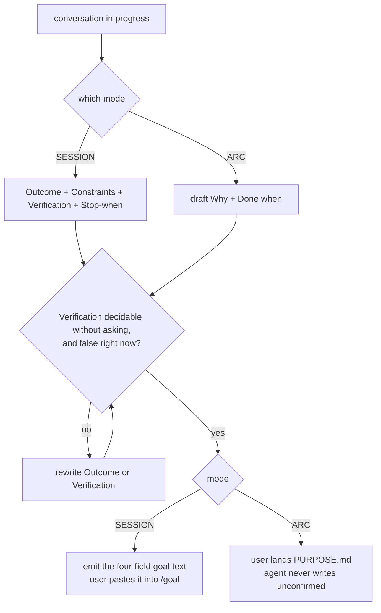

# goal-create — brief

> **Phase**: brainstorming output (`brainstorming` → `writing-plans` handoff)
> **Date**: 2026-08-27
> **Author**: agent (Opus 5) with kouko

## Design-side on-ramp

fired: rows 3 — user chose direct

## Queue relation

unqueued — this arc started from a conversation rather than from the queue; the one live bet entry (`2026-08-21-kumiko-zaiku-app-icons-queue-layer-migration`) stays bet and is not displaced

## Problem

When a long design conversation has produced agreement but no artifact, I want to fix the agreed goal and its acceptance condition in one pass, so I can hand the agent something it can act on and check itself against instead of re-deciding the same thing next session.

## Users

- **Repo owner driving loom arcs (kouko)** — works across Claude Code and Codex; Codex has no Workflow driver, so anything that only exists inside `loom-pipeline.js` is invisible there. Discussions diverge mid-stream, not only at arc kickoff.
- **The agent in a later session** — reads `docs/loom/PURPOSE.md` to justify a routing or scoping decision. Needs a quotable, falsifiable `Done when`, not a vision sentence.
- **A repo adopting loom cold** — `loom_init.py` scaffolds an empty `PURPOSE.md` and `check_north_star_link.py` then fails it for being unanswered, with no procedure anywhere that produces the answer. This is the population `PURPOSE.md`'s own `Done when` names.

## Smallest End State

`loom-workflow:goal-create` ships as one skill with two modes over one shared quality bar. SESSION mode converts the conversation in progress into a goal written in one four-field shape this arc synthesises from both vendors' published guidance — Outcome, Constraints, Verification, Stop-when — ready to paste into Claude Code's or Codex's `/goal`. ARC mode drafts or revises `docs/loom/PURPOSE.md`'s `Why` and `Done when` for the user to land. Success criterion: on a real conversation, the skill produces a goal whose Verification field names the command or artifact whose result decides the outcome, such that a second reader can apply it without asking the author anything. Explicit non-criterion: this arc does not measure whether goal-setting reduces rework or shortens arcs — that evidence is what T1 escalation would need, and it does not exist yet.
<!-- narrative: the two modes, the shared bar, and the success criterion are one argument — each sentence names the constraint the next one depends on, and splitting them into bullets would duplicate the BI list directly beneath. -->

- BI-1 — `loom-workflow:goal-create` exists as one skill carrying two named modes, SESSION and ARC, selected by what the user asks for rather than by the agent's inference.
- BI-2 — SESSION mode emits a goal in the four-field canonical shape (Outcome / Constraints / Verification / Stop-when), within Claude Code's documented 4,000-character limit, and points at a file rather than inlining detail when the goal would exceed it. Codex's public goal pages state no limit; the same budget is applied to both for portability, not because Codex is known to impose one.
- BI-3 — ARC mode emits a draft `Why` and `Done when` for `docs/loom/PURPOSE.md`; the user lands it, the agent never writes the file without that confirmation.
- BI-4 — Both modes reject an acceptance condition that already holds at authoring time, on the same reasoning that a test must first fail. A condition that cannot be decided either way is rejected on the same rule. This judgment stays prose and is not claimed to be mechanical; the floor in BI-13 sits beneath it and warns rather than deciding.
- BI-5 — The skill states the PURPOSE-citation boundary: `PURPOSE.md` is a source an agent quotes to justify an inference, never authority to settle a choice the on-ramp gate or the betting rule reserves for the user.
- BI-6 — `finishing-a-development-branch`'s standing offer to write a `PURPOSE.md` when one is absent names this skill as the procedure that does it.
- BI-8 — Every field of a produced goal carries a provenance tag: `user-said` with the words quoted, `derived` with the anchor it was inferred from, or `proposed` meaning the agent supplied it and the user has not confirmed it.
- BI-9 — The skill refuses to emit a goal unless it can fill two input slots: the current state (what is true now, cited to something readable) and the wanted difference (what must become true instead). The current state is what Verification is written against; the wanted difference is what Outcome states. When either is empty, the skill names the empty one and emits no goal.
- BI-11 — The skill never fires on its own, and its description says so. It is named as an available option at exactly two points where the need is already visible: `handoff`'s Prepare mode, and `check_north_star_link.py`'s exit-2 message. Naming it is not firing it. When `brainstorming` is already running for the same work, `brainstorming` keeps discovery and this skill runs after its brief exists rather than competing for the same turn.
- BI-12 — `check_north_star_link.py`'s exit-2 message names this skill, so the one surface a cold adopting repo actually hits stops being a dead end. The check's exit codes and its opacity to `PURPOSE.md`'s body are unchanged.
- BI-13 — A `goal_lint.py` enforces the mechanical floor and nothing above it: the four field labels present and non-empty, a stop clause present, at least one backticked command inside Verification, and the character limit. Everything that needs intent read — undecidable wording, dependence on a person — is a warning, never a failure, because the measured cost of a false failure on a gate is that its user stops reading it.
- BI-14 — The floor's checks work on goal text written in Traditional Chinese, English and Japanese, and its tests cover all three. A language-bound check over goal text fails silently rather than loudly, so untested language coverage is indistinguishable from a check that does nothing.
- BI-15 — ARC mode is conditional and says so out loud. When the repository has no `docs/loom/PURPOSE.md` and no loom store to hold one, ARC mode reports itself not applicable and names the reason; it neither falls silent nor creates the artifact, since scaffolding it belongs to loom-init. SESSION mode carries no such precondition and stays available everywhere, which is why it is the default mode.
- BI-10 — The Verification field is written so that Claude Code's evaluator can see the evidence: it names the check to run and requires that check's output to be surfaced in the conversation, because that evaluator reads only the transcript.

## Current State Evidence

- **Forward**: `loom-code/skills/finishing-a-development-branch/SKILL.md` — "before listing betting candidates, print `docs/loom/PURPOSE.md`" and its "offer to write one" — the betting moment gains a named procedure instead of a bare offer. `loom-code/scripts/check_north_star_link.py` — "`PURPOSE.md` is a FOUNDATIONAL artifact" — its exit-2 *PURPOSE unanswered* branch becomes recoverable rather than a dead end. `loom-code/skills/brainstorming/SKILL.md` Axis 0 — deliberately untouched; the new skill adds no step to the kickoff sequence.
- **Reverse**: `loom-code/scripts/templates/PURPOSE.md` — "**Done when:**" — the format SSOT the skill points at and must not restate. `loom-code/scripts/loom_init.py` — "its content is human-owned and loom-init never overwrites it" — scaffolds the file this skill fills. `loom-workflow/.claude-plugin/plugin.json` `description` — must gain the skill's slug or `check-plugin-description-skill-coherence` fails.
- **Error**: `loom-code/scripts/check_north_star_link.py` exit codes 0 / 1 / 2 — the skill neither weakens nor duplicates this check; a repo whose user has not landed a draft still fails exactly as it does today.
- **Data**: `docs/loom/PURPOSE.md` — "**Why:**" / "**Done when:**" — the only persisted output, and only after user confirmation. `loom-code/scripts/templates/backlog-README.md` — "promotion to `bet` is user-only; agents never promote" — an optional backlog-entry draft may be emitted at `status: open` and never above it. SESSION mode persists nothing by default.
- **Boundary**: `[API]` Claude Code `/goal` — https://code.claude.com/docs/en/goal — "The evaluator judges your condition against what Claude has surfaced in the conversation. It doesn't run commands or read files independently"; its three named elements are "One measurable end state" / "A stated check" / "Constraints that matter", the condition caps at 4,000 characters, and a turn clause such as "or stop after 20 turns" bounds the run. `[API]` Codex `/goal` — https://learn.chatgpt.com/use-cases/follow-goals — "It should define what Codex should achieve, what it shouldn't change, how it should validate progress, and when it should stop", and its four-step recipe "Name one objective and one stopping condition. Point Codex at the files, docs, issue, logs, or plan it must read first. Define the commands or artifacts that prove progress. Tell Codex to work in checkpoints and keep a short progress log."; https://learn.chatgpt.com/docs/long-running-work names the columns Outcome / Constraints / Verification and says "The goal text becomes both the first prompt and the completion criteria for the task." The same page also documents the conversational path this skill's SESSION mode occupies: "ask Codex to help: start by having a conversation about what you want to build, then ask it to directly set a goal and start working." Codex needs `[features] goals = true`. Neither page states a length limit, and neither states how Codex gathers its completion evidence — so the one documented difference is that Claude Code's evaluator is external and transcript-bound, while Codex's completion criteria are carried by the executing agent itself. The skill emits text for a human to paste and never invokes either command. `[FRAGILE]` `loom-code/scripts/check_contract_citations.py` — "the closed protocol filenames every host repo owns" — no new repo-level filename is introduced, so that list stays unchanged. `[FRAGILE]` `.claude-plugin/marketplace.json` description must stay verbatim-identical to the plugin manifest's.
- **Evidence paths**: `loom-code/skills/finishing-a-development-branch/SKILL.md`; `loom-code/scripts/check_north_star_link.py`; `loom-code/scripts/templates/PURPOSE.md`; `loom-code/scripts/templates/backlog-README.md`; `loom-code/scripts/loom_init.py`; `loom-code/hooks/family-reception.md`; `loom-code/skills/brainstorming/SKILL.md`; `loom-code/skills/brainstorming/references/handoff-brief-format.md`; `loom-design/skills/product-principles/SKILL.md`; `loom-design/skills/using-loom-design/SKILL.md`; `loom-design/skills/using-loom-pipeline/SKILL.md`; `loom-design/scripts/pipeline/driver_30_seg1.js`; `docs/loom/specs/2026-08-20-dissolve-direction-layer.md`; `docs/loom/PURPOSE.md`; `docs/loom/KICKOFF-DEFAULTS.md`; `docs/loom/backlog/2026-07-23-general-goal-loop-harness-extraction.md`; https://code.claude.com/docs/en/goal; https://learn.chatgpt.com/use-cases/follow-goals; https://learn.chatgpt.com/docs/long-running-work; https://platform.claude.com/docs/en/test-and-evaluate/define-success.

## Decision

We add one cross-cutting skill to `loom-workflow` and we do not add a pipeline station. The skill owns the act of producing a goal and its acceptance condition in two modes. The two share one principle — the condition must be decidable without asking the user, and false when written — but little else: SESSION's fields, character budget and transcript-bound evidence serve a Haiku evaluator that lives for minutes, while ARC's serve a file read by humans and agents for the repo's lifetime. They ship as one skill for discovery-surface economy, not because the shared bar is thick: two skills cost a second description slot in a list with a measured eviction ceiling, and the phrasing that reaches for either one ("let's pin down the goal") does not sort itself between them. It lands in `loom-workflow` because goal divergence happens at any point in a session, which is the shape of that plugin's existing skills, and because `loom-design` has explicitly renounced authoring `PURPOSE.md`. The trade-off accepted here is that a cross-cutting skill has no enforcement: nothing compels it to fire, so if the goal is never set the process notices nothing. We take that deliberately, because the evidence needed to justify enforcement — instances where a missing goal actually cost something, at arc kickoff specifically — does not exist yet, and a governance layer built ahead of that evidence is the failure this repo already paid for once with the DIRECTION layer. The four-field output shape is not this arc's invention: Anthropic names one measurable end state, a stated check, and the constraints that matter, while OpenAI names Outcome, Constraints, and Verification for the same job, so the two vendors converge on its first three elements independently. The fourth, Stop-when, is first-class for OpenAI — its recipe opens "Name one objective and one stopping condition" — and optional guidance for Anthropic, whose docs suggest a turn clause such as "or stop after 20 turns" to bound the run; naming it a required slot is this brief's own choice. The skill also has to survive being installed on its own: this family's standing decision is that no plugin declares another as a mandatory dependency and standalone installation is a required outcome, so the loom-bound half degrades loudly rather than assuming a store that may not exist. The refusal path has the same kind of backing — OpenAI's own guidance sends an unclear goal to `/plan` first and back to a goal only once it carries measurable success criteria.
<!-- narrative: the placement decision, the cost it accepts, and the two independent groundings are a single chain of reasoning; broken into bullets each clause loses the concession it answers. -->

The skill is named `goal-create`, chosen by the user over `goal-contract` and `setting-a-goal`. Nothing in this arc's evidence distinguishes the three, so this is recorded as a taste call rather than dressed as a finding; the name also matches the branch this arc is developed on.

- BI-7 — Goal-setting enters loom as one un-enforced cross-cutting skill in `loom-workflow`, with the on-ramp row and the driver station explicitly deferred until instances of the failure are recorded.

## Out of Scope

- Adding an on-ramp row for goal-setting (T1) or a `loom-pipeline.js` segment station (T2). Deferred until the failure is observed at arc kickoff at least three times, each observation recorded as a `docs/loom/memory/` entry naming the arc it cost something in. A count with no ledger can never reach three, so the ledger is part of the deferral, not an afterthought.
- Any new repo-level artifact filename, such as a `GOALS.md`. Both persistent outputs reuse artifacts loom already owns.
- Creating the loom store when it is absent. A repository without one gets ARC mode's not-applicable report, not a scaffolding side effect; `loom-init` owns that act and this skill does not duplicate it.
- Any checker that parses `PURPOSE.md`'s body. Its body stays opaque to `check_north_star_link.py`; quality is reviewed by a human, not asserted by a script.
- Promoting a backlog entry to `status: bet`. That stays user-only, and this skill does not become a route around it.
- Changing `brainstorming`'s Axis 1 or Axis 3. Their success-criteria work stays where it is; this skill does not duplicate or supersede it.
- Integrating with `think-orbit`'s `GOAL` node type. A shared identity between the two goal representations is a separate question.
- Invoking `/goal` on the user's behalf on either host.
- Any iteration or convergence loop that drives work until the condition holds. That capability is already filed as `docs/loom/backlog/2026-07-23-general-goal-loop-harness-extraction.md` (`status: open`, blocked on the Rule of Three). The relationship is complementary, not overlapping: this skill authors the definition of better that such a harness would consume, and building even a thin loop here would pre-empt that entry's extraction.

## Alternatives Considered

| Alternative | Who ships it / source | Why rejected |
|---|---|---|
| Make goal-setting a pipeline station (T1 on-ramp row, or T2 driver segment) | This arc's own evaluation of `using-loom-pipeline` + `family-reception.md` | Buys enforcement at a governance cost this repo has measured once already: the DIRECTION layer carried an artifact, a template, a charter, two generator verbs, a freshness checker, and three test files that existed only for it, while "Ten of the twelve loom repos on this machine have never had a queue layer at all". T2 also does not exist on Codex at all. |
| Extend `brainstorming` instead of adding a skill | Option B in this conversation | Cheapest and overlaps nothing, but reaches only conversations that entered `brainstorming`, and the ARC half has no home there at all. The reach argument alone would prove too much — a user-invoked skill reaches only conversations whose user remembers it, and `brainstorming` at least has automatic routing — so the deciding reason is the ARC half, not reach. |
| Leave SESSION mode to each host's native flow | https://learn.chatgpt.com/use-cases/follow-goals — "ask Codex to help: start by having a conversation about what you want to build, then ask it to directly set a goal and start working." | Rejected on measurement. In a four-seed A/B at equal model, the bare arm produced a goal every time, twice targeting work already merged or already overturned, once over the character limit, and never with the four fields; the ruled arm refused three seeds with repo-verified reasons and, on the one genuinely open seed, produced a passing goal without over-refusing. The bare host drafts fluently and is confidently wrong about whether there is anything to draft. Numbers and counter-evidence: `../audits/2026-08-27-goal-create-experiments.md`. |
| Put the skill in `loom-design` | kouko's proposal, on the reasoning that direction belongs early | `loom-design` renounced this turf deliberately: `product-principles/SKILL.md` says of `PURPOSE.md` "read it when present but do not author it", and 0.4.0 moved the North Star out of `PRINCIPLES.md`. Adopting it back means reversing that boundary in the router, the plugin description, the README and the principles contract. Sequencing early does not imply membership in the four-station pipeline; goal-setting precedes even discovery. |
| ARC mode only, no SESSION mode | Option C in this conversation | Fills the real vacuum but leaves the reported pain — mid-conversation divergence — untouched. |
| SESSION mode only, no ARC mode | Implied by the `/goal` framing | Ships the immediately usable half but leaves `PURPOSE.md` with no producer, which is the one gap no other skill covers. |

## What Becomes Obsolete

- Nothing is deleted in this PR. The nearest candidate, `finishing-a-development-branch`'s bare offer to write a `PURPOSE.md`, is rewritten to name this skill rather than removed — that rewrite is BI-6, not a deletion.

## Open Questions

(empty — the on-ramp and queue-relation gates were answered by the user on 2026-08-27, and the two design questions the adversarial review raised were resolved by measurement the same day. Both experiments, including the evidence that argues against their conclusions, are recorded in `../audits/2026-08-27-goal-create-experiments.md`: SESSION mode ships because its value is the refusal and the fields rather than the drafting, and the bar ships as a syntactic floor with the judgment half left as prose.)

## Diagrams

The one branch worth seeing is where the two modes converge: both pass the same condition bar, and both stop at a user decision rather than writing on their own.

