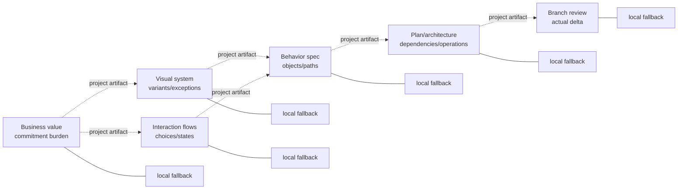

# Stage-specific complexity gates — brief

> **Phase**: brainstorming output (`brainstorming` → `writing-plans` handoff)
> **Date**: 2026-08-27
> **Author**: agent with kouko

## Design-side on-ramp

fired: rows 1, 2, 3 — user chose direct

The user explicitly chose to design this mechanism in the current Loom arc
after comparing a centralized score, a shared orchestrator, and stage-owned
lenses.

## Queue relation

in-queue: 2026-08-27-stage-specific-complexity-gates

## Problem

When Loom advances work from business intent through design and engineering,
the maintainer wants each stage to expose the complexity it creates in that
stage's own terms, so accidental complexity is challenged before it becomes an
opaque downstream cost without turning independently installable plugins into
one coupled system.

## Users

- **Product and business planners** — need to compare continuing commitments,
  coordination cost, and opportunity cost rather than code metrics.
- **Flow and interface designers** — need to see navigation, state, choice,
  variant, and exception burden before those decisions become requirements.
- **System designers and implementers** — need to challenge components,
  dependencies, configuration, migration, and operating burden before and
  after code exists.
- **Independent Loom plugin adopters** — may install only `loom-design` or only
  `loom-code`; a missing sibling plugin or upstream artifact must not disable
  the installed plugin's own judgment.

## Smallest End State

Each in-scope stage extends one checkpoint it already owns with a native
complexity lens. Every lens states when it applies, asks stage-specific
questions, records the four thin handoff meanings—added complexity, why it is
worthwhile, what can be removed or avoided, and downstream risk—and permits a
reasoned N/A where the stage adds no material complexity. A simplification is
valid only when it preserves that stage's required outcome; otherwise the lost
outcome is an explicit scope trade-off. Success means cold
standalone installs still evaluate locally, composition uses only optional
project-owned `docs/loom/` artifacts, and tests reject private cross-plugin
paths. A universal score, identical checklist, new orchestration layer, or
cross-plugin synchronization system is explicitly not a success criterion.
<!-- narrative: the success and non-success clauses jointly define the smallest mechanism and cannot be separated without making a larger implementation appear compliant -->

- BI-1 — Every in-scope Loom stage owns a stage-specific complexity lens at an existing checkpoint.
- BI-2 — Every lens communicates added complexity, worth, outcome-preserving deletion or avoidance, and downstream risk in stage-native artifact language, with a reasoned N/A path.
- BI-3 — Each plugin evaluates independently and composes only through optional project-owned artifacts and public capability detection.
- BI-4 — Tests protect stage behavior, cold standalone installation, public composition, and the absence of private cross-plugin path dependencies.

## Current State Evidence

- **Forward**: `loom-design/skills/business-value/SKILL.md` distinctive phrase
  "Why now? Why now rather than later or never?"
  currently judges `Why now`, `Why me`, and `Opportunity cost`, so business
  complexity belongs there rather than in an engineering reviewer.
  `loom-design/skills/spec-expansion/SKILL.md` §"Phase ③ 自動拓展矩陣" already
  converts surviving paths into requirements, making its prune step the last
  design-side point before behavioral complexity becomes downstream work.
- **Forward**: `loom-code/skills/writing-plans/SKILL.md`
  §"Plan size ceiling — critical-path depth ≤5"
  bounds task size before execution. `loom-code/agents/code-reviewer.md`
  §"Deletion-first" already evaluates new abstractions and concrete simpler
  alternatives after implementation; the two stations therefore cover
  architecture/plan intent and actual code delta without another reviewer.
- **Reverse**: `loom-design/skills/using-loom-design/SKILL.md`
  §"Skill priority — decision order for interface-design tasks"
  dispatches business, visual-system, flow, and specification work to the
  owning skills. `loom-code/skills/using-loom-code/SKILL.md`
  §"Skill priority — decision order for coding tasks"
  dispatches discovery, planning, implementation, and review; these routers
  remain unchanged because the new judgments live inside existing stations.
- **Error**: `loom-design/skills/spec-expansion/SKILL.md` distinctive phrase
  "If no high-priority paths survive pruning, report it" already makes an
  empty result explicit. `loom-code/skills/writing-plans/SKILL.md` distinctive
  phrase "If reviewer returns `NEEDS_REVISION`" already loops a rejected plan.
  The new lenses preserve those stage-native failure paths rather than adding
  a family-level verdict.
- **Data**: stage outputs already persist in project-owned Loom artifacts:
  `business-value.md`, `DESIGN.md`, `ui-flows.md`, change-folder proposals,
  briefs/plans, and review verdicts. The handoff is semantic content inside
  those artifacts, not a new shared schema or store.
- **Boundary**: `[FRAGILE]` `scripts/check_plugin_boundaries.py` and
  `scripts/test_loom_plugin_install_layout.py` encode the cold-install boundary;
  `scripts/test_loom_plugin_composition.py` proves optional composition through
  plugin-qualified public skills and `docs/loom/` artifacts.
- **Evidence paths**:
  `loom-design/skills/business-value/SKILL.md` distinctive phrase
  "Why now? Why now rather than later or never?";
  `loom-design/skills/business-value/assets/business-value-template.md`;
  `loom-design/skills/design-system/SKILL.md` §"Scope — visual system only, NOT flows";
  `loom-design/skills/design-system/references/design-md-schema.md` §"The 8 canonical sections (in order)";
  `loom-design/skills/interaction-flows/SKILL.md`;
  `loom-design/skills/spec-expansion/SKILL.md` §"The three phases";
  `loom-code/skills/brainstorming/SKILL.md` §§"Axis 3" and "Axis 5";
  `loom-code/skills/writing-plans/SKILL.md` §"Plan size ceiling — critical-path depth ≤5";
  `loom-code/skills/requesting-code-review/SKILL.md` §"Verdict structure";
  `loom-code/agents/code-reviewer.md` §"D10 — Deletion-First (whole-branch)";
  `scripts/check_plugin_boundaries.py`;
  `scripts/test_loom_plugin_install_layout.py`;
  `scripts/test_loom_plugin_composition.py`.

## Decision

We will federate complexity judgment: each stage adds a small native lens to an
existing checkpoint, and no stage delegates its verdict to a universal
complexity service. Business-value judges commitment and coordination burden;
visual-system design judges vocabulary, variants, exceptions, and token debt;
interaction-flow design judges choices, states, branches, and recovery burden;
spec expansion judges surviving objects, roles, states, paths, and obligations;
planning judges components, dependencies, migrations, configuration, and
operational load; branch review verifies the complexity actually introduced by
the diff. The only shared contract is the meaning of four questions, expressed
locally rather than copied as identical prose. An upstream conclusion may
inform a downstream stage when its project artifact exists, but absence never
blocks or weakens the downstream stage's own assessment.
<!-- narrative: the sentences assign ownership stage by stage and then state the one composition rule that keeps those assignments independent -->

- BI-5 — Business-value evaluates commitment, coordination, and opportunity complexity in its existing worth-it gate.
- BI-6 — Design-system evaluates visual vocabulary, variant, exception, and token complexity inside the canonical DESIGN.md surface.
- BI-7 — Interaction-flows evaluates choice, navigation, state, branch, recovery, and handoff complexity in ui-flows.md.
- BI-8 — Spec-expansion evaluates the behavioral complexity that survives its existing expansion-and-prune phase.
- BI-9 — Writing-plans evaluates intended architecture and implementation complexity before execution.
- BI-10 — Requesting-code-review evaluates the actual complexity delta and simpler alternatives without repeating upstream verdicts.
- BI-11 — Cross-stage relay is optional evidence carried by project-owned artifacts; missing evidence triggers an independent local assessment, not failure.

## Stage responsibilities

| Stage / owner | Applies when | Native judgment questions | Output meaning | Reasonable N/A |
|---|---|---|---|---|
| Business planning / `business-value` | The proposal creates durable commitments, coordination, policy, or opportunity cost | What must users or operators keep doing? Who must coordinate? What simpler/non-build option is displaced? Is that burden worth the value now? | Worth-it verdict records business burden, justification, avoided work, and risks passed to design | No continuing business/operational commitment beyond the already-approved work |
| Visual system / `design-system` | New tokens, components, variants, themes, or visual exceptions are proposed | How many concepts must remain coherent? Can variants inherit instead of fork? Which exceptions can be removed? What downstream component debt remains? | Existing DESIGN.md prose names the visual-system burden and constraints; no ninth canonical section | TUI/CLI stub or a change that reuses existing tokens with no new visual rule |
| Interaction flows / `interaction-flows` | Navigation, choices, states, recovery, or actor handoffs change | What new decisions/states/branches appear? Which path or state can be collapsed? Why is each survivor user-valued? Which ambiguity reaches spec? | ui-flows.md records flow burden, simplifications, and downstream behavioral risk | Static surface with no interaction/state change |
| Behavioral specification / `spec-expansion` | Expansion produces candidate objects, roles, states, paths, NFRs, or obligations | What survives pruning and why? Which combinations are redundant, impossible, or speculative? What risk remains unquantified? | Proposal/change-folder records retained complexity, DROP results, and risks handed to planning | No net-new behavior after prior-state comparison |
| Architecture and implementation planning / `writing-plans` | Work introduces or changes boundaries, dependencies, migration, config, operations, or multi-task sequencing | What new moving parts and seams exist? What can be reused/deleted? Why is each dependency or transition needed now? What runtime/operational risk reaches implementation? | Brief/plan records intended complexity and explicit simplification before tasks execute | Pure mechanical edit with no new boundary, state, dependency, or operating duty |
| Implemented branch / `requesting-code-review` + `code-reviewer` | A non-trivial branch is reviewed | What did the diff actually add? Did promised deletions land? Is there a concrete smaller shape? Did implementation add unplanned complexity? | Existing review dimensions report actual delta and actionable findings | Trivial review-exempt branch under the station's existing exemption rules |

## Alternatives Considered

| Alternative | Who ships it / source | Why rejected |
|---|---|---|
| One universal complexity score | General software-metric dashboards; ISO 25010 instead defines multiple quality characteristics rather than one lifecycle-independent number | It creates false comparability between business commitment, interaction burden, architecture, and code, and invites gaming the score. |
| One family-level complexity orchestrator and schema | Central architecture-governance patterns such as ATAM coordinate stakeholder trade-offs | It would duplicate existing Loom routers/reviewers, couple independently installable plugins, and add a schema whose main job is synchronizing prose. |
| Only strengthen engineering review | Google Engineering Practices reviews code complexity and over-engineering at change review | It catches implementation cost after upstream product, flow, and state decisions have already hardened into requirements. |
| Stage-owned lenses with a thin relay | NASA and SEI lifecycle guidance tailor evaluation to lifecycle phase and stakeholder concerns; process-model research similarly separates comprehension dimensions | **Chosen.** It preserves domain judgment and standalone execution while exposing only the minimum downstream meaning. |

Sources: [Google Engineering Practices](https://google.github.io/eng-practices/review/reviewer/looking-for.html),
[ISO/IEC 25010:2023](https://www.iso.org/standard/78176.html),
[SEI ATAM](https://sei.cmu.edu/library/atam-method-for-architecture-evaluation/),
[SEI lifecycle tailoring](https://www.sei.cmu.edu/library/a-life-cycle-view-of-architecture-analysis-and-design-methods/),
[NASA Systems Engineering Handbook](https://ntrs.nasa.gov/archive/nasa/casi.ntrs.nasa.gov/20170001761.pdf), and
[process-model comprehension framework](https://link.springer.com/article/10.1007/s10257-023-00642-2).

## Deletion-first complexity critique

**Smallest viable mechanism:** edit the six existing stations and their owned
artifact references/templates; extend the existing compaction/behavior and
plugin-boundary tests. Do not create a new skill, agent, hook, command, common
reference directory, score, synchronizer, or artifact type.

| Cost surface | Before | Proposed after | Net cost / deletion |
|---|---:|---:|---|
| Orchestrators | Existing stage routers and review stations | Same | 0; proposed universal orchestrator deleted from the design |
| Runtime concepts | Stage-specific existing checks; deletion-first mostly engineering-shaped | Six native lenses + one optional thin relay meaning | +6 local judgments, +1 semantic convention; no scoring or shared execution concept |
| Required workflow steps | Existing stage checkpoints | Same checkpoints with added questions | 0 new stations or user approval stops |
| Artifact types / schemas | Existing stage artifacts | Same | 0; no `complexity.json` or universal heading |
| Cross-plugin runtime dependencies | None required | None required | 0; private cross-plugin reads remain forbidden |
| Synchronization mechanisms | Existing family-contract sync only | Same | 0; proposed complexity prose sync deleted from the design |
| Primary files expected to change | 0 | About 12–18 skill-owned instructions/templates/tests plus manifests/changelogs | Documentation/test delta only; exact count fixed by the implementation plan |
| Production LOC | 0 | Expected 0 executable runtime LOC; validators/tests may grow | No new runtime service or CLI |

The proposal earns its added concepts only where a stage currently has no
native way to name its own burden. The thin relay earns its place because a
downstream reader otherwise cannot distinguish “no assessment exists” from
“assessment found no material complexity”; it remains semantics, not a
machine-wide schema. If implementation requires a seventh station, a shared
score, or a new sync script, the plan must return to this brief rather than
normalizing that expansion.

## What Becomes Obsolete

- BI-12 — The idea that engineering deletion-first review is a sufficient proxy for business, visual, interaction, and behavioral complexity is retired from Loom's stage model.
- BI-13 — The proposed universal score, shared complexity orchestrator, complete common schema, and cross-plugin prose synchronization are rejected and must not appear in the implementation.
- BI-14 — Repeated downstream re-derivation of whether upstream complexity was considered is replaced by optional stage-artifact evidence plus an independent fallback assessment.

## Out of Scope

- Restoring the pre-`#726` automatic close-out prompt for selecting the next bet.
- Creating a universal complexity score or forcing identical checklists.
- Making any plugin depend on another plugin's private skill, reference, hook,
  agent, or script path.
- Adding a new family-level orchestrator, synchronization regime, or artifact
  type.
- Refactoring unrelated Loom workflow, reviewer, or queue behavior.
- Redesigning the canonical eight-section `DESIGN.md` schema.

## Open Questions

N/A — no unresolved question: the user approved federated, stage-owned lenses,
plugin independence, the thin handoff meaning, and registration of this arc as
a live bet.

## Diagrams

Each stage owns its judgment; arrows carry optional project artifacts, never a
private plugin call.

