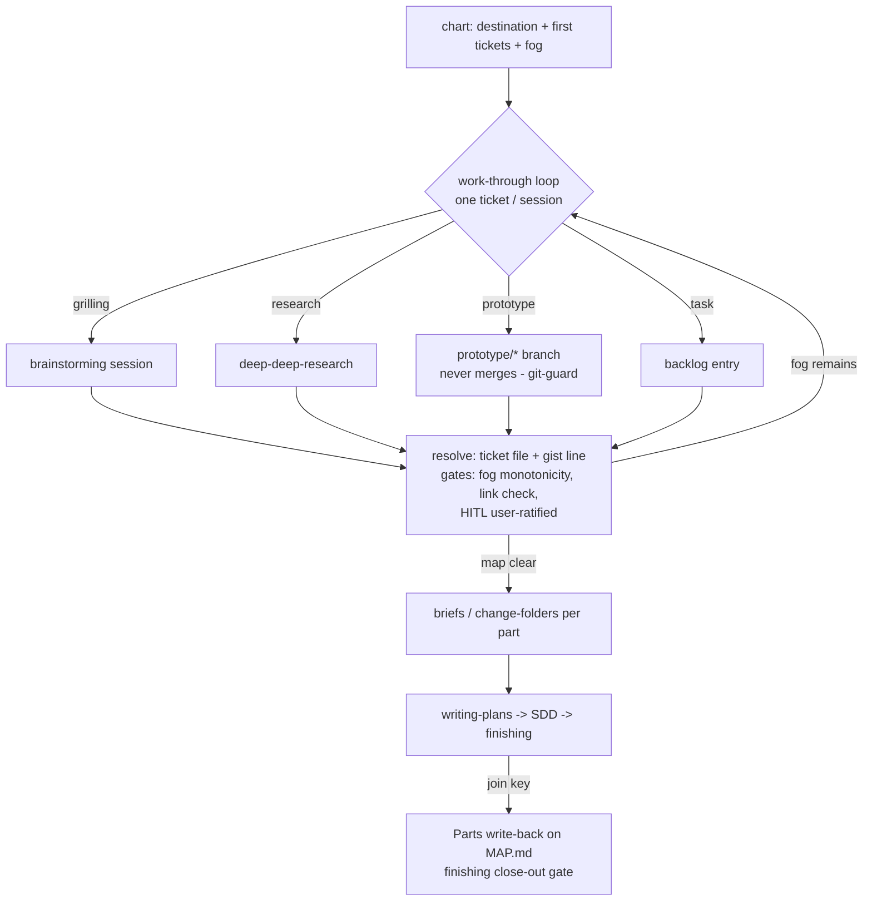

# Decision-map layer (wayfinder absorption) — brief

> **Phase**: brainstorming output (`brainstorming` → `writing-plans` handoff)
> **Date**: 2026-08-28
> **Author**: kouko + agent (Opus 5 session; research record
> `docs/loom/research/2026-08-28-wayfinder-mechanism-and-family-placement-research.md`)

## Design-side on-ramp

fired: rows 1 — standing direct (KICKOFF-DEFAULTS.md)

## Queue relation

unqueued — no live `status: bet` entries exist in docs/loom/backlog/ (normal
between-arcs resting state); this arc executes the open entries named in
§Current State Evidence rather than a queued bet.

## Problem

When a loom user faces an effort whose *planning itself* spans multiple
sessions — the route is foggy, the open questions cannot all be phrased yet —
they want a persistent, machine-gated decision surface, so that sessions can
resume without re-deriving context, every decision stays traceable to the
discussion that produced it, and a multi-plan deliverable shows its true
progress instead of a hand-kept table that drifts (kumiko progress.md drifted
4× with no gate noticing).

## Users

- kouko driving loom arcs in monkey-skills and adopting repos (kumiko-zaiku,
  external) — needs resume-across-sessions and progress-at-a-glance without
  hand-maintained files.
- Weak-model / future agent sessions working a map they did not chart —
  contracts must be mechanically checkable, not prose-judgment (repo precedent:
  prose-only enforcement dies on weak executors).
- loom-design / loom-code stations as ticket-resolution verbs — they consume
  the map only through plain-file reads and name-based skill invocation, never
  sibling plugin paths.

## Smallest End State

A loom-workflow-owned decision-map layer ships: a charting/work-through skill,
a `docs/loom/maps/` store, and mechanical gates, with prototype work
mechanically fenced and delivery progress written back at branch close-out.
Success criteria: one real map charted and worked in this repo (dogfood) with
all gates exercised; the three feeder backlog entries (arc E, milestone-layer,
queue-ownership north-star) resolved or explicitly narrowed. Non-criteria: no
issue-tracker (GitHub/Linear) backend in v1; no relocation of queue/memory/
hooks ownership (separate arc per the adopted sequencing).

- BI-1 — A `docs/loom/maps/<map-id>/` store exists (MAP.md index +
  `tickets/` one file per ticket), scaffolded and owned by a new
  loom-workflow skill (working name `loom-workflow:decision-map`); MAP.md
  carries Destination / Notes / Decisions-so-far (gist+link lines) /
  Not-yet-specified (fog) / Out-of-scope, and the store charter carries a
  schema version that checkers refuse to read past.
- BI-2 — Work-through mode: one ticket per session (research tickets
  excepted), claim-before-work, resolution recorded in the ticket file,
  one gist line appended to MAP.md linking the ticket, fog graduated into
  new tickets in the same close.
- BI-3 — Four ticket types delegate to existing skills by name:
  grilling → `loom-code:brainstorming` session, research →
  `research-toolkit:deep-deep-research`, task → backlog entry,
  prototype → the BI-5 protocol; HITL ticket resolutions carry a
  user-ratified line.
- BI-4 — Mechanical gates ship with the store: fog monotonicity (a fog
  entry may only shrink, graduate to a ticket, or move to Out-of-scope —
  never silently vanish), every Decisions-so-far line must link an
  existing closed ticket, live-map detection means a checker-valid map in
  an active state (directory presence alone is never adoption), explicit
  join keys bind plan ↔ map part (no topic-similarity inference).
- BI-5 — Prototype separation mechanism: prototype work is legal only on
  `prototype/<map-id>/<ticket-slug>` branches; git-guard blocks merge/PR
  of `prototype/*` into the default branch (prototype code never merges);
  the ticket resolution inlines the validated decision (state machine,
  schema, snippet) and links the branch as an asset; red-flags.md's
  prototyping line and tdd-iron-law's spike exemption are amended in the
  same PR to scope the exception to this namespace.
- BI-11 — The decision-map skill text ships the full prototype contract
  (§Prototype contract below): the when-to-use routing test, the two modes
  (design HITL / feasibility AFK) with their three probe shapes, the
  definitional constraints, and the six-stage lifecycle including
  human-only variant selection, human-ratified feasibility conclusions,
  and the branch retention rule.
- BI-12 — Risk-driven front-loading: charting (and every work-through
  close) runs a risk pass over tickets and fog; an unknown matching the
  §Prototype contract front-load triggers gets a feasibility/prototype
  ticket created on the frontier immediately — highest-risk first, never
  deferred until reached — under that section's anti-over-prototyping
  guardrails.
- BI-6 — Delivery-phase write-back: MAP.md gains a Parts section; when a
  plan carrying a map join key closes, `finishing-a-development-branch`
  flips that part's status mechanically — resolving the milestone-layer
  entry's need without a hand-kept table.
- BI-7 — On-ramp detection: family-reception's criteria table gains one
  row (multi-session + foggy route → charting detour), with the file's
  100-line accretion budget re-argued in the same PR as its own charter
  requires; brainstorming Axis 0 detects a live map per BI-4's criterion.

## Current State Evidence

- **Forward**: brainstorming Axis 0 currently walks upstream artifacts and the
  backlog ready check only ("Backlog ready check", loom-code/skills/
  brainstorming/SKILL.md) — a new detection row changes what every kickoff
  session does next. Plan close-out duties live in the Backlog-close check row
  ("if COMMITTED-NEXT is EMPTY, surface a betting prompt",
  loom-code/skills/finishing-a-development-branch/SKILL.md) — BI-6 adds a
  sibling duty there.
- **Reverse**: family contracts are fanned out from the repo-root SSOT
  (`SYNC_TARGETS`, scripts/sync_loom_family_contracts.py — loom-workflow is
  not currently a target; BI-7's row edit must extend the fan-out). Store
  scaffolding precedent is loom_init.py ("refuses if either artifact exists",
  loom-code/scripts/loom_init.py).
- **Error**: unknowns today either block the plan ("any `[OPEN]` blocks the
  plan", loom-code/skills/writing-plans/references/plan-format.md §Open
  Questions) or rest in backlog `start:` conditions — no managed middle state;
  the map adds one without weakening either existing behavior.
- **Data**: the map store is repo files under docs/loom/ like every existing
  loom store ("Stores:", docs/loom/README.md); ticket resolutions are the
  primary source, MAP.md is an index of gist+link lines only.
- **Boundary**: `[FRAGILE]` red-flags.md carries the doctrine BI-5 amends
  ("prototyping happens INSIDE the smallest end state",
  loom-code/skills/brainstorming/references/red-flags.md); `[FRAGILE]`
  family-reception.md sits at its 100-line budget ("accretion budget",
  docs/loom/backlog/2026-08-20-family-reception-is-at-its-line-budget-with-zero-headroom.md);
  git-guard is the enforcement point BI-5 extends
  (loom-code/hooks/git-guard.py). No network/API boundaries.
- **Evidence paths**: loom-code/skills/brainstorming/SKILL.md §Axis 0;
  loom-code/skills/finishing-a-development-branch/SKILL.md §close-out checks;
  scripts/sync_loom_family_contracts.py; loom-code/scripts/loom_init.py;
  loom-code/skills/writing-plans/references/plan-format.md §Open Questions;
  loom-code/skills/brainstorming/references/red-flags.md; loom-code/hooks/
  git-guard.py; docs/loom/README.md; docs/loom/backlog/ entries dated
  2026-07-14 (arc E), 2026-08-10 (milestone-layer, queue-ownership
  north-star, integration-seed), 2026-08-20 (family-reception budget);
  docs/loom/research/2026-08-28-wayfinder-mechanism-and-family-placement-research.md.

## Decision

Absorb wayfinder's terrain model — map / fog / frontier / graduation — into a
loom-workflow-owned skill over a repo-file store, while replacing its trust
model (prose norms + human vigilance) with loom's mechanical gates; the four
codex advisory divergences are adopted in full (public-skill delegation +
plain-file detection, checker-valid active-entry detection, map-first
sequencing with an admission rule for loom-workflow, schema versioning +
explicit join keys). We will NOT build an issue-tracker backend, NOT relocate
existing family infrastructure in this arc, and NOT let the map execute work —
it schedules decisions, and the one type that produces artifacts (prototype)
is fenced by BI-5's branch namespace. Trade-off: a longer map lifecycle
(planning through delivery) buys the milestone layer at the cost of a larger
drift surface, accepted because every write is generator- or gate-backed.
<!-- narrative: one build/not-build/trade-off argument — the NOT-build clauses and the accepted cost each qualify the same absorb-terrain-not-trust commitment and are meaningless split apart -->

- BI-8 — The decision-map layer ships as one loom-workflow skill + store +
  gates, with loom-workflow's admission rule recorded (cross-station,
  multi-session coordination — not "used by several plugins") so the
  ownership problem does not reappear under a new name.

## Out of Scope

- Issue-tracker (GitHub/Linear/Jira) backend for the map — the wayfinder
  original; revisit only if repo-file frontier rendering proves insufficient.
- Relocating queue layer / loom-memory / family hooks into loom-workflow —
  separate compatibility arc per the adopted sequencing (north-star entry
  stays open, narrowed to that follow-up).
- Full plugin merge (loom-code⊕loom-design⊕loom-workflow) — remains the
  north-star fallback; this arc's placement doctrine is the
  behavioral-pull answer.
- kumiko-zaiku migration to the new map layer — its own backlog entry
  already tracks the guided migration.
- Parallel multi-session ticket work (concurrent claims) — the claim field
  ships, but concurrency discipline is deferred until single-session
  work-through is dogfooded.

## Alternatives Considered

| Alternative | Who ships it / source | Why rejected |
|---|---|---|
| Wayfinder as-is (issue-tracker store, prose contracts) | mattpocock/skills (community-tested since 2026-07) | Its own FAQ documents unfixed failures (Notes self-exemption, in-map implementation, agent self-closing prototype tickets) — exactly the judgment-shaped-prose class this repo legislates into gates; tracker store also conflicts with loom's repo-file convention |
| ADR-driven development (ADR駆動開発) | JP community practice (Zenn 2026 "Decision First" ADR-for-agents; AWS prescriptive guidance) | Records *already-made* decisions post-hoc; no open-question tickets, no frontier, no fog — the opposite phase of the decision lifecycle. JA side has no comparable shipped frontier mechanic (EN/JA divergence is itself the finding) |
| Do nothing — declare OQ-blocking + backlog sufficient (milestone entry's option c) | this repo's own backlog deliberation | Empirically failed: kumiko hand-invented progress.md and it drifted 4×; arc E and milestone-layer entries both stayed open because the need recurs |
| GitHub issues as store, repo files as mirror | wayfinder's tracker-agnostic setup | Native blocking UI is real value, but adds an external store dependency, public-tracker pollution (author-documented OSS complaint), and a second drift surface; deferred, not refuted |

## What Becomes Obsolete

- BI-9 — Hand-kept multi-plan progress tables become a declared
  anti-pattern: the milestone-layer backlog entry closes (resolved by
  BI-6), and the map's Parts section is the sanctioned replacement.
- BI-10 — Arc E of the 2026-07-14 pocock-roadmap entry closes as shipped;
  the queue-ownership north-star entry is updated (narrowed to the
  deferred relocation arc) and the four-scripts-shapes entry's start
  condition is acknowledged as fired (its resolution may be folded into
  this arc's checker CLI design or explicitly re-deferred in the plan).

## Prototype contract

Descriptive section: every shippable outcome here is declared by BI-5
(the fence) and BI-11 (this contract landing in the skill text); no
un-identified outcomes are introduced.

**Purpose — the when-to-use test.** A prototype ticket answers exactly one
question that talking cannot settle and a lookup cannot answer. Route by
where the answer comes from: discussion settles it → grilling; a lookup
settles it → research; **building-and-measuring settles it → prototype in
feasibility mode** ("can approach A meet constraint C" — the machine
answers); **human reaction settles it → prototype in design mode** ("how
should this look / behave" — the human answers). The question is written
in the ticket body before any code exists; a prototype with no named
question is mis-typed.

**Definition — what qualifies.** Throwaway code built to answer that one
question, in one of three shapes: a logic probe (state machine / algorithm
/ data-shape playground — design mode), a surface probe (UI variants —
design mode), or a **feasibility probe** (a minimal build that measures
whether an approach clears a named constraint: latency, scale, API
capability, integration fit — feasibility mode; the resolution records the
measured numbers or pass/fail, not an impression). Constraints, all
mechanical where possible:

- lives only on its `prototype/<map-id>/<ticket-slug>` branch (BI-5 fence;
  upstream wayfinder independently converged on `prototype/<name>`
  never-merged branches after reversing its own delete-it doctrine —
  "a prose summary of a prototype loses the thing that made it
  convincing");
- the question is written at the top of the artifact itself (a visible
  intro, not a comment), not only in the ticket;
- **one sitting**: answered in one session; still building a day later
  means the question was too big — split the ticket;
- no tests, no error handling beyond what makes it run, no persistence
  (in-memory state only), no speculative abstraction; **the moment you
  harden one (add a test, wire a real database, generalize for later) you
  have stopped prototyping** — that is the stop signal, not progress;
- logic probes isolate the answering logic in a pure portable module
  (reducer / machine / function set, zero DOM reach-in) so the validated
  module itself is the distillable artifact; surface probes render
  variants that disagree **structurally** (layout, hierarchy, primary
  affordance — "three tweaked card grids is wallpaper"), hosted inside a
  real page against real data wherever one exists (a variant judged in a
  vacuum always looks fine);
- must be trivially runnable (one command or one double-clickable file) and
  must surface its state after every action, so a human can judge it;
- marked as a prototype in its filenames/entry point — a casual reader can
  tell it is not production code;
- scoped to ONE named question — a whole-app prototype is refused ("what
  is the whole app" is not a question; it has no stopping point and
  becomes production by momentum). Feasibility mode is this contract's
  extension beyond upstream, whose two branches cover design questions
  only.

**Risk-driven front-loading — when a probe is scheduled early (BI-12).**
"Research said probably-fine" is not evidence; the map front-loads a
feasibility/prototype ticket onto the frontier when any of these fire
(industry-standard triggers, EN/JA practice agreeing on substance):

- the item cannot be estimated or judged without building — the gap is
  knowledge-limited, not time-limited (XP spike solution; SAFe Spikes;
  JA スパイク practice, ryuzee.com — "誰も見積れないストーリー");
- it is architecturally significant and no proof-of-concept exists yet
  (RUP Elaboration's executable architecture baseline: retire the
  architecturally significant risks first, deliberately partial);
- it carries the map's highest risk exposure (probability × impact) —
  sequence it first, never defer it until reached (Boehm spiral,
  risk-driven ordering);
- the architecture is unproven end-to-end (new integration path, main
  components never yet linked) — a thin walking-skeleton / tracer-bullet
  slice, which loom's SDD standards already prescribe for execution,
  applied here at planning time (Cockburn; Hunt & Thomas);
- one assumption, if false, kills the whole effort — test that one first
  (Riskiest Assumption Test).

Anti-over-prototyping guardrails (same sources): if a conversation or a
lookup can settle it, no probe — spikes are the exception, not the rule
(SAFe; JA sources agree); the success criterion is named before the probe
starts (JA PoC practice: 事前に評価軸を定義); the one-sitting timebox
above applies.

**Lifecycle — six stages.**

1. **Birth**: charting or a work-through close types a ticket `prototype`,
   question in the body. The type is a claim the resolution gate checks.
2. **Build**: the session creates the namespace branch; artifacts exist
   nowhere else. TDD iron law's spike exemption applies inside the
   namespace only (the same-PR doctrine amendment of BI-5).
3. **React / Measure** (mode fork): design mode — the human drives the
   artifact and reacts; HITL, the agent never answers its own question.
   Feasibility mode — the agent runs the probe and records the measured
   result (numbers, pass/fail against the named constraint); AFK, no human
   reaction needed to produce the evidence.
4. **Select / Ratify** (mode fork): design mode — variant selection is the
   human's act; an agent-selected variant is the documented wayfinder
   failure this stage exists to block. Feasibility mode — the human
   ratifies the *conclusion drawn from* the measurement (the numbers are
   the machine's; what they mean for the map is a decision). Both modes
   close only through the resolution's user-ratified line (BI-4 gate).
5. **Distill**: the validated decision — state machine, schema, reducer,
   snippet trimmed to its decision-rich parts — is inlined into the ticket
   resolution; the branch is linked as the primary source. The inlined
   decision, not the branch, is what downstream specs and plans cite.
6. **Death**: the branch never merges (git-guard enforces); implementation
   later re-lands the behavior from the inlined decision under full TDD —
   a validated pure module may be carried over as the starting point, but
   its tests are written first and it enters through a normal reviewed
   task, never through the prototype branch.
   The branch is retained read-only as primary source while the map is
   live; at map archival the archive note lists surviving prototype
   branches, and pruning them is the repo owner's recorded choice — never
   an agent default.

## Open Questions

(none — the two Axis-3 forks were resolved by the user 2026-08-28: v1 spans
planning + delivery write-back; prototype ships in v1 with the BI-5 fence and
same-PR doctrine amendment. The four codex divergences were adopted in full.)

## Diagrams

One flow: the map lifecycle from charting through delivery write-back,
showing where each gate fires.

