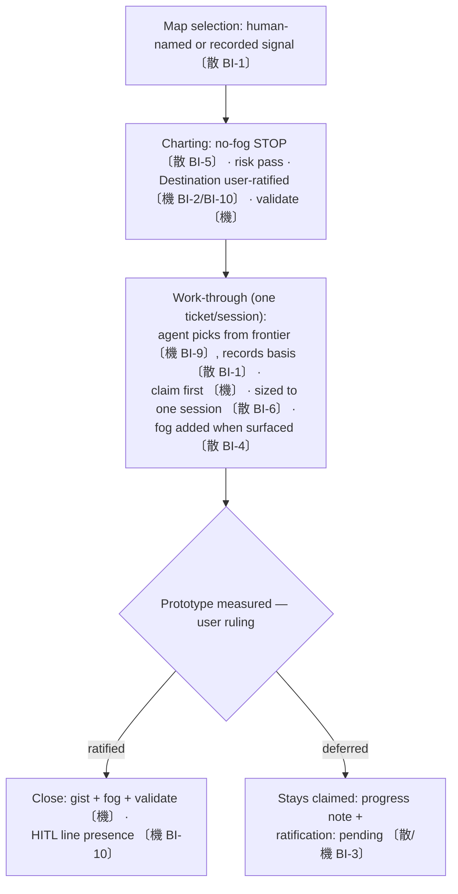

# decision-map protocol hardening — brief

> **Phase**: brainstorming output (`brainstorming` → `writing-plans` handoff)
> **Date**: 2026-08-29
> **Author**: kouko + agent (Fable session; scope ratified via AskUserQuestion 2026-08-29)

## Design-side on-ramp

not fired — contract-text + checker increment on an existing skill; no product-shaped, UI, or spec-station surface.

## Queue relation

unqueued — no live bet entries exist (normal resting state); arc is a user-directed follow-up of the first decision-map dogfood session's findings (PR #757 records).

## Problem

When a cold session (any model tier, Claude or Codex) charts or works through a decision map, I want every selection, ratification, and routing duty to be answered by the protocol text or a checker rather than by the agent's improvisation, so that dogfooded blanks — who picks the map/ticket, who ratifies the destination, where a mid-flight ruling lives, which store a lesson goes to — stop resurfacing as silent agent defaults.

## Users

- Future work-through/charting sessions (Claude Code and Codex mirror; any model tier) — run with only the shipped skill text; weak-tier sessions hold verifiable-action prose but lose judgment-shaped prose, so rules must name actions or be checker-backed.
- kouko reading MAP.md/tickets across sessions — needs recorded bases (claim provenance, ratification lines) to audit who decided what.
- Adopting repos (post-relocation) — same skill text serves them; rules must not assume monkey-skills-specific context.

## Smallest End State

The decision-map skill text answers the eight dogfooded/dropped-upstream blanks, and the four additive mechanism guards back the judgment-critical ones. `loom-workflow` ships as 1.4.0; `schema_version` stays 1 (every change additive). Success = a cold-reader dogfood on the revised text resolves each blank correctly, all existing maps stay checker-valid unmodified, and the ticket-selection backlog entry closes. Non-criteria: no frontier UI, no status-vocabulary change, no supersession path.

- BI-1 — Selection-authority rule: the map is human-named (or taken from a recorded signal such as worktree-branch == ticket-slug); the ticket within a map is agent-picked, and the claim records the selection basis in the ticket body at claim time.
- BI-2 — Destination ratification: charting close requires a user-ratified line on MAP.md (same dated shape as ticket-level HITL).
- BI-3 — Measured-pending-ratification convention: a prototype ticket whose probe finished but whose conclusion the user deferred keeps `status: claimed`, records a progress note in the ticket body, and may carry the new optional `ratification: pending` frontmatter field.
- BI-4 — Mid-ticket fog additions are explicitly legal: surfaced questions are recorded as fog when surfaced, not deferred to ticket close.
- BI-5 — Charting no-fog STOP: when charting surfaces no fog, the protocol says stop and ask the user instead of opening a map.
- BI-6 — Ticket sizing rule: one ticket's question is sized to one agent session.
- BI-7 — Store-routing criterion: a lesson/unknown blocking THIS map's destination goes to its fog; one that outlives every map goes to the backlog store; the agent decides silently but records the routing basis where it files.
- BI-8 — The prototype branch-fence doctrine is re-attributed as loom's own (upstream attribution removed pending re-verification).
- BI-9 — Optional `blocked-by:` ticket frontmatter (comma-separated slugs) with existence + cycle checks; frontier becomes computable as open ∧ all blockers closed ∧ unclaimed.
- BI-10 — HITL presence checks in `validate`: a closed grilling/prototype ticket must contain a `user-ratified` line; an `active`/`clear` map must carry the Destination ratification line (presence only; authenticity stays review-enforced).
- BI-11 — Additive-only revision constitution recorded in map-format §Schema versioning: mechanism revisions must keep old checkers from mis-killing new stores (rationale: measured cross-host version skew).

## Current State Evidence

- **Forward**: work-through sessions execute SKILL.md's numbered close duties — `loom-workflow/skills/decision-map/SKILL.md` §Work-through mode ("Claim before work."; "Run the risk pass, then the close-time gates"); charting closes via §Charting ("Charting closes only after the risk pass").
- **Reverse**: SKILL.md defers all grammar to the schema SSOT — SKILL.md header ("Full schema authority for MAP.md and ticket files … lives in `references/map-format.md`"); every checker parses through `map_store.py` (map-format §Command surface: "the only sanctioned parser for this schema"). Direction confirmed by reading both files whole — SKILL cites map-format, never restates.
- **Error**: shared reader-script exit contract — map-format §Command surface ("`0` — clean", "`1` — operational error", "`2` — violation"; schema_version past ceiling → "exits 2 with a message naming both").
- **Data**: ticket frontmatter vocabulary — map-format §Ticket schema ("`type` — one of `grilling`, `research`, `task`, `prototype`"; claim shape "`<who>, <YYYY-MM-DD>`"); fog line grammar §Fog entries ("`- F-<n>: <text>`"; "Monotonic, never renumbered, never reused").
- **Boundary**: [FRAGILE] upstream attribution in `references/prototype-contract.md` ("upstream wayfinder independently converged on `prototype/<name>` never-merged branches") — unattested in upstream's current text (diff record §E). [FRAGILE] cross-host version skew: Codex cache held loom-workflow 1.2.1 vs Claude 1.3.0 (diff record §D.3 context; measured 2026-08-28) — motivates BI-11.
- **Evidence paths**:
  - `loom-workflow/skills/decision-map/SKILL.md` (whole; §Charting, §Work-through mode, §Delegation by ticket type, §Liveness assessment)
  - `loom-workflow/skills/decision-map/references/map-format.md` (whole; §Frontmatter, §Fog entries, §Ticket schema, §Schema versioning, §Command surface)
  - `loom-workflow/skills/decision-map/references/prototype-contract.md` (whole; §Definition, §Lifecycle)
  - `docs/loom/research/2026-08-28-wayfinder-vs-loom-decision-map-diff.md` (§C, §E, §F, §G)
  - `docs/loom/backlog/2026-08-28-decision-map-ticket-selection-authority-unspecified.md` (whole)
  - `docs/loom/backlog/README.md` (§Frontmatter contract — routing target for BI-7's backlog half)
  - upstream verbatim quotes via fresh extraction 2026-08-28 (agent report quoted in PR #757's research record)

## Decision

Build batch 1 (eight prose rules: BI-1..BI-8) and batch 2 (four additive mechanism guards: BI-9..BI-11 plus the `ratification` field inside BI-3) in one arc shipping loom-workflow 1.4.0, keeping `schema_version: 1` because every mechanism change is additive (new optional fields, tightened checks on new writes only).

- We will NOT build: status-vocabulary changes, decision supersession, frontier UI, domain-modeling/to-spec ports — each deferred with a recorded re-trigger (see Out of Scope).
- Trade-off: one larger PR in exchange for the judgment-critical rules (selection, ratification) landing with mechanical backing instead of a prose-only window.
- Risk bound: live maps stay valid by construction (additive-only), and TDD covers the shared parser.

- BI-12 — Umbrella: decision-map protocol blanks are closed in one 1.4.0 arc, prose + additive mechanism together, schema_version unchanged.

## Out of Scope

- Decision supersession / reopening closed tickets (backlog: re-trigger = first real overturn incident).
- `status` vocabulary extension (breaking; bound to the supersession design).
- MAP.md in-progress visibility (Decisions-so-far stays closed-only; backlog candidate).
- Cross-repo mechanism-debt return channel (adopting repo → monkey-skills backlog; separate backlog entry).
- Porting upstream companions (domain-modeling, to-spec collapse, handoff wiring).
- Any change to the family-relocation map's own content (its fog F-5/F-6 are relocation questions, not this arc's).

## Alternatives Considered

| Alternative | Who ships it / source | Why rejected |
|---|---|---|
| Adopt upstream wayfinder text verbatim | mattpocock/skills (full-text extraction 2026-08-28) | Tracker-native + single-map assumptions (map = one issue, human passes URL, no mechanical gates) don't fit loom's repo-native multi-map store; upstream's own FAQ admits the prose-trust failures loom legislates against. |
| Prose-only arc (defer all of batch 2) | This session's initial recommendation | Rejected by user ruling 2026-08-29 (同弧): selection/HITL rules would run prose-only for an unbounded window; weak-tier sessions hold action-shaped prose but the ratification checks are cheap checker additions. |
| Full mechanism now (incl. status vocab + supersession) | Evaluation session 2026-08-28 | Breaking schema (bump to 2, dual-version checkers) calibrated on n=1 dogfood; measured cross-host version skew makes breaking changes the one class that can mis-kill stores. |

## What Becomes Obsolete

- BI-13 — Backlog entry `2026-08-28-decision-map-ticket-selection-authority-unspecified` closes in this PR (status flip + evidence line + index regen) — BI-1 resolves it.
- BI-14 — The upstream-attribution sentence in `prototype-contract.md` (the "upstream wayfinder independently converged" claim and its quote) is removed/replaced in this PR — BI-8.

## Open Questions

(none — scope, schema stance, and batch composition ratified in-session 2026-08-29)

## Diagrams

The revised work-through with guard levels — 〔散〕 prose-guarded, 〔機〕 checker-guarded:

## Notes

- Version bump duty: `loom-workflow/plugin.json` (and `.codex-plugin` mirror via `scripts/sync_codex_manifests.py`) → 1.4.0 in the same PR; marketplace publishes by version.
- Contract-citation rule applies: revised skill text must not cite this repo's `docs/` records (the research diff doc is development record, not runtime contract); BI-8's fix must stand on its own prose.
