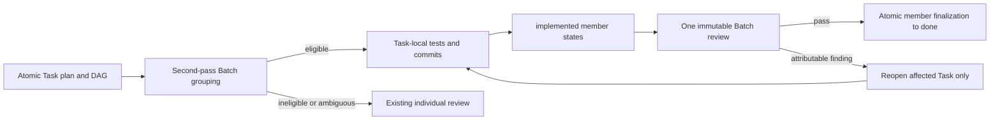

# Task Batch Review — brief

> **Phase**: brainstorming output (`brainstorming` → `writing-plans` handoff)
> **Date**: 2026-08-30
> **Author**: Codex, from kouko's ratified B direction

## Design-side on-ramp

fired: rows 3 — user chose detour

## Queue relation

unqueued — the related backlog entries are `open`, and the store currently has no live `bet` entry

## Problem

When Loom decomposes one capability into fine-grained TDD tasks, the operator needs to preserve that traceability without paying a complete reviewer fan-out for every knowingly incomplete intermediate state, so review cost falls without weakening defect detection.

## Users

- **Loom plan author** — needs atomic requirements, RED/GREEN tests, dependency edges, and a reproducible rule for proposing review groups.
- **SDD orchestrator** — needs one authoritative readiness and fallback rule; it must never guess after implementation whether tasks are safe to group.
- **Implementer** — needs local completion to remain visible while dependent work in the same review group proceeds.
- **Spec, quality, and docs reviewers** — need one immutable aggregate packet with a coherent verdict question, review lane, member scope, and attributable findings.
- **Repository maintainer** — needs the final whole-branch review to retain its cross-task and cross-plugin safety role; historical plans remain records rather than supported execution inputs.

## Smallest End State

`writing-plans` emits atomic Tasks first and then performs a second grouping pass over the completed dependency graph. Eligible Tasks may share one Review Batch; ineligible or ambiguous Tasks keep today's individual review. SDD records locally verified members as `implemented(<sha>)`, dispatches one full reviewer fan-out for the immutable Batch aggregate, and atomically marks all passing members `done(<sha>)`. The result is judged by fewer full reviewer dispatches on representative plans, not by making Tasks larger or removing final whole-branch verification.

- BI-1 — Plans preserve atomic Tasks and derive explicit Review Batches in a second pass over the Task dependency graph.
- BI-2 — Batch eligibility is fail-closed and automatically retains individual review when the shared review boundary is absent or becomes invalid.
- BI-3 — The progress ledger represents locally verified `implemented(<sha>)` members and atomically finalizes a passing Batch as member-specific `done(<sha>)` states.
- BI-4 — SDD dispatches one immutable full-review packet per eligible Batch while retaining per-Task mechanical checks and final whole-branch verification.

## Current State Evidence

- **Forward**:
  - `loom-code/skills/subagent-driven-development/SKILL.md`, anchor `## Process — per-task triad`: every ordinary Task currently reaches its own immutable reviewer fan-out.
  - `loom-code/scripts/plan_card.py`, anchor `def build_card(text: str)`: the card renders the plan ledger and therefore must understand any new transient state.
- **Reverse**:
  - `loom-code/skills/writing-plans/SKILL.md`, anchor `## Output contract — the plan`: plan authoring owns the Task schema passed to SDD.
  - `scripts/plan_card.py`, anchor `_TARGET`: the repository wrapper delegates to the loom-code script, so the plugin script remains the canonical implementation.
- **Error**:
  - `loom-code/skills/subagent-driven-development/SKILL.md`, anchor `### Verdict resolution`: reviewer disagreement or failure currently routes a Task back to its implementer.
  - `loom-code/scripts/plan_card.py`, anchor `def set_status(text: str, task_number: int, status: str)`: malformed or duplicate status fields fail loudly and leave the plan untouched.
- **Data**:
  - `loom-code/skills/writing-plans/references/plan-format.md`, anchor `#### Review-weight`: the plan already carries review-lane input on each Task.
  - `loom-code/skills/writing-plans/references/plan-format.md`, anchor `#### Progress ledger`: Task status is durable plan data and currently has four legal values.
  - `loom-code/scripts/plan_card.py`, anchor `_SET_STATUS_GRAMMAR`: status writes are currently single-Task and cannot atomically finalize a Batch.
- **Boundary**:
  - `[ASYNC]` `loom-code/skills/subagent-driven-development/SKILL.md`, anchor `review_context.py`: reviewer dispatch crosses into asynchronous agents using an immutable SHA-bound packet.
  - `[FRAGILE]` `loom-code/skills/subagent-driven-development/references/plan-ledger-notes.md`, anchor `On resolved DONE`: SDD and the ledger contract duplicate completion semantics and must move together.
- **Evidence paths**:
  - `docs/loom/backlog/2026-08-30-implementation-task-and-review-checkpoint-granularity.md` — anchor `The next step is to add and dogfood a task-sizing rule`
  - `docs/loom/backlog/2026-08-30-task-review-packets-lack-requirement-ownership.md` — anchor `owned_requirements`
  - `loom-code/skills/writing-plans/SKILL.md` — anchors `## Output contract — the plan`, `## Kickoff briefing`
  - `loom-code/skills/writing-plans/references/plan-format.md` — anchors `#### Review-weight`, `#### Progress ledger`
  - `loom-code/skills/writing-plans/references/plan-document-reviewer-prompt.md` — anchors `Check 16`, `per-task Status field`
  - `loom-code/skills/subagent-driven-development/SKILL.md` — anchors `## Process — per-task triad`, `### Verdict resolution`
  - `loom-code/skills/subagent-driven-development/references/plan-ledger-notes.md` — anchor `On resolved DONE`
  - `loom-code/scripts/plan_card.py` — anchors `_MARKS`, `_SET_STATUS_GRAMMAR`, `def set_status`
  - `scripts/plan_card.py` — anchor `_TARGET`

## Decision

Build Review Batch as a derived checkpoint, not as a larger Task or a second workflow. The planner first emits the complete atomic Task DAG, then proposes groups whose members share one review lane, one end-to-end verdict question, and one closable review window. A user decision, external wait, deferred test, independent release point, distinct failure domain, or uncertain boundary forces individual review. SDD may consume `implemented` only across an edge whose producer and consumer are in the same Batch; every cross-Batch consumer still requires `done`. Batch failure reopens only attributable members, and any member change invalidates the previous aggregate packet before re-review.
<!-- narrative: these sentences jointly define one indivisible grouping, dependency, failure, and invalidation contract -->

- BI-6 — Review Batch remains derived plan metadata and never becomes an independently queued or independently transitioned object.
- BI-7 — Each Batch declares its ID, members, shared verdict question, review lane, aggregate verification, and boundary.
- BI-8 — Same-Batch dependencies may consume `implemented`; cross-Batch dependencies require `done`.
- BI-9 — Failed Batch findings reopen only attributable members while unchanged members remain `implemented`; changed aggregate bytes require a fresh Batch packet.

`Aggregate verification` is an inert description of the required Batch check, not a shell program. Plan validation never executes it; SDD resolves the runnable test command independently through the existing declared-first verification contract.

## Out of Scope

- Merging requirements, tests, or Tasks into larger implementation units.
- Runtime compatibility for plans authored before the Task Batch Review schema; those files remain historical records only.
- Replacing the whole-branch code/docs review at branch close-out.
- Adding an arbitrary maximum Batch size, configurable heuristics, scoring, or a separate Batch queue/ledger.
- Serializing direct editors or filesystem tools that bypass Loom's shared plan-write lock; the orchestrator must not run those non-participating writers concurrently with SDD.
- Solving the sibling requirement-ownership backlog entry unless a minimal packet field is strictly necessary for finding attribution.
- Changing agent models, reviewer disciplines, or review quality rubrics unrelated to aggregate scope.

## Alternatives Considered

| Alternative | Who ships it / source | Advantage | Why rejected |
|---|---|---|---|
| Review every atomic change independently | Google Small CL guidance ([EN](https://google.github.io/eng-practices/review/developer/small-cls.html); [JA translation](https://fujiharuka.github.io/google-eng-practices-ja/ja/review/developer/small-cls.html)) | Strong isolation and rollback; every change is self-contained | Preserves the exact repeated reviewer setup cost this arc is meant to reduce and cannot judge knowingly incomplete intermediate capability states efficiently. |
| Keep atomic patches but review the series with shared context | Linux patch series and cover letters ([EN](https://cdn.kernel.org/doc/html/latest/process/submitting-patches.html)); B4 series preparation ([EN](https://b4.docs.kernel.org/en/latest/contributor/prep.html)) | Preserves patch identity while giving reviewers one series-level purpose and change history | Closest model and adopted here, but upstream practice still reviews individual patches; Loom must prove that replacing member fan-outs does not lower detection. |
| Group submission while retaining per-change votes | Gerrit topics / submitted-together changes ([EN](https://gerrit-review.googlesource.com/Documentation/cross-repository-changes.html)) | Mature all-members-ready and atomic submission semantics | Useful for readiness/finalization, but it does not reduce review fan-outs because every change still receives individual votes. |

## What Becomes Obsolete

- BI-10 — The default assumption that every non-mechanical Task immediately triggers its own full reviewer fan-out becomes obsolete for planner-declared eligible Batch members.
- BI-11 — The four-state-only status grammar and single-Task-only finalization path become obsolete once `implemented(<sha>)` and atomic multi-member completion are supported.
- BI-12 — The convention that a missing Review Batch declaration means an executable legacy plan becomes obsolete; newly executed plans use the new schema.

## Open Questions

- OQ-1 [RESOLVED] — Run high-coverage design-side spec expansion before implementation; user chose the detour on 2026-08-30.

## Diagrams

The key distinction is that Task execution stays atomic while the full-review checkpoint may span several completed Tasks.

