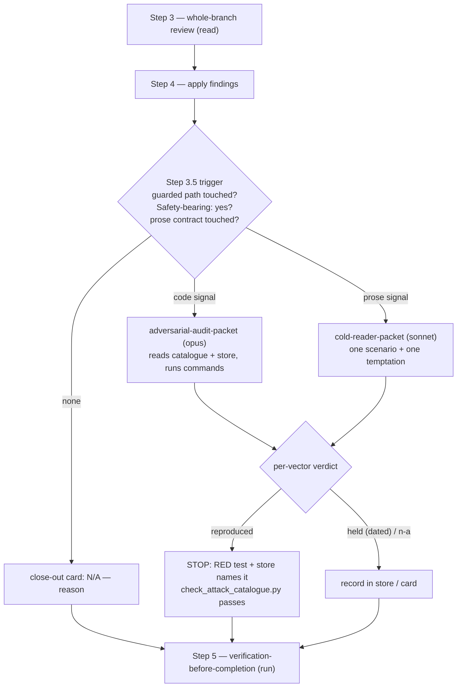

# Adversarial audit station — run the artifact against a catalogue, pin what breaks

> Entry artifact (brief). Origin: backlog
> `2026-08-31-adversarial-audit-as-a-loom-mechanism`, opened after an ad-hoc
> opus audit of main `96a56d8b` reproduced three 🔴 (F1 apply-result
> finalised an unreviewed commit, F2 one hand-written PASS file worked across
> repositories, F4 a hand-set `done` laundered through crash recovery) one
> hour after #767 merged with every per-task triad and the whole-branch
> review PASS. The fix arc (#768 + hotfix #769) closed F1–F6/F8 in one arc
> and sent F7/F9/F10 to the backlog — the ticket's own "if the closures land
> cheaply, the audit paid for itself" condition is met. Reframed with kouko
> on 2026-08-31: the mechanism is generic (loom running against an adopting
> repo); monkey-skills is its first instance because loom develops loom.
> **Author**: agent (Fable 5) — for kouko's sign-off.

## Design-side on-ramp

not fired — process-mechanism increment on existing close-out flow (negative guard); backlog ready check ran (0 bet / 8 open); live map `family-relocation` is `claimed` on a research ticket about queue-layer/memory/hooks relocation and does not overlap this arc.

## Queue relation

unqueued — no live bet entries exist; this arc consumes the `open` entry `2026-08-31-adversarial-audit-as-a-loom-mechanism` by kouko's explicit pick, and `open` entries cannot be cited by `in-queue:` until bet.

## Problem

When a branch changes something that promises to *prevent* an outcome — a gate, a receipt, a validator, an exemption rule, or the prose that tells an agent when it may skip a step — I want a station that tries to defeat that promise against the merged-shape artifact before the branch closes, so that a hole no reviewer read for and no test exercised cannot ship, and so that every hole found becomes a test that makes the next audit cheaper instead of a checkbox.

## Users

- The orchestrator closing a branch (any loom-code session, Claude or Codex) — needs a mechanical "does this station fire?" answer and a packet to dispatch, not a judgement call about whether the change "feels" safety-relevant (a weak-model session self-waived exactly such a judgement in #595).
- The adversarial auditor (a fresh-context `opus` dispatch) — needs a catalogue of attack classes with the repo's concrete instances, a hard reproduced/held/not-applicable rule, and no access to the author's plan narrative.
- The cold reader (a fresh-context `sonnet` dispatch) — needs the changed prose contract, one real scenario, and one temptation to take a shortcut, returning what it actually did.
- The whole-branch `code-reviewer` — gains the catalogue as reading material so its security dimension asks "which listed vector does this diff touch?" instead of reading OWASP in the abstract.
- kouko reading the close-out card — one line per cell: fired or N/A with a reason, reproduced/held counts, and which test now pins each reproduced finding.
- An adopting repo's maintainer — owns the repo-side store (guarded paths, instances, pinned tests); the plugin ships only the generic classes and the packets.

## Smallest End State

What is true when this ships:

- One conditional station sits between review and verification; it fires on two mechanical signals — the branch diff touches a guarded path, or the plan declares itself safety-bearing.
- A fresh-context adversarial audit reads a two-tier catalogue (plugin-shipped attack classes + repo-side instances) and returns reproduced / held / not-applicable per vector; a reproduced vector blocks close-out until a RED test pins it and the store names that test.
- The same station dispatches a cold reader when the diff touches a prose contract: one real scenario, one temptation.
- A checker keeps the repo store honest — every `reproduced` entry names a test that exists.
- The three 🔴 from 2026-08-31 and their #768 tests become the first instances, so the audit that produced this arc is itself pinned.
- Success: the station fires on this branch's own guarded paths, refuses close-out on a deliberately planted reproduced entry, and passes after the test lands.
- Non-criteria: coverage beyond the catalogue's vectors is not claimed; a `held` entry is a dated record, never a pass.

- BI-1 — `loom-code/skills/requesting-code-review/references/attack-catalogue.md` ships the generic attack classes (forge an artifact the gate trusts, bypass a gate by editing its input, replay a stale artifact, cross a trust boundary — repo / worktree / process, self-exempt via a prose condition, race a concurrent writer), each with the question the auditor must answer and the evidence a `reproduced` verdict requires (a command that ran and its output, never a reading).
- BI-2 — The adopting repo's store `docs/loom/ATTACK-CATALOGUE.md` carries `## Guarded paths` (globs whose change fires the station), `## Instances` (one entry per concrete vector: class, target, status `reproduced <date> — pinned by <test-name>` / `held <date>` / `not-applicable — <reason>`), and `## Prose temptations` (one line per shortcut a cold reader is offered); `loom_init.py` scaffolds it, and `finishing-a-development-branch` reports `attack catalogue: absent` loudly when the store is missing.
- BI-3 — `loom-code/scripts/check_attack_catalogue.py <store> --repo <root>` exits non-zero when a `reproduced` instance names no test or names a test that does not exist in the repo (`def <name>` or a matching test id), when a `held` entry has no date, or when `## Guarded paths` is empty; it runs in loom-code CI on this repo's store and is listed in the close-out card's gate lines.
- BI-4 — Plans gain one header line `Safety-bearing: yes — <reason> | no — <reason>` beside `Stage:` (plan-format grammar; `plan_card.py` renders it); `finishing-a-development-branch` fires the audit when the header says `yes` OR the branch diff (merge-base..HEAD) touches a guarded path; a `no` header on a branch that touches a guarded path is a STOP that surfaces both facts — the header does not override the path signal.
- BI-5 — `finishing-a-development-branch` Step 3.5 dispatches `references/adversarial-audit-packet.md` (fresh-context, `opus` by default, zero plan narrative: paths to the catalogue, the store, the diff range, and the repo — nothing else) and receives a per-vector verdict list; any `reproduced` → STOP until a RED test is committed and the store entry names it; Step 5 then re-runs by the existing "review-driven fixes" rule. `held` verdicts are written to the store with today's date; `not-applicable` verdicts are listed in the close-out card only.
- BI-6 — The same Step 3.5 dispatches `references/cold-reader-packet.md` (fresh-context, `sonnet` by default) when the diff touches a prose contract (`**/SKILL.md`, `agents/*.md`, `hooks/*.md`, `references/*-prompt.md`, `rules/*.md`); the packet carries one real scenario derived from the changed contract and one temptation drawn from `## Prose temptations`; the reader reports what it did, and a taken shortcut is a `reproduced` verdict routed exactly like BI-5's (the fix is normally a mechanical gate, per `docs/loom/memory/prose-only-enforcement-dies-on-weak-executors.md` — recorded, not decided here).
- BI-7 — The close-out card gains two lines, `adversarial audit: fired — reproduced k / held m / n-a j` or `N/A — <reason>`, and `cold reader: fired — <scenario verdict> / <temptation verdict>` or `N/A — <reason>`; `verification-before-completion` is unchanged.
- BI-8 — `docs/loom/ATTACK-CATALOGUE.md` in this repo seeds `## Guarded paths` with `loom-code/scripts/batch_review_cli.py`, `loom-code/scripts/loom_gate_markers.py`, `loom-code/hooks/git-guard.py`, `loom-code/scripts/plan_card.py`, and the prose-contract globs, and seeds `## Instances` with the 2026-08-31 findings F1–F6 as `reproduced 2026-08-31 — pinned by <test>` naming the #768 tests that exist today (e.g. `test_apply_result_refuses_receipt_bound_to_another_batch`, `test_apply_result_recovers_receipt_stuck_after_ledger_crash`, `test_repository_identity_anchored_on_member_sha_not_head`) — traceability the fix arc shipped without.
- BI-9 — `loom-code/agents/code-reviewer.md` reads the plugin catalogue and the repo store when present, and its `security` dimension names the vector class a finding belongs to; no new dimension, no new verdict value.
- BI-10 — Every closure lands with a RED test written before its fix; the station is exercised end to end on this branch (its own diff touches guarded paths, so the audit fires on itself), including one deliberately planted `reproduced` entry that the checker and the close-out STOP must refuse before it is removed.

## Current State Evidence

- **Forward**: `finishing-a-development-branch` Step 3 is `3. Dispatch requesting-code-review — route on the returned verdict, not raw severity:`, Step 4 `4. Before applying any review findings from Step 3: Read each file you intend to Edit`, Step 5 `5. Dispatch verification-before-completion`, and the re-run rule `If any review-driven fixes were applied in Steps 3–4, re-run verification-before-completion` (`loom-code/skills/finishing-a-development-branch/SKILL.md`) — Step 3.5 slots between the second and third and inherits the re-run rule; the cross-skill table has no row labelled "5" (verification is row `2/2b`) — the new row must follow the table's own numbering, flagged for the plan. `requesting-code-review` routes docs via `**delegate the review to [\`requesting-docs-review\`]` and mints the marker via `run \`python3 <resources.gate_markers> review-pass --repo <target_repo> --verdict-file <file> --expected-head <reviewed_sha>\`` (`loom-code/skills/requesting-code-review/SKILL.md`); `code-reviewer.md` lists `dimension: security | architecture | correctness | naming | tests | refactoring | cross-task-coherence | external-surface-grounding | principles-conformance | deliberate-simplification | deletion-first` and reads `loom-code/skills/requesting-code-review/references/design-evidence.md` — the catalogue sits beside it.
- **Reverse**: the plan header grammar is `Stage: <planning | sdd:wave-N | review:round-N | blocked:user-decision |` (`loom-code/skills/writing-plans/references/plan-format.md`) — BI-4's header joins it; `check_scenario_coverage.py` `def main(argv: list[str] | None = None) -> int:` diffs a named catalogue against join keys and names every drop — BI-3's shape; `loom_init.py` scaffolds the repo store set; the 2026-08-31 findings are recorded only as `BI-8 — The batch path is at least as strong as the per-task path it replaces: every attack the 2026-08-31 audit reproduced (F1–F6) now hits a fail-closed refusal pinned by a test` (`docs/loom/specs/2026-08-31-batch-review-hardening.md`) with no test named — BI-8 here closes that gap; `docs/loom/memory/cold-read-and-adversarial-review-catch-different-failures.md` already states the trigger rule ("touches an exemption, a gate, a self-check, or anything that lets an agent skip a safety step") as prose — BI-2/BI-4 make it mechanical.
- **Error**: `git-guard.py` blocks with `"loom gate: no fresh review-PASS marker for the current HEAD. Run "` (`loom-code/hooks/git-guard.py`) and `_cmd_review_pass` mints the marker (`loom-code/scripts/loom_gate_markers.py`) — the station does not add a marker; a `reproduced` verdict is a prose STOP in the close-out flow (the same class as the Open-questions check), and BI-3 is the mechanical half that CI enforces.
- **Data**: the audit packet passes paths only (catalogue, store, diff range, repo root); verdicts are a per-vector list the orchestrator writes back into `## Instances`; the store is tracked in git (unlike `<git-dir>/loom/` markers) because pinned-test names are documentation, not session state.
- **Boundary**: `[SECURITY]` the store's `reproduced` line is the only place a finding's pin is recorded — BI-3 refusing an unpinned or dangling entry is what keeps "attempted, held" from becoming a checkbox; `[FRAGILE]` `skill-dev-toolkit:dogfood-skill-testing` (`**Input** — a path to a skill-under-test directory in the working tree`, runs `Probe A / B / C` via fresh `Agent`) is not a loom-code dependency and an adopting repo may lack it — BI-6 ships its own packet; `[FRAGILE]` root `README.md` lists only 10 of 18 plugins and has no loom-code row (`**Totals:** 84 skills and 42 slash commands across 10 plugins listed`), so the version-bump surfaces are `loom-code/.claude-plugin/plugin.json` `"version": "0.108.0",` and `loom-code/CHANGELOG.md` `## [0.108.0] — 2026-08-31 — Batch review measurement + batching nudge`; `.claude-plugin/marketplace.json` carries no per-plugin version.
- **Evidence paths**:
  - `loom-code/skills/finishing-a-development-branch/SKILL.md` — Step 3 / 4 / 5 lines, "re-run verification-before-completion", cross-skill table row `2/2b`
  - `loom-code/skills/requesting-code-review/SKILL.md` — docs delegation line, `review-pass --repo` minting line
  - `loom-code/agents/code-reviewer.md` — `dimension: security | …`, `references/design-evidence.md`
  - `loom-code/hooks/git-guard.py` — `no fresh review-PASS marker`
  - `loom-code/scripts/loom_gate_markers.py` — `def _cmd_review_pass`
  - `loom-code/scripts/check_scenario_coverage.py` — `def main`
  - `loom-code/skills/writing-plans/references/plan-format.md` — `Stage: <planning | …`
  - `loom-code/scripts/test_batch_review_cli.py` — the three test names cited in BI-8
  - `docs/loom/specs/2026-08-31-batch-review-hardening.md` — BI-8 line, `## Out of Scope`
  - `docs/loom/memory/cold-read-and-adversarial-review-catch-different-failures.md` — "touches an exemption, a gate, a self-check"
  - `skill-dev-toolkit/skills/dogfood-skill-testing/SKILL.md` — `**Input** — a path to a skill-under-test directory`, `Probe A / B / C`
  - `loom-code/.claude-plugin/plugin.json`, `loom-code/CHANGELOG.md`, `README.md` — version surfaces

## Decision

Build the station as a conditional close-out step with a two-tier catalogue and a checker — not a standalone skill, not a post-merge ritual.

- Split of ownership: the plugin ships the attack classes, the two packets, the checker, and the plan header; the adopting repo owns its guarded paths, instances, temptations, and pinned tests — monkey-skills is the first store.
- Timing: before merge. Microsoft SDL places penetration testing in Verification, before Release; marketplace plugins publish from `main`, so post-merge means the hole is live.
- Trigger: only when a mechanical signal fires — the industry split where every merge runs static checks but dynamic attacks run on risk.
- Cost curve: every reproduced finding must become a test named in the store, so the audit's cost falls as the pinned set grows; a held verdict is dated and never counts as coverage.
- Not built: no new reviewer dimension, verdict value, or marker; loom-design's spec fan-out is untouched in this arc.

- BI-11 — One conditional station (audit + cold reader), a plugin-shipped class catalogue plus a repo-owned instance store, and a CI checker that refuses unpinned `reproduced` entries — shipped as loom-code 0.109.0.

## Out of Scope

- An abuse-case fan-out lens in `loom-design:spec-expansion` (misuse cases per Sindre & Opdahl; would let the catalogue grow from the spec instead of from audits) — separate loom-design arc; backlog entry to be filed at close-out.
- A periodic post-merge audit of `main` (GameDay-style drill) — the station is pre-merge; a scheduled run is a different trigger with no evidence yet.
- Reusing `skill-dev-toolkit:dogfood-skill-testing` as the cold-reader engine — cross-plugin dependency an adopting repo may lack; its Probe A/B/C design informs the packet, nothing more.
- Mutation testing and property-based / fuzz testing — no evidence they pay for a prose-contract repo; one backlog line each, not this arc.
- Seeding instances for any adopting repo other than monkey-skills.
- Retro-tagging tests older than #768 with finding ids — BI-8 seeds F1–F6 only.
- A `haiku`/`sonnet` tier for the audit — the audit dispatch defaults to `opus` per the tier table; the cold reader defaults to `sonnet`; both remain overridable by the orchestrator, no new knob.

## Alternatives Considered

| Alternative | Who ships it / source | Why rejected |
|---|---|---|
| (a) Optional close-out step gated on a plan flag only | The backlog ticket's shape (a); Microsoft SDL's Verification-phase pen-test — https://learn.microsoft.com/en-us/compliance/assurance/assurance-microsoft-security-development-lifecycle | Declared-only trigger is what #595 showed a weak model will self-waive; kept the flag but paired it with the guarded-path signal (BI-4) so a `no` cannot silence a touched gate. |
| (b) Standalone `loom-code:adversarial-audit` skill invoked by name post-merge | Ticket shape (b); PCI-DSS 4.0 "annually and after significant change" — https://www.sherlockforensics.com/blog/pci-dss-4-pentest-requirements.html | Post-merge is after publication for a marketplace plugin (#767 → 0.106.0 shipped with F1/F2/F4 live); by-name invocation relies on someone remembering. Kept only as the Out-of-Scope periodic drill. |
| (c) Catalogue read by the whole-branch reviewer, no separate dispatch | Ticket shape (c); OWASP SAMM security-testing stream prioritises by "risk, recent relevant changes" — https://owaspsamm.org/model/verification/security-testing/ | Reading is what all three existing layers already do and what F1/F2/F4 passed; kept as BI-9 (cheap, always-on) but not as the station — the station must run commands. |
| Reuse `skill-dev-toolkit:dogfood-skill-testing` for the prose cell | This repo, `skill-dev-toolkit/skills/dogfood-skill-testing/SKILL.md` (Probe A/B/C via fresh `Agent`) | Cross-plugin dependency; an adopting repo installs loom-code alone. Packet design borrows its fresh-context probe shape. |
| Red-team paired with evals on every prompt change (promptfoo) — https://www.promptfoo.dev/docs/red-team/ ; JP sources on ペネトレーションテスト タイミング agree on pre-release placement with change-triggered reruns (no EN/JP disagreement found) | promptfoo docs; JP vendor guidance | Adopted for the prose cell's shape (scenario + temptation in one dispatch, BI-6) — not rejected; listed to record that EN and JP sources agree on pre-release timing. |

## What Becomes Obsolete

- BI-12 — The ad-hoc audit as practised on 2026-08-31 (attack list authored from the orchestrator's memory, plain `general-purpose` dispatch, findings living only in a PR body) — replaced by the packet + store; the backlog entry `2026-08-31-adversarial-audit-as-a-loom-mechanism` closes with this arc.
- BI-13 — The "post-merge" framing in that backlog entry's description — superseded by the pre-merge station; recorded in the entry's closure, not edited in place.
- BI-14 — `docs/loom/memory/cold-read-and-adversarial-review-catch-different-failures.md` §How to apply gains one line pointing at the station as the mechanical form of its trigger rule (append, not rewrite — the practice stays valid).

## Open Questions

- OQ-1 [RESOLVED] — Trigger authority (BI-4): plan header `Safety-bearing:` paired with guarded-path globs, or paths only, or header only? Resolved 2026-08-31 by kouko ("照建議"): header + guarded paths — declared plus mechanical, a `no` cannot silence a touched path. Rejected: paths only; header only (the ticket's shape (a)).
- OQ-2 [RESOLVED] — Prose cell scope (BI-6): ship the cold reader + temptation in this arc, or defer to its own arc? Resolved 2026-08-31 by kouko ("照建議"): ship in this arc — same station, same routing, `## Prose temptations` is one store section.

## Diagrams

Where the station sits in the close-out flow, and what a verdict does.

