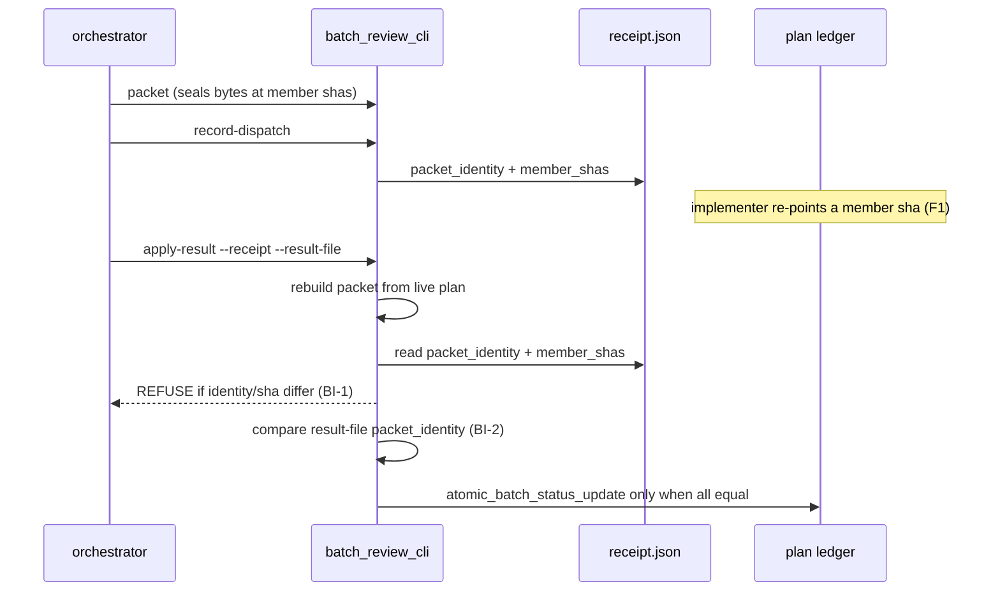

# Batch review hardening — bind the applied verdict to what the reviewer saw

> Entry artifact (brief). Origin: an independent zero-context opus adversarial
> audit of main `96a56d8b` (loom-code 0.106.0) run 2026-08-31 right after
> #767 merged. It reproduced four 🔴 and six 🟡 findings against the batch
> review adapter; kouko chose to fix the four 🔴 plus F5 / F6 / F8 in one arc
> (verbatim: "好 起 brief 修四條紅的加 F5/F6/F8", 2026-08-31). F7 / F9 / F10
> go to the backlog, not this arc.
> **Author**: agent (Fable 5) — for kouko's sign-off.

## Design-side on-ramp

not fired — bug-fix arc on an existing mechanism (negative guard); backlog ready check ran (0 bet / 1 open); live map `family-relocation` is active but its scope (queue-layer ownership decisions) does not overlap this arc.

## Queue relation

unqueued — no live bet entries exist; the one open backlog entry (`2026-08-30-task-review-packets-lack-requirement-ownership`) is adjacent (per-task packet ownership) but not this defect set, so this arc neither claims nor displaces it.

## Problem

When an orchestrator runs the batch review path shipped in #766/#767, I want the `done(<sha>)` that `apply-result` writes into the plan ledger to be provably the commit the reviewer's PASS was rendered on, so I can accept a batch verdict in place of per-task review without the batch path being weaker than the per-task path it replaces.

## Users

- SDD orchestrator sessions (Claude Code / Codex) driving `batch_review_cli.py` from the SKILL.md prose contract — they follow the four-subcommand call contract and will only get the result-file shape right if the contract states it.
- kouko as reviewer of merged arcs — needs the ledger to be trustworthy evidence, not a field any later step can rewrite.
- Future adversarial auditors / CI — need the seals to hold across the dispatch→apply window, not only at packet build time.

## Smallest End State

All seven findings close with fail-closed refusals that the audit's own reproduction steps now hit, and the prose contract names the result-file shape. Nothing new is configurable; no batch state object is introduced.

- BI-1 — `apply-result` refuses (non-zero, no ledger write, no receipt flip) unless the rebuilt packet's `identity` equals the dispatch receipt's stored `packet_identity` AND every member's rebuilt sha equals the receipt's `member_shas[member]` (closes F1 and F6 together: a receipt from another batch or an edited member can never be applied).
- BI-2 — `apply-result` reads `packet_identity` from the result file (arm bindings, terminal results, blocking findings) and compares it to the rebuilt packet; mismatch or absence refuses. The CLI stops injecting `packet.identity` into those constructors (closes F2 replay; reviewer authenticity is documented as out of the CLI's reach — see Decision).
- BI-3 — `apply-result --receipt` becomes `required=True`; the SKILL.md sentence "always pass `--receipt`" stays as explanation, not as the only enforcement (closes F3).
- BI-4 — `plan_card.py --set-status` refuses to write `done(<sha>)` for a task that the plan's `## Review Batches` section declares as a batch member, using the already-importable `_review_batch_oracle`; the refusal message names the batch id and points at `batch_review_cli.py apply-result` (closes F4: the recovery path can then trust a `done` state because only `atomic_batch_status_update` under `transition_authority` can produce it).
- BI-5 — `build_packet` refuses when a member commit's `git diff --name-only <sha>^ <sha>` is not a subset of that member's `declared_files`, mirroring the individual path's self-check step 2 (closes F5).
- BI-6 — `references/conditional-operations.md` §Batch review and individual fallback documents the `--result-file` JSON shape (`arm_bindings`, `terminal_results`, per-finding fields) and states the verbatim-`ground_ref` rule the pilot learned; SKILL.md's call-contract paragraph points at it (closes F8).
- BI-7 — Each of the seven closures lands with a RED test that is the audit's reproduction step expressed as a test (`test_batch_review_cli.py` / `test_plan_card.py` / a prose-contract grep test), so the attack surface stays pinned.

## Current State Evidence

- **Forward**: `_cmd_apply_result` rebuilds the packet via `_build_from_args` (`loom-code/scripts/batch_review_cli.py`, `def _build_from_args(args):` → `build_packet(plan_text=..., fields=...)`) from the live plan, then flips the receipt in the block guarded by `getattr(args, "receipt", None) and resolution.ledger_mutation_allowed and ledger_written` — nothing between those two points reads `stored["packet_identity"]` or `stored["member_shas"]`; `_recover_settled_receipt` runs before `json.loads(Path(args.result_file)...)` (anchor `recovered = _recover_settled_receipt(args)`), so the result file is unparsed on the recovery path.
- **Reverse**: SDD SKILL.md is the only caller contract (`loom-code/skills/subagent-driven-development/SKILL.md`, paragraph beginning "The executable form of that sequence is the adapter CLI", ~:217-228); `plan_card.py --set-status` is called by orchestrators and by `batch_review_cli.py` indirectly through `atomic_batch_status_update`; `_review_batch_oracle()` already exists in `plan_card.py` (`def _review_batch_oracle():`) but the `--set-status` branch (`if set_status_ref is not None:` → `_publish_cli_mutation`) never consults it.
- **Error**: `ReviewerArmBinding(packet.identity, ...)`, `ReviewerTerminalResult(packet_identity=packet.identity, ...)`, `BlockingFinding(packet_identity=packet.identity, ...)` in `_cmd_apply_result` — the library's identity checks in `review_batch.py` (`resolve_aggregate_review`) therefore compare the packet to itself and cannot fail; `_validate_scope` (`review_batch.py`, anchor `"declared scope does not exactly match committed proof"`) checks proof⇄declared only, never proof⇄actual commit diff. `apply_result.add_argument("--receipt")` has no `required=`.
- **Data**: dispatch receipt JSON (`batch-dispatch-receipt-v1`) already persists `packet_identity`, `member_shas` (dict task→sha) and `result_applied` (anchor `"member_shas": {` in `_cmd_record_dispatch`); result file JSON is `{"arm_bindings": [...], "terminal_results": [...]}` (anchor `set(payload) == {"arm_bindings", "terminal_results"}`) and is documented nowhere under `loom-code/skills/` (`grep -rn "ground_ref\|result_identity" loom-code/skills/` → 0 hits).
- **Boundary**: `[FRAGILE]` git subprocesses — `_committed_bytes` (`git show <sha>:<path>`, `cat-file -t`) and the new `git diff --name-only` call both go through `_run_subprocess` (30 s timeout) and owe a grounding cite per this repo's review baseline (four 🔴 for missing cites last arc). `[SECURITY]` the ledger and receipt are plain files; integrity is by refusal logic only, never by signature — this arc does not change that.
- **Evidence paths**:
  - `loom-code/scripts/batch_review_cli.py` — `def _build_from_args(args):`; `recovered = _recover_settled_receipt(args)`; `packet_identity=packet.identity`; `getattr(args, "receipt", None)`; `apply_result.add_argument("--receipt")`; `"member_shas": {`
  - `loom-code/scripts/plan_card.py` — `def _review_batch_oracle():`; `if set_status_ref is not None:`; `_publish_cli_mutation`
  - `loom-code/scripts/review_batch.py` — `"declared scope does not exactly match committed proof"`; `def _validate_members(`
  - `loom-code/skills/subagent-driven-development/SKILL.md` — "The executable form of that sequence is the adapter CLI"; "2. **Scope match.** `git diff --name-only`"
  - `loom-code/skills/subagent-driven-development/references/conditional-operations.md` — `## Batch review and individual fallback`
  - `loom-code/scripts/test_batch_review_cli.py`, `loom-code/scripts/test_plan_card.py` — existing suites (146 passed at 96a56d8b)

## Alternatives Considered

My take: **Recommend** binding apply-time to the receipt's stored identities (BI-1/BI-2) — the data is already persisted, so the fix is comparison, not new state. **Why**: it is the same invariant GitHub and Gerrit ship ("approval is bound to the reviewed diff/patchset; a new push dismisses it"), and it needs zero new artifacts. **Conditional reversal**: if a future arc adds signed reviewer results, BI-2's file-side identity check becomes the signature's payload rather than being replaced.

| Alternative | Who ships it / source | Why rejected |
|---|---|---|
| Dismiss the approval when the reviewed commit changes (bind verdict to sha; re-review on new push) | GitHub branch protection "Dismiss stale pull request approvals" + "Require approval of the most recent reviewable push" — [GitHub Docs](https://docs.github.com/en/repositories/configuring-branches-and-merges-in-your-repository/managing-protected-branches/about-protected-branches), [changelog 2023-06](https://github.blog/changelog/2023-06-06-security-enhancements-to-required-approvals-on-pull-requests/) (EN); Gerrit votes are per patch set and reset on a new patch set — [MediaWiki Gerrit/コード レビュー](https://www.mediawiki.org/wiki/Gerrit/Code_review/ja) (JA). EN and JA agree. | **Adopted** — this is BI-1/BI-2; listed so the trade-off is on record. |
| Re-run the reviewer automatically when the sha moved instead of refusing | GitHub "re-request review" flow | Rejected: the CLI has no reviewer to dispatch; a refusal that names the drifted member lets the orchestrator re-dispatch under its own contract. Auto-redispatch would add state the brief for #766 explicitly forbids. |
| Sign the result file (HMAC keyed per session) so a hand-written PASS is rejected | Gerrit/GitHub server-side identity; not a CLI-shippable pattern | Rejected for this arc: no key custody exists in a plugin CLI; reviewer authenticity stays out of reach and is now stated as such in the contract (BI-2 note). |
| Make `plan_card --set-status` batch-aware by removing `--set-status` for `done` entirely | — | Rejected: individual-lane tasks legitimately use `--set-status done(...)`; the refusal must be membership-gated, not verb-gated. |

## Decision

Build the seven closures as refusals inside the existing adapter and ledger writer, using data the receipt and packet already carry; add one git subprocess (`diff --name-only`) to `build_packet`; document the result-file schema where the SKILL.md call contract already points. We will NOT add signatures, a batch state object, auto-redispatch, configurable knobs, or any new artifact type. F7, F9 and F10 go to the backlog: they change ergonomics and measurement, not the safety claim. Reviewer authenticity stays out of the CLI's reach; the contract will say so rather than imply the seal covers it.

- BI-8 — The batch path is at least as strong as the per-task path it replaces: every attack the 2026-08-31 audit reproduced (F1–F6) now hits a fail-closed refusal pinned by a test, and the result-file contract is written down (F8).
- BI-11 — F7, F9 and F10 are filed as three `status: open` entries under `docs/loom/backlog/`, each naming the 2026-08-31 audit as origin, so the declined findings stay visible.

## Out of Scope

- F7 orphan receipt jamming a batch / hand-edited `result_applied: true` — backlog entry.
- F9 folding `packet`'s referent refusals into `ready` / `check_review_batches.py` — backlog entry.
- F10 making `task_batch_replay.py` observe dispatches instead of reading declared counts; a ≥5-batch measurement with reopen cycles — backlog entry.
- Signed reviewer results / key custody.
- The checker-family UnicodeDecodeError gap and the CAS simplification (both explicitly parked last arc).
- Any change to `review_batch.py`'s sealing model beyond the F5 subset check.

## What Becomes Obsolete

- BI-9 — The SKILL.md clause "always pass `--receipt`: it is the idempotency record…" stops being the enforcement of receipt presence (argparse enforces it); the sentence is kept only as explanation, reworded so it does not read as the gate.
- BI-10 — The plan Notes "ground_ref lesson" in `docs/loom/plans/2026-08-31-contract-repair-post-v3.md` stops being the only carrier of the verbatim-referent rule; it stays as history, the contract in `conditional-operations.md` becomes the source.

## Open Questions

(none — all seven findings carry a reproduced attack and a named fix; the user chose the set.)

## Diagrams

After this arc, the apply step compares the live rebuild against the two records that already exist (receipt, result file) instead of trusting whichever plan text is present at apply time.
