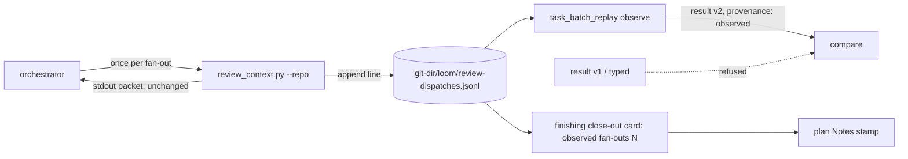

# Batch review measurement and nudge — observe fan-outs, make not-batching cost a sentence

> Entry artifact (brief). Origin: backlog group A chosen by kouko on
> 2026-08-31 ("A") right after #768/#769 merged: F10
> (`2026-08-31-batch-cost-numbers-are-declared-not-observed`) plus knobs ①
> and ② of `2026-08-31-batch-eligibility-should-push-toward-batching`
> (kouko: "我想要做 1 2", after a read-only simulation over 283 historical
> plans sized them — see BI-11), with the
> refusal-message half (b) of `2026-08-31-packet-identity-binds-whole-plan-text`
> folded in because it is a message change with no new state, and the
> memory entry owed from #769 (non-ASCII path crosses the process boundary
> twice) filed in the first commit.
> **Author**: agent (Fable 5) — for kouko's sign-off.

## Design-side on-ramp

not fired — tooling/measurement increment on an existing mechanism (negative guard); backlog ready check ran (0 bet / 7 open); live map `family-relocation` is active and does not overlap this arc.

## Queue relation

unqueued — no live bet entries exist; this arc consumes three `open` entries by kouko's explicit pick (group A), and `open` entries cannot be cited by `in-queue:` until bet.

## Problem

When we claim that batch review saves review dispatches, I want the number to come from something the harness recorded at the moment each fan-out happened, so I can tell whether a batching change actually moved the count — and when a plan leaves homogeneous adjacent tasks unbatched, I want the planner to have written down why, so the conservative default stops being free and silent.

## Users

- The orchestrator (me, or any loom-code session) — runs `review_context.py` once per reviewer fan-out by contract and would rather not maintain a tally by hand.
- writing-plans / plan-document-reviewer — needs a mechanical definition of "could have been batched" that does not become a second judgement call.
- kouko reviewing an arc's close-out — reads one observed line ("this branch ran N reviewer fan-outs") instead of a number typed into JSON.
- The next batch pilot — needs `task_batch_replay.py compare` to refuse declared numbers so the 10→2 mistake cannot recur.

## Smallest End State

Every reviewer fan-out leaves a record without anyone typing a number; the replay harness consumes those records and refuses typed ones; a plan that leaves same-lane tasks of one module (or dependency-adjacent ones) unbatched, or declares a batch larger than four, must carry a one-line reason or fails plan review; and the packet-identity refusal says whether the batch members moved or only the surrounding plan text did.

- BI-1 — `review_context.py --repo <r>` appends one JSON line `{schema: "review-dispatch-log/v1", recorded_at, branch, reviewed_sha, plugin_version}` to `<git-dir>/loom/review-dispatches.jsonl` (the same directory `loom_gate_markers.py` uses) on every non-`--validate` invocation; stdout is unchanged; the file is never tracked.
- BI-2 — `task_batch_replay.py observe --log <jsonl> --branch <name> --corpus <corpus> --out <result> [--receipts <dir>]` writes a `task-batch-replay-result/v2` file whose `review_dispatches` is the count of log lines for that branch, `review_rounds` the count of distinct `reviewed_sha`, and `batch_reopens` the count of dispatch receipts in the given directory whose applied resolution was `reopen` (0 when no directory is given), with `provenance: observed`; `compare` refuses any result file whose schema is `v1` or whose `provenance` is not `observed` (exit non-zero, message names the field), so a typed number can no longer PASS.
- BI-3 — `propose_review_batches.py <plan>` clusters non-mechanical tasks into candidate batches — an edge when two tasks share a review lane AND (have a direct `Dependencies` edge OR declare the same `Module`); connected components split into batches of at most 4 tasks in dependency order — and prints them; its `--check` mode exits non-zero when (a) a proposed pair is not in the same declared batch and the later task lacks a `- **Not batched because**: <reason>` line, or (b) a declared batch has more than 4 members and lacks an `- **Oversized because**: <reason>` line. Knob ① and knob ② are the two modes of this one script: `propose` is the cluster-first starting point writing-plans' second pass now begins from, `--check` is the reciprocal of plan-document-reviewer Check 10 and gains its own check row; writing-plans' gate list runs `--check` before review; plan-format documents both fields and the cap. The edge rule and the cap are two planning-time constants of the proposer, changed by editing the script — not a runtime batch size setting (the #766 constraint against configurable batch limits stands) and not an automatic fallback.
- BI-11 — The simulation that sized these choices is committed as a dogfood record (`docs/loom/dogfood/2026-08-31-batch-knob-simulation.md` with its script and per-plan CSV): 283 historical plans across 7 repos; per-task fan-outs 2,060 → 813 with the module rule at cap 4 (−61%; the six application repos −48%), versus −19% for the strict dependency-and-file-overlap rule; 34% of module-rule batches contain members with no shared file (the accepted cost, bounded by the shared Module and by whole-branch review); the dependency-only rule (−60%, no module anchor) was rejected. Transcript mining over 3,225 real verdicts (2026-07..08) showed per-task arms find something in 31% of runs and whole-branch in 70%, which is why the saving is taken from the per-task layer and whole-branch is untouched.
- BI-4 — `_bind_receipt_to_packet`'s identity refusal distinguishes the two causes: when every member sha still matches the receipt, the message says the plan text changed outside the batch members (ledger flip or notes edit) and names the recovery (re-seal, re-record, rebind); when a member sha differs, the existing "drifted after dispatch" message stays.
- BI-5 — `finishing-a-development-branch`'s close-out card reports `observed reviewer fan-outs: N` for the branch from the log (N/A when the log is absent), and the plan's `## Notes` gets that line stamped at close-out — the first observed number, replacing declared ones going forward.
- BI-6 — `docs/loom/memory/` gains the entry owed from #769: a non-ASCII path crosses the process boundary twice (pipe decode via the locale, argv encode via the filesystem encoding) and only Linux under a C locale exposes the argv half.
- BI-7 — Every closure lands with a RED test written before its fix; the log-append and the `observe` count are exercised end to end on this branch's own fan-outs (this arc is its own first measurement).

## Current State Evidence

- **Forward**: `review_context.py` `main` either validates or prints the packet and writes nothing else (`loom-code/scripts/review_context.py`, anchor `print(json.dumps(context, sort_keys=True))`); SDD binds it to "once per reviewer fan-out" (`loom-code/skills/subagent-driven-development/SKILL.md`, anchor "once per reviewer fan-out"); `task_batch_replay.py` reads `review_dispatches`/`review_rounds` as bare typed integers via `_count` inside `_validate_result_case` and `compare` PASSes on `candidate_metrics["review_dispatches"] >= baseline_metrics["review_dispatches"]` being false (anchors `_RESULT_CASE_KEYS`, `"no_review_dispatch_reduction"`); `RESULT_SCHEMA = "task-batch-replay-result/v1"`.
- **Reverse**: `loom_gate_markers.py` already writes `review-pass.json` / `verified.json` under `<git-dir>/loom/` (module docstring) — the directory and the git-dir resolution idiom BI-1 reuses; `check_review_batches.py` `_parse_tasks` yields `Task(number, dependencies, disposition, review_lane)` per task and `_projection_files` parses `Files touched` (anchors `def _parse_tasks`, `def _projection_files`) — BI-3's clustering input; plan-document-reviewer Check 10 is the one-directional eligibility check (`loom-code/skills/writing-plans/references/plan-document-reviewer-prompt.md`, anchor "Eligibility requires the same review lane, one end-to-end verdict"); plan-format §Review Batches eligibility paragraph (anchor "Grouping is eligible only when all members have the same review lane").
- **Error**: `_bind_receipt_to_packet` refuses with `"packet_identity does not match the rebuilt packet; re-send the dispatch"` after the per-member sha loop has already passed (`loom-code/scripts/batch_review_cli.py`, anchor `packet_identity does not match`), so the caller cannot tell a member drift from a plan-text drift; `compare` has no provenance check at all.
- **Data**: the packet's `source_digest` is `rb.text_digest(plan_text)` over the whole plan file (anchor `source_digest=rb.text_digest(plan_text)`); the only declared dispatch numbers in the repo live in `docs/loom/plans/2026-08-31-contract-repair-post-v3.md` (anchor "review_dispatches 10 → 2") — BI-2's refusal makes that shape unrepeatable, it does not rewrite history.
- **Boundary**: `[FRAGILE]` `<git-dir>/loom/` is per-worktree (`git rev-parse --git-dir` inside a worktree returns the worktree's git dir) — the log follows the worktree, which is where the arc's fan-outs happen; a worktree removed before close-out loses its log (BI-5 must say N/A loudly, never invent). `[SECURITY]` none — the log is append-only local JSONL, never trusted for gating.
- **Evidence paths**:
  - `loom-code/scripts/review_context.py` — `print(json.dumps(context, sort_keys=True))`
  - `loom-code/scripts/task_batch_replay.py` — `RESULT_SCHEMA`, `_RESULT_CASE_KEYS`, `_validate_result_case`, `"no_review_dispatch_reduction"`
  - `loom-code/scripts/loom_gate_markers.py` — module docstring (`review-pass.json`, `verified.json`)
  - `loom-code/scripts/check_review_batches.py` — `def _parse_tasks`, `def _projection_files`
  - `loom-code/scripts/batch_review_cli.py` — `packet_identity does not match`, `source_digest=rb.text_digest(plan_text)`
  - `loom-code/skills/subagent-driven-development/SKILL.md` — "once per reviewer fan-out"
  - `loom-code/skills/writing-plans/references/plan-document-reviewer-prompt.md` — Check 10
  - `loom-code/skills/writing-plans/references/plan-format.md` — "Grouping is eligible only when"
  - `loom-code/skills/finishing-a-development-branch/SKILL.md` — close-out sub-checks table

## Alternatives Considered

My take: **Recommend** an untracked append-only log at the contractual once-per-fan-out call site, snapshotted into the plan at close-out (BI-1/BI-5). **Why**: it is the only point every fan-out already passes through, it needs no new orchestrator duty, and it mirrors how DORA-style numbers earn trust — derived from recorded events, not reported ([Gitrecap on DORA from raw GitHub events](https://www.gitrecap.com/blog/what-are-dora-metrics), [ScopeCone on SPACE/self-report being empirically thin](https://scopecone.io/blog/engineering-metrics-pragmatic-analysis) — EN; the JA sources on PR practice ([Zenn](https://zenn.dev/s_masa/articles/956ec4c9814ddf), [NRI Netcom](https://tech.nri-net.com/entry/pull_request_review_practical_approach)) carry no measurement layer at all, which is itself the finding: nobody publishes a self-reported review-count metric). **Conditional reversal**: if a host ever runs fan-outs without `review_context.py` (a Codex port that skips the packet), the log undercounts and BI-5 must say so — the count is a floor, not a truth.

| Alternative | Who ships it / source | Why rejected |
|---|---|---|
| Orchestrator writes a tally line to the plan after each fan-out | loom's own prose-duty pattern (SKILL.md contracts) | Rejected: it is exactly the "declared" shape F10 condemns — a prose duty the orchestrator forgets or rounds; the last arc's 11-arm figure was such a hand count. |
| Track the log in the repo (`docs/loom/dogfood/…jsonl`) | Repo-tracked metrics files (e.g. benchmark JSON committed per run) | Rejected: one commit of noise per fan-out inside the arc, and the log would then change the plan's neighbourhood while a batch packet is sealed — the trap `packet-identity-binds-whole-plan-text` records. Snapshot the total at close-out instead. |
| Require a justification for every `individual` disposition | ESLint `eslint-comments/require-description` applied to every disable ([EN rule doc](https://eslint-community.github.io/eslint-plugin-eslint-comments/rules/require-description.html), [JA: 無理由の disable は「悪」](https://zenn.dev/kodai/articles/3919afed3f8ef0) — EN/JA agree on the mechanism) | Adopted in spirit, narrowed in scope: a reason is required only where the mechanical homogeneity test fires (same lane + dependency edge + file overlap), not on every individual task — otherwise the field becomes boilerplate and the reviewer stops reading it. |
| Knob ② as a prose rule only ("start the second pass from clusters") | the backlog entry's original phrasing | Rejected: a prose starting point is the same silent-default problem in reverse; the simulation showed the clustering is mechanical (lane + dependency edge + file overlap) and cheap, so it ships as a script whose output the planner must adopt or explain — knob ② proposes, knob ① audits. |
| Strict clustering (dependency edge AND file overlap) | the first variant simulated (−19%, 0 unrelated batches) | Rejected for this arc's target: kouko asked for ~50% fewer review triggers without changing the review arms; strict stops at −19%. It stays the documented fallback — switching back is a one-constant edit if observed reopens rise. |
| Knob ② without a batch-size cap | the uncapped variants in the simulation | Rejected: module-rule plans produce 11–14-task batches on chain-shaped plans (e.g. `us-sec-financial-table-xval`), deferring all feedback to one aggregate review; cap 4 keeps the saving and every batch reviewable in one sitting, and an oversized declared batch must now explain itself. |
| Dependency-only clustering (no module anchor) | the "loose" variant in the simulation (−60% at cap 4) | Rejected: same saving as the module rule but a batch has no boundary a reviewer can name; the module rule gives the aggregate verdict question a subject ("module X, this wave"). |
| Cutting the per-task arms or whole-branch rounds | the other cost levers (transcript mining: per-task 31% vs whole-branch 70% find rate) | Out of scope by kouko's instruction ("先不要考慮修改 review 的類型"); recorded so the next arc starts from the numbers. |
| Knob ③ (mechanical eligibility criterion replacing "one verdict question") | the backlog entry's escalation ladder | Deferred by that entry's rule: only justified if ①+② measurably fail to move the observed count. |

## Decision

Build the observation at `review_context.py` (BI-1), make the replay harness consume observed records — fan-outs, rounds and batch reopens — and refuse declared ones (BI-2), ship knobs ① and ② as one proposer/checker script using the module rule with a cap of 4 and a reason line for any deviation (BI-3), sharpen the identity refusal without new state (BI-4), and surface the observed count at close-out (BI-5).

We will NOT add knob ③, NOT track the log, NOT count arms (a fan-out is the unit), NOT touch the eligibility rules a declared batch must still satisfy, NOT narrow the packet digest, NOT add any automatic fallback — the edge rule and the cap are constants a person changes after reading the observed numbers. The old 10→2 number stays as history; `compare` simply cannot accept that shape again.

- BI-8 — The next claim "batching saved N dispatches" is backed by a log the harness wrote, a plan check that made every unbatched homogeneous pair explain itself, and a replay tool that refuses anything else.

## Out of Scope

- Knob ③ (mechanical eligibility criterion) — backlog, gated on this arc's observed numbers.
- A configurable batch-size limit at runtime (#766 forbids it); the proposer's cap of 4 and its edge rule are planning-time constants.
- Any change to review arms per fan-out or to whole-branch review rounds (kouko: adjust trigger count first, not review types).
- Automatic switching between the module rule and the strict rule based on observed reopens — a person reads the numbers and edits the constant.
- Narrowing `source_digest` to the batch projection (packet-identity entry alternative (a)).
- F7 (orphan receipt / unsigned `result_applied`) and F9 (`ready` accepting what `packet` refuses).
- Arm-level or token-level cost accounting; wall-clock timing.
- Counting fan-outs that bypass `review_context.py` (Codex hosts) — reported as a floor, not fixed.
- Rewriting the historical 10→2 record.

## What Becomes Obsolete

- BI-9 — `task-batch-replay-result/v1` as an accepted input to `compare` (refused; the schema constant stays for the `observe` reader's error message only).
- BI-10 — The hand-counted "review dispatch count" Notes line pattern (last arc's plan and PR body) — replaced by the stamped observed line at close-out.

## Open Questions

(none — the one real fork, tracked vs untracked log, is decided above with its reason; kouko can reverse it at sign-off.)

## Diagrams

The record is written where the contract already forces every fan-out to pass; everything downstream reads that file instead of a number someone typed.
