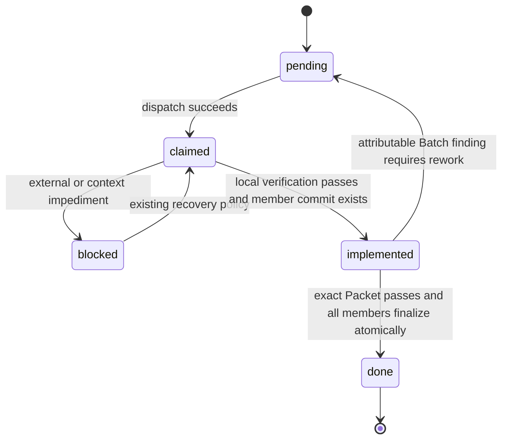
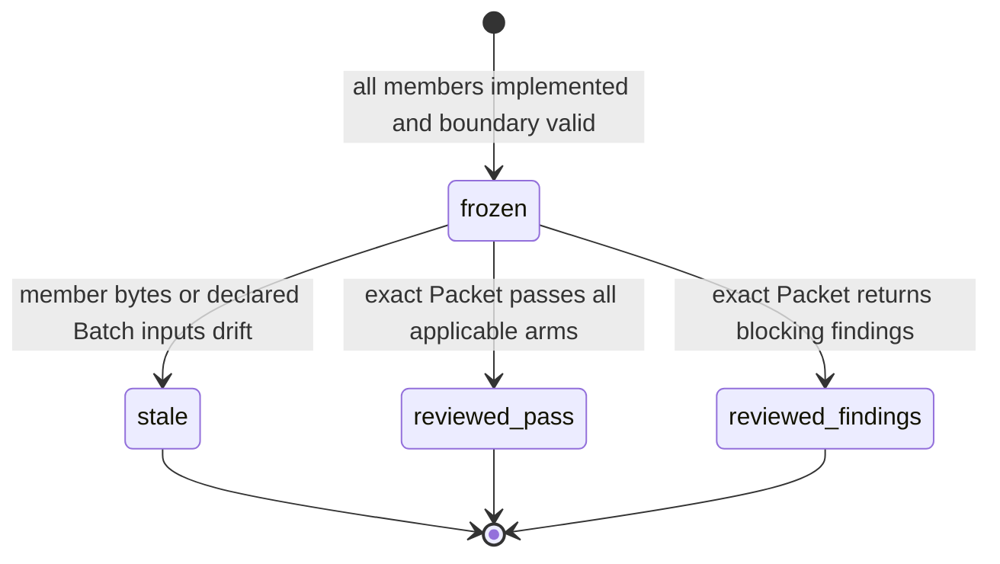
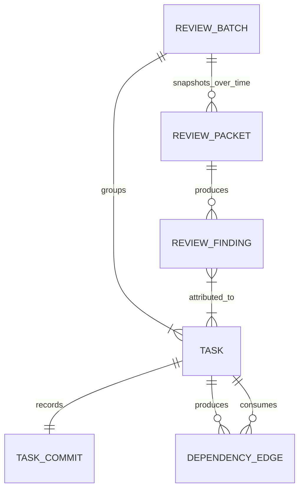

# Task Batch Review — specification proposal

> **Seed**: `docs/loom/specs/2026-08-30-task-batch-review.md`
> **Governance caveat**: no `docs/loom/PRINCIPLES.md`; this repository has a standing direct-to-brief choice. The ratified B direction, `docs/loom/PURPOSE.md`, and current Loom contracts bound this expansion.

## USM backbone

| Step | Actor | Intent and action | Objects | Provenance |
|---|---|---|---|---|
| 1. Author atomic work | Planner | Produce individually traceable Tasks, RED/GREEN criteria, review lane, and dependency edges. | Task, Task DAG | seeded |
| 2. Propose review checkpoints | Planner | Make a second pass over the complete DAG and either declare an eligible Review Batch or explicitly retain individual review. | Task DAG, Review Batch | seeded |
| 3. Validate the plan | Plan reviewer | Reject malformed, incoherent, or unsafe Batch declarations before execution begins. | Plan, Review Batch | inferred |
| 4. Implement each member | Implementer and SDD | Claim one Task, run its mechanical verification, commit it, and record `implemented(<sha>)` without declaring review complete. | Task, Task Commit | seeded |
| 5. Continue legal internal dependencies | SDD | Allow a consumer to use an implemented producer only when both belong to the same Review Batch; otherwise wait for `done`. | Task DAG, Review Batch | seeded |
| 6. Freeze aggregate evidence | SDD | Once every member is implemented and the boundary is still valid, build one immutable aggregate Review Packet. | Review Batch, Review Packet | seeded |
| 7. Review once | Reviewers | Answer the shared verdict question against the aggregate packet in the declared lane without repeating the same full fan-out per member. | Review Packet, Review Finding | seeded |
| 8. Resolve the verdict | SDD | Atomically finalize every passing member, or reopen only members to which blocking findings can be attributed. | Review Finding, Task ledger | seeded |
| 9. Close the branch | Maintainer and whole-branch reviewers | Run cumulative code/docs review and full verification to catch cross-Batch and cross-plugin defects. | Branch, verification evidence | seeded |

### Navigation graph

| From | Edge | To | Required reaction | Provenance |
|---|---|---|---|---|
| Author atomic work | forward | Propose review checkpoints | Preserve Task identity and dependency edges. | seeded |
| Propose review checkpoints | forward | Validate the plan | Carry the proposal as inspectable plan metadata. | seeded |
| Propose review checkpoints | skip | Individual review | Record that no eligible shared boundary exists. | seeded |
| Validate the plan | error_escape | Author atomic work | Return malformed or unsafe grouping to the planner before dispatch. | inferred |
| Implement each member | retry_self | Implement each member | A failed mechanical verification stays local to that Task. | seeded |
| Implement each member | forward | Continue legal internal dependencies | Record `implemented(<sha>)` only after local verification and commit. | seeded |
| Continue legal internal dependencies | forward | Freeze aggregate evidence | Proceed only when every Batch member is implemented. | seeded |
| Continue legal internal dependencies | error_escape | Individual review | Invalidate the Batch when its shared boundary no longer holds. | seeded |
| Freeze aggregate evidence | forward | Review once | Bind all member commits and declared files into one immutable packet. | seeded |
| Review once | retry_self | Review once | A changed member or packet invalidates the prior review and requires a fresh packet. | seeded |
| Review once | error_escape | Implement each member | Reopen only finding-attributable members; keep unaffected members implemented. | seeded |
| Review once | forward | Resolve the verdict | Require every applicable review arm to pass. | seeded |
| Resolve the verdict | forward | Close the branch | Make all member-specific `done(<sha>)` transitions atomically. | seeded |

## OOUX object model

### Inventory

| Object | Attributes | Relationships and actions | Provenance |
|---|---|---|---|
| Task | ID, review lane, dependencies, status, member SHA, optional Batch ID | Belongs to at most one Batch; claim, verify, commit, record implemented, reopen, finalize. | seeded; single-Batch ownership inferred |
| Task Commit | member SHA, reachable bytes, verification evidence | Exactly one reviewed version of one Task; supplies the SHA retained from `implemented` to `done`. | seeded; reachability check inferred |
| Review Batch | ID, non-empty unique members, shared verdict question, review lane, aggregate verification, boundary | Derived from the complete DAG; may be proposed, validated, re-evaluated, or discarded, but is never claimed or transitioned in a ledger. | seeded |
| Review Packet | Batch ID, ordered member→SHA/bytes map, member-owned requirements and acceptance, verdict question, lane, boundary snapshot, aggregate evidence, identity | Immutable snapshot reviewed exactly once; any input drift requires a new Packet. It also serves as the retry receipt, so no separate pass-receipt store is added. | seeded; ownership and canonical identity critic-found/inferred |
| Review Finding | stable ID, Packet identity, blocking state, non-empty owner Task set, blocking ground, location, severity, reason | Belongs to one exact Packet and one or more Batch members; open, resolve, or reject as unassignable. | inferred; blocking ground critic-found |
| Dependency Edge | producer Task, consumer Task | Readiness is derived from producer status and whether both endpoints share a Batch; no new edge type is stored. | seeded |

### Task state machine

- `implemented(<sha>)` and `done(<sha>)` always name that Task's own commit; `implemented(A) → done(A)` preserves the SHA. [seeded]
- A revised member produces a new commit and re-enters `implemented(<new-sha>)`; a previous Packet or verdict cannot follow it. [seeded]
- Direct transitions from `pending`, `claimed`, or `blocked` to `done` are illegal. `done` never moves backward; later corrections become new Tasks. [inferred]
- Existing blocked-reason and stale-claim policy is unchanged and outside this specification. [seeded scope decision]
- Planner authors dispositions, the plan reviewer validates them before dispatch, reviewers return immutable verdict/finding evidence, and only SDD writes `implemented` or `done`; this reuses existing role separation rather than adding an authorization system. [critic-found]

### Review Batch derived observations

These labels are recomputed views, not persisted Batch states or a second ledger.

```mermaid
stateDiagram-v2
    [*] --> ineligible: any exclusion or uncertainty
    [*] --> eligible_not_ready: boundary valid; some member not implemented
    [*] --> ready_for_packet: boundary valid; every member implemented
    eligible_not_ready --> ineligible: boundary invalidates
    ready_for_packet --> ineligible: boundary or member identity invalidates
    ready_for_packet --> eligible_not_ready: member reopens
```

- Eligibility requires one review lane, one end-to-end verdict question, one closable window, and no user decision, external wait, deferred test, independent release point, distinct failure domain, or uncertain boundary. [seeded]
- Membership is fixed once any member becomes `implemented`; changing members, lane, verdict question, aggregate verification, or boundary invalidates any Packet. [inferred]
- A Task belongs to at most one Batch. An ineligible Batch is discarded and its members use individual review; it is not marked failed. [inferred from no-state-machine constraint]

### Review Packet state machine

- Packet bytes are immutable: append, refresh-in-place, member rebinding, and verdict reuse on new bytes are illegal. [seeded]
- The Packet identity plus exact member→SHA map is the idempotency receipt for atomic finalization; no additional Batch receipt store is introduced. [inferred]
- If identity cannot be verified after interruption, SDD rebuilds the Packet and repeats review instead of guessing. [inferred]

### Review Finding state machine

```mermaid
stateDiagram-v2
    [*] --> open: reviewer reports blocking issue with non-empty owner set
    open --> resolved: every owner Task is revised and finding is addressed
    open --> unassignable: owner set is empty, ambiguous, or outside Batch
    resolved --> [*]
    unassignable --> individual_review: discard Batch Packet; review members individually
    individual_review --> [*]
```

- A finding may own multiple members when it crosses a seam; forcing exactly one owner would manufacture attribution. [inferred]
- Attributable owners return to `pending`; unaffected members remain `implemented` at their original SHAs. [seeded; `pending` target inferred as the smallest redispatch state]
- An unassignable finding causes zero member ledger changes before the system falls back to individual review. [seeded fallback]

### Relationships

## Path × edge matrix

| Backbone step | Object | CTA | State | Lens verdict | Expected reaction | Provenance |
|---|---|---|---|---|---|---|
| Author atomic work | Task | author | no Batch decision yet | keep — state legality | Preserve atomic Task fields and finish the DAG before grouping. | seeded |
| Propose review checkpoints | Review Batch | propose | all eligibility predicates true | keep — permissions/state | Emit one Batch declaration with complete required fields. | seeded |
| Propose review checkpoints | Review Batch | propose | any exclusion true | keep — error | Emit individual-review disposition; do not create a Batch. | seeded |
| Propose review checkpoints | Review Batch | propose | boundary uncertain | keep — boundary | Fail closed to individual review; planner confidence is not evidence. | seeded |
| Validate the plan | Task | validate membership | member appears in two Batches | keep — illegal transition | Reject the plan before SDD. | inferred |
| Validate the plan | Review Batch | validate fields | empty/duplicate members or missing verdict/lane/verification/boundary | keep — empty/error | Reject the plan with an actionable field error. | seeded |
| Implement each member | Task | record implemented | verification failed or no member commit | keep — illegal transition | Keep the Task non-implemented and dispatch no Batch review. | seeded |
| Implement each member | Task Commit | bind SHA | verified bytes equal committed bytes | keep — state legality | Write `implemented(<member-sha>)`. | seeded |
| Implement each member | Task Commit | bind SHA | SHA missing, unreachable, wrong-member, aggregate, or ledger commit | keep — error/security | Refuse the transition. | inferred |
| Continue legal internal dependencies | Dependency Edge | test readiness | same Batch producer implemented | keep — state legality | Consumer may be claimed. | seeded |
| Continue legal internal dependencies | Dependency Edge | test readiness | cross-Batch producer implemented | keep — denied path | Consumer remains not ready until producer is done. | seeded |
| Continue legal internal dependencies | Dependency Edge | test readiness | producer pending, claimed, or blocked | keep — denied path | Consumer remains not ready regardless of Batch identity. | inferred |
| Freeze aggregate evidence | Review Batch | test readiness | one or more members not implemented | keep — boundary | Do not materialize a Packet. | seeded |
| Freeze aggregate evidence | Review Packet | materialize | all members implemented and boundary valid | keep — state legality | Freeze exact member→SHA/bytes plus aggregate evidence. | seeded |
| Freeze aggregate evidence | Review Packet | reproduce evidence | verification result is missing or does not match Packet inputs | keep — error | Refuse dispatch and rebuild evidence. | inferred |
| Review once | Review Packet | dispatch | exact immutable identity | keep — async/NFR | Dispatch one applicable reviewer fan-out bound to this Packet. | seeded |
| Review once | Review Packet | dispatch/reuse | any member or declaration drift | keep — concurrency | Mark prior Packet stale; rebuild and re-review. | seeded |
| Review once | Review Finding | attribute | non-empty owner subset of Batch members | keep — state legality | Reopen every owner and preserve unaffected members as implemented. | seeded/inferred |
| Review once | Review Finding | attribute | empty, outside-Batch, or ambiguous owner set | keep — error | Make zero ledger changes and fall back to individual member review. | seeded fallback |
| Resolve the verdict | Task ledger | finalize | exact Packet passed; all members still implemented at reviewed SHAs | keep — transaction | Atomically replace every member status with `done(<same-sha>)`. | seeded |
| Resolve the verdict | Task ledger | finalize | one member SHA/status/member set drifted | keep — concurrency | Compare-and-swap fails with zero status changes. | inferred |
| Resolve the verdict | Task ledger | retry | all members already equal target done SHAs | keep — idempotency | Return success as a no-op. | inferred |
| Resolve the verdict | Task ledger | retry | torn mix of done and implemented | keep — error | Reject as corruption; never fill remaining lines opportunistically. | inferred |
| Close the branch | Branch | cumulative verify | Batch reviews passed | keep — NFR | Still run whole-branch code/docs review and full touched-plugin tests. | seeded/memory-grounded |

Behavioral burden retained: one new Task status, a six-field Batch declaration, immutable aggregate identity, finding ownership plus blocking ground, and atomic multi-line status update. Each exists to preserve Task traceability while removing repeated full-review setup. Dropped as speculative or redundant: Batch queue/status/claim state, score-based eligibility, arbitrary Batch-size caps, new dependency-edge kinds, a separate pass-receipt store, stale-claim redesign, blocked-reason redesign, retention service, lock manager, timeout service, SHA-rebinding transaction, telemetry platform, and legacy plan execution compatibility.

## Cross-object combinations

The review stage has four co-active dimensions, so the pairwise generator was run with direct argv `python3 loom-design/scripts/spec/pairwise.py` over Batch view, member set, Packet identity, and Finding class. Pairwise coverage leaves higher-order combinations as an explicit blind spot.

| Stage | Co-active objects | Joint state | Required reaction |
|---|---|---|---|
| Review | Batch / members / Packet / Finding | ready / SHA drift / exact / attributable | Reject the contradictory snapshot, rebuild Packet, then re-evaluate attribution. |
| Review | Batch / members / Packet / Finding | ineligible / all implemented / exact / none | Discard Batch disposition and run individual reviews; implemented alone does not restore eligibility. |
| Review | Batch / members / Packet / Finding | ready / all implemented / stale / unassignable | Make no ledger change; discard Packet and fall back to individual reviews. |
| Review | Batch / members / Packet / Finding | ready / SHA drift / stale / none | Rebuild member evidence and Packet before any review. |
| Review | Batch / members / Packet / Finding | ineligible / member reopened / stale / attributable | Continue rework and individual review; no Batch finalization path remains. |
| Review | Batch / members / Packet / Finding | ready / member reopened / exact / unassignable | Treat the apparently exact Packet as stale because readiness no longer holds; make no additional ledger changes. |
| Review | Batch / members / Packet / Finding | ineligible / SHA drift / exact / unassignable | Reject Batch and Packet; run individual review from current member commits. |
| Review | Batch / members / Packet / Finding | ready / all implemented / exact / attributable | Reopen every owner Task; unaffected members stay implemented; rebuild Packet after fixes. |
| Review | Batch / members / Packet / Finding | ready / member reopened / exact / none | Do not review or finalize until the member returns implemented and a new Packet is frozen. |

## Journey navigation

| Edge | Type | Landing and restoration | Warning / revalidation | Provenance |
|---|---|---|---|---|
| Author → group | forward | Preserve the completed Task DAG and Task fields. | Revalidate DAG acyclicity before grouping. | seeded |
| Group → individual review | skip | Keep every Task separate. | Record which eligibility predicate was absent; no Batch object survives. | seeded |
| Plan validation → author | error_escape | Return to the plan with exact malformed or unsafe declaration. | Re-run all plan gates after amendment. | inferred |
| Implementation → implementation | retry_self | Keep Task identity; replace only its candidate bytes. | Re-run local verification against the final commit. | seeded |
| Internal dependency → individual review | error_escape | Preserve implemented members but discard Batch disposition. | Re-evaluate every affected cross-Batch dependency. | seeded |
| Packet freeze → review | forward | Land on exact immutable member SHAs and aggregate evidence. | Validate identity immediately before dispatch. | seeded |
| Review → review | retry_self | Discard stale Packet and freeze a new snapshot. | Repeat every applicable review arm; old verdict cannot transfer. | seeded |
| Review → implementation | error_escape | Reopen only owner Tasks; keep unaffected members implemented. | Re-run Task checks and all Batch aggregate verification after repair. | seeded |
| Unassignable finding → individual review | error_escape | Make zero ledger changes before switching review mode. | Each member receives the existing individual-review path. | seeded fallback |
| Passed review → finalization | forward | Compare exact member statuses with Packet SHAs. | Atomic replace or no change; never partial completion. | inferred |
| Finalization retry → close | resume_reenter | If every member already has target done SHA, resume after the completed operation. | Verify Packet identity and ledger bytes; otherwise repeat review. | inferred |

## Provenance

- **seeded**: B-direction Task atomicity, second-pass grouping, Batch fields and exclusions, `implemented`/`done` boundary, same-Batch dependency rule, one aggregate fan-out, immutable invalidation, attributable rework, individual-review fallback, final whole-branch review, and no legacy-plan runtime compatibility.
- **inferred**: one-Batch-per-Task, member-set freeze, reachable member SHA, multi-owner findings, `implemented → pending` rework target, Packet identity as retry receipt, compare-and-swap finalization, idempotent retry, and torn-write refusal.
- **critic-found**: disposition-reference closure, DAG-cycle rejection, named capability boundary, role-separated ledger writes, untrusted declaration fields, committed-scope-only Packet publication, Packet completeness before dispatch, non-vacuous reviewer-arm aggregation, authoritative result provenance, owned-requirement blocking grounds, atomic owner-union rework, whole-decision compare-and-swap, and corpus-based cost/safety evaluation.
- **memory-grounded**: whole-branch review and cold execution remain necessary because per-Task review cannot see cross-plugin guard tests and reading/tests catch different defect classes.
- **dropped**: no persisted Batch lifecycle, review score, configurable heuristic, maximum member count, special dependency edge, separate receipt store, stale-claim redesign, blocked-reason redesign, or legacy execution branch.

## Blind spots — needs human/field input

- **Higher-order interaction residue**: pairwise generation covers every value pair across four review-stage dimensions, not all triples or quadruples; completeness critique must inspect combinations involving simultaneous boundary invalidation, SHA drift, and unassignable findings. [inferred]
- **Canonical Packet identity**: the spec requires deterministic identity over member SHAs/bytes and declarations but does not yet choose a serialization. Planning must reuse an existing canonical JSON/hash pattern if present rather than inventing a framework. [inferred; evidence_needed: project-local]
- **Reviewer finding attribution quality**: a non-empty owner set is mechanically checkable, but whether it truthfully captures a cross-member seam remains reviewer judgment and needs adversarial scenarios. [inferred]
- **Historical replay ceiling**: prior simulation estimates dispatch savings, but only live dogfood can show whether aggregate review changes escaped-defect rate or repair latency. [seeded]
- **Reviewer transport behavior**: cancellation, late-result suppression, and delivery retry capabilities differ by host adapter. First-version correctness requires one authoritative result per expected arm, but concrete timeout budgets and cancellation machinery need field probes rather than a new service. [critic-found; needs human/field input]
- **Artifact retention**: this specification requires enough durable evidence to resume and audit a Packet-bound decision, but its retention period should reuse the repository's existing branch artifact policy once identified. [critic-found; needs human/field input]
- **Git history rewriting**: member SHAs are exact identities; whether rebases after `implemented` or `done` are supported needs current branch-close workflow evidence. First version fails closed on identity drift and does not add SHA rebinding. [critic-found; needs human/field input]
- **Fallback dependency cascade**: if a same-Batch consumer has already used an implemented producer and the Batch later invalidates, the safe reusable-work boundary depends on the actual dependency payload and worktree isolation. First version must stop new claims and fail closed; live dogfood must decide whether existing consumer work can ever be preserved. [critic-found; needs human/field input]
- **Critic round 1**: five lenses produced a moderately overlapping union. Security/policy converged on Packet data and actor authority; state/system converged on partial results and competing writes; the requirements-only lens uniquely recovered requirement ownership, capability-boundary naming, and corpus evaluation. Load-bearing items were re-seeded; the rest remains residue here. [critic-found]
- **Critic targeted round 2**: three changed-input lenses converged on verified requirement ownership, dispatch-bound authoritative results, and symmetric compare-and-swap for rework/finalization. These constraints were re-seeded without adding a new service or lifecycle. [critic-found]
- **Critic targeted round 3**: NFR/security, policy/permissions, and cross-object/system lenses each returned dry on the changed inputs. Because no artifact input changed afterward, the following observation is dry by definition; the loop stopped at two consecutive dry observations. Pairwise overlap remained moderate and the requirements-only view retained unique findings, so no orthogonal lens was required. [critic-found]
- **Coverage statement**: coverage is relative to the ratified seed, the auto-expansion lenses, and five critic lenses. It makes no claim about unseen external/domain knowledge; the non-empty blind spots above remain the handoff limits. [critic-found]
