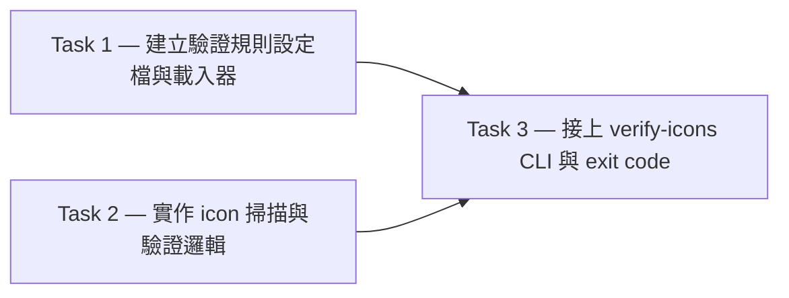

# Plan: icon 出貨前驗證工具

**Source brief**: docs/loom/specs/2026-08-14-icon-ship-verification.md
Goal: 一支 committed 的 CLI 工具，掃描所有 icon 檔，驗證尺寸與格式，任一不符即 exit 非 0。
Stage: planning
Steps:
  1. 建立設定檔載入與 icon 驗證邏輯
  2. 接上 CLI 讓驗證真的能跑
**Total tasks**: 3
**Critical-path depth**: 2 (≤5 ✓)
**Execution order**: sequential
**Plan-document-reviewer verdict**: PENDING

## Task-flow diagram

## Open Questions

N/A — no unresolved question: brief left nothing undecided at plan time.

## Task 1 — 建立驗證規則設定檔與載入器

- **Description**: Add a JSON rules config declaring each icon's expected dimensions and format, and a stdlib loader (`json`) that parses it into a rules object of shape `{icon: {width, height, format}}`. Malformed config raises a clear error.
- **Module**: `NEW: scripts/verify_icons/config.py`
- **Files touched**: `NEW: scripts/verify_icons/config.py`, `NEW: scripts/verify_icons/rules.json`, `NEW: tests/verify_icons/test_config.py`
- **Context paths**:
  - none — greenfield target, no existing code to read
- **Acceptance**:
  - **RED**: `tests/verify_icons/test_config.py > test_load_rules_parses_expected_dimensions_and_format` fails
  - **GREEN**: loader parses `rules.json` into a rules object exposing expected width, height, and format per icon; malformed config raises a clear error; the new test suite is runnable via `python -m unittest` (stdlib, no new deps)
- **Dependencies**: none
- **Independent**: false  # NEW paths — disjointness oracle untrusted (empty-recon sentinel)
- **Brief item covered**: "驗證規則寫在設定檔"
- **Status**: pending
- **Gloss**: 設定檔是驗證規則的唯一來源——沒有它，工具就不知道「正確尺寸」是什麼。

## Task 2 — 實作 icon 掃描與驗證邏輯

- **Description**: Scan a target directory of icon files and verify each against a rules object passed in as a parameter: format by extension and magic bytes, dimensions by parsing PNG IHDR (`struct`) and SVG (`xml.etree.ElementTree`), stdlib only. Return a report listing every violation with expected vs actual values.
- **Module**: `NEW: scripts/verify_icons/verify.py`
- **Files touched**: `NEW: scripts/verify_icons/verify.py`, `NEW: tests/verify_icons/test_verify.py`
- **Context paths**:
  - none — greenfield target, no existing code to read
- **Acceptance**:
  - **RED**: `tests/verify_icons/test_verify.py > test_verify_flags_wrong_dimensions` fails
  - **GREEN**: verifier returns a report listing each violation (file, expected vs actual); a fixture icon with wrong dimensions or format is flagged; a conforming icon passes; the new test suite is runnable via `python -m unittest` (stdlib, no new deps)
- **Dependencies**: none
- **Independent**: false  # NEW paths — disjointness oracle untrusted (empty-recon sentinel)
- **Brief item covered**: "掃描所有 icon 檔，驗證尺寸與格式"
- **Status**: pending
- **Gloss**: 驗證邏輯是工具的心臟——它決定哪些 icon 算「不符」，是 CI 能否在出貨前抓到錯誤的關鍵。

## Task 3 — 接上 verify-icons CLI 與 exit code

- **Description**: Add a `verify-icons` CLI entry point that loads the rules config, runs the verifier over the target directory, prints a human-readable report, and exits non-zero when any violation exists. Declare the command in the command surface and verify it runs.
- **Module**: `NEW: scripts/verify_icons/cli.py`
- **Files touched**: `NEW: scripts/verify_icons/cli.py`, `NEW: tests/verify_icons/test_cli.py`
- **Context paths**:
  - none — greenfield target, no existing code to read
- **Acceptance**:
  - **RED**: `tests/verify_icons/test_cli.py > test_cli_exits_nonzero_on_violation` fails
  - **GREEN**: CLI prints a report and exits 0 on a clean directory, non-zero on any violation; the `verify-icons` verb is declared in the command surface (e.g. `pyproject.toml` `[project.scripts]`) and verified to run
- **Dependencies**: Tasks 1, 2 complete first
- **Independent**: false
- **Brief item covered**: "一支 committed 的 CLI 工具，掃描所有 icon 檔，驗證尺寸與格式，任一不符即 exit 非 0"
- **Status**: pending
- **Gloss**: 這一步讓 kouko 與 CI 都有一支可重現的命令——驗證結果看得見，錯誤由 exit code 說話。

## Notes

Tasks 1 與 2 同屬第一層（皆無 Dependencies），但兩者的 `Files touched` 都是 `NEW:` 路徑（greenfield），依 empty-recon sentinel 規則不得標 `Independent: true`，故執行序為 sequential。Task 3 需 Task 1 與 Task 2 都完成後才開始；rules object 的形狀（`{icon: {width, height, format}}`）是 Task 1 與 Task 2 之間的共享契約，由 Task 3 的接線測試把關。
