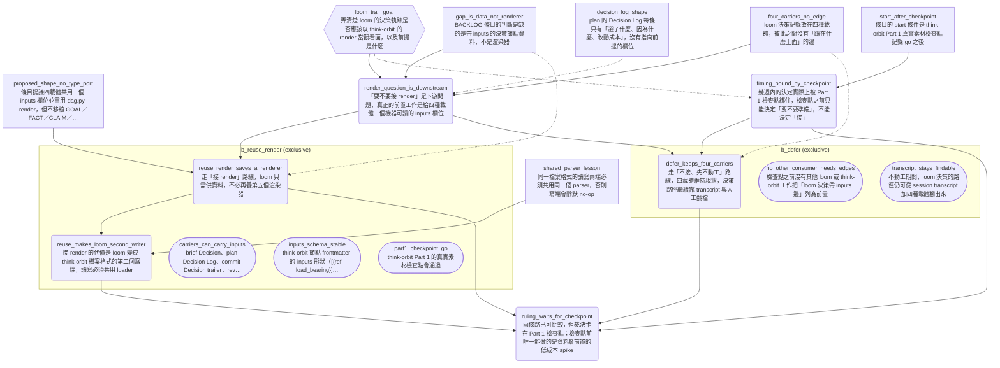

<!-- generated by dag.py render — regenerate, never hand-edit; agent must not read -->

```mermaid
flowchart TD
    loom_trail_goal{{"loom_trail_goal<br/>弄清楚 loom 的決策軌跡是否應該以 think-orbit 的 render 當觀看面，以及前提是什麼"}}
    four_carriers_no_edge["four_carriers_no_edge<br/>loom 決策記錄散在四種載體，彼此之間沒有「踩在什麼上面」的邊"]
    gap_is_data_not_renderer["gap_is_data_not_renderer<br/>BACKLOG 條目的判斷是缺的是帶 inputs 的決策節點資料，不是渲染器"]
    proposed_shape_no_type_port["proposed_shape_no_type_port<br/>條目提議四載體共用一個 inputs 欄位並重用 dag.py render，但不移植 GOAL／FACT／CLAIM／…"]
    start_after_checkpoint["start_after_checkpoint<br/>條目的 start 條件是 think-orbit Part 1 真實素材檢查點記錄 go 之後"]
    shared_parser_lesson["shared_parser_lesson<br/>同一檔案格式的讀寫兩端必須共用同一個 parser，否則寫端會靜默 no-op"]
    decision_log_shape["decision_log_shape<br/>plan 的 Decision Log 每條只有「選了什麼、因為什麼、改動成本」，沒有指向前提的欄位"]
    render_question_is_downstream("render_question_is_downstream<br/>「要不要接 render」是下游問題，真正的前置工作是給四種載體一個機器可讀的 inputs 欄位")
    timing_bound_by_checkpoint("timing_bound_by_checkpoint<br/>幾週內的決定實際上被 Part 1 檢查點綁住，檢查點之前只能決定「要不要準備」，不能決定「接」")
    ruling_waits_for_checkpoint("ruling_waits_for_checkpoint<br/>兩條路已可比較，但裁決卡在 Part 1 檢查點；檢查點前唯一能做的是資料層前置的低成本 spike")
    subgraph br_b_defer ["b_defer (exclusive)"]
    defer_keeps_four_carriers("defer_keeps_four_carriers<br/>走「不接、先不動工」路線，四載體維持現狀，決策路徑繼續靠 transcript 與人工翻檔")
    no_other_consumer_needs_edges(["no_other_consumer_needs_edges<br/>檢查點之前沒有其他 loom 或 think-orbit 工作把「loom 決策帶 inputs 邊」列為前置"])
    transcript_stays_findable(["transcript_stays_findable<br/>不動工期間，loom 決策的路徑仍可從 session transcript 加四種載體翻出來"])
    end
    subgraph br_b_reuse_render ["b_reuse_render (exclusive)"]
    reuse_render_saves_a_renderer("reuse_render_saves_a_renderer<br/>走「接 render」路線，loom 只需供資料，不必再養第五個渲染器")
    reuse_makes_loom_second_writer("reuse_makes_loom_second_writer<br/>接 render 的代價是 loom 變成 think-orbit 檔案格式的第二個寫端，讀寫必須共用 loader")
    carriers_can_carry_inputs(["carriers_can_carry_inputs<br/>brief Decision、plan Decision Log、commit Decision trailer、rev…"])
    inputs_schema_stable(["inputs_schema_stable<br/>think-orbit 節點 frontmatter 的 inputs 形狀（[{ref, load_bearing}]…"])
    part1_checkpoint_go(["part1_checkpoint_go<br/>think-orbit Part 1 的真實素材檢查點會通過"])
    end
    loom_trail_goal --> render_question_is_downstream
    four_carriers_no_edge --> render_question_is_downstream
    gap_is_data_not_renderer --> render_question_is_downstream
    decision_log_shape -.-> render_question_is_downstream
    start_after_checkpoint --> timing_bound_by_checkpoint
    loom_trail_goal -.-> timing_bound_by_checkpoint
    render_question_is_downstream --> reuse_render_saves_a_renderer
    proposed_shape_no_type_port --> reuse_render_saves_a_renderer
    gap_is_data_not_renderer -.-> reuse_render_saves_a_renderer
    reuse_render_saves_a_renderer --> reuse_makes_loom_second_writer
    shared_parser_lesson --> reuse_makes_loom_second_writer
    render_question_is_downstream --> defer_keeps_four_carriers
    timing_bound_by_checkpoint --> defer_keeps_four_carriers
    four_carriers_no_edge -.-> defer_keeps_four_carriers
    reuse_render_saves_a_renderer --> ruling_waits_for_checkpoint
    reuse_makes_loom_second_writer --> ruling_waits_for_checkpoint
    defer_keeps_four_carriers --> ruling_waits_for_checkpoint
    timing_bound_by_checkpoint --> ruling_waits_for_checkpoint
```
