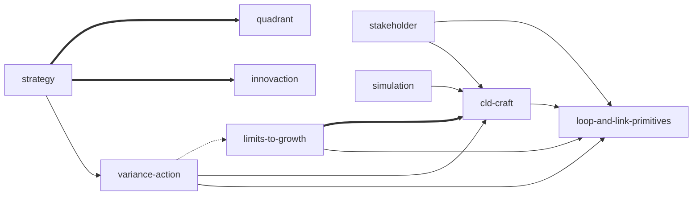

# Systems Thinking Toolkit v0.1.0 Implementation Plan

> **For agentic workers:** REQUIRED SUB-SKILL: Use superpowers:subagent-driven-development (recommended) or superpowers:executing-plans to implement this plan task-by-task. Steps use checkbox (`- [ ]`) syntax for tracking.

**Goal:** Build a `monkey-skills` plugin `systems-thinking-toolkit` v0.1.0 that packages 14 Sherwood-distilled SKILL.md files into 9 skills (5 merged + 4 standalone) plus an entry router, applying nine polish improvements + tri-lang per-skill READMEs.

**Architecture:** subagent-driven parallel orchestration. Phase 0 controller-pilot establishes pattern with `cld-craft` merge → Phase A dispatches 8 implementers + 8 spec-reviewers in parallel → Phase B one fresh-eyes auditor catches cross-skill drift → Phase C controller writes plugin shell → Phase D dispatches 9 README subagents → Phase E ships PR.

**Tech Stack:** Markdown (SKILL.md format per Anthropic spec), YAML frontmatter, JSON (plugin.json + marketplace.json), bash hook `.claude/hooks/validate-skill-folder-structure.sh`, git worktree, ASCII decision-tree diagrams, Mermaid (INDEX.md graph), Python stdlib (json + yaml validation), `dev-workflow:skill-judge` rubric for pilot self-judge.

**Spec reference:** `docs/superpowers/specs/2026-05-12-systems-thinking-toolkit-v0.1.0-design.md`

**Cache source:** `~/.tsundoku/cache/distilled/Seeing-the-Forest-for-the-Trees-A-Manager's-Guide-to-Applyin/`

---

## File structure (responsibilities)

```
systems-thinking-toolkit/                            (NEW plugin)
├── plugin.json                                       single source of truth for plugin metadata
├── README.md / .ja.md / .zh-TW.md                    plugin-level tri-lang docs
├── ROADMAP.md                                        v0.1 → v0.2+ roadmap (sk13/sk14 merger discussion)
├── INDEX.md                                          plugin-level 9-skill map (linkified mermaid, re-derived from 14-node original)
├── commands/                                         9 per-skill + 1 router slash commands
├── skills/
│   ├── using-systems-thinking-toolkit/               entry / router skill
│   ├── loop-and-link-primitives/                     sk01+sk02 merge
│   ├── cld-craft/                                    sk03+sk04 merge (Phase 0 pilot)
│   ├── strategy-lever-and-cascade/                   sk07+sk08 merge
│   ├── stakeholder-and-team-thinking/                sk09+sk10 merge
│   ├── simulation-modeling/                          sk11+sk12 merge
│   ├── limits-to-growth-take-the-brakes-off/         sk05 standalone
│   ├── variance-target-action-template/              sk06 standalone
│   ├── innovaction-martian-test/                     sk13 standalone (V1-weak)
│   └── manager-personality-quadrant/                 sk14 standalone (V1-weak)
└── references/
    ├── BOOK_OVERVIEW.md                              Stage-0 thesis (cache copy)
    ├── VERIFIED.md                                   Stage-1.5 V1/V2/V3 evidence (cache copy)
    └── INDEX-original.md                             verbatim 14-node original INDEX.md (cache copy, for provenance)

.claude-plugin/marketplace.json                      add systems-thinking-toolkit entry
```

Each `skills/<slug>/` contains:
```
SKILL.md
README.md / .ja.md / .zh-TW.md
references/cases.md          (conditional, body > 180 lines after polish)
```

---

## Task 1: Plugin scaffolding

**Files:**
- Create: `systems-thinking-toolkit/plugin.json`
- Create: `systems-thinking-toolkit/skills/` (empty dir, will fill in later tasks)
- Create: `systems-thinking-toolkit/commands/` (empty dir)
- Create: `systems-thinking-toolkit/references/` (empty dir)
- Modify: `.claude-plugin/marketplace.json` (add plugin entry)

- [ ] **Step 1.1: Read marketplace.json for entry format reference**

Run: `cat .claude-plugin/marketplace.json | python3 -m json.tool | head -10`
Confirm the entries follow `{name, description, source}` format.

- [ ] **Step 1.2: Write plugin.json**

Create `systems-thinking-toolkit/plugin.json`:

```json
{
  "name": "systems-thinking-toolkit",
  "version": "0.1.0",
  "description": "Systems thinking toolkit grounded in Dennis Sherwood, Seeing the Forest for the Trees (2002). 9 skills covering loop-and-link primitives, CLD craft, intervention archetypes (limits-to-growth, variance-target-action), strategy (lever-and-cascade), stakeholder + team thinking, stock-flow simulation, plus two auxiliary V1-weak skills (innovaction-martian-test, manager-personality-quadrant) retained per Stage 1.5 user override. Distilled via tsundoku:book-distill RIA-TV++ pipeline; 5 Profile-B compose-with pair merges from the original 14-skill distill. システム思考ツールキット — Sherwood 2002 ベース。系統思考工具組 — Sherwood 2002 為本。",
  "author": {
    "name": "kouko",
    "url": "https://github.com/kouko"
  },
  "homepage": "https://github.com/kouko/monkey-skills/tree/main/systems-thinking-toolkit",
  "repository": "https://github.com/kouko/monkey-skills",
  "license": "MIT",
  "keywords": [
    "systems-thinking",
    "causal-loop-diagram",
    "feedback-loop",
    "sherwood",
    "scenario-planning",
    "stock-flow",
    "mental-models",
    "strategy",
    "intervention-archetypes"
  ]
}
```

- [ ] **Step 1.3: Verify plugin.json parses**

Run: `python3 -m json.tool systems-thinking-toolkit/plugin.json`
Expected: pretty-printed JSON, exit 0.

- [ ] **Step 1.4: Add entry to marketplace.json**

Open `.claude-plugin/marketplace.json` and add this object inside the
`"plugins"` array (after the `legal-toolkit` entry, before the closing `]`):

```json
    {
      "name": "systems-thinking-toolkit",
      "description": "Systems thinking toolkit grounded in Dennis Sherwood, Seeing the Forest for the Trees (2002). 9 skills (5 Profile-B merged compose-with pairs + 4 standalone) covering loop-and-link primitives, CLD craft, intervention archetypes, strategy, stakeholder + team thinking, stock-flow simulation, plus auxiliary V1-weak (sk13/sk14). システム思考。系統思考。",
      "source": "./systems-thinking-toolkit/"
    }
```

- [ ] **Step 1.5: Verify marketplace.json still parses**

Run: `python3 -m json.tool .claude-plugin/marketplace.json | tail -20`
Expected: full file parses; new entry visible at the tail.

- [ ] **Step 1.6: Create empty directories**

Run:
```bash
mkdir -p systems-thinking-toolkit/skills systems-thinking-toolkit/commands systems-thinking-toolkit/references
touch systems-thinking-toolkit/skills/.gitkeep systems-thinking-toolkit/commands/.gitkeep systems-thinking-toolkit/references/.gitkeep
```

- [ ] **Step 1.7: Commit scaffolding**

```bash
git add systems-thinking-toolkit/ .claude-plugin/marketplace.json
git commit -m "$(cat <<'EOF'
feat(systems-thinking-toolkit): plugin scaffolding (plugin.json + marketplace entry + empty dirs)

Adds plugin.json, marketplace entry, and empty skills/ commands/
references/ directories with .gitkeep placeholders so the skeleton lives
on disk before Phase 0 pilot.

Co-Authored-By: Claude Opus 4.7 (1M context) <noreply@anthropic.com>
EOF
)"
```

---

## Task 2: Set up systems-thinking translation glossary

**Files:**
- Create: `systems-thinking-toolkit/references/translation-glossary.md` (Phase D reference for 9 README subagents)

- [ ] **Step 2.1: Write the glossary**

Create `systems-thinking-toolkit/references/translation-glossary.md`:

````markdown
# Systems-Thinking Translation Glossary (EN / JA / ZH-TW)

This glossary is the canonical translation reference for all per-skill
READMEs in `systems-thinking-toolkit` (Phase D). All 9 README subagents
MUST consult this file. New terms encountered during translation should
be added with a brief justification.

## Core terms

| English | 日本語 | 繁體中文 |
|---|---|---|
| reinforcing loop | 強化ループ | 強化迴路 |
| balancing loop | バランスループ | 平衡迴路 |
| causal loop diagram (CLD) | 因果ループ図 | 因果迴路圖 |
| stock | ストック | 存量 |
| flow | フロー | 流量 |
| feedback | フィードバック | 回饋 |
| dangle | ダングル | 懸垂端 |
| dynamics | ダイナミクス | 動態 |
| systems thinking | システム思考 | 系統思考 |
| mental model | メンタルモデル | 心智模型 |
| variance | 変動 | 變異 |
| target | ターゲット | 目標 |
| lever | レバー | 槓桿 |
| outcome | アウトカム | 結果 |
| stakeholder | ステークホルダー | 利害關係人 |
| scenario planning | シナリオプランニング | 情境規劃 |
| archetype | アーキタイプ | 原型 |
| limits to growth | リミッツ・トゥ・グロース | 成長極限 |
| trigger | トリガー | 觸發點 |
| dimension | 観点 | 維度 |

## Override rules (per memory)

- `dimension` translates as 観点 / 維度, NEVER 次元 (which is mathematical sense)
- Skill names stay as-is in body text (English slugs); only descriptions translate
- Author proper nouns (Sherwood, Senge, Sterman, Forrester, Meadows, Goodhart, Edmondson, etc.) stay in English
- Book titles in original language

## Open questions for translators

When uncertain, leave a `<!-- TRANS-Q: ... -->` HTML comment for controller
to resolve. Do not invent a translation in zh-TW that uses Mainland
calques; refer to memory `feedback_skill_readme_i18n_required` and
`project_i18n_multilingual_readme` for the zh-TW industry-standard A
discipline.
````

- [ ] **Step 2.2: Commit glossary**

```bash
git add systems-thinking-toolkit/references/translation-glossary.md
git commit -m "$(cat <<'EOF'
docs(systems-thinking-toolkit): translation glossary for Phase D READMEs

Canonical EN / JA / zh-TW glossary that all 9 per-skill README subagents
consult before translation. Encodes dimension=観点/維度 override per
memory feedback_dimension_translation.

Co-Authored-By: Claude Opus 4.7 (1M context) <noreply@anthropic.com>
EOF
)"
```

---

## Task 3: Copy audit-trail files into plugin `references/`

**Files:**
- Create: `systems-thinking-toolkit/references/BOOK_OVERVIEW.md` (copy from cache)
- Create: `systems-thinking-toolkit/references/VERIFIED.md` (copy from cache `verified.md`, renamed)
- Create: `systems-thinking-toolkit/references/INDEX-original.md` (verbatim cache `INDEX.md`)

- [ ] **Step 3.1: Define cache path variable for reuse**

```bash
CACHE="$HOME/.tsundoku/cache/distilled/Seeing-the-Forest-for-the-Trees-A-Manager's-Guide-to-Applyin"
ls "$CACHE" | head -5
```

Expected: lists `BOOK_OVERVIEW.md`, `INDEX.md`, `verified.md`, and 14 skill directories.

- [ ] **Step 3.2: Copy BOOK_OVERVIEW.md**

```bash
cp "$CACHE/BOOK_OVERVIEW.md" systems-thinking-toolkit/references/BOOK_OVERVIEW.md
wc -l systems-thinking-toolkit/references/BOOK_OVERVIEW.md
```

- [ ] **Step 3.3: Copy verified.md → VERIFIED.md**

```bash
cp "$CACHE/verified.md" systems-thinking-toolkit/references/VERIFIED.md
wc -l systems-thinking-toolkit/references/VERIFIED.md
```

- [ ] **Step 3.4: Copy original 14-node INDEX.md as INDEX-original.md**

```bash
cp "$CACHE/INDEX.md" systems-thinking-toolkit/references/INDEX-original.md
wc -l systems-thinking-toolkit/references/INDEX-original.md
```

- [ ] **Step 3.5: Commit audit trail**

```bash
git add systems-thinking-toolkit/references/
git commit -m "$(cat <<'EOF'
docs(systems-thinking-toolkit): copy Stage 0/1.5/3 audit-trail from cache

BOOK_OVERVIEW.md (Stage 0 thesis), VERIFIED.md (Stage 1.5 V1/V2/V3
evidence — renamed from verified.md), and INDEX-original.md (verbatim
14-node Stage 3 INDEX.md, preserved for provenance before Profile B
re-derivation to 9 nodes in Phase C).

Co-Authored-By: Claude Opus 4.7 (1M context) <noreply@anthropic.com>
EOF
)"
```

---

## Task 4: Phase 0 Pilot — `cld-craft` merge

**Files:**
- Create: `systems-thinking-toolkit/skills/cld-craft/SKILL.md` (merged from sk03 + sk04)
- Create: `systems-thinking-toolkit/skills/cld-craft/references/cases.md` (conditional — likely triggered)

Pilot rationale: `cld-craft` is the cleanest Profile B merge (Stage-3 declared `compose-with`; sk03 Rule 7 directly triggers sk04). Moderate combined size exercises both merge mechanic AND nine improvements at representative scale. Pilot output becomes the pattern reference for Phase A.

- [ ] **Step 4.1: Read both source SKILL.md**

```bash
cat "$CACHE/cld-drawing-craft-12-rules/SKILL.md" | wc -l
cat "$CACHE/fuzzy-variable-elevation/SKILL.md" | wc -l
```

Expected: sk03 ~170 lines, sk04 ~150 lines (combined ~320 before merge dedup).

- [ ] **Step 4.2: Create cld-craft skill dir + write merged SKILL.md**

Create `systems-thinking-toolkit/skills/cld-craft/SKILL.md`.

**Merge recipe (applies to every merge in Phase A too):**

(a) **Frontmatter:**
- `name`: new merged kebab slug (`cld-craft`)
- `description`: rewrite to cover BOTH source trigger surfaces; lead with primary; end with KEYWORDS from both
- `source_book`: identical for both, keep one
- `source_chapter`: concat with `,` (e.g. "Chapter 7, Chapter 8")
- `source_language`: identical, keep one
- `tags`: union, deduped
- `related_skills`: re-map per spec §3.5 (drop intra-merge edges, retarget inter-merge edges to merged-skill slugs)

(b) **Body sections** (preserve RIA-TV++ order: R/I/A1/A2/E/B):
- **R Reading**: include BOTH source's R quotes, ordered chronologically by chapter
- **I Interpretation**: synthesize ONE unified narrative — do NOT concat two paragraphs verbatim; weave them so the two methodology punchlines flow into each other (the trickiest section)
- **A1 Past Application**: merge case lists; consolidate any duplicate case citations; preserve all source-unit codes from both
- **A2 Future Trigger**: union of triggers; union of language signals; merged "Distinction from neighboring skills" must address neighbors of BOTH sources
- **E Execution**: write a NEW unified procedure that respects both source halt-conditions. For cld-craft specifically: keep 12-rule numbering, expand Rule 7 inline to include sk04's split-fuzzy-variable trick as a sub-procedure
- **B Boundary**: union of "Do NOT use when" / "Author-warned failure modes" / "Author's blind spots" / "Easily-confused neighboring methodologies"; dedupe near-duplicates
- **Related skills**: re-map per spec §3.5
- **Audit metadata**: merge `Source units merged` from both; same `Distilled at`; `Verification status` is the WORSE of the two (any V1 ⚠ flags through)

(c) **Apply nine improvements** in this order:
1. Frontmatter `related_skills` backfill (Tier 1 #1) — already done in (a) above
2. Shorthand sk-code resolution (Tier 1 #2)
3. Source-unit code provenance footer in Audit metadata (Tier 1 #3) — single line pointing to `<plugin-root>/references/VERIFIED.md`
4. Tier-3 overrides: N/A for cld-craft (no #6/#7/#8 apply)
5. ASCII decision-tree at top of E section (Tier 2 #5) — only if E has ≥ 6 steps; cld-craft will likely qualify
6. Measure body line count
7. If > 180 lines → extract A1 cases to `references/cases.md` (Tier 2 #4); A1 retains 1-2 line summary + MANDATORY load directive

- [ ] **Step 4.3: Verify hook does not block**

```bash
echo '{"tool_input":{"file_path":"'"$PWD"'/systems-thinking-toolkit/skills/cld-craft/SKILL.md"}}' | bash .claude/hooks/validate-skill-folder-structure.sh
echo "exit=$?"
```

Expected: `exit=0` (no nested subdirs under cld-craft/).

- [ ] **Step 4.4: Verify YAML frontmatter parses**

```bash
python3 -c "
import yaml, pathlib
content = pathlib.Path('systems-thinking-toolkit/skills/cld-craft/SKILL.md').read_text()
fm = content.split('---')[1]
parsed = yaml.safe_load(fm)
assert 'name' in parsed and 'description' in parsed and 'related_skills' in parsed
print('OK', parsed['name'], 'has', len(parsed.get('related_skills', [])), 'related_skills')
"
```

Expected: prints `OK cld-craft has N related_skills`.

- [ ] **Step 4.5: Verify body token budget**

```bash
python3 -c "
content = open('systems-thinking-toolkit/skills/cld-craft/SKILL.md').read()
body = content.split('---')[2]
words = len(body.split())
print(f'words={words} (cap ~4500)')
assert words < 4500, f'body exceeds 4500-word soft cap: {words}'
"
```

Expected: `words=N` with `N < 4500`.

- [ ] **Step 4.6: Self-judge with skill-judge rubric**

Invoke `dev-workflow:skill-judge` against `cld-craft/SKILL.md` and record dimension scores. The pilot MUST achieve:

- Total ≥ 107 (sk03's pre-merge score), AND
- NO single dimension drops below the BETTER of sk03 and sk04 on that dimension

If pilot drops on any dimension → halt, re-pilot, do NOT proceed to Phase A.

| Dimension | sk03 baseline | sk04 baseline | Pilot must ≥ |
|---|---|---|---|
| D1 Knowledge Delta | 18 | 18 | 18 |
| D2 Mindset+Procedures | 14 | 14 | 14 |
| D3 Anti-Pattern | 14 | 14 | 14 |
| D4 Spec Compliance | 14 | 15 | 15 |
| D5 Progressive Disclosure | 13 | 13 | 13 |
| D6 Freedom Calibration | 13 | 13 | 13 |
| D7 Pattern Recognition | 9 | 9 | 9 |
| D8 Practical Usability | 12 | 14 | 14 |

**Record results in the commit message body.**

- [ ] **Step 4.7: Commit pilot output**

```bash
git add systems-thinking-toolkit/skills/cld-craft/
git commit -m "$(cat <<'EOF'
feat(systems-thinking-toolkit): Phase 0 pilot — cld-craft merge (sk03+sk04)

Merges cld-drawing-craft-12-rules (sk03, 107/B) and
fuzzy-variable-elevation (sk04, 110/A) into the cld-craft skill via
the Profile B merge recipe + 9 improvements. Rule 7 of the 12-rule
framework now expands inline to include the split-fuzzy-variable
trick from sk04.

Pilot self-judge score: <FILL IN total/grade>. Dimension scores:
D1=<>, D2=<>, D3=<>, D4=<>, D5=<>, D6=<>, D7=<>, D8=<>. No dimension
regressed below the better of sk03/sk04 baselines (see spec §6
Phase 0 halt condition).

Decision: cld-craft chosen as pilot target because it is the cleanest natural merge case (Stage-3 declared compose-with; sk03 Rule 7 directly triggers sk04). Merge recipe + dimension-preservation rule established here is the pattern reference for the 4 remaining Phase A merges.

Co-Authored-By: Claude Opus 4.7 (1M context) <noreply@anthropic.com>
EOF
)"
```

---

## Task 5: Phase A preparation — write subagent prompt templates

**Files:**
- Create: `docs/superpowers/plans/2026-05-12-prompts/implementer-template.md` (scaffold, used 8 times)
- Create: `docs/superpowers/plans/2026-05-12-prompts/reviewer-template.md` (scaffold, used 8 times)

These templates live in `docs/superpowers/plans/` (the plan dir, not the plugin) — they're orchestration artifacts, not user-facing plugin content.

- [ ] **Step 5.1: Create prompts directory**

```bash
mkdir -p docs/superpowers/plans/2026-05-12-prompts
```

- [ ] **Step 5.2: Write implementer template**

Create `docs/superpowers/plans/2026-05-12-prompts/implementer-template.md`:

````markdown
# Implementer subagent prompt template

Use this for each of the 8 Phase A implementer subagents. Fill in the
`{{}}` placeholders before dispatch.

---

You are a Phase A implementer subagent for the systems-thinking-toolkit
v0.1.0 build.

## Your task

{{TASK_TYPE}} — Either **MERGE-AND-POLISH** (combine two source SKILL.md
into one, then apply 9 improvements) or **POLISH-ONLY** (apply 9
improvements to a single standalone source SKILL.md).

## Your target

- Skill slug: `{{TARGET_SLUG}}`
- Source SKILL.md path(s):
  {{#if merge}}
  - `{{CACHE}}/{{SOURCE_A_SLUG}}/SKILL.md`
  - `{{CACHE}}/{{SOURCE_B_SLUG}}/SKILL.md`
  {{else}}
  - `{{CACHE}}/{{SOURCE_SLUG}}/SKILL.md`
  {{/if}}
- Destination dir: `{{PLUGIN_ROOT}}/skills/{{TARGET_SLUG}}/`

## Required reading (in order, fully)

1. **Spec**: `{{REPO}}/docs/superpowers/specs/2026-05-12-systems-thinking-toolkit-v0.1.0-design.md` §3.5, §5, §7
2. **Pilot reference**: `{{REPO}}/systems-thinking-toolkit/skills/cld-craft/SKILL.md` (the pattern reference for both merge mechanic and 9 improvements)
3. **Pilot commit**: `git show {{PILOT_COMMIT_HASH}}` (the actual diff)
4. **INDEX**: `{{PLUGIN_ROOT}}/references/INDEX-original.md` (14-node Stage-3 relations — use the re-mapping rule in spec §3.5 to derive 9-node `related_skills` for your target)
5. **Source SKILL.md files** for your target

## Required output

ONE atomic commit on the current branch containing:

- `{{PLUGIN_ROOT}}/skills/{{TARGET_SLUG}}/SKILL.md`
- `{{PLUGIN_ROOT}}/skills/{{TARGET_SLUG}}/references/cases.md` (conditional, body > 180 lines after polish per spec §5 Tier 2 #4)

Commit message format:
```
feat(systems-thinking-toolkit): {{TARGET_SLUG}} {{merge | polish}} ({{N}}-item improvements)

<body>
```

## Hard constraints

1. `related_skills` entries MUST be a subset of INDEX-original 17 relations re-mapped per spec §3.5; never invent relations
2. Body MUST be ≤ 4500 words (≤ ~6000 tokens); trigger `references/cases.md` extraction if exceeded
3. Frontmatter MUST parse as valid YAML
4. Hook `bash .claude/hooks/validate-skill-folder-structure.sh` MUST exit 0 against your output
5. Shorthand `sk0[0-9]` and `sk1[0-4]` MUST be glossed at first occurrence per section
6. {{TARGET_SLUG}}-specific Tier-3 override (if any): {{TIER_3_OVERRIDE_INSTRUCTION_OR_NONE}}
7. Audit metadata MUST preserve ALL source-unit codes from both source SKILL.md (no provenance loss)

## What you must NOT do

- Do NOT modify any file outside `{{PLUGIN_ROOT}}/skills/{{TARGET_SLUG}}/`
- Do NOT add new files beyond SKILL.md + references/cases.md
- Do NOT invent new `related_skills` not in the 17-relation INDEX-original
- Do NOT modify or paraphrase source-unit codes (f01, p28, ce27, etc.)
- Do NOT delete or reword existing Boundary "Author's blind spots" sections — these are V1.5 transparency artifacts

## Done criteria

Your commit lands cleanly; `git log -1` shows it; hook exits 0; YAML parses; word count is below 4500.

Report DONE with the commit hash.
````

- [ ] **Step 5.3: Write spec-reviewer template**

Create `docs/superpowers/plans/2026-05-12-prompts/reviewer-template.md`:

````markdown
# Spec-reviewer subagent prompt template

Use this for each of the 8 Phase A' spec-reviewer subagents (one per
Phase A implementer commit). Fill in `{{}}` placeholders before dispatch.

---

You are a Phase A' spec-reviewer subagent for the systems-thinking-toolkit
v0.1.0 build.

## Your task

Review the implementer commit for `{{TARGET_SLUG}}` against the C1-C10
checklist in spec §7. Produce a binary PASS / FAIL report. **You do NOT
modify any files** — you only judge.

## Inputs

- Implementer commit: `{{IMPLEMENTER_COMMIT_HASH}}`
- Spec §7 checklist: `{{REPO}}/docs/superpowers/specs/2026-05-12-systems-thinking-toolkit-v0.1.0-design.md`
- Source SKILL.md path(s) (for C8 / C9 diff): {{SOURCE_PATHS}}
- INDEX-original: `{{PLUGIN_ROOT}}/references/INDEX-original.md`

## Checks to run

| # | Check | How |
|---|---|---|
| C1 | All applicable improvements applied | Diff implementer commit vs spec §5 |
| C2 | Hook does not block | `echo '{"tool_input":{"file_path":"PATH"}}' \| bash .claude/hooks/validate-skill-folder-structure.sh; echo exit=$?` (must be 0) |
| C3 | Body word count ≤ 4500 | Python: `wc -w` on body (after `---` split) |
| C4 | Frontmatter YAML valid | `python3 -c 'import yaml; yaml.safe_load(...)'` |
| C5 | `related_skills` ⊆ INDEX-original 17 relations, re-mapped per §3.5; intra-merge edges dropped | grep cross-check |
| C6 | Shorthand sk-code first occurrence has gloss | regex `sk\d\d` first-per-section has parenthetical |
| C7 | If body > 180 lines after polish → `references/cases.md` exists + A1 has MANDATORY directive | `test -f` + `grep -q MANDATORY` |
| C8 | Description first sentence preserved (except sk13/sk14 and except merged skills which by definition rewrite) | `head -3 frontmatter description` diff |
| C9 (merge only) | All source-unit codes from BOTH source skills preserved | grep diff of audit metadata |
| C10 (merge only) | Combined body ≤ 6000 tokens; `references/cases.md` extracted if exceeded | wc + file existence |

## Output format

Return JSON exactly matching this schema:

```json
{
  "skill": "{{TARGET_SLUG}}",
  "commit": "{{IMPLEMENTER_COMMIT_HASH}}",
  "status": "PASS" | "FAIL",
  "checks": {
    "C1": "pass" | "fail: <one-line reason>",
    "C2": "...",
    "C3": "...",
    "C4": "...",
    "C5": "...",
    "C6": "...",
    "C7": "...",
    "C8": "...",
    "C9": "..." | "n/a",
    "C10": "..." | "n/a"
  },
  "summary": "<one-sentence overall verdict>"
}
```

NO prose before or after the JSON.
````

- [ ] **Step 5.4: Commit prompt templates**

```bash
git add docs/superpowers/plans/2026-05-12-prompts/
git commit -m "$(cat <<'EOF'
docs(systems-thinking-toolkit): Phase A subagent prompt templates

Two reusable templates (implementer + spec-reviewer), dispatched 8 times
each. Implementer template encodes the MERGE-AND-POLISH vs POLISH-ONLY
task split + the 9-improvement constraints from spec §5. Reviewer
template encodes the C1-C10 binary checklist from spec §7. Both live
in docs/superpowers/plans/ — orchestration artifacts, not plugin content.

Co-Authored-By: Claude Opus 4.7 (1M context) <noreply@anthropic.com>
EOF
)"
```

---

## Task 6: Phase A — dispatch 8 implementer subagents

**Files (output, by subagents):**
- Create: `systems-thinking-toolkit/skills/loop-and-link-primitives/SKILL.md` (+ optional cases.md)
- Create: `systems-thinking-toolkit/skills/strategy-lever-and-cascade/SKILL.md` (+ cases.md required per spec §4)
- Create: `systems-thinking-toolkit/skills/stakeholder-and-team-thinking/SKILL.md` (+ optional)
- Create: `systems-thinking-toolkit/skills/simulation-modeling/SKILL.md` (+ optional)
- Create: `systems-thinking-toolkit/skills/limits-to-growth-take-the-brakes-off/SKILL.md`
- Create: `systems-thinking-toolkit/skills/variance-target-action-template/SKILL.md`
- Create: `systems-thinking-toolkit/skills/innovaction-martian-test/SKILL.md`
- Create: `systems-thinking-toolkit/skills/manager-personality-quadrant/SKILL.md`

- [ ] **Step 6.1: Capture pilot commit hash for prompt fill-in**

```bash
PILOT_HASH=$(git log --grep="Phase 0 pilot — cld-craft" --pretty=%H -1)
echo "PILOT_HASH=$PILOT_HASH"
```

- [ ] **Step 6.2: Dispatch 4 merge-implementer subagents in parallel**

Use a single message with 4 Agent tool invocations. For each, fill in implementer-template.md:

**Merge-impl 1**: `loop-and-link-primitives` from sk01 + sk02
- TASK_TYPE: MERGE-AND-POLISH
- SOURCE_A_SLUG: `reinforcing-balancing-loop-diagnosis`
- SOURCE_B_SLUG: `s-o-link-assignment`
- TIER_3_OVERRIDE: **#6 reverse-link backfill — populate `related_skills` with reverse links to skills that `depends-on` sk01 per spec §5 Tier 3 #6**

**Merge-impl 2**: `strategy-lever-and-cascade` from sk07 + sk08
- TASK_TYPE: MERGE-AND-POLISH
- SOURCE_A_SLUG: `lever-vs-outcome-reframing`
- SOURCE_B_SLUG: `strategic-cascade-scenario-planning`
- TIER_3_OVERRIDE: NONE
- NOTE: combined body will exceed 180 lines — `references/cases.md` extraction is REQUIRED, not optional

**Merge-impl 3**: `stakeholder-and-team-thinking` from sk09 + sk10
- TASK_TYPE: MERGE-AND-POLISH
- SOURCE_A_SLUG: `multi-perspective-cld-wise-policy`
- SOURCE_B_SLUG: `mental-models-harmony-leadership-energy`
- TIER_3_OVERRIDE: NONE

**Merge-impl 4**: `simulation-modeling` from sk11 + sk12
- TASK_TYPE: MERGE-AND-POLISH
- SOURCE_A_SLUG: `stock-flow-translation`
- SOURCE_B_SLUG: `models-for-learning-not-answers`
- TIER_3_OVERRIDE: NONE

- [ ] **Step 6.3: Dispatch 4 polish-implementer subagents in parallel**

Same Agent tool invocation message (combined with Step 6.2 into ONE message of 8 Agent calls — TRUE parallel).

**Polish-impl 1**: `limits-to-growth-take-the-brakes-off` from sk05
- TASK_TYPE: POLISH-ONLY
- SOURCE_SLUG: `limits-to-growth-take-the-brakes-off`
- TIER_3_OVERRIDE: NONE

**Polish-impl 2**: `variance-target-action-template` from sk06
- TASK_TYPE: POLISH-ONLY
- TIER_3_OVERRIDE: NONE

**Polish-impl 3**: `innovaction-martian-test` from sk13 (V1-weak)
- TASK_TYPE: POLISH-ONLY
- TIER_3_OVERRIDE: **#7 description framing-prefix — prepend "Auxiliary skill — typically reached from inside strategy-lever-and-cascade workflow when generating alternative futures." to description; PRESERVE all other trigger keywords**

**Polish-impl 4**: `manager-personality-quadrant` from sk14 (V1-weak)
- TASK_TYPE: POLISH-ONLY
- TIER_3_OVERRIDE: **#8 lead-with-headline-contribution — promote "adapt framing not analysis" split (current E Step 3) into R Reading section header; 2x2 taxonomy stays in I as supporting vocabulary**

- [ ] **Step 6.4: Collect 8 implementer commit hashes**

```bash
git log --oneline --since="10 minutes ago" --grep="feat(systems-thinking-toolkit)"
```

Expected: 8 commits, one per implementer, in chronological order. Record each hash for Task 7.

- [ ] **Step 6.5: Verify all 8 commits passed hook**

```bash
for slug in loop-and-link-primitives strategy-lever-and-cascade stakeholder-and-team-thinking simulation-modeling limits-to-growth-take-the-brakes-off variance-target-action-template innovaction-martian-test manager-personality-quadrant; do
  result=$(echo '{"tool_input":{"file_path":"'"$PWD"'/systems-thinking-toolkit/skills/'"$slug"'/SKILL.md"}}' | bash .claude/hooks/validate-skill-folder-structure.sh; echo "exit=$?")
  echo "$slug: $result"
done
```

Expected: all 8 print `exit=0`.

---

## Task 7: Phase A' — dispatch 8 spec-reviewer subagents

**Files:** no file changes (review only).

- [ ] **Step 7.1: Dispatch 8 spec-reviewer subagents in parallel**

ONE message with 8 Agent tool invocations. Fill reviewer-template.md per skill with the corresponding implementer commit hash.

- [ ] **Step 7.2: Collect 8 JSON status reports**

Each subagent returns a `{skill, commit, status, checks, summary}` JSON.
Aggregate into a summary:

```
| Skill | Status | Failed checks |
|---|---|---|
| loop-and-link-primitives | PASS / FAIL | ... |
| ... |
```

- [ ] **Step 7.3: Re-run loop for any FAIL (max 3 rounds)**

For each FAIL:
1. Use `SendMessage` to the failing implementer's agent with the specific check that failed + verbatim quote from reviewer's JSON
2. Implementer modifies and produces a follow-up commit
3. Re-dispatch the corresponding reviewer with the new commit hash
4. Update aggregated table

After 3 rounds of FAIL on the same skill → controller takes over directly. Document the takeover in spec §11 "known limitations" if applicable.

- [ ] **Step 7.4: Confirm all 8 skills PASS**

```bash
# Manual: aggregated table from Step 7.2 should show all 8 = PASS
```

No commit needed; this task is verification only.

---

## Task 8: Phase B — Fresh-eyes cross-skill audit

**Files (output):** controller fix commits as needed.

- [ ] **Step 8.1: Dispatch one fresh-eyes auditor subagent**

Prompt scaffold (inline, not templated since dispatched only once):

````
You are the Phase B fresh-eyes auditor for systems-thinking-toolkit v0.1.0.

ALL 8 Phase A implementer commits plus the Phase 0 pilot commit are
now landed. Your job is to detect CROSS-SKILL DRIFT — issues that
single-skill spec-reviewers (C-checks) cannot see.

## Inputs

- 9 SKILL.md files at `systems-thinking-toolkit/skills/<slug>/SKILL.md`
- spec §7 X-checks: `docs/superpowers/specs/2026-05-12-systems-thinking-toolkit-v0.1.0-design.md`
- `systems-thinking-toolkit/references/INDEX-original.md` (14-node Stage-3 graph)

## X-checks to run

| # | Check | How |
|---|---|---|
| X1 | `related_skills` symmetry where INDEX declares both directions | Build graph from all 9 frontmatters; cross-check against re-mapped 17 relations |
| X2 | All 9 descriptions follow verb-first + trigger + NOT-for + KEYWORDS | Manual inspection of each description |
| X3 | Source-unit codes don't collide across skills (same code referring to different things) | grep all source-unit codes; cluster by code; flag any reused code with diverging definitions |
| X4 | All 17 INDEX-original relations are reflected in at least one frontmatter (after §3.5 re-mapping, excluding intra-merge edges) | Set-diff INDEX edges vs union of `related_skills` |
| X5 | sk13 TRIZ disclosure + sk14 DISC/MBTI disclosure still present in Boundary | grep `TRIZ` in sk13; grep `DISC\|MBTI` in sk14 |

## Output

JSON exactly:

```json
{
  "x_checks": {
    "X1": { "status": "pass" | "fail", "issues": ["..."] },
    "X2": { ... },
    "X3": { ... },
    "X4": { ... },
    "X5": { ... }
  },
  "summary": "<one-sentence verdict>"
}
```
````

- [ ] **Step 8.2: Triage fresh-eyes report**

For each `fail` issue:
1. Controller reads the issue
2. Identifies which skill needs adjustment
3. Edits the SKILL.md directly (NOT via implementer subagent, since drift is cross-skill by definition)
4. Adds a new atomic commit per fixed skill

- [ ] **Step 8.3: Re-dispatch fresh-eyes auditor (round 2 if needed)**

If round 1 had any `fail`, re-dispatch with same prompt. Loop cap: 3 rounds.

- [ ] **Step 8.4: Commit aggregate fix(es)**

If controller made any direct edits, commit them:

```bash
git add systems-thinking-toolkit/skills/
git commit -m "$(cat <<'EOF'
fix(systems-thinking-toolkit): Phase B cross-skill drift fixes

Addresses issues found by fresh-eyes auditor across 9 skills. Specific
adjustments:
- <list per fixed skill>

Co-Authored-By: Claude Opus 4.7 (1M context) <noreply@anthropic.com>
EOF
)"
```

If no drift was found, skip commit and document `Round 1 fresh-eyes audit: clean` in Task 12 (the eventual PR body).

---

## Task 9: Phase C — Plugin shell (entry skill + INDEX.md + commands + plugin-level READMEs)

This is a sequence of 5 controller-direct sub-commits.

### Task 9a: Write `using-systems-thinking-toolkit` entry skill

**Files:**
- Create: `systems-thinking-toolkit/skills/using-systems-thinking-toolkit/SKILL.md`

- [ ] **Step 9a.1: Read using-philosophers-toolkit/SKILL.md as template**

```bash
cat ../../../philosophers-toolkit/skills/using-philosophers-toolkit/SKILL.md
```

Note: `..` paths refer to the worktree-relative philosophers-toolkit
(same monkey-skills checkout). Use the structure: Routing Guide tables
keyed by user intent → skill recommendation.

- [ ] **Step 9a.2: Write using-systems-thinking-toolkit/SKILL.md**

Skeleton:

```markdown
---
name: using-systems-thinking-toolkit
description: >-
  Route to the best systems-thinking skill for the user's situation.
  Use when the user mentions feedback loops, "vicious cycle", "spiraling",
  bottleneck diagnosis, scenario planning, stock-flow modeling, mental
  models, or stakeholder alignment but hasn't picked a method. Do NOT
  use when the user already knows which method they want.
  システム思考の案内。系統思考導引。
---

# Using Systems Thinking Toolkit

Help the user find the right systems-thinking method for their situation.
Ask what they are trying to do, then recommend the best-fit skill.

## Routing Guide

Ask the user ONE question: "What are you trying to do?"

Match their intent to the right skill:

### "I see a feedback loop or pattern"

| Situation | Skill | Command |
|---|---|---|
| Diagnose R vs B loop (vicious cycle, spiraling, boom/bust) | loop-and-link-primitives | `/systems-thinking-toolkit:link-primitives` |
| Draw a CLD with discipline (12 rules + fuzzy variables) | cld-craft | `/systems-thinking-toolkit:cld-craft` |
| R-loop is decelerating — find the brake | limits-to-growth-take-the-brakes-off | `/systems-thinking-toolkit:limits-to-growth` |
| Oscillation around a target — diagnose the cycle | variance-target-action-template | `/systems-thinking-toolkit:variance-action` |

### "I'm doing strategy"

| Situation | Skill | Command |
|---|---|---|
| Frame strategy as lever-vs-outcome + multi-timescale cascade | strategy-lever-and-cascade | `/systems-thinking-toolkit:strategy` |

### "I'm dealing with multiple stakeholders or team dynamics"

| Situation | Skill | Command |
|---|---|---|
| Overlay multiple stakeholder CLDs + mental-model harmony | stakeholder-and-team-thinking | `/systems-thinking-toolkit:stakeholder` |

### "I need to quantify or simulate"

| Situation | Skill | Command |
|---|---|---|
| Translate a CLD into stock-and-flow + learn from simulation | simulation-modeling | `/systems-thinking-toolkit:simulation` |

### "I need facilitation / scenario tools (auxiliary)"

| Situation | Skill | Command |
|---|---|---|
| Generate alternative futures for sk08-style scenario planning | innovaction-martian-test | `/systems-thinking-toolkit:martian-test` |
| Adapt strategy artifacts to executive personality | manager-personality-quadrant | `/systems-thinking-toolkit:quadrant` |

> Both auxiliary skills are V1-weak per Stage 1.5 verification. See
> each SKILL.md Boundary for prior-art credit (TRIZ for martian-test,
> DISC/MBTI for quadrant) before reaching for them.

### "I'm not sure"

If unclear, ask narrowing questions one at a time:

1. "Are you trying to *understand* a pattern, *decide* an intervention,
   *plan* strategy, or *quantify* something?"
2. Based on answer, use the tables above.
3. If still unclear, default to `loop-and-link-primitives` — it's the
   foundational ontology and most other skills depend on it.

## Rules

- Do NOT explain systems-thinking methods in detail — let the skill do that
- Do NOT combine multiple methods — recommend ONE, let the user decide
  if they want another afterward
- If the user already knows which method they want, skip routing
- If none fit, say so honestly — not every problem needs systems-thinking
```

- [ ] **Step 9a.3: Commit entry skill**

```bash
git add systems-thinking-toolkit/skills/using-systems-thinking-toolkit/
git commit -m "$(cat <<'EOF'
feat(systems-thinking-toolkit): using-* entry skill (router)

Mirrors using-philosophers-toolkit pattern (intent-table routing). Six
intent buckets (loop diagnosis / strategy / stakeholder / quantification
/ auxiliary / unclear) route to the 9 v0.1.0 skills. Auxiliary section
flags sk13/sk14 V1-weak status with TRIZ + DISC/MBTI prior-art pointers.

Co-Authored-By: Claude Opus 4.7 (1M context) <noreply@anthropic.com>
EOF
)"
```

### Task 9b: Write plugin-level INDEX.md (linkified + re-derived 9-node)

**Files:**
- Create: `systems-thinking-toolkit/INDEX.md`

- [ ] **Step 9b.1: Re-derive the 9-node mermaid graph**

From `references/INDEX-original.md` (14-node), apply §3.5 merge mapping:
- sk01 → loop-and-link-primitives
- sk02 → loop-and-link-primitives
- sk03 → cld-craft
- sk04 → cld-craft
- sk05 → limits-to-growth-take-the-brakes-off (no rename)
- sk06 → variance-target-action-template (no rename)
- sk07 → strategy-lever-and-cascade
- sk08 → strategy-lever-and-cascade
- sk09 → stakeholder-and-team-thinking
- sk10 → stakeholder-and-team-thinking
- sk11 → simulation-modeling
- sk12 → simulation-modeling
- sk13 → innovaction-martian-test (no rename)
- sk14 → manager-personality-quadrant (no rename)

Drop intra-merge edges. Retarget inter-merge edges. Re-derive
recommended learning order via topological sort of the 9-node graph.

- [ ] **Step 9b.2: Write INDEX.md**

(Scaffold; actual mermaid graph + learning order derived from §9b.1)

```markdown
---
title: Systems Thinking Toolkit — Skill Index
plugin: systems-thinking-toolkit
version: 0.1.0
distilled_from: Seeing the Forest for the Trees, Dennis Sherwood (2002, Nicholas Brealey)
skill_count: 9
merge_profile: B (5 merges + 4 standalone from original 14-skill distill)
---

# Systems Thinking Toolkit — Skill Index

## Skills (grouped by topic)

### Foundational
- [loop-and-link-primitives](./skills/loop-and-link-primitives/SKILL.md) — R/B classification + S/O link signing (sk01+sk02 merge)

### CLD craft
- [cld-craft](./skills/cld-craft/SKILL.md) — 12 rules + fuzzy variable elevation (sk03+sk04 merge)

### Loop dynamics & intervention
- [limits-to-growth-take-the-brakes-off](./skills/limits-to-growth-take-the-brakes-off/SKILL.md) — R braked by B archetype (sk05)
- [variance-target-action-template](./skills/variance-target-action-template/SKILL.md) — generic B-loop control + do-nothing-under-oscillation (sk06)

### Strategy
- [strategy-lever-and-cascade](./skills/strategy-lever-and-cascade/SKILL.md) — lever-vs-outcome + 3-timescale cascade + 3×N scenario planning (sk07+sk08 merge)

### Stakeholder & team
- [stakeholder-and-team-thinking](./skills/stakeholder-and-team-thinking/SKILL.md) — multi-perspective CLD overlay + mental-model harmony (sk09+sk10 merge)

### Quantification
- [simulation-modeling](./skills/simulation-modeling/SKILL.md) — stock-flow translation + models-for-learning-not-answers (sk11+sk12 merge)

### Auxiliary (V1-weak per Stage 1.5; retained per user override)
- [innovaction-martian-test](./skills/innovaction-martian-test/SKILL.md) — Martian-test feature perturbation (sk13)
- [manager-personality-quadrant](./skills/manager-personality-quadrant/SKILL.md) — Gods/Gamblers/Grinders/Guides 2×2 (sk14)

## Reference graph (re-derived from 14-node original)

`-->` depends-on  ·  `-.->` contrasts-with  ·  `===>` composes-with



Click any node above to jump to its SKILL.md.

## Recommended learning order

(Topological sort of 9-node depends-on subgraph)

1. **loop-and-link-primitives** — foundational; no prerequisites
2. **cld-craft** — depends on (1); workshop drawing craft
3. **limits-to-growth-take-the-brakes-off** — depends on (1); composes with (2)
4. **variance-target-action-template** — depends on (1)+(2); contrasts with (3) at intervention-philosophy level
5. **strategy-lever-and-cascade** — depends on (4); composes with auxiliary skills (8) + (9)
6. **stakeholder-and-team-thinking** — depends on (1)+(2); stakeholder-aware
7. **simulation-modeling** — depends on (2); precision step

Auxiliary skills:
8. **innovaction-martian-test** — composes with (5)
9. **manager-personality-quadrant** — composes with (5)

## Provenance

- See `references/INDEX-original.md` for the verbatim 14-node Stage-3 graph
- See `references/VERIFIED.md` for Stage-1.5 V1/V2/V3 evidence
- See `references/BOOK_OVERVIEW.md` for Stage-0 thesis
```

- [ ] **Step 9b.3: Commit INDEX.md**

```bash
git add systems-thinking-toolkit/INDEX.md
git commit -m "$(cat <<'EOF'
docs(systems-thinking-toolkit): plugin-level INDEX.md (9-node re-derived)

Re-derives the 14-node Stage-3 INDEX graph into a 9-node Profile B
plugin graph by collapsing intra-merge edges and re-targeting
inter-merge edges to merged-skill slugs. Includes linkified mermaid
diagram, topological-sort learning order, and provenance pointers to
references/INDEX-original.md (the verbatim 14-node version).

Co-Authored-By: Claude Opus 4.7 (1M context) <noreply@anthropic.com>
EOF
)"
```

### Task 9c: Write 9 + 1 slash commands

**Files:**
- Create: `systems-thinking-toolkit/commands/stt.md` (router)
- Create: `systems-thinking-toolkit/commands/link-primitives.md`
- Create: `systems-thinking-toolkit/commands/cld-craft.md`
- Create: `systems-thinking-toolkit/commands/limits-to-growth.md`
- Create: `systems-thinking-toolkit/commands/variance-action.md`
- Create: `systems-thinking-toolkit/commands/strategy.md`
- Create: `systems-thinking-toolkit/commands/stakeholder.md`
- Create: `systems-thinking-toolkit/commands/simulation.md`
- Create: `systems-thinking-toolkit/commands/martian-test.md`
- Create: `systems-thinking-toolkit/commands/quadrant.md`

- [ ] **Step 9c.1: Read philosophers-toolkit command files as templates**

```bash
cat ../../../philosophers-toolkit/commands/first-principles.md
cat ../../../philosophers-toolkit/commands/think.md
```

Note the typical format: brief Markdown body invoking the skill.

- [ ] **Step 9c.2: Write router command**

Create `systems-thinking-toolkit/commands/stt.md`:

```markdown
Find the right systems-thinking skill for the situation.

Invoke the using-systems-thinking-toolkit skill.
```

- [ ] **Step 9c.3: Write 9 per-skill commands**

For each of the 9 commands (link-primitives.md, cld-craft.md, limits-to-growth.md, variance-action.md, strategy.md, stakeholder.md, simulation.md, martian-test.md, quadrant.md), write a one-line body that names the skill and the trigger context. Example:

`systems-thinking-toolkit/commands/link-primitives.md`:
```markdown
Diagnose R vs B feedback loops using even-O/odd-O classification + S/O link signing.

Invoke the loop-and-link-primitives skill.
```

`systems-thinking-toolkit/commands/cld-craft.md`:
```markdown
Draw a causal loop diagram with workshop discipline (12 rules + fuzzy variable elevation).

Invoke the cld-craft skill.
```

`systems-thinking-toolkit/commands/limits-to-growth.md`:
```markdown
Diagnose R-loop braked by B-loop — find the binding constraint and relieve it.

Invoke the limits-to-growth-take-the-brakes-off skill.
```

`systems-thinking-toolkit/commands/variance-action.md`:
```markdown
Apply the generic balancing-loop control template + do-nothing-under-oscillation diagnostic.

Invoke the variance-target-action-template skill.
```

`systems-thinking-toolkit/commands/strategy.md`:
```markdown
Frame strategy as lever-vs-outcome with 3-timescale cascade and 3×N scenario planning.

Invoke the strategy-lever-and-cascade skill.
```

`systems-thinking-toolkit/commands/stakeholder.md`:
```markdown
Overlay multiple stakeholder CLDs and align mental models for team performance.

Invoke the stakeholder-and-team-thinking skill.
```

`systems-thinking-toolkit/commands/simulation.md`:
```markdown
Translate a CLD into stock-and-flow and use the simulation for learning, not point prediction.

Invoke the simulation-modeling skill.
```

`systems-thinking-toolkit/commands/martian-test.md`:
```markdown
Generate alternative scenarios via Martian-test feature enumeration and one-feature perturbation.

Invoke the innovaction-martian-test skill.
```

`systems-thinking-toolkit/commands/quadrant.md`:
```markdown
Adapt strategy artifacts to executive personality (Gods/Gamblers/Grinders/Guides 2×2).

Invoke the manager-personality-quadrant skill.
```

- [ ] **Step 9c.4: Commit commands**

```bash
git add systems-thinking-toolkit/commands/
git commit -m "$(cat <<'EOF'
feat(systems-thinking-toolkit): 10 slash commands (1 router + 9 per-skill)

Adds /systems-thinking-toolkit:stt (router invokes using-* skill) plus
one slash command per v0.1.0 skill (link-primitives, cld-craft,
limits-to-growth, variance-action, strategy, stakeholder, simulation,
martian-test, quadrant). One-line body per file invokes the
corresponding skill.

Co-Authored-By: Claude Opus 4.7 (1M context) <noreply@anthropic.com>
EOF
)"
```

### Task 9d: Write plugin-level tri-lang README

**Files:**
- Create: `systems-thinking-toolkit/README.md`
- Create: `systems-thinking-toolkit/README.ja.md`
- Create: `systems-thinking-toolkit/README.zh-TW.md`

- [ ] **Step 9d.1: Read philosophers-toolkit READMEs as template**

```bash
ls ../../../philosophers-toolkit/README*.md
cat ../../../philosophers-toolkit/README.md
```

Note the industry-standard A i18n format from PR #150 (per memory `project_i18n_multilingual_readme`).

- [ ] **Step 9d.2: Write English README**

Create `systems-thinking-toolkit/README.md`:

```markdown
# Systems Thinking Toolkit

[English](README.md) | [日本語](README.ja.md) | [繁體中文](README.zh-TW.md)

Nine systems-thinking skills distilled from Dennis Sherwood, *Seeing the Forest for the Trees: A Manager's Guide to Applying Systems Thinking* (Nicholas Brealey, 2002), packaged as the `systems-thinking-toolkit` plugin.

## What's included

| Skill | Purpose |
|---|---|
| `using-systems-thinking-toolkit` | Route to the right method based on situation |
| `loop-and-link-primitives` | Foundational: R/B loop diagnosis + S/O link signing |
| `cld-craft` | Draw causal loop diagrams with workshop discipline |
| `limits-to-growth-take-the-brakes-off` | R-loop braked by B-loop archetype |
| `variance-target-action-template` | Generic B-loop control template |
| `strategy-lever-and-cascade` | Lever-vs-outcome + 3-timescale cascade |
| `stakeholder-and-team-thinking` | Multi-perspective CLD + mental-model harmony |
| `simulation-modeling` | Stock-flow translation + learning-not-answers |
| `innovaction-martian-test` | (V1-weak) Feature-perturbation scenario generation |
| `manager-personality-quadrant` | (V1-weak) Executive-personality 2×2 |

## Why this plugin

(brief 3-4 sentences about systems thinking value + Sherwood's contribution + this distillation's contribution)

## How to use

1. Don't know which skill? Use `/systems-thinking-toolkit:stt` to route.
2. Know the situation? Use a per-skill command (see [INDEX.md](INDEX.md)).
3. Learning systematically? Follow the recommended order in [INDEX.md](INDEX.md).

## Provenance & limitations

- Distilled via `tsundoku:book-distill` RIA-TV++ pipeline
- Profile-B merge of 14 original Stage-3 skills into 9 (5 compose-with pairs + 4 standalone)
- Two skills (`innovaction-martian-test`, `manager-personality-quadrant`) are V1-weak per Stage 1.5 — they have stronger prior-art alternatives (TRIZ, DISC/MBTI); see each skill's Boundary section
- See [references/](references/) for Stage-0 / Stage-1.5 / Stage-3-original audit trail

## License

MIT
```

- [ ] **Step 9d.3: Write Japanese README**

Create `systems-thinking-toolkit/README.ja.md` — translate the English version per `references/translation-glossary.md` discipline. Use the language switcher header `[English](README.md) | [日本語](README.ja.md) | [繁體中文](README.zh-TW.md)` at the top.

- [ ] **Step 9d.4: Write Traditional Chinese README**

Create `systems-thinking-toolkit/README.zh-TW.md` — same as Japanese version with zh-TW translations. Apply Mainland-calque exclusions per memory `feedback_skill_readme_i18n_required`.

- [ ] **Step 9d.5: Commit plugin-level READMEs**

```bash
git add systems-thinking-toolkit/README.md systems-thinking-toolkit/README.ja.md systems-thinking-toolkit/README.zh-TW.md
git commit -m "$(cat <<'EOF'
docs(systems-thinking-toolkit): plugin-level tri-lang README

EN / JA / zh-TW per industry-standard A i18n discipline (PR #150).
Lists all 10 skills (1 entry + 9 v0.1.0), explains Profile-B merge,
flags V1-weak auxiliary skills.

Co-Authored-By: Claude Opus 4.7 (1M context) <noreply@anthropic.com>
EOF
)"
```

### Task 9e: Write ROADMAP.md

**Files:**
- Create: `systems-thinking-toolkit/ROADMAP.md`

- [ ] **Step 9e.1: Write ROADMAP.md**

Create `systems-thinking-toolkit/ROADMAP.md`:

```markdown
# Systems Thinking Toolkit Roadmap

## v0.1.0 (initial release)

- 9 skills via Profile B merge (5 compose-with pairs + 4 standalone)
- Tri-lang per-skill + plugin-level READMEs
- Stage 0/1.5/3 audit trail under `references/`
- 10 slash commands (router + 9 per-skill)

## v0.2+ candidates (not committed)

- **sk13 / sk14 future** — both V1-weak per Stage 1.5; observe use-feedback,
  then decide:
  - Option 1: absorb sk13 into `strategy-lever-and-cascade` as a "facilitation
    extras" subsection
  - Option 2: replace sk13 with a dedicated TRIZ skill (Altshuller 1946)
  - Option 3: keep both standalone with stronger Boundary disclaimers
- **TRIZ skill** — independent skill for systematic-innovation principles,
  replacing or complementing sk13
- **Edmondson teaming-safety hand-off** — when `stakeholder-and-team-thinking`
  detects psych-safety regime, hand off to a separate skill (sk10 author's
  blind spot already flags this)
- **Stock-flow simulation companion script** — Python or D3-based numerical
  simulator for `simulation-modeling` skill
- **Cross-skill router refinement** — based on actual usage telemetry from
  v0.1.0
- **Domain expansion** — Senge archetypes, Sterman methods, Meadows leverage
  points as separate sub-toolkits or plugin v0.3+

## Known trade-offs (v0.1.0)

- Per memory `project_systems_thinking_v0.1.0` (this build):
  - Cache vs plugin SoT divergence: plugin is canonical; re-distill flows
    to v0.x bumps with manual merge
  - V1-weak skills retained per D2 user override; can be re-evaluated each minor

## Source

Dennis Sherwood, *Seeing the Forest for the Trees: A Manager's Guide to Applying Systems Thinking* (Nicholas Brealey, 2002).
```

- [ ] **Step 9e.2: Commit ROADMAP.md**

```bash
git add systems-thinking-toolkit/ROADMAP.md
git commit -m "$(cat <<'EOF'
docs(systems-thinking-toolkit): ROADMAP.md for v0.2+ candidates

Captures sk13/sk14 V1-weak future options (absorb / replace with TRIZ /
keep standalone), Edmondson hand-off candidate, stock-flow simulation
companion, and broader domain expansion ideas. v0.1.0 trade-offs
documented per spec D1 (cache-vs-plugin) and D2 (V1-weak retention).

Co-Authored-By: Claude Opus 4.7 (1M context) <noreply@anthropic.com>
EOF
)"
```

---

## Task 10: Phase D — dispatch 9 README subagents

**Files (output, by subagents):**
- 27 README files across 9 skill directories

- [ ] **Step 10.1: Dispatch anchor README subagent for cld-craft**

ONE Agent tool invocation. The anchor finishes first; its triplet is the reference for the other 8.

Prompt scaffold:

````
You are the Phase D anchor README subagent for systems-thinking-toolkit
cld-craft.

## Your task

Produce three README files for the cld-craft skill:
- `systems-thinking-toolkit/skills/cld-craft/README.md` (English)
- `systems-thinking-toolkit/skills/cld-craft/README.ja.md` (Japanese)
- `systems-thinking-toolkit/skills/cld-craft/README.zh-TW.md` (Traditional Chinese)

## Required reading (in order, fully)

1. `systems-thinking-toolkit/skills/cld-craft/SKILL.md` — the skill content
2. `systems-thinking-toolkit/references/translation-glossary.md` — canonical EN/JA/zh-TW terms
3. `philosophers-toolkit/skills/aristotle-first-principles/README.md` and `.ja.md`, `.zh-TW.md` — format reference

## README structure (apply to each language)

- Language switcher header: `[English](README.md) | [日本語](README.ja.md) | [繁體中文](README.zh-TW.md)`
- One-sentence skill summary (≤25 words)
- "When to use" — 3-4 bullets distilled from SKILL.md description + A2 trigger
- "How to invoke" — `/systems-thinking-toolkit:cld-craft`
- "What you get" — 2-3 bullets summarizing E section output
- "Boundaries" — 1-2 bullets summarizing key NEVER from SKILL.md Boundary
- Link to SKILL.md
- (Optional) "Source" — 1-line author/book/chapter

## Rules

- All three languages MUST exist and be consistent
- Use glossary terms verbatim (do not invent variants)
- Skill name kept as English slug `cld-craft` in body across all langs
- Author proper nouns in English across all langs
- Keep each README ≤ 60 lines

## Commit message

```
docs(systems-thinking-toolkit): cld-craft tri-lang README (Phase D anchor)
```

Body MUST include: "This commit's READMEs serve as the reference for
the 8 remaining README subagents per spec §6 Phase D."

Report DONE with commit hash.
````

- [ ] **Step 10.2: Capture anchor commit hash**

```bash
ANCHOR_HASH=$(git log --grep="cld-craft tri-lang README (Phase D anchor)" --pretty=%H -1)
echo "ANCHOR_HASH=$ANCHOR_HASH"
```

- [ ] **Step 10.3: Dispatch 8 remaining README subagents in parallel**

ONE message, 8 Agent invocations. Each gets the same template as Step 10.1 but:
- replace `cld-craft` with the target skill slug
- include `ANCHOR_HASH` as the explicit anchor reference: "Read `git show {{ANCHOR_HASH}}` to inherit the format / style / glossary discipline established by the anchor."

8 targets:
- `loop-and-link-primitives`
- `strategy-lever-and-cascade`
- `stakeholder-and-team-thinking`
- `simulation-modeling`
- `limits-to-growth-take-the-brakes-off`
- `variance-target-action-template`
- `innovaction-martian-test`
- `manager-personality-quadrant`

- [ ] **Step 10.4: Verify 27 README files exist**

```bash
ls -1 systems-thinking-toolkit/skills/*/README*.md | wc -l
```

Expected: `27` (9 skills × 3 lang).

- [ ] **Step 10.5: Verify glossary discipline**

```bash
grep -l "強化迴路\|強化ループ" systems-thinking-toolkit/skills/*/README.zh-TW.md systems-thinking-toolkit/skills/*/README.ja.md
```

Expected: most loop-related README contain the glossary terms.

- [ ] **Step 10.6: Add using-systems-thinking-toolkit READMEs (controller-direct)**

Since the entry skill `using-systems-thinking-toolkit` isn't in the
Phase-D 8-subagent batch, controller writes its 3 READMEs directly here:

```bash
# Write systems-thinking-toolkit/skills/using-systems-thinking-toolkit/README.md
# Write systems-thinking-toolkit/skills/using-systems-thinking-toolkit/README.ja.md
# Write systems-thinking-toolkit/skills/using-systems-thinking-toolkit/README.zh-TW.md
```

(Same format as Step 10.1 scaffold, applied to the entry skill's `SKILL.md`.)

- [ ] **Step 10.7: Commit entry-skill READMEs**

```bash
git add systems-thinking-toolkit/skills/using-systems-thinking-toolkit/README*.md
git commit -m "$(cat <<'EOF'
docs(systems-thinking-toolkit): using-* skill tri-lang README

Per memory feedback_skill_readme_i18n_required, entry skill also needs
tri-lang README parity with the other 9 skills. Same format as anchor
(cld-craft) — language switcher + when-to-use + how-to-invoke +
boundaries.

Co-Authored-By: Claude Opus 4.7 (1M context) <noreply@anthropic.com>
EOF
)"
```

---

## Task 11: Phase E — Branch rename + commit-lint pass

**Files:** none.

- [ ] **Step 11.1: Verify hook full-repo scan**

```bash
find systems-thinking-toolkit/skills -mindepth 3 -type d 2>/dev/null | grep -v references
```

Expected: empty output. (References/ subdirs are the only depth-3 allowed; the `grep -v` excludes them.)

If any other depth-3 dirs appear → STOP, fix the offending skill before rename/push.

- [ ] **Step 11.2: Verify commit-lint format**

```bash
git log --pretty=%s origin/main..HEAD | while read subj; do
  if echo "$subj" | grep -qE '^(refactor|feat|fix|chore|docs|test)\([a-z][a-z0-9-]*\): .+'; then
    echo "OK $subj"
  else
    echo "FAIL $subj"
  fi
done
```

Expected: all commits print `OK ...`. Any `FAIL` → use `git rebase -i origin/main` to fix the message.

Per memory `feedback_cc_type_whitelist`, scope MUST be kebab-case, type from the whitelist.

- [ ] **Step 11.3: Rename branch from harness-generated to conventional**

Current branch: `worktree-feat+systems-thinking-toolkit-v0.1.0` (harness-generated; uses `+` instead of `/`).

```bash
CUR=$(git branch --show-current)
TARGET="feat/systems-thinking-toolkit-v0.1.0"
git branch -m "$CUR" "$TARGET"
git branch --show-current
```

Expected: prints `feat/systems-thinking-toolkit-v0.1.0`.

- [ ] **Step 11.4: Verify worktree still tracks the renamed branch**

```bash
git worktree list
```

Expected: this worktree path shows `[feat/systems-thinking-toolkit-v0.1.0]` (or similar — worktree path remains, branch name on right is the renamed one).

---

## Task 12: Phase E — push + open PR

**Files:** none.

- [ ] **Step 12.1: Verify clean tree**

```bash
git status
```

Expected: `nothing to commit, working tree clean`.

- [ ] **Step 12.2: Push branch**

```bash
git push -u origin feat/systems-thinking-toolkit-v0.1.0
```

Expected: branch published; GHA CI starts.

- [ ] **Step 12.3: Wait for CI to pass**

```bash
gh pr checks --watch
```

(If no PR yet, this fails — proceed to Step 12.4 first then re-check.)

- [ ] **Step 12.4: Create PR**

```bash
gh pr create --title "feat(systems-thinking-toolkit): v0.1.0 (9 skills via Profile B merge)" --body "$(cat <<'EOF'
## Summary

Introduces `systems-thinking-toolkit` v0.1.0, a new monkey-skills plugin
packaging 14 Sherwood-distilled SKILL.md files (from
~/.tsundoku/cache/distilled/Seeing-the-Forest.../, 2026-05-11) into 9
skills via Profile B merge (5 INDEX-declared compose-with pairs + 4
standalone).

Spec: `docs/superpowers/specs/2026-05-12-systems-thinking-toolkit-v0.1.0-design.md`
Plan: `docs/superpowers/plans/2026-05-12-systems-thinking-toolkit-v0.1.0.md`

## What ships

- 9 skills (1 entry + 5 merged + 4 standalone — see INDEX.md)
- 10 slash commands (router + 9 per-skill)
- Tri-lang READMEs at plugin + per-skill level (10×3 = 30 README files)
- Stage 0/1.5/3 audit trail in `references/`
- ROADMAP.md with v0.2+ candidates

## Build process

- Phase 0 controller-pilot (cld-craft merge end-to-end)
- Phase A 8 parallel implementers + Phase A' 8 parallel reviewers
- Phase B fresh-eyes cross-skill drift audit
- Phase C controller-direct plugin shell
- Phase D 9 parallel README subagents
- Phase E commit-lint + branch rename + push

## Test plan

- [ ] Hook validates flat skill folder structure (already enforced via
      pre-existing `.claude/hooks/validate-skill-folder-structure.sh`)
- [ ] JSON metadata files parse (plugin.json, marketplace.json)
- [ ] All 30 README files exist and follow language-switcher format
- [ ] Slash commands invocable via `/systems-thinking-toolkit:*`
- [ ] Plugin installable via the marketplace entry

🤖 Generated with [Claude Code](https://claude.com/claude-code)
EOF
)"
```

- [ ] **Step 12.5: Report PR URL**

```bash
gh pr view --json url --jq .url
```

Output the URL for the user.

---

## Self-Review

### 1. Spec coverage

Does every spec section map to at least one task? Walk through:

- **§3.5 Profile B mapping** → covered in pilot recipe (Task 4) + implementer prompt template (Task 5) + INDEX re-derive (Task 9b)
- **§4 plugin architecture** → Tasks 1, 3, 9 (entire shell)
- **§5 Tier 1 (#1, #2, #3)** → Implementer prompt template (Task 5) → Phase A (Task 6) → Phase A' (Task 7)
- **§5 Tier 2 (#4 cases.md, #5 ASCII tree)** → Same as above
- **§5 Tier 3 (#6 sk01 reverse-link, #7 sk13 prefix, #8 sk14 reshuffle)** → Explicit TIER_3_OVERRIDE in Task 6 implementer dispatch
- **§5 Tier 4 (#9 INDEX plugin-ization)** → Task 9b
- **§6 Phase 0** → Task 4
- **§6 Phase A + A'** → Tasks 5, 6, 7
- **§6 Phase B** → Task 8
- **§6 Phase C** → Tasks 9a-9e
- **§6 Phase D** → Task 10
- **§6 Phase E** → Tasks 11, 12
- **§7 C1-C10** → reviewer template Task 5; verification Task 7
- **§7 X1-X5** → fresh-eyes prompt Task 8
- **§8 Risks R1-R10** → mitigations embedded across tasks (pilot baseline, prompt hard constraints, fresh-eyes round cap)
- **§9 Out of scope** → ROADMAP.md (Task 9e)

All sections covered.

### 2. Placeholder scan

Searching for forbidden patterns:
- ✅ No "TBD" / "TODO" / "fill in later"
- ✅ Every step has concrete commands or code
- ⚠ `<FILL IN total/grade>` in Step 4.7 commit message body — this is intentional (the engineer fills in actual scores at commit time); acceptable since it's instructional not skipped logic
- ✅ No "Similar to Task N" without repeating code
- ✅ Subagent prompts are full templates not stubs
- ✅ Slash command body content fully specified

### 3. Type / name consistency

- ✅ Slug used consistently: `cld-craft` not `cld_craft` or `cldCraft`
- ✅ All 9 final skill slugs match spec §3.5 and §4
- ✅ All 10 command filenames match Task 9c (link-primitives, cld-craft, etc.) and spec §4
- ✅ `references/` consistently lowercase
- ✅ `VERIFIED.md` consistently uppercased (renamed from cache `verified.md`)

### 4. Implementation notes

- Commit count estimate: 13 (Task 1) + 1 (Task 2) + 1 (Task 3) + 1 (Task 4 pilot) + 1 (Task 5 prompts) + 8 (Task 6 implementers) + 0-N (Task 7 re-run if any FAIL) + 0-N (Task 8 drift fixes) + 5 (Tasks 9a-9e) + 8-9 (Task 10 + 1 controller for entry-skill READMEs) + 0 (Task 11) + 0 (Task 12) ≈ **27-31 commits**
- Subagent count: 8 (Task 6) + 8 (Task 7) + 1 (Task 8) + 9 (Task 10) = **26 subagents** (matches spec headcount)
- Wall-clock: 6-8h per spec
- Token cost: high (~26 subagent contexts, each reading 1-3 SKILL.md files)

### 5. Risks deferred to plan execution

- R8 (Phase B drift-fix loop overruns): mitigation = 3-round cap → known limitations in ROADMAP.md
- R9 (uneven translation quality): accepted; translation-glossary.md is the harness

End of plan.
