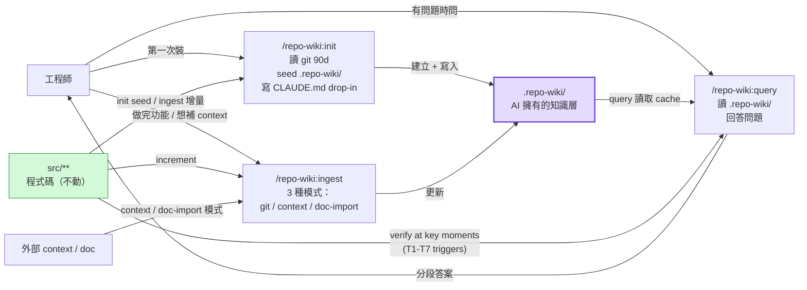
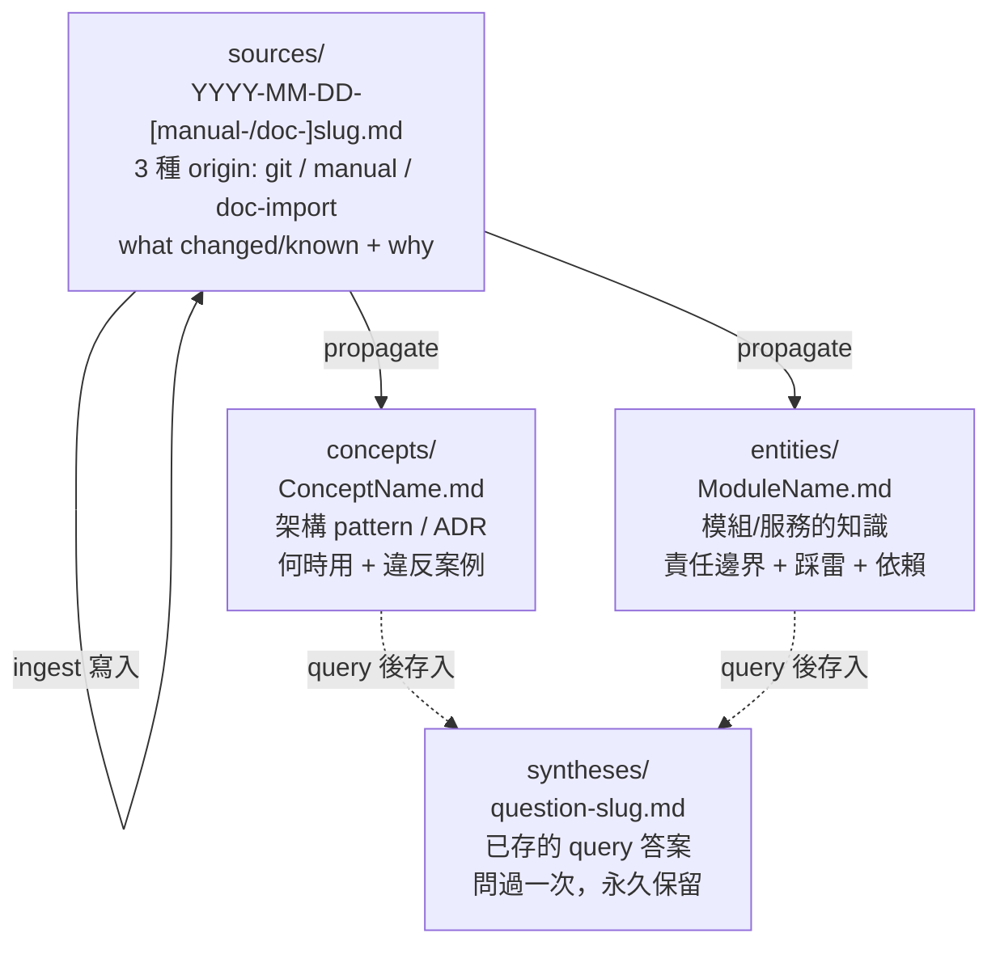

# repo-wiki Plugin 專案統整

## Table of Contents

- What Is This
- 設計哲學
- Plugin 完整架構
- 三個核心 skill
- 使用方式
- 與現有工具的比較
- 實作 Checklist
- v2 Backlog

---

## What Is This

**repo-wiki** 是一個 Claude Code plugin，把 [Karpathy LLM Wiki Pattern](https://gist.github.com/karpathy/442a6bf555914893e9891c11519de94f) 應用到 code repo 的知識管理。發行通路：[monkey-skills](https://github.com/kouko/monkey-skills) marketplace 第 10 個 sibling plugin（不是獨立 repo——v1 期間 dogfood + 迭代）。

> [!important] 核心概念
> - `src/**` = sources 層（immutable，永遠不動，**當前狀態的最終權威**）
> - `.repo-wiki/` = wiki 層（**AI 完全擁有**的 implementation cache + decision archive，人類不直接編輯）
> - 人類用 `/repo-wiki:query` 詢問，不需要讀 .repo-wiki/ 頁面
> - Knowledge 入口三條：git history、conversational context、external doc import
> - **Query 在關鍵時刻自動讀 src/ 驗證**（決策 13；T1-T7 triggers + 分段輸出）

**解決的問題**：
工程師用 AI coding 工具時，LLM 對 codebase 的理解是一次性的、session 結束就消失。repo-wiki 讓知識**持久化在 repo 裡**——init 用 git history seed 第一批，ingest 增量補新變更和 tribal knowledge，query 越用越聰明。

**靈感來源**：
- [SamurAIGPT/llm-wiki-agent](https://github.com/SamurAIGPT/llm-wiki-agent) — 架構參照
- [llmrix/llm-wiki-skill](https://github.com/llmrix/llm-wiki-skill) — SKILL.md 實作參照

---

## 設計哲學



五個關鍵原則：

1. **Synthesize at ingest time, not query time** — 知識在 ingest 時就整理好，query 只需要讀，不需要重新分析程式碼
2. **WHY first, WHAT is best-effort cache** — .repo-wiki/ 可以描述 implementation 但不是權威；src/ 才是當前狀態的最終解釋
3. **Verify at key moments** — query 偵測到 stale / 「現在怎麼」/ 高風險寫 code 等 trigger 就自動讀 src/ 比對，分段輸出 Verified / Unverified / Discrepancies
4. **Gap is feedback** — 當 query 找不到答案，或 verification 發現 cache 跟 src/ 不一致，都會明確 suggest /repo-wiki:ingest 補上
5. **Multi-source input** — knowledge 不只從 git 來，conversational context 跟 external doc 也走 ingest 同一條 pipeline

---

## Plugin 完整架構

### 目錄結構

```
monkey-skills/                          ← marketplace root
├── .claude-plugin/
│   └── marketplace.json               ← 加 repo-wiki 進 plugins 陣列
├── repo-wiki/                         ← 本 plugin（第 10 個 sibling）
│   ├── .claude-plugin/
│   │   └── plugin.json
│   ├── skills/
│   │   ├── init/
│   │   │   ├── SKILL.md               ← /repo-wiki:init
│   │   │   └── assets/                ← init 專屬 bundled resources（init 複製到 user repo）
│   │   │       ├── SCHEMA.md
│   │   │       ├── index.md
│   │   │       ├── log.md
│   │   │       ├── overview.md
│   │   │       └── claude-md-snippet.md  ← CLAUDE.md drop-in 範本
│   │   ├── ingest/SKILL.md            ← /repo-wiki:ingest
│   │   └── query/SKILL.md             ← /repo-wiki:query
│   ├── README.md / README.ja.md / README.zh-TW.md
│   └── CHANGELOG.md
└── (其他 9 個 sibling plugins: dev-workflow, obsidian, ...)
```

> [!note] Skill 命名 → slash command 對應
> `skills/init/` + `name: init` → `/repo-wiki:init`
> `skills/ingest/` + `name: ingest` → `/repo-wiki:ingest`
> `skills/query/` + `name: query` → `/repo-wiki:query`
> （namespace `repo-wiki:` 由 plugin 系統自動加，SKILL.md frontmatter 的 `name:` 不要重複前綴）

### plugin.json

```json
{
  "name": "repo-wiki",
  "version": "1.0.0",
  "description": "LLM Wiki pattern for code repos. Seed a persistent knowledge base from git history (init), grow it incrementally from changes or conversational context (ingest), and query it with natural language (query). Zero external dependencies — knowledge lives as plain markdown committed into your repo.",
  "author": { "name": "kouko", "url": "https://github.com/kouko" },
  "homepage": "https://github.com/kouko/monkey-skills/tree/main/repo-wiki",
  "repository": "https://github.com/kouko/monkey-skills",
  "license": "MIT",
  "keywords": ["repo-knowledge", "knowledge-base", "llm-wiki", "code-wiki", "git-aware", "documentation", "tribal-knowledge"]
}
```

### 安裝後的 user repo 結構

```
your-repo/
├── CLAUDE.md                          ← init 加入 drop-in 區塊（idempotent）
├── .repo-wiki/                         ← AI 擁有，從 plugin templates 初始化
│   ├── SCHEMA.md                      ← v1 frozen
│   ├── index.md                       ← init / ingest 維護
│   ├── log.md                         ← init / ingest / query 維護
│   ├── overview.md                    ← init / ingest 維護
│   ├── sources/                       ← 3 種 origin: git / manual / doc-import
│   ├── entities/                      ← 模組頁面
│   ├── concepts/                      ← pattern / ADR
│   └── syntheses/                     ← 已存的 query 答案
└── src/**                             ← 永遠不動
```

---

## 三個核心 skill

完整設計稿：

| Skill | 設計稿 | Plugin 路徑 |
|---|---|---|
| init | [2026-05-02-repo-wiki-skill-init.md](2026-05-02-repo-wiki-skill-init.md) | `skills/init/SKILL.md` |
| ingest | [2026-05-02-repo-wiki-skill-ingest.md](2026-05-02-repo-wiki-skill-ingest.md) | `skills/ingest/SKILL.md` |
| query | [2026-05-02-repo-wiki-skill-query.md](2026-05-02-repo-wiki-skill-query.md) | `skills/query/SKILL.md` |
| SCHEMA template | [2026-05-02-repo-wiki-schema-design.md](2026-05-02-repo-wiki-schema-design.md) | `skills/init/assets/SCHEMA.md` |

### .repo-wiki/ 四種頁面類型



---

## 使用方式

### 安裝（路線 A：monkey-skills sub-plugin）

```bash
# 訂閱 monkey-skills marketplace 後
/plugin install repo-wiki@monkey-skills

# 或本機開發直接載入整個 monkey-skills repo
claude --plugin-dir <path-to-monkey-skills>
```

### 第一次設定

```bash
# 在你的 repo 根目錄
/repo-wiki:init
```

Init 會：
- 建立 `.repo-wiki/` 目錄結構 + 複製 SCHEMA / index / log / overview templates
- 在 `CLAUDE.md` 寫入 `<!-- repo-wiki:start --> ... <!-- repo-wiki:end -->` 區塊
- 跑最近 90 天 git history（最多 50 commits）seed 第一批 source pages + entity stubs
- 寫 overview.md
- 印出 next-step 提示

預設 window 不夠可以加 arg：`/repo-wiki:init "from last year"` 或 `/repo-wiki:init "last 100 commits"`。

### 日常工作流

```
做完功能 → /repo-wiki:ingest
    自動讀 log.md 取上次 SHA → git log <sha>..HEAD
    建立 sources/2026-05-02-add-payment.md (origin: git)
    更新 entities/PaymentService.md
    建立 concepts/IdempotencyKey.md（如果是新 pattern）
    更新 index.md + log.md (entry: ingest:git)

收到 tribal knowledge → /repo-wiki:ingest "AuthModule 命名怪因為 2020 migration"
    建立 sources/2026-05-02-manual-auth-naming.md (origin: manual)
    更新 entities/AuthModule.md 的 Gotchas
    log.md (entry: ingest:manual)

PM 給設計文件 → /repo-wiki:ingest "import design doc: docs/postgres-decision.md"
    讀 docs/postgres-decision.md
    建立 sources/2026-05-02-doc-postgres-decision.md (origin: doc-import)
    建立 concepts/DatabaseChoice.md
    log.md (entry: ingest:doc-import)

有問題 → /repo-wiki:query "PaymentService 的錯誤處理邏輯是什麼"
    讀 index.md → 找到 entities/PaymentService.md
    回答，附上 [source-name](path) 引用
    若任何 page > 60d 出現 stale warning
    問：要存到 syntheses/ 嗎？
```

### Skill 名稱對照

| 指令 | 用途 |
|---|---|
| `/repo-wiki:init` | 第一次設定 / 重新 seed knowledge base |
| `/repo-wiki:init "from last year"` | 自訂 init scan window |
| `/repo-wiki:ingest` | 增量處理新 commit（git mode） |
| `/repo-wiki:ingest "<text>"` | 捕捉 tribal knowledge（context mode） |
| `/repo-wiki:ingest "import design doc: <path>"` | 匯入外部文件（doc-import mode） |
| `/repo-wiki:query "<question>"` | 問關於 codebase 的問題 |

---

## 與現有工具的比較

> [!tip] 為什麼不用現有工具？

| 工具 | 問題 |
|---|---|
| NotebookLM | SaaS，知識不在 repo |
| Greptile / DeepWiki | SaaS，程式碼上雲 |
| Code-Index-MCP | 語意搜尋好，但不做 WHY 整理 |
| Roo Memory Bank | 全文注入，大 repo token 爆炸 |
| RepoAgent | auto-commit 知識更新，多人協作有風險 |
| SamurAIGPT/llm-wiki-agent | 通用文件，不懂 git / 程式碼概念 |
| dev-workflow:git-memory | 處理 commit 時的 decision context；repo-wiki 處理「跨 commit 的整體架構知識」 — 互補不衝突 |

**repo-wiki 的定位**：
- 比 Memory Bank 更精準（不全文注入）
- 比 Code-Index-MCP 更有意義（整理 WHY + verify against src/）
- 比 SaaS 工具更安全（程式碼不離開本機）
- 比 RepoAgent 更安全（人類觸發，不 auto-merge）
- 比通用 wiki-agent 更貼近 code（init 用 git history seed）
- 比 git-memory 涵蓋更廣（context mode 收 non-commit 知識）
- **比 code-doc 工具更誠實**（明示 .repo-wiki/ 是 cache，src/ 才是當前狀態權威）

---

## 實作 Checklist

完整 phase 計畫見 [../plans/2026-05-02-repo-wiki-plugin-v1.0.0.md](../plans/2026-05-02-repo-wiki-plugin-v1.0.0.md)，這裡是高階追蹤：

- [ ] **Phase 1 — Plugin Skeleton**：建立 `monkey-skills/repo-wiki/`，寫 plugin.json，更新 marketplace.json
- [ ] **Phase 2 — Three SKILL.md**：init / ingest / query 三份，frontmatter `name:` 不帶 `repo-wiki-` 前綴
- [ ] **Phase 3 — Templates**：SCHEMA / index / log / overview / claude-md-snippet 共 5 份
- [ ] **Phase 4 — Test**：建測試 repo，跑 init → ingest（3 種 mode 都測）→ query → edge cases
- [ ] **Phase 5 — README + Release**：3 語 README + CHANGELOG + 更新 root README + ATTRIBUTION + 開 PR

---

## v2 Backlog

從 v1 設計討論中明確 defer 的項目：

- **`.repo-wiki/inputs/` zone** — 半人類擁有的輸入區（決策 8 替代方案）
- **Multi-person CI workflow** — AI-proposes-humans-approve 的 PR comment 流（決策 6 deferred）
- **`/repo-wiki:lint`** — 完整健康檢查含 git-aware stale check（決策 10）、broken links、orphan concepts、missing entities
- **`/repo-wiki:graph`** — 從 standard markdown link 建知識圖譜（JSON + HTML 視覺化）
- **SCHEMA migration script** — v2.0 解 frozen + ship 升級工具（決策 11）
- **Monorepo support** — per-app `.repo-wiki/` 子目錄
- **Ruler / AGENTS.md drop-in** — vendor-neutral，Cursor / Codex / aider 都收得到 AI-owned rule
- **Standalone repo graduation** — v1 穩定後 fork 出獨立 `kouko/repo-wiki`，提交 Anthropic plugin marketplace
