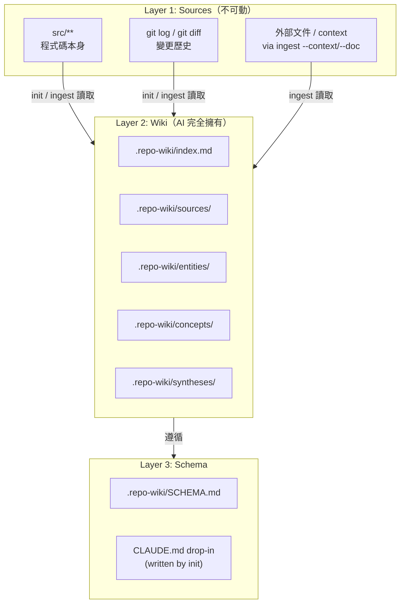

# Repo Wiki SCHEMA.md 設計

> [!abstract] 這個檔案是什麼
> 這是放在 code repo 的 `.repo-wiki/SCHEMA.md` 設計稿——init/ingest/query 三個 skill 都會讀這份 SCHEMA 來決定怎麼組織知識。
> 這份 SCHEMA 在 v1 被 freeze（決策 11），v1.x 內不修改結構；新 page type 或 frontmatter 改動留給 v2.0 + migration script。

---

## 三層架構



---

## .repo-wiki/SCHEMA.md 完整內容

把以下內容存為 `.repo-wiki/SCHEMA.md`：

````markdown
# Repo Wiki Schema (v1.0 — frozen)

This schema is **frozen for the v1.x line**. Page types, frontmatter
shape, and naming conventions will not change within v1.x patches; only
wording clarifications are allowed. Major schema changes ship in v2.0
with a migration script.

## Architecture

This knowledge base has three layers:

- **src/*** — Source layer. Immutable. Never modified by skills.
  **Always the authoritative source of current behavior.**
- **.repo-wiki/** — Wiki layer. Owned entirely by AI skills.
  Records past decisions and acts as a *best-effort implementation cache*.
  Humans read via /repo-wiki:query. Do not edit directly.
  (Enforced by repo-root CLAUDE.md drop-in.)
- **.repo-wiki/SCHEMA.md** — Schema layer. Defines structure and rules.

### Positioning Statement

.repo-wiki/ describes implementation, but does NOT claim authority over
current behavior. When a query asks about current state (vs past
decisions), /repo-wiki:query verifies key claims against src/ via the
verification triggers (T1–T7) in the query workflow. See SKILL.md for
details.

## Directory Layout

```
.repo-wiki/
  SCHEMA.md      # This file
  index.md       # Master catalog of all pages
  log.md         # Append-only operation log
  overview.md    # Living synthesis of the full codebase
  sources/       # One page per significant change OR per context capture
  entities/      # One page per module / service / subsystem
  concepts/      # One page per pattern / ADR / convention
  syntheses/     # Saved query answers
```

## Page Types

### source
File: `.repo-wiki/sources/<filename>.md`

Filename convention varies by `origin`:
- `origin: git` → `YYYY-MM-DD-<slug>.md`
- `origin: manual` → `YYYY-MM-DD-manual-<slug>.md`
- `origin: doc-import` → `YYYY-MM-DD-doc-<slug>.md`

Create when: a meaningful change lands (git mode), user supplies tribal
knowledge (manual mode), or user imports an external design doc
(doc-import mode).

Frontmatter:
- `title`, `type: source`, `origin: git | manual | doc-import`, `date`
- Git mode: `commits: [...]`, `modules_affected: [...]`
- Doc-import mode: `source_path`, `source_mtime`

Contents: what changed/known + key decisions + connections to entities/concepts.

### entity
File: `.repo-wiki/entities/<ModuleName>.md` (PascalCase)

Create when: the module is meaningfully load-bearing across multiple
sources. Use judgment, not a numeric count — but err toward not creating
skeletal pages from a single isolated change.

Required frontmatter:
- `title`, `type: entity`, `last_updated`
- `paths: [...]` — list of directories or files comprising this entity.
  Used by /repo-wiki:query for verification (Decision 13). init populates
  from git stat (most-touched paths). ingest updates when commits move files.

Contents: responsibility boundary (what it does NOT do is as important
as what it does), gotchas, common entry points, dependencies, recorded
decisions. Implementation descriptions are *best-effort cache* — src/
remains authoritative. Query verifies current-behavior claims at key
moments (verification triggers T1–T7 in query SKILL.md).

### concept
File: `.repo-wiki/concepts/<ConceptName>.md` (PascalCase)

Create when: the pattern is meaningfully cross-cutting. Same descriptive
heuristic as entity — avoid one-off concept pages.

Contents: summary (what + why), when to apply / when not to, canonical
example, known violations.

### synthesis
File: `.repo-wiki/syntheses/<question-slug>.md`

Create when: user asks /repo-wiki:query to save the answer for future reuse.

Contents: original question + full answer with citations.

## Naming Conventions

| Page type  | Format                | Example                           |
|------------|-----------------------|-----------------------------------|
| entity     | PascalCase.md         | Auth.md, AuthMiddleware.md, PaymentService.md |
| concept    | PascalCase.md         | OptimisticLocking.md, EventSourcing.md |
| source (git)     | YYYY-MM-DD-kebab.md         | 2026-05-02-add-jwt-auth.md  |
| source (manual)  | YYYY-MM-DD-manual-kebab.md  | 2026-05-02-manual-auth-naming.md |
| source (doc)     | YYYY-MM-DD-doc-kebab.md     | 2026-05-02-doc-postgres-decision.md |
| synthesis  | kebab-slug.md         | how-does-auth-flow-work.md        |

### Entity Name Normalization Rule (shared between init and ingest)

Entity names MUST be derived from `paths:` using this exact algorithm so
that init and ingest never produce two pages for the same module under
different names.

**Algorithm**:

1. Take the entity's primary path (first entry in `paths:`)
2. Strip these leading prefixes if present (in order of specificity):
   - `apps/<name>/src/`
   - `packages/<name>/src/`
   - `src/`
   - `lib/`
   - `app/`
3. Strip trailing `/` and trailing `.ts` / `.js` / `.py` / `.go` / `.rs` etc.
4. Split remaining path on `/` and `-` and `_`
5. Capitalize each segment (PascalCase), no separator
6. The result is the entity name (and the filename: `<name>.md`)

**Examples**:

| Input path | Stripped | Segments | Entity name |
|---|---|---|---|
| `src/auth/` | `auth` | [auth] | `Auth` |
| `src/api/` | `api` | [api] | `Api` |
| `src/auth/middleware/` | `auth/middleware` | [auth, middleware] | `AuthMiddleware` |
| `src/utils/jwt-handler/` | `utils/jwt-handler` | [utils, jwt, handler] | `UtilsJwtHandler` |
| `src/auth/jwt.ts` | `auth/jwt` | [auth, jwt] | `AuthJwt` |
| `lib/email/` | `email` | [email] | `Email` |
| `packages/core/src/queue/` | `queue` | [queue] | `Queue` |
| `apps/web/src/components/Button.tsx` | `components/Button` | [components, Button] | `ComponentsButton` |
| `services/payment/handler.go` | `services/payment/handler` | [services, payment, handler] | `ServicesPaymentHandler` |

**Rules**:
- Do NOT add suffixes like `Module`, `Service` — the path itself is the
  identity. (PaymentService entity comes from `src/payment-service/` or
  `src/services/payment/`, not from adding suffix.)
- If two entities would collapse to the same name (e.g., both `src/auth/`
  and `lib/auth/` produce `Auth`), the second one created should append a
  disambiguator from the original prefix: `Auth` and `LibAuth`. ingest
  should detect collision before writing.
- Single-letter or numeric-only segments are kept as-is: `src/v2/api/` →
  `V2Api`.
- Non-ASCII path segments (rare) are transliterated to ASCII or kept
  verbatim if PascalCase preserves readability.

**Why this rule and not "use last segment + Module suffix"**:
- Last-segment-only causes collisions for nested modules
  (`src/auth/jwt/` and `src/payment/jwt/` both become `Jwt`)
- Adding `Module` suffix introduces ambiguity (when does it apply?)
- Path-derived names round-trip: given an entity name, you can guess
  the path, and vice versa

## Verification Triggers (in /repo-wiki:query)

.repo-wiki/ is a *best-effort cache* of implementation, not the
authority. Query reads src/ to verify current-behavior claims when any
of these triggers fires:

| ID | Trigger | Action |
|---|---|---|
| T1 | Loaded page `last_updated > 60d` | Read entity's paths to spot-check |
| T2 | Question contains "currently"/"now"/"still"/「現在」/「目前」 | Spot-check current-state claims |
| T3 | Answer will inform new code being written | Verify entry-point files |
| T4 | Loaded source page has TODO / "subject to change" | Read corresponding src/ |
| T5 | Multiple loaded pages contradict each other | Read src/ to arbitrate |
| T6 | Question is purely about past decisions | **No verification** (trust .repo-wiki/) |
| T7 | User explicitly requests verification | Verify every claim |

When any trigger fires, query presents answer in segmented format:
- **Verified Claims** (against src/)
- **Unverified Claims** (from .repo-wiki/ cache)
- **Discrepancies Found** (with /repo-wiki:ingest suggestion)

## Linking Convention

Use **standard markdown links** — never `[[wikilinks]]`.

- Same directory: `[Name](OtherEntity.md)`
- Cross directory: `[Name](../entities/AuthModule.md)`
- Link text: page title (no path, no `.md` suffix)

Why: .repo-wiki/ is committed into the repo and read on GitHub, in IDEs,
and in terminal markdown viewers — none of which render `[[X]]`.
Standard links work everywhere. (Tradeoff: lose Obsidian's graph view.
A future v2 `/repo-wiki:graph` skill builds a graph from standard links.)

All links must point to pages listed in `.repo-wiki/index.md`.

## index.md Format

```markdown
# Knowledge Base Index

## Overview
- [Overview](overview.md) — living codebase synthesis

## Sources (recent → old)
- [YYYY-MM-DD slug](sources/slug.md) — one-line summary

## Entities
- [ModuleName](entities/ModuleName.md) — one-line description

## Concepts
- [PatternName](concepts/PatternName.md) — one-line description

## Syntheses
- [Question slug](syntheses/slug.md) — what question it answers
```

## log.md Format

Each entry: `## [YYYY-MM-DD] <operation>:<mode> | <title>`

Operations / modes:
- `init` (no mode suffix)
- `ingest:git` — incremental from git diff
- `ingest:manual` — context capture from user text
- `ingest:doc-import` — external document import
- `query` — read operation

Grep-friendly:
```bash
grep "^## \[" .repo-wiki/log.md | tail -10        # recent activity
grep "ingest:git" .repo-wiki/log.md               # only code changes
grep "ingest:manual" .repo-wiki/log.md            # only context captures
```

The git-mode log entry MUST record the new HEAD SHA — it's the anchor
the next `/repo-wiki:ingest` uses to find new commits.

## Health Checks

Routine health checks (broken links, stale entities with git
cross-check, orphan concepts, modules missing entity pages) ship as
`/repo-wiki:lint` in **v2** — out of scope for v1. The query skill does a
basic stale warning based on `last_updated > 60 days`.

## What .repo-wiki/ Does NOT Contain

- Code (describe intent and decisions, not implementation)
- Verbatim commit messages (those live in git log; sources/ summarize them)
- API documentation (belongs in code comments / OpenAPI)
- Anything that changes on every PR (keep knowledge evergreen)
- Personal notes / TODOs (use a separate notes file outside .repo-wiki/)

## Schema Evolution

This schema is frozen until v2.0. Within v1.x:
- Wording in this file may be clarified
- New examples may be added
- BUT: page types, frontmatter shape, naming, and linking conventions
  do not change

When v2.0 lands, the plugin will ship a migration script. v1 users do
not need to plan for migrations within v1.x.
````

---

## Repo 目錄結構總覽

```
.claude/
  plugins/
    monkey-skills/
      repo-wiki/
        skills/init/SKILL.md     ← 設計見 2026-05-02-repo-wiki-skill-init.md
        skills/ingest/SKILL.md   ← 設計見 2026-05-02-repo-wiki-skill-ingest.md
        skills/query/SKILL.md    ← 設計見 2026-05-02-repo-wiki-skill-query.md
        templates/
          SCHEMA.md              ← 本頁設計
          index.md log.md overview.md
          claude-md-snippet.md   ← drop-in 用

your-repo/
├── CLAUDE.md                   ← init 自動寫入 drop-in 區塊
├── .repo-wiki/                  ← 從 templates/ 初始化
│   ├── SCHEMA.md               (本頁內容)
│   ├── index.md                (init / ingest 維護)
│   ├── log.md                  (init / ingest / query 維護)
│   ├── overview.md             (init / ingest 維護)
│   ├── sources/                (3 種 origin 的 source pages)
│   ├── entities/
│   ├── concepts/
│   └── syntheses/
└── src/**                      ← 永遠不動
```

> [!tip] 第一次跑流程
> `/repo-wiki:init` 會一次做完：
> - mkdir + 複製 SCHEMA / index / log / overview templates
> - 寫 CLAUDE.md drop-in
> - 用最近 90 天 git history seed 第一批 source pages + entity stubs
> - 寫 overview.md
>
> User 之後做完功能跑 `/repo-wiki:ingest`，需要補 context 跑 `/repo-wiki:ingest "<text>"`，問問題跑 `/repo-wiki:query`。

> [!note] 與通用 wiki-agent 的差異
> [SamurAIGPT/llm-wiki-agent](https://github.com/SamurAIGPT/llm-wiki-agent) 用 `raw/` 放文件來源。
> 這個設計把 `raw/` 換成 `src/**` + `git log`——source 層已經存在，不需要手動放文件進去。
> 但仍然保留「user 主動餵 context」這條路：ingest 多態接收 manual / doc-import 模式，等於 raw/ 的 conversational 版本。

> [!warning] SCHEMA frozen 的承諾
> v1.x（v1.0.0、v1.1.0、v1.2.0...）內不會改 page types、frontmatter、naming、linking。
> User 可以放心把 .repo-wiki/ commit 進 repo，不用擔心升級插件後既有頁面失效。
> 真要演進就 v2.0 + migration script，明確告知。
