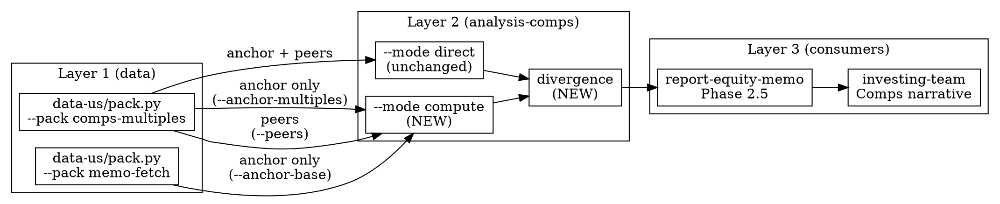

# Design Spec: investing-toolkit v2.2.0-b — analysis-comps `--mode compute` activation

**Date**: 2026-05-03
**Previous release**: investing-toolkit v2.1.0 (ADR-0004 Phase 1) + v2.2.0-j Phase 0+1 (PR #224) + ADR-0008 MCP removal (PR #225)
**ROADMAP entry**: [ROADMAP.md §v2.2.0-b](../../../investing-toolkit/ROADMAP.md#L95)
**Status**: design — pending implementation
**Scope**: single-PR feature activation (no breaking change; direct mode untouched)

---

## 1. Goal

Activate the placeholder `--mode compute` branch in `analysis-comps/scripts/comps_compute.py` so the analyst can recompute the 5 canonical multiples (`trailingPE` / `forwardPE` / `evEbitda` / `priceToSales` / `priceToBook`) from raw financials, audit yfinance's pre-cooked numbers against SEC EDGAR primary source, and surface divergence as a deterministic Layer 2 primitive (not a Layer 3 narrative responsibility).

Why this matters:
- Direct mode trusts yfinance's pre-cooked multiples — definition opaque (which EPS? which adjustment? which timing?). Acceptable for industry-comparability narrative but **not for primary-source memo defence**.
- Compute mode controls every numerator / denominator and stamps SEC EDGAR `accession` per multiple, so a short-thesis or buy-side memo can trace each multiple back to a regulatory filing line.
- The divergence between the two answers is the *most actionable* output: when |pct_diff| > 15% on `trailingPE`, yfinance applied an adjustment we should understand before quoting it.

---

## 2. Context

### 2.1 Current state

`analysis-comps/scripts/comps_compute.py` (383 lines, shipped v2.0.0):
- `--mode direct` (default): consumes `comps-multiples` pack from `data-{country}/pack.py`, runs stats + anchor_delta + ranking. Production-ready.
- `--mode compute`: placeholder. Falls back to direct with stderr warning. `_provenance.requested_mode` records the user asked for compute even though we returned direct.

Existing input contract (`comps-multiples` pack):
```json
{
  "pack": "comps-multiples",
  "ticker": "AAPL",
  "info": { "AAPL": { "trailingPE": 28.5, "forwardPE": 25.1, ... } },
  "_provenance": { "skill": "data-us", ... }
}
```
yfinance pre-cooked. No raw financials.

### 2.2 What's already on disk

`data-{us,jp,tw,kr,cn}/pack.py --pack memo-fetch` already emits raw financials per FY/FQ in canonical shape (income_statement / cash_flow / balance_sheet arrays). Verified against `tests/data/fixtures/data-us-memo-fetch-sample.json`. This is the input compute mode needs — **no `data-*/pack.py` change required**.

### 2.3 Triggering ROADMAP context

ROADMAP §v2.2.0-b §What says: "v2.0.0 shipped analysis-comps skill with peer-discovery + multiples fetch but `--mode compute` is placeholder. Implement: percentile rank per multiple, composite score, anchor-vs-peer delta, sector tilt overlay."

**Spec ambiguity audit (2026-05-03)**: Direct mode already produces percentile rank, composite score, and anchor-vs-peer delta (verified against `comps_compute.py:165-253`). The literal Acceptance text is already met by direct mode. The *spirit* of the ROADMAP entry — what `--mode compute` was reserved for — is recompute-from-raw-financials. This spec implements the spirit, not the literal-already-met letter.

---

## 3. Decisions log

Brainstorming session 2026-05-03 (`superpowers:brainstorming` skill) resolved 4 forking decisions. Recording here so future readers don't re-debate.

### D1. Compute mode reads `memo-fetch` pack (not new `comps-base-financials` pack)

**Choice**: B (read existing memo-fetch pack).
**Rejected**: A (new `--pack comps-base-financials` in data-* layer).
**Rationale**:
- memo-fetch schema already designed for 5-country symmetry (US T3 → JP EDINET → TW MOPS → CN cninfo → KR DART)
- ROADMAP §v2.2.0-b §Files lists only analysis-comps changes, no data-* changes
- v2.2.0-c sector-adjusted multiples will need extra fields (FFO for REITs, segment revenue for banks) — extending memo-fetch once feeds all consumers; new pack would need its own extension cycle
- payload size is not a constraint in pure-compute single-shot invocation

### D2. `forwardPE` is pass-through, not recomputed

**Choice**: B (pass-through with `_provenance.computed: false`).
**Rejected**: A (drop forwardPE from compute), C (synthesize forwardPE from earnings growth).
**Rationale**:
- Forward EPS has no primary source — it's a sell-side analyst consensus aggregate
- Synthesizing our own forward EPS would create a number that disagrees with market convention (named-collision risk in narratives)
- Pass-through with explicit `computed: false` is honest about the limitation
- Future LLM web-search supplemental for consensus EPS belongs in Layer 3, not Layer 2 (user observation, recorded in §10 out-of-scope)

### D3. Single-run dual-input output (not two-run + caller-side diff)

**Choice**: B' (anchor-only dual input; peers single input).
**Rejected**: A (caller diffs externally), A.5 (only compute, no diff), B (dual input for anchor AND peers).
**Rationale**:
- Divergence is deterministic arithmetic — fits Layer 2 contract identically to existing `_anchor_delta` (precedent at `comps_compute.py:165`)
- Caller-side diff (A) duplicates math across every report-* consumer; consistency risk
- Anchor-only compute (B' over B): peers stay industry-comparable via sell-side convention; anchor gets the audit treatment because that's the recommendation target. **Zero extra fetch cost** — anchor memo-fetch is already pre-fetched in report-equity-memo Phase 1.
- Dual input for peers (B original) would require N extra memo-fetch calls per memo (~5-8 × heavy fetches); B' avoids this

### D4. Layer boundary — TTM aggregation + EV pinning belong in Layer 2

**Choice**: β (Layer 2 aggregates).
**Rejected**: α (Layer 1 emits derived TTM / EV).
**Rationale**: see §4 below.

---

## 4. Layer boundary policy

User principle (recorded 2026-05-03):
> **Layer 1 = only raw data + persistent storage. No computation we ourselves perform.**

Codebase precedent at `analysis-dcf/scripts/dcf_compute.py:22-36`:
```
income_statement: { "revenue": [r_t0, r_t-1, ...] }   # Layer 1: FY arrays
balance_sheet:    { "total_debt": [td_t0, ...] }
cash_flow:        { "fcf": [fcf_t0, ...] }
```
analysis-dcf then derives `net_debt = total_debt[0] - cash[0]` and `base_revenue = revenue[0]` itself. Layer 1 ships arrays; Layer 2 derives.

This spec follows the same pattern:

| Operation | Layer | Why |
|---|---|---|
| SEC EDGAR XBRL fetch | Layer 1 | I/O |
| XBRL concept → canonical name (`Revenues` → `revenue`) | Layer 1 | Renaming, no math |
| FY/FQ row alignment + currency unit normalization | Layer 1 | Selection, no derived metric |
| `revenue_TTM = sum(quarterly[-4:].revenue)` | **Layer 2** | We aggregate |
| `EBITDA_TTM = sum(quarterly[-4:].operating_income) + sum(quarterly[-4:].depreciation)` | **Layer 2** | We aggregate |
| `EV = marketCap + total_debt − cash_and_equivalents` | **Layer 2** | We pin |
| `trailingPE = price ÷ (net_income_TTM ÷ diluted_shares)` | **Layer 2** | We divide |
| `divergence_pct = (compute - direct) / direct × 100` | **Layer 2** | We compare |
| Cache TTL on raw fetches | Layer 1 | Storage strategy (separately tracked, see §11) |

**Out of scope, explicitly**: memo-fetch pack will NOT add `derived.revenue_ttm` / `derived.enterprise_value` sub-blocks. Layer 1 stays canonical FY/FQ arrays.

---

## 5. Architecture



Plain-language summary:
- Anchor: dual input — comps-multiples (yfinance pre-cooked) + memo-fetch (SEC EDGAR raw)
- Peers: single input — comps-multiples only
- compute mode produces direct multiples + compute multiples + divergence in one JSON
- direct mode unchanged — when invoked without `--anchor-base`, behaves exactly like v2.0.0

---

## 6. CLI contract

### 6.1 New / changed flags

```bash
# UNCHANGED — direct mode (v2.0.0 byte-equal):
comps_compute.py --mode direct \
  --anchor anchor.json \
  --peers p1.json,p2.json,p3.json \
  [--rationale-map peers.json]

# NEW — compute mode:
comps_compute.py --mode compute \
  --anchor anchor.json \                  # comps-multiples pack
  --anchor-base anchor-memo-fetch.json \  # memo-fetch pack (REQUIRED for compute)
  --peers p1.json,p2.json,p3.json \       # comps-multiples (peers stay direct)
  [--rationale-map peers.json]
```

### 6.2 Validation rules

- `--mode compute` without `--anchor-base` → `argparse.error()` exit 2 + `"--mode compute requires --anchor-base"` message
- `--mode direct` with `--anchor-base` → warning to stderr `"--anchor-base ignored in direct mode"`, continue with direct
- `--anchor-base` file not memo-fetch shape → `ValueError("--anchor-base must be a memo-fetch pack; got {pack}")` exit 1
- `--anchor-base` ticker mismatches `--anchor` ticker → `ValueError` exit 1

---

## 7. Input contracts

### 7.1 `--anchor` / `--peers` (existing, unchanged)

```json
{
  "pack": "comps-multiples",
  "ticker": "AAPL",
  "fetched_at": "2026-05-01T00:00:00Z",
  "info": {
    "AAPL": {
      "trailingPE": 33.92,
      "forwardPE": 25.10,
      "priceToSales": 7.20,
      "priceToBook": 35.40,
      "enterpriseToEbitda": 21.30
    }
  },
  "_provenance": { "skill": "data-us", "source": "pack.py --pack comps-multiples" }
}
```

### 7.2 `--anchor-base` (NEW reader, existing pack)

memo-fetch pack as already produced by `data-us/pack.py --pack memo-fetch`. Compute mode reads:

```jsonc
{
  "pack": "memo-fetch",
  "ticker": "AAPL",
  "company_info": {
    "regularMarketPrice": 280.14,             // → trailingPE numerator
    "sharesOutstanding":  14667688000,        // → diluted shares (TTM proxy if XBRL diluted absent)
    "marketCap":          4109006274560,      // → priceToSales / priceToBook / EV numerator
    // Note: company_info.trailingPE etc. IGNORED in compute mode (those are direct-mode inputs)
    "_provenance": { ... }
  },
  "financials": {
    "annual": [                                // most-recent-first
      {
        "period_end": "2025-09-28",
        "income_statement": { "revenue": ..., "net_income": ..., "operating_income": ..., ... },
        "balance_sheet":    { "total_stockholders_equity": ..., "total_debt": ..., "cash_and_equivalents": ..., ... },
        "cash_flow":        { "depreciation_amortization": ..., ... },
        "_provenance": { "tier": "A", "accession": "0000320193-25-000123", ... }
      },
      ...
    ],
    "quarterly": [                             // most-recent-first; need at least 4 for TTM
      { "period_end": "2025-Q4", "income_statement": {...}, "cash_flow": {...}, ... },
      ...
    ]
  },
  "_provenance": { "skill": "data-us", "source": "pack.py --pack memo-fetch" }
}
```

If `financials.quarterly` has fewer than 4 rows, compute mode falls back to `financials.annual[0]` for FY-based multiples and emits a `warnings` entry: `"insufficient quarterly history for TTM; using FY{year} annual"`. trailingPE definition shifts from TTM to FY in this case.

---

## 8. Compute formulas

For each multiple, `compute_provenance[m]` records `numerator_source`, `denominator_source`, `accession` (when available), and `computed: true | false`.

### 8.1 The 5 multiples

| Multiple | Numerator | Denominator | computed |
|---|---|---|---|
| `trailingPE` | `company_info.regularMarketPrice` | `(sum(quarterly[-4:].net_income)) ÷ company_info.sharesOutstanding` | true |
| `priceToSales` | `company_info.marketCap` | `sum(quarterly[-4:].revenue)` | true |
| `priceToBook` | `company_info.marketCap` | `annual[0].balance_sheet.total_stockholders_equity` | true |
| `evEbitda` | `marketCap + annual[0].balance_sheet.total_debt − annual[0].balance_sheet.cash_and_equivalents` | `sum(quarterly[-4:].operating_income) + sum(quarterly[-4:].depreciation_amortization)` | true |
| `forwardPE` | (pass-through) | (pass-through from `--anchor.info.AAPL.forwardPE`) | false |

### 8.2 Missing-field handling

| Missing | Behaviour |
|---|---|
| `quarterly[-4:].operating_income` (any) | `evEbitda.compute = null`; warnings += "evEbitda compute skipped: incomplete quarterly OI" |
| `cash_flow.depreciation_amortization` | Same as above (D&A is part of EBITDA) |
| `total_debt` or `cash_and_equivalents` | Same — EV cannot be pinned |
| `total_stockholders_equity` | `priceToBook.compute = null`; warnings += "priceToBook compute skipped: book value missing" |
| `--anchor.info.AAPL.forwardPE` not present | `forwardPE.compute = null`; `forwardPE.divergence.alert = "n/a"` (no upstream value to pass through) |

Computed `null` participates in divergence as `alert: "n/a"` with explanatory note.

### 8.3 Edge cases

- Negative denominator (loss-making company, negative EPS / equity): divergence still computed; consumers handle interpretation
- Currency mismatch between `regularMarketPrice` and `financials` (e.g. ADRs): out of scope (US-first; non-US compute lands in follow-up PR)
- `sharesOutstanding` rebasing across quarters (buybacks): use `company_info.sharesOutstanding` (current snapshot) — known limitation, recorded in `_provenance.warnings`

---

## 9. Divergence threshold spec

### 9.1 Bands

```python
# comps_compute.py — named constants (functional copy of references/divergence-thresholds.md)
DIVERGENCE_BAND_LOW = 0.05   # 5%
DIVERGENCE_BAND_HIGH = 0.15  # 15%
```

| `|pct_diff|` band | alert | Analyst action |
|---|---|---|
| ≤ 5% | `low` | Reasonable upstream-rounding noise; no narrative needed |
| 5% < x ≤ 15% | `medium` | Mention divergence source in memo Comps section |
| > 15% | `high` | Red flag — Comps section MUST trace each anchor multiple back to SEC raw with `accession` |
| (compute = null OR direct = null) | `n/a` | Skip; surface in `warnings` instead |

### 9.2 SoT vs functional copy

[`skills/analysis-comps/references/divergence-thresholds.md`](../../../investing-toolkit/skills/analysis-comps/references/divergence-thresholds.md) (NEW) is the **canonical doc**. Constants in `comps_compute.py` are the **functional copy** (per SSOT-and-functional-copy pattern, codified in feedback memory `feedback_ssot_functional_copy_pattern.md`). Same-PR drift rule: any band change touches both files.

---

## 10. Output JSON shape

```jsonc
{
  "anchor": {
    "ticker": "AAPL",
    "multiples_direct": {              // EXISTING (just renamed from "multiples" when mode=compute)
      "trailingPE":   33.92,
      "forwardPE":    25.10,
      "priceToSales": 7.20,
      "priceToBook":  35.40,
      "evEbitda":     21.30
    },
    "multiples_compute": {              // NEW (compute mode only)
      "trailingPE":   42.32,
      "forwardPE":    25.10,            // pass-through
      "priceToSales": 7.50,
      "priceToBook":  37.20,
      "evEbitda":     22.85
    },
    "divergence": {                     // NEW (compute mode only)
      "trailingPE":   { "abs_diff":  8.40, "pct_diff": 24.7,  "alert": "high"   },
      "forwardPE":    { "abs_diff":  0.0,  "pct_diff":  0.0,  "alert": "n/a", "note": "pass-through" },
      "priceToSales": { "abs_diff":  0.30, "pct_diff":  4.17, "alert": "low"    },
      "priceToBook":  { "abs_diff":  1.80, "pct_diff":  5.08, "alert": "medium" },
      "evEbitda":     { "abs_diff":  1.55, "pct_diff":  7.28, "alert": "medium" }
    },
    "compute_provenance": {             // NEW (compute mode only)
      "trailingPE": {
        "numerator_source":   "memo-fetch.company_info.regularMarketPrice",
        "denominator_source": "sum(memo-fetch.financials.quarterly[-4:].net_income) / memo-fetch.company_info.sharesOutstanding",
        "accession_basis":    ["0000320193-25-000123", "0000320193-25-000098", ...],
        "computed":           true
      },
      "forwardPE":    { "computed": false, "note": "pass-through from comps-multiples pack (consensus EPS has no primary source)" },
      "priceToSales": { ... },
      ...
    }
  },
  "peers": [                             // EXISTING — single input, direct only
    { "ticker": "MSFT", "multiples": {...}, "rationale": "..." },
    { "ticker": "GOOGL", "multiples": {...}, "rationale": "..." }
  ],
  "statistics": {                        // EXISTING — computed from peers' direct multiples
    "trailingPE": { "median": 31.5, "mean": 32.1, "q1": 28.0, "q3": 34.8, "min": 24.5, "max": 38.0, "n": 4 },
    ...
  },
  "anchor_delta": {                      // EXISTING — uses multiples_direct (industry comparability axis)
    "trailingPE": { "value": 33.92, "vs_median_pct": 7.68, "percentile": 0.6 },
    ...
  },
  "ranking": [...],                      // EXISTING — uses direct
  "_provenance": {
    "skill":               "analysis-comps",
    "anchor_data_source":  "data-us/pack.py --pack comps-multiples",
    "anchor_base_source":  "data-us/pack.py --pack memo-fetch",  // NEW field, only when mode=compute
    "peer_data_sources":   ["data-us/pack.py --pack comps-multiples", ...],
    "computed_at":         "2026-05-03T...",
    "io":                  "none",
    "mode":                "compute",
    "requested_mode":      "compute",
    "warnings":            []
  }
}
```

### 10.1 Backward compat for direct mode

Direct mode output shape matches v2.0.0 with **one breaking field rename**: `anchor.multiples` → `anchor.multiples_direct`. The rename applies in BOTH modes (direct and compute) for output-shape consistency. All other fields (`statistics`, `anchor_delta`, `ranking`, `peers`, `_provenance`) are byte-equal v2.0.0 in direct mode.

Direct-mode consumers must update — covered by SKILL.md release note + integration tests + atomic in-tree caller migration (`report-equity-memo` Phase 2.5 lands same PR).

Decision: choose explicit-rename over silent passthrough. `multiples_direct` makes it obvious in any consumer code that this is *one of two possible measurement axes*, even when only one is present. Avoids future confusion when compute mode adoption spreads.

### 10.2 anchor_delta / ranking / statistics use direct, not compute

Industry comparability is the conventional purpose of these blocks. Peers are direct; computing percentile of `anchor_compute` against `peer_direct` would be apples-to-oranges. Documented in SKILL.md.

---

## 11. report-equity-memo Phase 2.5 update

[`skills/report-equity-memo/SKILL.md` Phase 2.5](../../../investing-toolkit/skills/report-equity-memo/SKILL.md#L156-L181) updates:

```bash
# 0.5 (NEW comment) — anchor memo-fetch already pre-fetched in Phase 1
#     /tmp/${TICKER_SAFE}-fetch.json — reuse path

# 1. Fetch anchor multiples (UNCHANGED)
INVESTING_TOOLKIT_CACHE=${CLAUDE_PLUGIN_DATA}/cache uv run \
  ${CLAUDE_PLUGIN_ROOT}/skills/data-${COUNTRY}/scripts/pack.py \
    --ticker ${TICKER} --pack comps-multiples \
    > /tmp/${TICKER_SAFE}-anchor-comps.json

# 2. Fetch peer multiples (UNCHANGED)
# ... unchanged batch fetch ...

# 3. Run analysis-comps (UPDATED: --mode compute + --anchor-base)
uv run ${CLAUDE_PLUGIN_ROOT}/skills/analysis-comps/scripts/comps_compute.py \
  --mode compute \
  --anchor       /tmp/${TICKER_SAFE}-anchor-comps.json \
  --anchor-base  /tmp/${TICKER_SAFE}-fetch.json \
  --peers        /tmp/<peer1>-comps.json,/tmp/<peer2>-comps.json,... \
  --rationale-map /tmp/peer-rationales.json \
  > /tmp/${TICKER_SAFE}-comps.json
```

investing-team prompt addition. Lives in `report-equity-memo/SKILL.md` Phase 4 section (NOT in cross-plugin `domain-teams:investing-team` — keeping changes inside this PR's git diff per §14):

> If `comps.anchor.divergence[*].alert == "high"`, the Comps section MUST surface the divergence source (e.g. "yfinance trailingPE 33.9x vs SEC raw recompute 42.3x — Yahoo applied stock-based comp adjustment"). Cite the relevant SEC accession from `compute_provenance[*].accession_basis`.

quick mode (Phase 2.5 skipped) is unaffected.

Cross-country: when the orchestrator routes a non-US ticker (.T / .TW / .KS / .HK), Phase 2.5 substitutes `data-jp` / `data-tw` etc. memo-fetch packs into `--anchor-base`. **US is the only country implemented in v2.2.0-b**; non-US compute mode falls back to direct with stderr warning until the corresponding country PR (deferred — see §13).

---

## 12. Tests

### 12.1 New / changed test files

| File | Change |
|---|---|
| `tests/analysis/test_analysis_comps.py` | NEW: ~15 test cases (see §12.2) |
| `tests/analysis/fixtures/comps_anchor_aapl_memo_fetch.json` | NEW — derived from `tests/data/fixtures/data-us-memo-fetch-sample.json` (slim copy with only fields compute mode needs; documents the contract surface) |
| `tests/analysis/fixtures/comps_compute_expected_aapl.json` | NEW — golden file capturing the full compute output |
| `tests/integration/test_cross_layer_chains.py` | NEW: `test_chain_us_comps_compute_dual_input` — end-to-end fixture chain via memo-fetch sample |
| `tests/data/fixtures/data-us-memo-fetch-sample.json` | UNCHANGED (source of truth for the slim anchor fixture) |

### 12.2 New test cases

Happy path:
1. `test_compute_mode_recomputes_5_multiples` — all 5 present, divergence computed, alerts assigned per band
2. `test_compute_mode_forwardPE_passthrough` — forwardPE.compute === forwardPE.direct, `_provenance.computed: false`
3. `test_compute_provenance_includes_accession` — each compute multiple has `accession_basis` populated

Missing data:
4. `test_compute_mode_skips_evEbitda_when_OI_incomplete` — quarterly OI has gap → evEbitda.compute null, alert n/a
5. `test_compute_mode_skips_priceToBook_when_equity_missing` — annual[0].balance_sheet.total_stockholders_equity null
6. `test_compute_mode_falls_back_to_FY_when_quarterly_short` — quarterly < 4 rows; trailingPE uses annual[0] with warning
7. `test_compute_mode_handles_negative_eps` — net_income < 0; divergence still emitted

Validation:
8. `test_compute_mode_requires_anchor_base` — `--mode compute` without `--anchor-base` → exit 2
9. `test_direct_mode_warns_on_unused_anchor_base` — `--mode direct --anchor-base ...` → stderr warning, continue direct
10. `test_anchor_base_ticker_mismatch_errors` — anchor ticker AAPL, anchor-base ticker MSFT → exit 1

Backward compat:
11. `test_direct_mode_byte_equal_v2_0_0` — golden file regression; multiples_direct rename is the only delta vs prior `multiples`

Divergence bands:
12. `test_divergence_alert_low_at_5_percent_boundary` — pct_diff = 5.0% → low (boundary is inclusive)
13. `test_divergence_alert_medium_at_15_percent_boundary` — pct_diff = 15.0% → medium (high band is strict >)
14. `test_divergence_alert_high_above_15_percent` — pct_diff = 24.7% → high

Provenance:
15. `test_provenance_anchor_base_source_present` — `_provenance.anchor_base_source` populated only in compute mode

### 12.3 Cross-layer integration

`tests/integration/test_cross_layer_chains.py::test_chain_us_comps_compute_dual_input`:
- Loads `tests/data/fixtures/data-us-memo-fetch-sample.json` (anchor) + 2 peer comps-multiples fixtures
- Runs comps_compute.py via subprocess with `--mode compute`
- Asserts: divergence keys present, all alerts ∈ {low, medium, high, n/a}, anchor_delta unchanged from direct-mode equivalent
- No live network — purely fixture-driven (matches existing chain pattern)

---

## 13. Out of scope (explicit anti-creep gates)

- ❌ **Sector-adjusted multiples** (Tech: EV/Revenue + Rule-of-40; Bank: P/B + ROE; REIT: P/AFFO) → ROADMAP §v2.2.0-c
- ❌ **JP / TW / KR / CN compute mode** — first land US, then per-country PRs (one per country, sharing the same compute pipeline; cosmetic schema-shape adapters per country if needed)
- ❌ **Forward EPS LLM web-search supplemental** — Layer 3 / report-equity-memo concern, not analysis-comps
- ❌ **Earnings beat/miss / consensus dispersion** — ROADMAP long-term blocked
- ❌ **memo-fetch pack adding `derived.revenue_ttm` / `enterprise_value`** — violates §4 Layer boundary policy
- ❌ **Composite quality score** (multi-multiple weighted aggregate) — premature; YAGNI until investing-team feedback says it's needed
- ❌ **Persistent immutable cache for historical filings** — separate ticket v2.2.0-k (see §15)
- ❌ **`anchor_delta` / `ranking` switching to compute multiples** — explicit choice for industry comparability (§10.2)

---

## 14. Acceptance

- [ ] `comps_compute.py --mode compute` produces JSON with `multiples_direct` + `multiples_compute` + `divergence` + `compute_provenance` blocks per shape in §10
- [ ] All 5 multiples have a corresponding divergence entry; `forwardPE.alert == "n/a"` (pass-through)
- [ ] `divergence[*].alert ∈ {low, medium, high, n/a}` per §9 bands
- [ ] `comps_compute.py --mode direct` byte-equal v2.0.0 except for `multiples` → `multiples_direct` rename (regression-locked by golden file)
- [ ] `--mode compute` without `--anchor-base` exits 2 with helpful message
- [ ] `pytest tests/analysis/ -v` 100% green, including all 15 new cases
- [ ] `pytest tests/integration/test_cross_layer_chains.py::test_chain_us_comps_compute_dual_input` green
- [ ] `references/divergence-thresholds.md` exists; constants in `comps_compute.py` match documented bands
- [ ] `report-equity-memo/SKILL.md` Phase 2.5 updated with `--mode compute` invocation
- [ ] `analysis-comps/SKILL.md` updated with §"Direct vs Compute — when to use which"
- [ ] `ROADMAP.md` §v2.2.0-b marked ✅ closed; new §v2.2.0-k entry added (per §15)
- [ ] `git diff` confined to: `analysis-comps/` (script + SKILL + new reference); `report-equity-memo/SKILL.md`; `tests/analysis/`; `tests/integration/`; `ROADMAP.md`. **No data-* directory changes.**

---

## 15. New ROADMAP entry — v2.2.0-k (immutable cache tag)

User principle 2026-05-03 explicit: "Layer 1 = raw data + persistent storage". Current cadence-aware cache TTL (v2.2.0-j Phase 0+1) treats every preset as TTL-bound. Historical filings (10-K already filed, past CPI prints, past GDP releases) are immutable — they should never expire from cache.

### Proposed ROADMAP entry text

> ### v2.2.0-k — Immutable cadence tag for historical filings
>
> - **What**: Add `cadence: "immutable"` to the cadence vocabulary. Cache helper recognizes this tag as TTL = ∞ (never refetch once cached). Historical fetch paths in each client tag their immutable products: SEC EDGAR per-accession 10-K/10-Q/8-K, EDINET past 報告書, MOPS past statements, NDC past CSV vintages, BOJ past series points, FRED past dated values.
> - **Why**: Per user principle 2026-05-03, Layer 1 should provide raw data + persistent storage. Cadence-aware TTL (v2.2.0-j) handles refresh smartly but does not distinguish "stale data" from "data that cannot become stale". Immutable filings are always fresh — refetching them is wasted bandwidth and a needless cache miss.
> - **Files**: `docs/cache-policy.md` (add `immutable` band); `data-us/scripts/sec_edgar_client.py` (tag past-accession fetches); same for `data-jp/scripts/edinet_client.py`, `data-tw/scripts/mops_client.py`, `data-tw/scripts/ndc_client.py`, `data-jp/scripts/boj_timeseries_client.py`, `data-us/scripts/fred_client.py` (per-dated-point queries). Block-level cache helper updated; CI sync guard catches drift.
> - **Blocker**: None. Builds on v2.2.0-j Phase 2-4 infrastructure (which lands the cache-block-equality CI check).
> - **Acceptance**: cache file inspection shows `_cache_meta.cadence: "immutable"` for past-accession fetches; `_cache_meta.expires_at: null`; deliberate-clock-forward smoke test confirms immutable entries do not refetch.
> - **Reference**: 2026-05-03 brainstorming session (user principle: "data 層應該只提供原始資料不做計算（加上持續保存已抓下來的原始資料）"); design doc 2026-05-03-investing-toolkit-v2.2.0-b-comps-compute-design.md §15.

### Sequencing

- v2.2.0-b (this spec) lands first — independent of cache strategy
- v2.2.0-k can land any time after v2.2.0-j Phase 2 (block-level CI sync)
- No dependency between the two

---

## 16. Risk register

| Risk | Likelihood | Mitigation |
|---|---|---|
| memo-fetch fixture drift breaks compute mode contract silently | Med | Slim derived fixture (`comps_anchor_aapl_memo_fetch.json`) lives in tests/analysis/fixtures/, not regenerated from data-us pack. Decoupled from data-us schema evolution |
| analyst confused by direct vs compute divergence | Low | SKILL.md §"Direct vs Compute — when to use which" explicit; investing-team prompt template explicit |
| Phase 2.5 fails on tickers without ≥4Q quarterly history (recently IPO'd) | Med | FY fallback in §7.2; `warnings` surfaces the degradation |
| Performance regression in dual-input parsing | Low | memo-fetch sample is ~3KB processed once; well under negligible threshold for pure-compute |
| Spec creep into v2.2.0-c sector-adjusted territory | High | §13 explicit gate; reviewer rejects any sector-classifier hook that creeps into this PR |
| Direct-mode caller breaks on `multiples` → `multiples_direct` rename | Med | Migration note in SKILL.md release notes; integration tests assert both shapes work; `report-equity-memo` Phase 2.5 update lands in same PR so the only in-tree caller is migrated atomically |

---

## 17. References

- ROADMAP entry: [investing-toolkit/ROADMAP.md §v2.2.0-b](../../../investing-toolkit/ROADMAP.md#L95)
- Existing direct mode: [skills/analysis-comps/scripts/comps_compute.py](../../../investing-toolkit/skills/analysis-comps/scripts/comps_compute.py)
- Layer-2 multi-input precedent: [skills/analysis-portfolio/scripts/](../../../investing-toolkit/skills/analysis-portfolio/scripts/) (holdings + prices dual input)
- Layer-2 derived-metric precedent: [skills/analysis-dcf/scripts/dcf_compute.py:22-36](../../../investing-toolkit/skills/analysis-dcf/scripts/dcf_compute.py#L22-L36) (FY arrays in, derived net_debt + base FCF margin out)
- Threshold-doc-and-constants pattern: [skills/analysis-macro-regime/references/thresholds-taiwan.md](../../../investing-toolkit/skills/analysis-macro-regime/references/thresholds-taiwan.md) (calibration doc + named-constant functional copy)
- Three-layer architecture: [docs/superpowers/specs/2026-05-01-investing-toolkit-v2.0.0-three-layer-design.md](2026-05-01-investing-toolkit-v2.0.0-three-layer-design.md)
- Cadence-aware cache foundation: [docs/adr/0007-cadence-aware-cache-ttl.md](../../../investing-toolkit/docs/adr/0007-cadence-aware-cache-ttl.md), [docs/cache-policy.md](../../../investing-toolkit/docs/cache-policy.md)
- ADR-0008 (MCP removal — establishes single-consumer skill model that simplifies sync surface): [docs/adr/0008-remove-mcp-server.md](../../../investing-toolkit/docs/adr/0008-remove-mcp-server.md)
- SSOT-and-functional-copy pattern: feedback memory `feedback_ssot_functional_copy_pattern.md`
- Brainstorming session decisions: D1-D4 in §3 above; auto-memory recorded in feedback memo `feedback_compute_mode_design_decisions.md` (to be created on PR merge)
