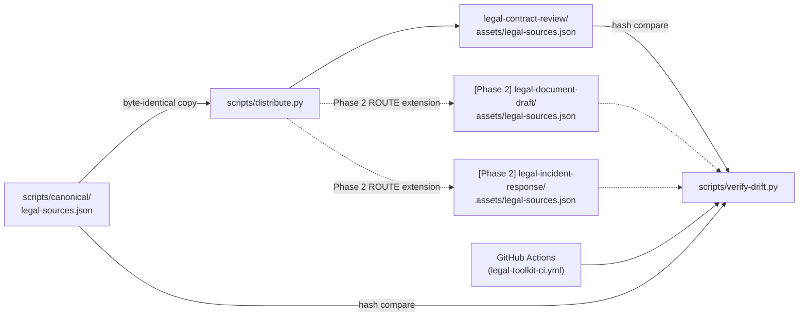

# legal-toolkit SP1 — `legal-sources.json` SSOT-and-functional-copy refactor

**Status**: Design (implementation-ready)
**Date**: 2026-05-12
**Authors**: kouko + Claude (brainstorming session)
**Predecessor**: `legal-toolkit` v0.3.5 (PR #267) — 3 skills (router + playbook-author + contract-review), `legal-sources.json` single-owned by `legal-contract-review` per Phase 1.7
**Target version**: `legal-toolkit` v0.3.6
**Sub-project**: SP1 of legal-toolkit Phase 2 program (SP1 plumbing → SP2 PDPA-2025/11 verify run → SP3 Phase 2 ship `v0.4.0` || SP4 Phase 4.5 research kickoff)
**Skill scope**: cross-skill plumbing — no skill behavior change

---

## 1. Goal

Promote `legal-sources.json` from `legal-contract-review/assets/` (current single-owner location) to a plugin-level **canonical source-of-truth** at `legal-toolkit/scripts/canonical/`, plus a deterministic `distribute.py` deploy script and a `verify-drift.py` CI gate, so that **Phase 2 sibling skills (`legal-document-draft`, `legal-incident-response`) can carry byte-identical functional copies under their own `assets/` without reaching into another skill's directory tree**.

Zero runtime behavior change in this PR: the existing `build_citation_url.py` continues reading its adjacent `assets/legal-sources.json`; only the *origin* of that file flips from "hand-edited in place" to "materialized from canonical SoT via `distribute.py`".

## 2. Why

**Trigger** — Phase 2 plan (memory `project_legal_toolkit_design.md`) adds two sibling skills, both of which need access to the same statute / case / 函釋 URL registry currently encoded in `legal-sources.json`:

- `legal-document-draft` — 4 mode protocols (privacy / tos / dpa / nda); templates cite 個資法 + GDPR + 民法 articles and need verified URL anchors.
- `legal-incident-response` — 3 path protocols (個資外洩 / 主管機關函覆 / 違約); PDPC 通報文 + 函覆 templates cite 個資法 + 民法.

**Constraint** — `monkey-skills/CLAUDE.md` "Skill Structure" rule: each skill is self-contained; SKILL.md and its runtime-loaded protocols must not reach into another skill's directory tree. Letting Phase 2 skills read `legal-contract-review/assets/legal-sources.json` directly violates this convention.

**Why now (not deferred to Phase 2 design)** — SP2 (PDPA 2025/11 verify run) writes new entries (`amendment_note`, refreshed `verified_at`, possibly new statute entries) into `legal-sources.json`. If we do verify run BEFORE SP1, those edits go into a location we are about to relocate, forcing duplicate rework. SP1 must land first.

**Why the established translation-toolkit pattern** — `translation-toolkit/scripts/` is the in-repo precedent for plugin-level SSOT-and-functional-copy plumbing (`canonical/<file>` SoT + `distribute.py` + `verify-drift.py` + plugin-level tests). Re-using that pattern keeps cognitive overhead minimal across plugins and matches `monkey-skills` memory `feedback_ssot_functional_copy_pattern.md`.

**Why NOT route Phase 2 skills to read `build_citation_url.py`'s adjacent JSON via `../legal-contract-review/...`** — the Anthropic skill self-containment convention is strict in this repo (`CLAUDE.md` Skill Structure section); plugin-validated by `.claude/hooks/validate-skill-folder-structure.sh`.

**Why NOT a per-skill independent narrow registry** — three drift surfaces for URL templates is worse than one SoT + CI gate; future statute additions would need three coordinated edits.

## 3. Scope decisions (carried forward from brainstorming)

| Decision | Choice | Reasoning |
|---|---|---|
| Pattern | **SSOT-and-functional-copy** mirror of `translation-toolkit/scripts/` | In-repo precedent; matches memory `feedback_ssot_functional_copy_pattern.md` |
| SoT location | `legal-toolkit/scripts/canonical/legal-sources.json` | Same dir name as translation-toolkit for cross-plugin familiarity |
| Deploy script | `legal-toolkit/scripts/distribute.py` (plugin-level) | translation-toolkit precedent; not per-skill |
| Drift gate | `legal-toolkit/scripts/verify-drift.py` (plugin-level) | Same precedent; CI-runnable in isolation |
| Tests | `legal-toolkit/scripts/tests/test_distribute.py` + `test_verify_drift.py` | Plugin-level, mirrors translation-toolkit |
| CI workflow | NEW `.github/workflows/legal-toolkit-ci.yml` (clone translation-toolkit-ci.yml) | No existing legal-toolkit CI workflow yet |
| Path-trigger | `paths: ['legal-toolkit/**', '.github/workflows/legal-toolkit-ci.yml']` | Only run on plugin or workflow touch |
| Migration of contract-review copy | `git mv` the existing file to canonical, then `distribute.py` re-materializes it back into `legal-contract-review/assets/` (byte-identical) | Preserves git history at one location while the per-skill copy regenerates |
| `build_baseline.py` | NOT touched | Different pattern class (1→1 plugin-tree-to-tarball); convention violation does not apply because it produces a packaged artifact, not a shared raw file |
| `build_citation_url.py` + `cache_check.py` per-skill SSOT | **Deferred to Phase 2 design** | Phase 2 design will decide whether draft + IR skills need runtime fetch (likely no — templates hardcode citations); if yes, they get canonical/ treatment in a separate refactor |
| `verified_at` / `amendment_note` field semantics | Unchanged (SP2 will update values, not schema) | Schema migration is out-of-scope for SP1 |

## 4. Architecture

### 4.1 File layout (after SP1)

```
legal-toolkit/
├── scripts/                          ← NEW (plugin-level, mirror translation-toolkit)
│   ├── canonical/
│   │   └── legal-sources.json        ← THE SoT (only editable location)
│   ├── distribute.py                 ← byte-identical deploy → consumer skills
│   ├── verify-drift.py               ← CI gate
│   └── tests/
│       ├── test_distribute.py
│       └── test_verify_drift.py
├── baseline-source/                  ← UNCHANGED (1→1 pattern; produces tarball)
└── skills/
    ├── using-legal-toolkit/          ← UNCHANGED (no consumer)
    ├── legal-playbook-author/        ← UNCHANGED (no consumer)
    └── legal-contract-review/
        ├── assets/
        │   └── legal-sources.json    ← functional copy (now materialized by distribute.py)
        └── scripts/                   ← UNCHANGED
            ├── build_baseline.py
            ├── build_citation_url.py
            └── cache_check.py
```

### 4.2 Routing table

`distribute.py` carries a single-source / multi-target routing table that **reflects current state, not future intent**:

```python
# SP1 ship — 1 consumer
CANONICAL_FILE = "legal-sources.json"
ROUTE = {
    "legal-sources.json": [
        "skills/legal-contract-review/assets/legal-sources.json",
    ],
}
```

When SP3 (Phase 2 `v0.4.0`) ships `legal-document-draft` and `legal-incident-response`, that PR appends two entries to `ROUTE` in the same commit that creates the skill subfolders. The routing table is the authoritative declaration of which destinations MUST exist and be byte-identical at HEAD; verify-drift compares this declaration against the working tree with no skip rule — every declared route must be present.

This mirrors translation-toolkit's actual implementation: it tracks an `ACTIVE_SKILLS` roster (updated when a skill goes live) rather than auto-skipping based on parent-dir presence. Simpler model, fewer test branches.

### 4.3 Mermaid — data flow



## 5. Component contracts

### 5.1 `distribute.py`

**Purpose**: copy each file under `scripts/canonical/` to its routed destination under `skills/<skill>/<subfolder>/<file>`, byte-identical.

**CLI**:
```
python3 scripts/distribute.py
  → writes / overwrites copies in routing destinations
  → exit 0 always (unless filesystem error)
  → stdout: per-copy `[deploy] <src> → <dst>` lines + summary count
```

**Determinism guarantee**: `shutil.copy2` preserves bytes; no formatting / minification / normalization step. The SoT file IS the bytes that appear in each consumer.

**Implementation note**: must be importable by `verify-drift.py` (which reuses the routing table). Pattern: dataclass / dict constant at module top, exposed via `from distribute import ROUTE, CANONICAL_DIR, ROOT`.

### 5.2 `verify-drift.py`

**Purpose**: assert each entry in the routing table is byte-identical to its canonical source.

**CLI**:
```
python3 scripts/verify-drift.py
  → exit 0 if every routed destination exists AND is byte-identical to canonical
  → exit 1 on any byte-level divergence OR any missing routed destination
  → on FAIL: print unified diff (truncated to 50 lines) + md5 of both files
  → on missing canonical for routed destination: also FAIL (canonical must exist if route is declared)
```

**Behavior**: every entry in `ROUTE` is mandatory. If you add a route, you must also commit the functional copy. There is no auto-skip — the ROUTE table is updated by humans (or in a single commit alongside the skill subfolder it points at) per §4.2.

**Reuse**: `from distribute import ROUTE, CANONICAL_DIR, ROOT`. Verify-drift iterates `ROUTE.items()` directly; it does not need `iter_canonical_files` (which scans the canonical/ dir on disk — relevant for distribute's deploy walk, not for drift checking).

### 5.3 `scripts/tests/test_distribute.py`

Minimum coverage:
- T-D-1: routing table loaded and well-formed (each route value is a list of str paths).
- T-D-2: each canonical file has at least one routing destination declared.
- T-D-3: after `distribute()` call, each routed destination exists and is byte-identical to its canonical source.
- T-D-4: re-running `distribute()` is idempotent (no diff).
- T-D-5: deploy creates parent dirs if missing.

### 5.4 `scripts/tests/test_verify_drift.py`

Minimum coverage:
- T-V-1: after fresh distribute, verify_drift returns 0.
- T-V-2: mutating a functional copy by one byte makes verify_drift return 1 (with unified-diff stdout).
- T-V-3: deleting a routed functional copy returns 1 (every routed destination is mandatory).
- T-V-4: deleting the canonical file but keeping copies returns 1 (broken pipe is a bug).

## 6. Migration steps (concrete)

1. `mkdir -p legal-toolkit/scripts/canonical legal-toolkit/scripts/tests`.
2. `git mv legal-toolkit/skills/legal-contract-review/assets/legal-sources.json legal-toolkit/scripts/canonical/legal-sources.json` — preserves git blame at the new location.
3. Write `legal-toolkit/scripts/distribute.py` with `ROUTE` declaring 1 destination.
4. Write `legal-toolkit/scripts/verify-drift.py`.
5. Write 2 test files under `legal-toolkit/scripts/tests/`.
6. Run `python3 legal-toolkit/scripts/distribute.py` — this **recreates** the file at `legal-toolkit/skills/legal-contract-review/assets/legal-sources.json` byte-identical to canonical.
7. Run existing tests (`pytest legal-toolkit/tests/`) — must remain green (zero behavior change).
8. Run new tests (`pytest legal-toolkit/scripts/tests/`).
9. Write `.github/workflows/legal-toolkit-ci.yml` (clone of translation-toolkit-ci.yml; trigger paths = `legal-toolkit/**` + workflow itself).
10. Bump `legal-toolkit/.claude-plugin/plugin.json` version `0.3.5` → `0.3.6`.
11. Update `legal-toolkit/ROADMAP.md` with new Phase 1.10 section explaining SP1 (mirror existing Phase 1.5-1.9 entry pattern).

## 7. CI integration

`.github/workflows/legal-toolkit-ci.yml`:

- Trigger: PR + push to main, paths `legal-toolkit/**` + workflow file.
- Steps:
  1. Checkout + Python 3.11.
  2. Install `pytest` (and any future deps via standard `pip install` once needed; SP1 needs only stdlib).
  3. `pytest legal-toolkit/scripts/tests/ -v` with `PYTHONDONTWRITEBYTECODE=1`.
  4. `pytest legal-toolkit/tests/ -v` (existing 171-test suite) with `PYTHONDONTWRITEBYTECODE=1`.
  5. `python3 legal-toolkit/scripts/verify-drift.py`.
  6. (Optional in SP1, can defer) skill-folder-structure validator over the 3 existing skills.

Add `legal-toolkit CI` to `main` branch protection's required checks list **after** first green run.

## 8. Quality gates

- ✅ `legal-toolkit/scripts/canonical/legal-sources.json` is the only hand-edited copy (no other writeable location).
- ✅ `legal-toolkit/skills/legal-contract-review/assets/legal-sources.json` is byte-identical to canonical after migration.
- ✅ Existing 171-test legal-toolkit pytest suite remains green (zero runtime behavior change).
- ✅ New `scripts/tests/` suite green (≥ 9 tests across T-D-1..5 and T-V-1..4).
- ✅ `verify-drift.py` exit 0 in the v0.3.6 commit state.
- ✅ `verify-drift.py` exit 1 when a functional copy is manually mutated (manual smoke test before push).
- ✅ `.github/workflows/legal-toolkit-ci.yml` green on PR.
- ✅ Skill folder structure validator (`.claude/hooks/validate-skill-folder-structure.sh`) passes for all 3 skills (no nested subfolders introduced — `scripts/` is plugin-level, not skill-level).

## 9. Out of scope (explicitly deferred)

| Item | Why deferred | Lands in |
|---|---|---|
| Materialize copies for `legal-document-draft` + `legal-incident-response` | Those skills don't exist yet | SP3 (Phase 2 v0.4.0 PR) |
| Move `build_citation_url.py` + `cache_check.py` into canonical/ | May not be needed (depends on whether Phase 2 skills do runtime fetch — likely no) | Phase 2 design call; if needed, separate small refactor PR |
| Move `baseline-source/` build pipeline | Different pattern (1→1 tarball); no convention violation today | Optional future harmonization |
| Update `legal-sources.json` content (PDPA 2025/11 entries / `verified_at` refresh) | That's SP2 verify run; SP1 is pure plumbing | SP2 PR |
| Phase 2 skill design (SKILL.md / protocols / asset layouts for draft + IR) | That's SP3 spec | SP3 spec doc |
| Phase 4.5 上市櫃 Compliance research outline | Independent D-track | SP4 (parallel research dispatch) |

## 10. Risks

| Risk | Likelihood | Impact | Mitigation |
|---|---|---|---|
| Git history opaque after rename | LOW | Low | Single-rename commit via `git mv`; reviewers use `git log --follow` if blame for the pre-move history is needed |
| `build_citation_url.py` cannot find adjacent JSON after move | LOW | High (breaks runtime fetch) | distribute.py recreates the file at the original location, byte-identical; existing tests catch any breakage |
| CI workflow false-positive (e.g., path-trigger over-broad) | LOW | Low | Cloning translation-toolkit-ci.yml exactly; that pattern is battle-tested |
| Phase 2 skills end up needing build_citation_url.py too late to schedule | MED | Medium (extra mini-PR mid-Phase-2) | Decide explicitly in Phase 2 design before SP3 implementation start |
| Future PR forgets to run distribute.py after editing SoT | HIGH | Low (CI catches it immediately) | verify-drift.py in CI = forcing function; document workflow in `scripts/canonical/README.md` |

## 11. References

- **In-repo precedent**: [translation-toolkit/scripts/distribute.py](../../../translation-toolkit/scripts/distribute.py) + [verify-drift.py](../../../translation-toolkit/scripts/verify-drift.py) + [translation-toolkit-ci.yml](../../../.github/workflows/translation-toolkit-ci.yml)
- **Convention**: [monkey-skills/CLAUDE.md](../../../CLAUDE.md) §Skill Structure (skill self-containment, plugin-level scripts/ allowed for cross-skill plumbing)
- **Validator hook**: [.claude/hooks/validate-skill-folder-structure.sh](../../../.claude/hooks/validate-skill-folder-structure.sh)
- **Prior single-owner context**: [legal-toolkit/skills/legal-contract-review/SKILL.md#L220-L222](../../../legal-toolkit/skills/legal-contract-review/SKILL.md#L220-L222) (v0.3.3 Phase 1.7 introduction of runtime fetch)
- **Prior similar refactor (cross-plugin SSOT)**: PR #159 dev-workflow v1.5.0 — memory `feedback_ssot_functional_copy_pattern.md`
- **SoT design doc for the broader Phase 2 program**: obsidian vault `research/2026-05-09 法務 Agent Skill (legal-toolkit) 整體架構與執行流程設計.md`

## 12. Estimate

~半天 工程 + 半天 CI iteration / review polish. ~10-15 commits expected, single PR `v0.3.6`. Subagent-driven not necessary (small, mechanical, well-bounded — single implementer is faster).
