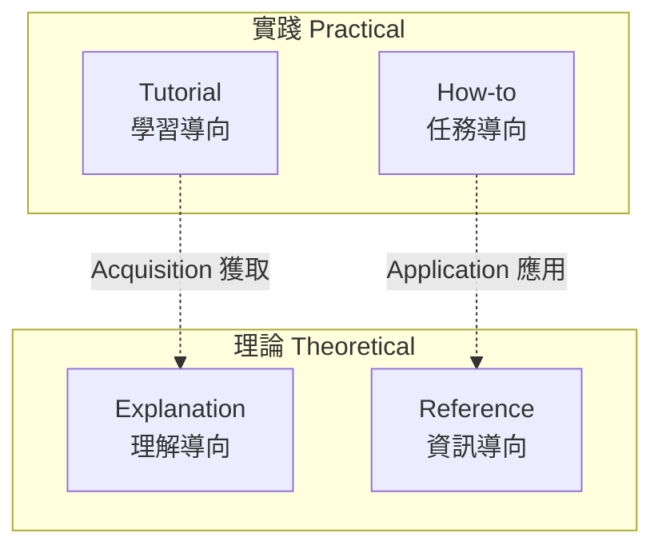

# 技術文件框架研究

> **Backfill note** (2026-04-11, v4.7.0): This file was migrated into
> the repo from the maintainer's Obsidian vault as part of the v4.7.0
> research-notes-in-repo convention. The original Obsidian note
> (`2026-04-10 技術文件框架研究 — Diátaxis・Google Style・ADR・OpenAPI.md`)
> remains in the maintainer's vault as a personal backup. Wikilinks
> have been normalized to plain-text references.

> [!info] 研究背景
> 為重新設計 `domain-teams/skills/docs-team` skill，調查技術文件領域的業界標準與框架。docs-team 目前只有 2 個 workflows（Documentation, Codebase Assessment）且全自創，跟 qa-team 重構前一樣。
>
> 研究方法：透過 `domain-teams:research-team` skill 執行深度研究，兩個 gate 都 first-try PASS（Citation MUST + Research Quality SHOULD）。

## TL;DR

| Framework | Category | 用途 |
|-----------|----------|------|
| **Diátaxis** (Daniele Procida) | 廣泛採用標準 | 技術文件分類詞彙權威（4 象限） |
| **Google Dev Style** | 廣泛採用標準 | 開發者文件風格（primary） |
| **Microsoft Writing Style** | 廣泛採用標準 | 消費者文件風格（secondary） |
| **Standard README** (RichardLitt) | 正式規範 | README 必要段落 |
| **Nygard ADR** (2011) | 影響力個人意見 → 事實標準 | 架構決策記錄 |
| **MADR** | 新興擴展 | Nygard ADR 的 Markdown 擴展 |
| **OpenAPI 3.2.0** | 正式業界標準 | API 文件結構 |
| **Docs as Code** (Write the Docs) | 社群共識 | 文件版控操作模型 |
| **Vale** | de facto prose linter | 機械化風格檢查 |
| **Google docs-rot / freshness** | 影響力工程實踐 | Freshness gate 基礎 |

## 1. Diátaxis — 文件分類的詞彙權威

### 四象限

Diátaxis 按 **用戶需求** 將技術文件分成四個象限：

| 模式 | 用戶需求 | 定位 | 服務對象 |
|------|---------|------|---------|
| **Tutorial** | "教我" | 學習導向、實踐性 | 新用戶 + 教師引導 |
| **How-to Guide** | "告訴我怎麼做 X" | 任務導向、實踐性 | 知道要達成什麼的用戶 |
| **Reference** | "告訴我事實" | 資訊導向、理論性 | 需要精確技術描述的用戶 |
| **Explanation** | "幫我理解" | 理解導向、理論性 | 想要背景、理由、設計決策的用戶 |

### 雙軸結構

- **Acquisition vs Application**: Tutorials + Explanation 服務獲取知識；How-to + Reference 服務應用既有知識
- **Practical vs Theoretical**: Tutorials + How-to 是實踐步驟；Reference + Explanation 是理論描述

### 採用者

- **框架文件**: Django, Gatsby, NumPy, Cloudflare Workers, Canonical, Google Fuchsia OS
- **企業**: IBM LoopBack, Ericsson, Bosch, Tesla Motors, Zalando, ING Bank

### 常見誤用

1. **教條僵化** — 把 Diátaxis 當成「四個固定桶」而非分析框架
2. **模式混合** — 在 how-to 裡塞進 explanation
3. **過度套用** — 小專案只需要 README，硬套四象限反而浪費

> [!warning] Diátaxis 的限制
> Procida 本人承認「人們不會嚴格區分這些模式」。Diátaxis 是**分析**框架，不是**規範**模板。

## 2. Google Developer Documentation Style Guide（推薦 primary）

### 核心原則（來自 developers.google.com/style/highlights）

**語氣與內容**：
- Conversational and friendly without being frivolous
- 使用描述性 link text
- 考慮全球讀者

**語法**：
- **第二人稱** ("you") 而非第一人稱
- **主動語態**
- 美式拼寫與標點
- 條件語句放在指令**之前**

**格式**：
- **Sentence case** 標題
- Numbered list for sequential / bulleted for non-sequential
- **Serial comma** (Oxford comma)
- Code font for code-related text

### 時態
- **Present tense** 而非過去或未來
- 明文要求：「Use second person, present tense, active voice, and the serial comma」

### 授權
CC BY 3.0 — 可自由 fork 使用

## 3. Microsoft Writing Style Guide（推薦 secondary）

### Top 10 Tips（2025-01-21 更新）

1. **Use bigger ideas, fewer words** — "Shorter is always better"
2. **Write like you speak** — 朗讀檢查
3. **Project friendliness** — 使用縮寫 (it's, you'll)
4. **Get to the point fast** — 重要的放前面
5. **Be brief** — 刪除冗字
6. **When in doubt, don't capitalize** — Sentence case
7. **Skip periods** — 標題不加結尾標點
8. **Remember the last comma** — Oxford comma
9. **Don't be spacey** — 句號後一個空格
10. **Revise weak writing** — 動詞開頭，刪除 "you can" 和 "there is/are"

### 核心精神
**"Above all, simple and human"**（品牌 voice 的根本原則）

## 4. Write the Docs — Docs as Code

### 定義
> "Docs as Code refers to a philosophy that you should be writing documentation with the same tools as code… following the same workflows as development teams"

### 八個操作原則

1. **純文字標記** (Markdown, reStructuredText, AsciiDoc)
2. **版本控制** — 文件跟 code 住在同一個 git
3. **同儕審查** — 文件改動走 PR
4. **自動化測試** — Vale, markdownlint, Alex, link checking
5. **建構管線** — Sphinx, MkDocs, Docusaurus, Hugo
6. **Issue 追蹤** — 文件 bug 跟 code bug 同等對待
7. **命名維護者** — 所有權明確
8. **協作** — 寫作者和開發者共享所有權

### Write the Docs 四原則

| 原則 | 意涵 |
|------|------|
| **ARID** | Acceptable to Repeated Information Duplication — 不同於 DRY，文件可適度重複以便讀者理解 |
| **Skimmable** | 像報紙，不是小說 — 可掃描結構 |
| **Consistent** | 語言和格式一致 |
| **Canonical** | 錯誤的文件比沒文件還糟 |

## 5. Standard README (RichardLitt)

### 必要段落（按順序）

1. **Title** — 必須跟 repo/package 名稱匹配
2. **Short Description** — 120 字以內
3. **Table of Contents** — README > 100 行時必要
4. **Install** — code block
5. **Usage** — code block
6. **Contributing** — 問題政策、PR 政策
7. **License** — SPDX 識別碼，**必須是最後一段**

### 檔案要求
- 檔名必須是 `README` + 適當副檔名
- 不能有 broken link
- 國際化版本用 BCP 47 tag (e.g., `README.zh-CN.md`)

## 6. Architecture Decision Records (ADR)

### Michael Nygard 原始模板（2011）

ADR 是「一個類似 Alexandrian pattern 的短文字檔，1-2 頁長」。五個段落：

1. **Title** — 短名詞片語
2. **Status** — proposed / accepted / deprecated / superseded
3. **Context** — 「技術的、政治的、社會的、專案局部的 forces at play」
4. **Decision** — 「我們對這些 forces 的回應。用完整句子，主動語態。'We will …'」
5. **Consequences** — 「套用決策後的 resulting context。所有後果都列出，不只正面的」

### MADR (Markdown ADR)

MADR 是 Nygard 的延伸，加了：
- Deciders, Date, Consulted, Informed
- Options Considered
- Pros and Cons

**慣例目錄**: `docs/decisions/NNNN-title.md`

### 四個模板變體
- `adr-template.md` — 所有段落 + 說明
- `adr-template-minimal.md` — 必要段落 + 說明
- `adr-template-bare.md` — 所有段落，空白
- `adr-template-bare-minimal.md` — 必要段落，空白

### 採用
ADR 被以下業界權威引用為最佳實踐：
- Microsoft Azure Well-Architected Framework
- AWS Prescriptive Guidance
- Red Hat
- Martin Fowler bliki
- UK GDS Way

## 7. API Documentation — OpenAPI 3.2.0

### 業界標準
OpenAPI Specification (OAS) 3.2.0（2025-09-19 發布）是由 Linux Foundation 維護的正式業界標準。

### 參數文件規範
- Parameter names 用 **camelCase**
- Required 先列，optional 後列
- 明確標示 type（path / query / header）
- 每個 parameter 都要有描述
- Schemas 定義在 `components/schemas`，用 `$ref` 引用

### 業界黃金標準
**Stripe** 和 **Twilio** 被公認為 API reference 的業界範例：
- **Stripe**: 「每個 operation 都有人性化的描述，arguments 完整文件化，copy-paste 的 request/response 範例」
- **Twilio**: 「多語言程式覆蓋 + 步驟式 walkthrough，keep code visible」

> [!important] Diátaxis 對齊
> API reference **不是** explanation。Reference docs 必須窮盡、模板驅動、機械地一致。「為什麼」放在另外的 concept docs。這直接對應 Diátaxis 的 Reference vs Explanation 分離。

## 8. Vale — Prose Linter

### 定義
> "An open-source, command-line tool that brings your editorial style guide to life."

- 支援 Markdown, HTML, reStructuredText, AsciiDoc, DITA, XML
- YAML 規則格式
- 離線運作
- MIT license

### 可用的 Style Packages
Vale 內建以下業界 style guide 的實作：
- **Microsoft** ✓
- **Google** ✓
- write-good
- proselint
- alex
- Joblint
- RedHat
- GitLab

### 機械 vs 人類判斷的分界

| 可機械檢查 | 需人類判斷 |
|-----------|-----------|
| Passive voice 偵測 | 被動語態是否合理 |
| 句子長度 > N 字 | 長句是否比拆分更清楚 |
| 禁用 jargon / weak verbs | 技術術語是否不可避免 |
| 標題大小寫風格 | 標題是否描述內容 |
| 包容性語言 (Alex) | 文化語氣是否恰當 |
| Markdown 結構 (markdownlint) | 結構是否對應 Diátaxis 模式 |
| Link 語法、broken link | Link 目標是否權威 |

## 9. Google 的 "Docs Rot" 與 Freshness Dates

出處：*Software Engineering at Google* Chapter 10

### 關鍵引述
> "Such documents note the last time a document was reviewed, and metadata in the documentation set will send email reminders when the document hasn't been touched in, for example, three months."

### Google 的五個實踐

1. **Freshness dates** — 每個文件有 metadata；N 個月後觸發 reminder
2. **Last reviewed by** byline — 明確維護者
3. **版控整合** — 文件和 code 在同一個 source control
4. **文件 code review** — 走同一個 review 工具
5. **Issue 追蹤** — 文件 bug 跟 code bug 同等

### Google 的三個品質維度

品質是這三者的 trade-off：
- **Completeness** — 涵蓋所有 case（風險：犧牲清晰）
- **Accuracy** — 嚴格正確（衝突：可理解性）
- **Clarity** — 可讀性（可能需要省略邊界 case）

> 「A 'good document' is defined as the document that is doing its intended job.」

## 10. The Good Docs Project

Diátaxis-aligned 的填空式 Markdown 模板。三個包：

**Core Pack (8)**: Concept, How-to, README, Reference, Release notes, Troubleshooting, Tutorial

**Community Pack**: Bug report, Changelog, Code of Conduct, Contributing guide, Our team

**Miscellaneous Pack**: API getting started, API reference, Glossary, Installation guide, Quickstart, Style guide

## 11. 日本技術文件傳統（lightweight）

### 3 原則
第 1 原則：**書き手と読み手の違いを認識** — 認知作者與讀者的差異
第 2 原則：**明確に伝わる構成** — 明確傳達的結構
第 3 原則：**明確に伝わる書き方** — 明確傳達的寫法

### 其他實踐
- **Topic-sentence paragraph structure** — 每段首句為 topic sentence
- **導入 → 本論 → 結論** — 三段結構
- **ロジックツリー構築** — 寫前建階層樹
- **JIS/JSA standards** — 日本規格協會的技術文件指引

### 與歐美的差異

| 面向 | 日本傳統 | 歐美（MS/Google） |
|------|---------|------------------|
| 結構重點 | 起承転結 → 三段構成 | Diátaxis 四模式分離 |
| 段落單元 | Topic sentence 置首 | 同 |
| 句長 | 較長、有 hedging | 短而直接 |
| 讀者建模 | 書き手/読み手差異是第 1 原則 | 透過 audience persona |
| 語氣 | 正式、中性 | 對話、友好 |

> [!note] `[分析|低]` 日本社群對 Diátaxis 的接受
> 日本社群並沒有發展出等同於 Diátaxis 的 user-need framework。Recruit、DMM、Qiita 的文章都直接用原文（英文/希臘文）術語。建議：**保留 Diátaxis 詞彙**而非發明日文對應物，但採用 3 原則作為補充的「讀者優先」lens。

## 12. 對 docs-team 再設計的建議

### 主要決策

1. **Primary vocabulary**: **Diátaxis** (cite diataxis.fr)
2. **Primary style guide**: **Google** (cite developers.google.com/style) 作為開發者目標受眾
3. **Secondary style guide**: **Microsoft** (cite learn.microsoft.com/style-guide) 作為消費者語氣參考

### 5 個新 Standards

| 檔案 | 主要來源 |
|------|---------|
| `diataxis-taxonomy.md` | diataxis.fr |
| `style-conventions.md` | developers.google.com/style (primary) + Microsoft (secondary) |
| `readme-standard.md` | RichardLitt Standard README spec |
| `adr-convention.md` | Nygard 2011 + adr.github.io MADR |
| `api-reference-standard.md` | OpenAPI 3.x + Stripe/Twilio benchmarks |

### 新 Workflows

| Workflow | Diátaxis 對應 |
|----------|--------------|
| Diátaxis Audit | Codebase assessment 擴展 |
| Write Tutorial | Tutorial 象限 |
| Write How-to Guide | How-to 象限 |
| Write Reference | Reference 象限 |
| Write Explanation | Explanation 象限 |
| Write ADR | Nygard/MADR format |
| Write README | Standard README spec |
| Write API Reference | OpenAPI + Stripe/Twilio |

### 新 Gates

**MUST**:
- **Diátaxis Mode Clarity** — 每個文件必須聲明自己的象限，不得混合
- **README Completeness** — Standard README 必要段落都在
- **ADR Structure** — Nygard 五段都在，status 明確，consequences 正負都列

**SHOULD**:
- **Style Convention** — Vale + markdownlint 乾淨通過
- **Freshness** — 每個 reference doc 有 `last_reviewed` metadata，> 6 個月觸發 review

**MAY**:
- **Inclusive Language** — Alex lint 通過
- **API Reference Completeness** — 100% endpoints 有 parameter type、required flag、description、example

## Anti-Patterns to Avoid

1. **Diátaxis 教條化** — 小專案只需 README，硬套四象限是浪費
2. **Google 過度克制** — 對使用者面向文件保留 Microsoft 「project friendliness」
3. **ADR 形式化** — 小團隊用 MADR minimal 就夠，不要全部用 bare template
4. **Vale false positive** — 把 Vale 當 advisory SHOULD，不是 MUST

## 相關研究脈絡

- qa-team 研究綜合（`domain-teams/skills/qa-team/research/grounding-v4.2.0.md`）— 本 session 前一個 re-grounding 的範本
- MOC (authoring workspace, kept in maintainer's Obsidian vault, NOT backfilled)

## 主要參考來源

### Diátaxis
- [diataxis.fr](https://diataxis.fr/) — 官方網站（Daniele Procida）
- [idratherbewriting Diátaxis review](https://idratherbewriting.com/blog/what-is-diataxis-documentation-framework)
- [diataxis mirror with adopter list](https://diataxis.qubitpi.org/en/latest/)
- [Recruit Data Blog: Diátaxis + C4](https://blog.recruit.co.jp/data/articles/diataxis-c4model/)
- [Quarkus JP: Diátaxis content types](https://ja.quarkus.io/guides/doc-concept)

### Style guides
- [Google Developer Documentation Style Guide](https://developers.google.com/style)
- [Google Style Highlights](https://developers.google.com/style/highlights)
- [Microsoft Writing Style Guide](https://learn.microsoft.com/en-us/style-guide/welcome/)
- [Microsoft Top 10 tips for style and voice](https://learn.microsoft.com/en-us/style-guide/top-10-tips-style-voice)
- [Google Open Source Blog: releasing the style guide (2017)](https://opensource.googleblog.com/2017/09/making-google-developers-documentation.html)

### Write the Docs
- [Write the Docs — Docs as Code](https://www.writethedocs.org/guide/docs-as-code/)
- [Write the Docs — Documentation principles](https://www.writethedocs.org/guide/writing/docs-principles/)
- [Cloudflare: our docs-as-code approach](https://blog.cloudflare.com/our-docs-as-code-approach/)
- [Kong: What is Docs as Code](https://konghq.com/blog/learning-center/what-is-docs-as-code)

### Standard README
- [Standard README spec (RichardLitt)](https://github.com/RichardLitt/standard-readme/blob/main/spec.md)
- [The Good Docs Project templates](https://www.thegooddocsproject.dev/template)

### ADR
- [Michael Nygard — Documenting Architecture Decisions (2011)](https://www.cognitect.com/blog/2011/11/15/documenting-architecture-decisions)
- [adr.github.io](https://adr.github.io/)
- [MADR: Markdown Architecture Decision Records](https://adr.github.io/madr/)
- [Martin Fowler: Architecture Decision Record](https://martinfowler.com/bliki/ArchitectureDecisionRecord.html)
- [UK GDS Way: Documenting architecture decisions](https://gds-way.digital.cabinet-office.gov.uk/standards/architecture-decisions.html)

### OpenAPI
- [OpenAPI Specification v3.2.0](https://spec.openapis.org/oas/latest.html)
- [OpenAPI Best Practices](https://learn.openapis.org/best-practices.html)

### Tooling & metrics
- [Vale](https://vale.sh/)
- [Datadog: How we use Vale](https://www.datadoghq.com/blog/engineering/how-we-use-vale-to-improve-our-documentation-editing-process/)
- [Software Engineering at Google, Chapter 10: Documentation](https://abseil.io/resources/swe-book/html/ch10.html)
- [The Good Docs Project](https://www.thegooddocsproject.dev/)

### Japanese tech writing
- [JAIST: 技術文書の書き方](http://www.jaist.ac.jp/~uehara/etc/tech/index.html)
- [LSNL: 正しい技術文章作成のためのヒント](https://lsnl.jp/~ohsaki/research/tips-japanese/)
- [JSA: 第10章 技術文書 (PDF)](https://www.jsa.or.jp/datas/media/10000/md_2464.pdf)
- [JTAP: 技術文書 3原則と6つのルール](https://www.jtapco.co.jp/training-02)

## 研究品質證明

透過 `domain-teams:research-team` skill 執行：

- ✅ **MUST: Source Citation gate** — PASS (first-try)
- ✅ **SHOULD: Research Quality gate** — PASS (4 dimensions all Green)

所有 load-bearing 主張都有一手來源引用，分析性主張標記為 `[analysis]` 並附信賴度，counter-arguments 都有 mitigation。

---

**研究日期**: 2026-04-10
**研究工具**: monkey-skills v4.2.0 domain-teams:research-team
**研究用途**: monkey-skills/domain-teams/docs-team 再設計
