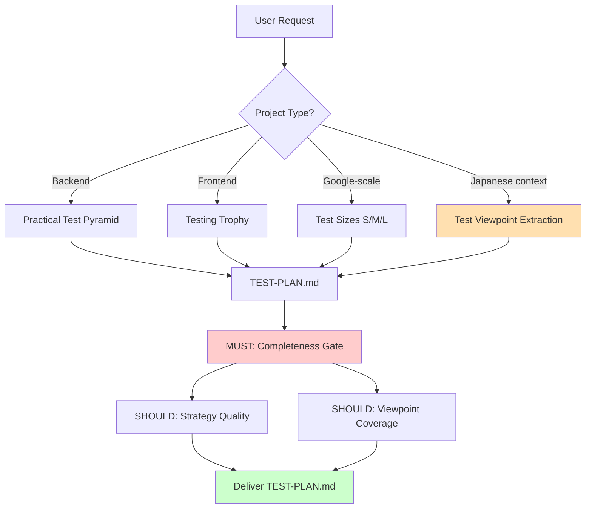

# qa-team 再設計研究綜合 — 歐美日跨文化 QA 框架對照

> **Backfill note** (2026-04-11, v4.7.0): This file was migrated into
> the repo from the maintainer's Obsidian vault as part of the v4.7.0
> research-notes-in-repo convention. The original Obsidian note
> (`2026-04-10 qa-team 再設計研究綜合 — 歐美日跨文化 QA 框架對照.md`)
> remains in the maintainer's vault as a personal backup. The two
> companion research notes (歐美篇 and 日本篇) and the MOC index are
> authoring workspace artifacts and were intentionally NOT backfilled;
> only this synthesized synthesis note is the canonical audit trail.
> Wikilinks have been normalized to plain-text references.

> [!info] 本筆記的定位
> 這是 qa-team skill 再設計研究的 **綜合篇**（歐美篇 + 日本篇的融合），直接產出對 `domain-teams/skills/qa-team/` 的具體設計處方。
>
> - 歐美篇: `2026-04-10 歐美軟體測試最佳實踐研究 — ISTQB・ISO 29119・Test Pyramid.md`（留在 maintainer 的 Obsidian vault，非 canonical 來源）
> - 日本篇: `2026-04-10 日本 QA 社群測試實踐研究 — JSTQB・VSTeP・テスト観点.md`（同上）
> - MOC: `2026-04-10 MOC — qa-team 再設計研究.md`（authoring workspace，非 audit trail）

## TL;DR — 核心洞察

> [!important] Two Orthogonal Layers
> qa-team 再設計**不是「加入日本的東西」**，而是承認**兩個正交層次**：
>
> 1. **歐美策略層** — 粒度、約束、自動化（Pyramid, Sizes, CI）
> 2. **日本覆蓋層** — 觀點抽取、DR 參與、手動+自動混合
>
> 兩層都應該存在。使用者按專案背景決定偏重哪一層。

## 跨文化收斂點（兩邊都同意）

| 收斂點 | 歐美來源 | 日本來源 |
|--------|---------|---------|
| **ISO/IEC/IEEE 29119-3** 作為測試計畫結構基準 | IEEE/ISO 標準 | JSTQB v4.0、Mercari Hallo、Qbook 11-step |
| **Risk-Based Testing** 作為優先順序方法 | ISTQB CTFL Ch5 (Risk = L × I) | JSTQB FL v4.0 Ch5 (相同公式) |
| **Shift-left 哲學** | SEI taxonomy | 「品質は工程で作り込む」（相容） |
| **測試計畫應能做 go/no-go 決策** | Google 10-Minute Test Plan | Mercari Hallo completion criteria |
| **區分 levels vs types** | ISTQB 4 levels × 4 types | JSTQB (翻譯同等) |

## 跨文化分歧點（需要並列支援）

| 面向 | 歐美做法 | 日本做法 | qa-team 意涵 |
|------|---------|---------|-------------|
| **主要產出** | 精簡計畫（Google 10-min） | 詳細計畫 + 觀點列表 | **要加觀點段落** |
| **測試觀點概念** | 無命名概念（隱含於 design techniques） | 「テスト観点」= 核心心智模型（VSTeP/HAYST/ゆもつよ） | **加思考框架層** |
| **策略框架** | Test Pyramid / Testing Trophy | Test viewpoint taxonomy（NGT, 6W2H, mind map） | **互補** — pyramid 管粒度，viewpoint 管覆蓋 |
| **自動化立場** | 預設自動化（CI/CD） | 手動 + 自動混合 | **不能強制自動化作為 KPI** |
| **風險方法** | RPN / FMEA 為選項 | FMEA 限安全關鍵，定性矩陣為主流 | **FMEA 作為 opt-in** |
| **文件長度** | 短（1-2 頁） | 詳細（11 段模板） | **可配置篇幅** |
| **計畫哲學** | Continuous testing, flexibility | 上流レビュー (設計レビュー) + "built into process" | **日本帶來 DR 文化** |

## 要採用的標準

### Vocabulary Layer（雙方共用）

- **ISTQB CTFL v4.0**:
  - Test levels: Component / Integration / System / Acceptance
  - Test types: functional / non-functional / structural / change-related
  - Design techniques: EP / BVA / Decision Table / State Transition / Use Case
- **ISO/IEC/IEEE 29119-3**: 文件結構基準
- **Google Test Sizes** (Small/Medium/Large): 執行時約束軸（與 levels 正交）

### Strategy Framework Layer（按專案類型可配置）

| 專案類型 | 推薦框架 |
|---------|---------|
| Backend / systems | Fowler/Vocke **Practical Test Pyramid** |
| Frontend / JS | Kent C. Dodds **Testing Trophy** |
| Google-scale | **Small/Medium/Large** test sizes |

### Japanese Additions（疊在歐美標準上）

- **テスト観点 (test viewpoints)** — 強制的思考層
- 觀點抽取方法（擇一）：
  - **VSTeP / NGT**（西康晴）
  - **HAYST法**（秋山浩一）
  - **ゆもつよメソッド**（湯本剛）
- **Design Review (DR)** 參與 — 上流活動
- **「品質は工程で作り込む」** — standards preamble

### Risk-Based Testing

- **預設**: ISTQB 定性矩陣 (Likelihood × Impact)
- **選項**: FMEA RPN (Severity × Occurrence × Detectability) — 安全關鍵系統用

### Observability for Non-Functional Testing

- **SLI/SLO/SLA** (Google SRE) — 使用者面對的 service contract
- **RED** (Rate/Errors/Duration) — request-driven services
- **USE** (Utilization/Saturation/Errors) — 基礎設施資源

## 要避免的 Anti-Patterns

> [!danger] 7 個 qa-team 再設計必須避免的錯誤

1. **自創 test type taxonomy**（目前的錯誤）→ 用 ISTQB
2. **忽略日本 テスト観点 概念** → 不符合日本使用者心智模型
3. **自創風險分級** → 用 ISTQB L × I 矩陣
4. **強制自動化作為預設** → 與日本脈絡不相容
5. **自創測試計畫結構** → 用 29119-3 作為 baseline
6. **強制單一策略框架** → Pyramid vs Trophy vs Sizes 是情境相關
7. **忽略 design review 文化** → 排除 50% 日本 QA 的價值增值

## 推薦的 qa-team 結構

### SKILL.md 改動

- **Persona**: 承認兩個傳統
- **Workflows**: 加入 "Test Viewpoint Extraction" 作為一等 phase
- **Mention**: 使用詞彙時引用 ISTQB、29119-3、JSTQB

### 新 Standards（取代自創的 test-conventions.md）

```
domain-teams/skills/qa-team/standards/
├── istqb-vocabulary.md        ← test levels/types/techniques (ISTQB-aligned)
├── iso-29119-structure.md     ← 文件結構 baseline
├── test-viewpoints-ja.md      ← 日本觀點方法論
└── quality-philosophy.md      ← "built into process" + shift-left integration
```

### 新 Protocols

```
domain-teams/skills/qa-team/protocols/
├── test-plan-writing.md             ← 修訂：29119-3 baseline + viewpoint section
├── test-viewpoint-extraction.md     ← 新：VSTeP/HAYST/mind-map 三選一
├── risk-assessment.md               ← 新：ISTQB L×I default, FMEA opt-in
└── test-strategy-selection.md       ← 新：Pyramid/Trophy/Sizes 決策樹
```

### 修訂的 Gates

| Gate | Type | 對應 |
|------|------|------|
| **Test Plan Completeness** | MUST | 對齊 29119-3 Annex A（不自創） |
| **Test Strategy Quality** | SHOULD | rubric 引用 Pyramid/Trophy |
| **Viewpoint Coverage** | SHOULD | rubric 引用 ASTER テスト設計コンテスト 評分軸 |
| **Coverage Gap Audit** | MAY | 既有 |
| **Risk Register Depth** | MAY | 新增，使用 ISTQB 詞彙 |

## 架構決策視覺化



## 下一步（歷史記錄 — v4.2.0 已執行）

v4.2.0 refactor 按以下步驟執行並已 merged：

1. **Plan mode** 規劃具體的 qa-team SKILL.md + standards + protocols + checklists + rubrics 改動
2. **拆分為兩階段 commit**：
   - Phase 1: 重寫 standards（詞彙對齊 ISTQB）
   - Phase 2: 重寫 protocols + gates（加入觀點抽取 + 策略選擇）
3. **向後相容**: 既有 test-plan-completeness.md 需要對齊 29119-3 Annex A（不是完全取代）

## 相關研究脈絡

- 歐美篇（原 Obsidian）: 深入 ISTQB CTFL、ISO/IEC/IEEE 29119-3、Test Pyramid、Testing Trophy、Google Test Sizes 的歐美原典
- 日本篇（原 Obsidian）: 深入 JSTQB、VSTeP（西康晴）、HAYST法（秋山浩一）、ゆもつよメソッド（湯本剛）、テスト観点文化
- MOC（原 Obsidian）: 研究總索引，authoring workspace

這三份關聯資料留在 maintainer 的 Obsidian vault，不進 repo — 只有這份綜合合成的設計處方是 canonical audit trail。

## 研究歷程元資料

這份研究透過 `monkey-skills` 的 `research-team` skill 執行（在 skill-team meta-skill 存在之前）：

1. **Phase 1 — Planning**: 規劃歐美 + 日本兩個平行研究方向
2. **Phase 2 — Parallel Research**: 平行 dispatch 兩個 `domain-teams:worker` agents
3. **Phase 3 — Synthesis**: Main agent 合併兩份報告為本筆記
4. **Phase 4 — Citation Gate (MUST)**:
   - Western report: 第 1 輪 NEEDS_REVISION（8 個一手來源缺失）→ 修正後 PASS
   - Japanese report: 第 1 輪 PASS_WITH_NOTES（標籤缺失）→ 修正後 PASS
5. **Phase 5 — Research Quality Gate (SHOULD)**: PASS（4 個維度全 Green）

所有三份報告都通過 research-team 的品質門檻。確信度標籤（高/中/低）和聲明類型標籤（事實/分析/推測）貫穿原始研究筆記全文。

## v4.2.0 之後的狀態

qa-team v4.2.0 在 2026-04-10 左右 merged，是第一個 grounded team。後續 v4.3.0 (docs-team)、v4.4.0 (devops-team)、v4.6.0 (code-team) 承襲本研究建立的 grounding refactor pattern。skill-team 這個 meta-skill（v4.5.0）在 qa-team / docs-team / devops-team 三次 grounding 之後才出現，目的是把這三次 refactor 觀察到的 convention 正式化。

本研究 note 在 v4.7.0 從 Obsidian 搬進 repo，作為三層 primary-source 記錄結構的第 3 層（audit trail）。
