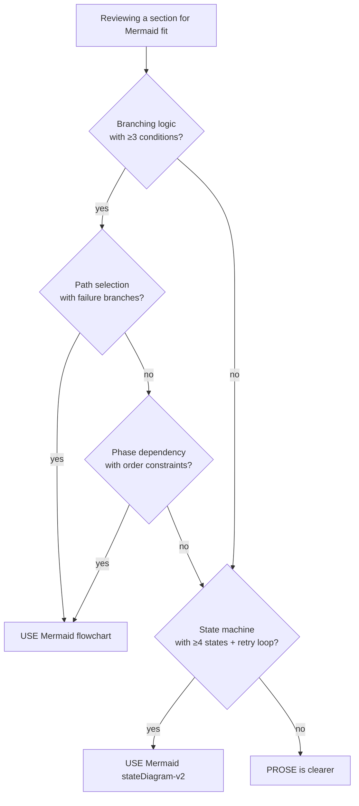

# Mermaid Usage Guidelines

When and how to use Mermaid diagrams in domain-team skills. Grounded
in the v4.18.5 empirical demonstration (3 conversions across
copywriting-team + skill-team).

## Primary Sources

- v4.18.5 demonstrations (see §Reference Examples below)
- Observed patterns across domain-team protocols and gates
- Mermaid official spec: https://mermaid.js.org/

## Core Finding

Mermaid **adds clarity** to branching logic but **does not reduce
token or line count** when added alongside explanatory prose. The
value is in **eliminating prose ambiguity** ("if we consider..." →
explicit branches), not compression.

**Decision criterion**: use Mermaid when prose would have ≥3 branch
conditions OR ≥4 state transitions. Below that threshold, prose is
clearer and cheaper.

## When to Use Mermaid (STRONG candidates)

- **Multi-condition decision trees**: framework selection
  (word-count × Schwartz-level × tone-exclusion), protocol routing,
  maestro selection
- **State machines with retry loops**: gate verdict handling
  (PASS / PASS_WITH_NOTES → auto-revise / NEEDS_REVISION → escalate)
- **Multi-path routing with failure branches**: retrieval paths
  (Path A-1 WebSearch vs Path A-2 parametric + failure handling)
- **Phase-dependency diagrams**: where Phase 1 → Phase 2 order is
  load-bearing and the narrative prose would obscure it
- **Cross-cutting flows touching 3+ agents/files**: main → worker →
  evaluator → gate handoffs

## When NOT to Use Mermaid

- **Primary Sources bibliographies** — prose with citations is denser
- **Anti-Patterns requiring why-explanation** — Mermaid nodes can't
  hold nuanced "because X would break Y" reasoning
- **Content corpora** — brand canonical copy, author voice profiles,
  example quotes belong in prose
- **Philosophy / tradition prose** — Anglo Ogilvy, JP 余韻 etc.
  cannot be diagrammed without losing meaning
- **Already-clean tables** — don't convert a 2-axis table to Mermaid;
  tables win for that shape
- **Single-line conditionals** — "if X then Y" is clearer as prose

## Mermaid Type Selection

| Type | Use for | Example in repo |
|------|---------|----------------|
| `flowchart TD` | Decision trees, routing | `write-long-form-copy.md §Phase 1` |
| `stateDiagram-v2` | State machines with retry loops | `gate-system.md §Verdict State Machine` |
| `sequenceDiagram` | Multi-agent interaction (rare) | — |

Avoid:
- `flowchart LR` (horizontal) — usually worse readability for skill contexts
- `classDiagram` — not a skill concern
- `gantt` — timelines rarely needed in skill design
- `pie` / `journey` — decorative, not structural

## Syntax Conventions (team-wide)

- **Labels with spaces**: double-quote or use brackets directly
  - Good: `["Phase 1: Framework Selection"]`
  - Bad: `[Phase 1: Framework Selection]` (may parse incorrectly)
- **Line breaks in labels**: ` ` for 2-line nodes (keep labels
  under 40 chars per line)
- **Guard / decision nodes**: diamond shape `{"condition?"}`
  (end with `?` for decisions)
- **Terminator nodes**: `[*]` in `stateDiagram-v2`
- **Edge labels**: always label non-trivial transitions
  (`-- "yes"/"no"` for decisions, `-- "state trigger"` for transitions)
- **Node count**: keep ≤15-20 per diagram; if more, split or
  reconsider whether Mermaid is right

## Integration with 4-Tier Gate System

Domain-team skills use the SELF / MUST / SHOULD / MAY tier system.
Mermaid interacts with this as follows:

- **SELF check**: Mermaid is optional for self-audit. If your SELF
  check has a simple 3-5 step flow, prose is fine. If it branches
  (e.g., "if output is code → X; if output is docs → Y"), consider
  Mermaid.
- **MUST / SHOULD gates**: **USE the shared Verdict State Machine**
  from `gate-system.md`. Do NOT duplicate the verdict logic
  (PASS / PASS_WITH_NOTES / NEEDS_REVISION) in each gate file.
  Reference the canonical state machine.
- **Auto-revise loops**: always show the retry cap (2-3 rounds) in
  any state diagram showing auto-revise behavior. Without the cap
  the diagram implies infinite retries.
- **Worker/evaluator flow**: if your skill has complex worker → 
  evaluator handoff (multi-stage), a `sequenceDiagram` can clarify,
  but only when the prose becomes "main agent launches X, then if Y
  launches Z, unless W" — below that complexity, prose is clearer.

## Reference Examples (v4.18.5 demonstrations)

Three canonical examples to pattern-match against:

1. **Decision tree** — multi-axis selection:
   `copywriting-team/protocols/write-long-form-copy.md` §Phase 1
   Framework Selection.
   Shape: word-count band × Schwartz level × tone exclusion →
   framework choice.

2. **Routing flowchart** — path selection with failure branches:
   `copywriting-team/protocols/copy-neta-injection.md` §Phase A.
   Shape: source-type preference → Path A-1 / A-2 / merge + failure
   handling per path.

3. **State machine** — verdict transitions with retry:
   `skill-team/standards/gate-system.md` §Verdict State Machine.
   Shape: 4 verdicts × auto-revise loop × retry cap × escalation.

Use these as templates when your decision matches their shape.

## Anti-Patterns

- **Forcing Mermaid where prose is natural** — "Phase 1, then Phase 2,
  then Phase 3" does not need a diagram. A numbered list is better.
- **Diagrams so complex they need prose explanation** — if readers
  need to read 3 paragraphs to understand the diagram, the diagram
  isn't doing its job. Simplify or split.
- **Mermaid with >20 nodes** — becomes unreadable for both humans
  and LLMs. Split into 2 smaller diagrams or revert to prose.
- **Missing edge labels on decision branches** — `-- yes` / `-- no`
  are minimum; complex transitions need descriptive labels.
- **Storing canonical content inside Mermaid nodes** — quotes,
  citations, brand copy belong in prose. Nodes are for flow concepts,
  not content.
- **Duplicate state machines across gate files** — reference the
  canonical `gate-system.md §Verdict State Machine` instead.
- **Converting tables to Mermaid** — if the information is natively
  rows × columns, keep it as a table.
