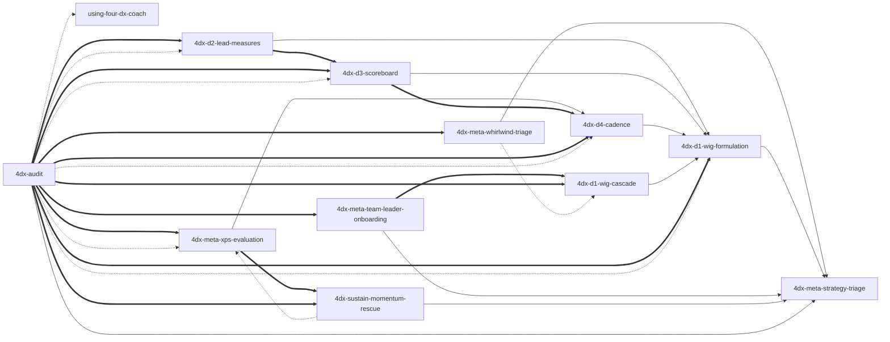

# four-dx-coach — Skill Index

> Distilled by `tsundoku:book-distill` (RIA-TV++ pipeline). **12** skills total in **v0.8.0 dual-mode architecture** — 1 plugin router (`using-four-dx-coach`) + 10 dual-mode topic skills (5 multi-file scope-flex + 5 single-file scope-specific; every topic skill ships `protocols/coach-mode.md` for Socratic dialogue AND `protocols/audit-mode.md` for single-layer artifact synthesis) + 1 cross-layer aggregator (`4dx-audit`, reserved for multi-artifact spanning ≥2 D-layers OR layer-unknown failures). Source distillation 2026-04-29 / 2026-04-30; **Plan U merge 2026-04-30** consolidated 20 atomic + 5 topic-routers into 5 multi-file scope-flex skills (each bundles 2-4 internal protocols), keeping 5 single-file skills that the source book treats as single-scope. **v0.7.0 (2026-04-30)** added consultant-mode `4dx-audit` entry point for artifact-rich starts. **v0.8.0 (2026-04-30)** introduced dual-mode topic skills (every topic gains its own audit-mode for single-layer synthesis) and repositioned `4dx-audit` as the cross-layer aggregator (multi-artifact only). Industry grounding (`references/industry-grounding.md` + `### Industry-experience addendum`) preserved in every multi-file and single-file skill.

## Plugin metadata

- **Source book**: *The 4 Disciplines of Execution* (2nd ed., 2021) — Chris McChesney, Sean Covey, Jim Huling, Scott Thele, Beverly Walker; Simon & Schuster
- **One-line thesis**: Strategic goals that require behavioral change die under the daily operational "whirlwind" unless leaders install a four-step operating system — narrow focus to one Wildly Important Goal, act on a few influenceable lead measures, keep a players-style scoreboard, and run a weekly cadence of peer commitments — applied as a **matched set, not a menu**.
- **Scope statement**: This plugin covers three actor scopes — **personal** (solo individual coaching), **team-leader** (manager / leader-of-team installation + cadence + audit), and **team-member** (individual contributor inside someone else's 4DX cadence). Enterprise / multi-team rollout (book chapters 6-10 — Leader-of-Leaders) is out of scope; route to the book directly.
- **Source language**: English; trigger phrasings multilingual (EN / JP / zh-TW).
- **Architecture (v0.8.0 dual-mode)**: 12 skills in three categories — 1 plugin router (`using-four-dx-coach`, cold-start dispatcher), 10 dual-mode topic skills (5 multi-file **scope-flex** with auto-Socratic scope detection + 5 single-file **scope-specific**; every topic skill ships `protocols/coach-mode.md` AND `protocols/audit-mode.md` for the same layer), 1 cross-layer aggregator (`4dx-audit`, multi-artifact only when ≥2 D-layers are involved OR the broken layer is unknown). Single-layer audits go to the topic skill's own audit-mode, not to the aggregator.

---

## Skills by category

### 1. Entry points (2)

Two doors into the plugin — pick by what you have on hand.

| Slug | Role | Description |
|---|---|---|
| [`using-four-dx-coach`](./skills/using-four-dx-coach/SKILL.md) | Router | Cold-start / cross-topic / out-of-4DX dispatcher. Triages by scope (personal / team-leader / team-member), picks coach-mode vs audit-mode based on whether the user has artifacts, defers to topic skills for in-topic disambiguation; declines if 4DX doesn't fit (habit-stacking / OKR / agile / burnout). |
| [`4dx-audit`](./skills/4dx-audit/SKILL.md) | Cross-layer aggregator | **Multi-artifact only**: fires when artifacts span ≥2 of the 5 D-layers OR user cannot name which layer is broken. Maps content to 4DX 5-layer model, diagnoses per-layer status (well-formed / malformed / absent / wrong-shape), surfaces cross-layer sequencing gaps, outputs prioritized recommendations routing back to topic-skill audit-mode / coach-mode. **Single-layer audit goes to the topic skill's own audit-mode**, not to this aggregator. |

### 2. Multi-file scope-flex topic skills (5) — dual-mode

Each multi-file skill carries one `SKILL.md` orchestrator + scope-variant protocol files (`personal-*.md` / `team-*.md` / `member-*.md`) for **coach mode** + a single `audit-mode.md` for **single-layer audit mode**. The orchestrator self-routes via internal scope disambiguation when needed. Industry grounding lives in `references/industry-grounding.md`; book-strict standards in `standards/`.

| Slug | Topic | Coach-mode scope variants | Audit-mode |
|---|---|---|---|
| [`4dx-meta-strategy-triage`](./skills/4dx-meta-strategy-triage/SKILL.md) | Pre-D1 fit gate (6-verdict triage: APPLICABLE / habit / portfolio-bet / emergency / creative / no-time-sovereignty) | `personal-mode.md`, `team-mode.md` | `audit-mode.md` |
| [`4dx-d1-wig-formulation`](./skills/4dx-d1-wig-formulation/SKILL.md) | Write / select / decode a *From X to Y by When* WIG | `personal-define.md`, `team-select.md`, `member-comprehend.md` | `audit-mode.md` |
| [`4dx-d2-lead-measures`](./skills/4dx-d2-lead-measures/SKILL.md) | Discover / facilitate / map sphere-of-influence on lead measures (predictive AND influenceable) | `personal-discover.md`, `team-facilitate.md`, `member-influence.md` | `audit-mode.md` |
| [`4dx-d3-scoreboard`](./skills/4dx-d3-scoreboard/SKILL.md) | Design / facilitate / read a players' scoreboard (≤4 elements, 5-second test) | `personal-design.md`, `team-lead-design.md`, `member-read.md` | `audit-mode.md` |
| [`4dx-d4-cadence`](./skills/4dx-d4-cadence/SKILL.md) | Run / facilitate / prep / debrief the weekly WIG Session (Account → Review → Plan) | `solo-session.md`, `team-leader-session.md`, `member-prep.md`, `member-debrief.md` | `audit-mode.md` |

### 3. Single-file scope-specific topic skills (5) — dual-mode where applicable

These topics live in one scope only — the source book has no cross-scope variant. v0.8.0 added `protocols/coach-mode.md` + `protocols/audit-mode.md` to topics where artifact-rich starts are common (whirlwind-triage, wig-cascade, leader-onboarding); `xps-evaluation` and `sustain-momentum-rescue` are inherently audit-shaped already (the skill itself IS the diagnostic — no separate audit-mode protocol needed).

| Slug | Scope | Coach-mode | Audit-mode | Role |
|---|---|---|---|---|
| [`4dx-meta-whirlwind-triage`](./skills/4dx-meta-whirlwind-triage/SKILL.md) | Personal | `protocols/coach-mode.md` | `protocols/audit-mode.md` | 7-day time audit; surface 80/20 BAU-vs-WIG split; protect ~20% slot. |
| [`4dx-d1-wig-cascade`](./skills/4dx-d1-wig-cascade/SKILL.md) | Team-leader | `protocols/coach-mode.md` | `protocols/audit-mode.md` | Translate Primary WIG into Battle WIGs (single-tier cascade — Targets-not-Plans). Multi-team-only concept. |
| [`4dx-meta-team-leader-onboarding`](./skills/4dx-meta-team-leader-onboarding/SKILL.md) | Team-leader | `protocols/coach-mode.md` | `protocols/audit-mode.md` | Get direct-report leaders bought in (commitment vs compliance). |
| [`4dx-meta-xps-evaluation`](./skills/4dx-meta-xps-evaluation/SKILL.md) | Team-leader | (audit-shaped) | (intrinsic) | Post-quarter XPS audit (0-4 scale; C1 cadence / C2 commitment / C3 leads / C4 scoreboard) — the skill itself IS the audit. |
| [`4dx-sustain-momentum-rescue`](./skills/4dx-sustain-momentum-rescue/SKILL.md) | Personal | (diagnostic) | (intrinsic) | Diagnose where the 4-discipline stack broke and route to the matching restart — the skill itself IS the diagnostic. |

---

## Reference graph

**Legend**:
- `-->` solid arrow — `depends-on` (A presupposes B)
- `===>` thick arrow — `composes-with` (typically used together; e.g. cross-layer audit routes into single-layer audit-mode)
- `-.->` dotted arrow — `contrasts-with` (alternative-choice; same domain, different scope / phase / mode)

Edge count: **29** (10 depends-on + 13 composes-with + 6 contrasts-with). v0.8.0 delta vs v0.7.0: kept all v0.7.0 edges; added 5 contrasts-with edges to mark the cross-layer-aggregator vs single-layer-audit-mode distinction (single-layer audits go to the topic skill's audit-mode, not the aggregator). Plugin-router edges (1 → 10) intentionally omitted — the router defers to every topical skill. Audit's composes-with edges are explicit because the audit's value *is* the routing roadmap.

(Node labels are English skill slugs for graph stability across languages.)

**Topology notes**:

- **`4dx-meta-strategy-triage` is the universal pre-gate** — every multi-file topical skill chain begins here in the personal walk-through; team-leader and team-member chains also pass through it before scope-specific specialization.
- **`4dx-d1-wig-formulation` is the formulation hub** — D2 / D3 / D4 / cascade all depend on a well-formed WIG. Inside the multi-file skill, `personal-define.md` / `team-select.md` / `member-comprehend.md` share the same X-Y-When grammar.
- **`4dx-d4-cadence` is the cross-scope cadence node** — solo / team-leader / member protocols all live inside the same multi-file skill so the agent can switch role without leaving the cadence topic.
- **`xps-evaluation` and `momentum-rescue` are the matched diagnostic pair** — leader-side audit vs solo-side rescue. Both run *after* a cadence has been established and stress-tested. They contrast across scope (team vs solo).
- **`4dx-audit` is the cross-layer aggregator (v0.8.0 reposition)** — it is NOT the only audit skill. v0.8.0 made every topic skill dual-mode (each ships its own `audit-mode.md` for single-layer synthesis at that layer). `4dx-audit` is reserved for cases the topic skills cannot own: artifacts spanning ≥2 D-layers OR layer-unknown failures. It *contrasts-with* topic-skill audit-mode (broader scope, different responsibility) and *composes-with* every topic skill because it routes to them after cross-layer diagnosis. It is broader than `xps-evaluation` (5-layer audit including artifact-quality, not just 0-4 score on running 4DX).
- **Plan U merge**: 5 multi-file scope-flex skills replaced 15 atomic + 5 topic-routers, reducing surface area while preserving every protocol. 5 single-file keepers retained because the book treats those topics as single-scope. **v0.7.0 (2026-04-30) added `4dx-audit` as the consultant-mode entry sibling**. **v0.8.0 (2026-04-30) introduced dual-mode topic skills** (every topic gains its own audit-mode for single-layer synthesis) **and repositioned `4dx-audit` as the cross-layer aggregator** — eliminating the v0.7.0 over-broad-scope ambiguity (the universal aggregator was wrong-shape for single-layer audits, which now have depth-appropriate per-topic audit-mode).

---

## Recommended progression by scope

### Solo user (personal — 7 steps)

1. `4dx-meta-strategy-triage` (→ enter `personal-mode.md`)
2. `4dx-meta-whirlwind-triage` — protect a ~20% WIG slot via 7-day audit.
3. `4dx-d1-wig-formulation` (→ `personal-define.md`)
4. `4dx-d2-lead-measures` (→ `personal-discover.md`)
5. `4dx-d3-scoreboard` (→ `personal-design.md`)
6. `4dx-d4-cadence` (→ `solo-session.md`)
7. `4dx-sustain-momentum-rescue` — load on demand when the cadence breaks.

### Team leader (5 steps)

1. `4dx-meta-strategy-triage` (→ `team-mode.md`)
2. `4dx-d1-wig-formulation` (→ `team-select.md`) and / or `4dx-d1-wig-cascade` if multi-tier.
3. `4dx-meta-team-leader-onboarding` — get direct-report leaders bought in.
4. `4dx-d4-cadence` (→ `team-leader-session.md`) — facilitate the live cadence.
5. `4dx-meta-xps-evaluation` — post-quarter audit; routes back to the broken layer.

### Team member (3 steps weekly loop)

1. `4dx-d1-wig-formulation` (→ `member-comprehend.md`) — orientation (one-time per quarter / per WIG change).
2. `4dx-d4-cadence` (→ `member-prep.md`) — before each weekly session.
3. `4dx-d4-cadence` (→ `member-debrief.md`) — after each weekly session; closes the loop.

---

## Cross-scope routing matrix

The plugin router (`using-four-dx-coach`) uses scope signals in user phrasing to dispatch. Multi-file skills then self-route to the correct internal protocol via a one-question Socratic check.

| User signal | Likely scope | First skill to load | Internal protocol |
|---|---|---|---|
| "Strategy doc + OKR + dashboard + meeting notes — audit 4DX" (≥2 layers) | Any (cross-layer) | `4dx-audit` | (cross-layer aggregator) |
| "I don't know which layer is broken — whole picture" | Any (cross-layer) | `4dx-audit` | (cross-layer aggregator) |
| "Here's our WIG only — diagnose" | Any | `4dx-d1-wig-formulation` | `audit-mode.md` |
| "Here's our lead-measure list only — diagnose" | Any | `4dx-d2-lead-measures` | `audit-mode.md` |
| "Here's our scoreboard / KPI dashboard only — diagnose" | Any | `4dx-d3-scoreboard` | `audit-mode.md` |
| "Here's our WIG-Session log only — diagnose" | Any | `4dx-d4-cadence` | `audit-mode.md` |
| "Here's our cascade tree only — diagnose" | Team-leader | `4dx-d1-wig-cascade` | `audit-mode.md` |
| "Should we use 4DX? Here's our memo / context" | Any | `4dx-meta-strategy-triage` | `audit-mode.md` |
| "Here's my 7-day time log — capacity audit" | Personal | `4dx-meta-whirlwind-triage` | `audit-mode.md` |
| "Here's my leader-onboarding artifacts — diagnose buy-in" | Team-leader | `4dx-meta-team-leader-onboarding` | `audit-mode.md` |
| "*my* goal / *I* want / personal habit" | Personal | `4dx-meta-strategy-triage` | `personal-mode.md` (coach) |
| "should *I* use 4DX for X" | Personal (gate) | `4dx-meta-strategy-triage` | `personal-mode.md` (coach) |
| "*my team* / *we* / I'm a manager / 部下 / 下屬" | Team-leader | `4dx-meta-strategy-triage` | `team-mode.md` (coach) |
| "cascade / split into sub-teams / Battle WIG" (no artifact) | Team-leader (multi-tier) | `4dx-d1-wig-cascade` | `coach-mode.md` |
| "post-quarter audit / XPS / why is execution stalling" | Team-leader | `4dx-meta-xps-evaluation` | (single-file, audit-shaped) |
| "*my* team has a WIG, what does it mean for me" | Team-member | `4dx-d1-wig-formulation` | `member-comprehend.md` (coach) |
| "what do I say in tomorrow's WIG Session" | Team-member | `4dx-d4-cadence` | `member-prep.md` (coach) |
| "I missed last week's commitment, what now" | Team-member | `4dx-d4-cadence` | `member-debrief.md` (coach) |
| "the cadence broke / I gave up / momentum died" (solo) | Personal | `4dx-sustain-momentum-rescue` | (single-file, diagnostic) |
| Enterprise rollout / cascading across departments | OUT OF SCOPE | book chapters 6-10 directly | — |
| Habit / OKR / GTD / atomic-habits / pure creative | OUT OF SCOPE | decline; recommend fitter framework | — |

---

## Provenance

- Source EPUB: 9781982156992 (Simon & Schuster, 2021 2nd ed.)
- Chapter MD path: `~/.tsundoku/cache/markdown/The-4-Disciplines-of-Execution/`
- Distillation cache: `~/.tsundoku/cache/distilled/The-4-Disciplines-of-Execution/`
- Pipeline: `tsundoku:book-distill` (RIA-TV++ — Adler analytical reading + verification triplet)
- Plan U merge audit: 26 → 11 skills, 2026-04-30
- v0.7.0 add: 11 → 12 skills (`4dx-audit` consultant-mode entry), 2026-04-30
- v0.8.0 reposition: dual-mode topic skills (every topic gains `protocols/audit-mode.md`) + `4dx-audit` narrowed to cross-layer aggregator, 2026-04-30
- See [`ATTRIBUTION.md`](./ATTRIBUTION.md) for upstream credits.
