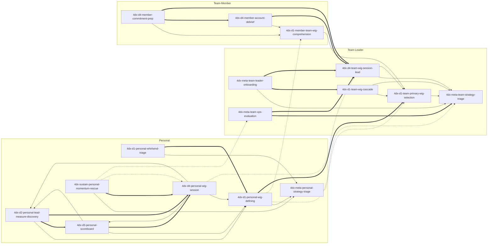

# four-dx-coach — Skill Index

> Distilled by `tsundoku:book-distill` (RIA-TV++ pipeline). **26** skills total: 7 personal + 8 team-leader + 5 team-member + 5 topic-routers + 1 plugin router. **Full 3-scope coverage of D1-D4** (each discipline has personal / team-leader / team-member variants where applicable). Distillation extended 2026-04-29 (team / member scopes); topic-routers added 2026-04-30; **all 20 atomic skills industry-grounded 2026-04-30** (each carries `references/industry-grounding.md` + `### Industry-experience addendum` in Boundary); **D2/D3 scope symmetry added 2026-04-30** (4 new atomic + 2 new topic-routers).

## Plugin metadata

- **Source book**: *The 4 Disciplines of Execution* (2nd ed., 2021) — Chris McChesney, Sean Covey, Jim Huling, Scott Thele, Beverly Walker; Simon & Schuster
- **One-line thesis**: Strategic goals that require behavioral change die under the daily operational "whirlwind" unless leaders install a four-step operating system — narrow focus to one Wildly Important Goal, act on a few influenceable lead measures, keep a players-style scoreboard, and run a weekly cadence of peer commitments — applied as a **matched set, not a menu**.
- **Scope statement**: This plugin covers three actor scopes — **personal** (solo individual coaching), **team-leader** (manager / leader-of-team installation + cadence + audit), and **team-member** (individual contributor inside someone else's 4DX cadence). Enterprise / multi-team rollout (book chapters 6-10 — Leader-of-Leaders) is out of scope; route to the book directly.
- **Source language**: English; trigger phrasings multilingual (EN / JP / zh-TW).

---

## Skills by scope group

### Plugin router (cold-start entry point)

| Slug | Role |
|---|---|
| [`using-four-dx-coach`](./skills/using-four-dx-coach/SKILL.md) | Cold-start / cross-topic / out-of-4DX dispatcher across all 16 atomic skills. Defers to topic-routers when topic is clear but scope ambiguous. |

### Topic-routers (mid-flow disambiguation — 3 skills)

| Slug | Routes between | When |
|---|---|---|
| [`4dx-meta-strategy-triage`](./skills/4dx-meta-strategy-triage/SKILL.md) | personal vs team strategy-triage | "Should X use 4DX?" — actor unclear |
| [`4dx-d1-wig-formulation`](./skills/4dx-d1-wig-formulation/SKILL.md) | personal-define / team-select / member-comprehend | WIG-formulation query — scope + verb unclear |
| [`4dx-d4-cadence`](./skills/4dx-d4-cadence/SKILL.md) | solo-session / team-lead / member-prep / member-debrief | WIG-Session / weekly-cadence — role + timing unclear |

### Personal (solo coach scope — 7 skills)

| Slug | Role |
|---|---|
| [`4dx-meta-personal-strategy-triage`](./skills/4dx-meta-personal-strategy-triage/SKILL.md) | Pre-D1 fit gate: 6-verdict triage (APPLICABLE / habit / portfolio-bet / emergency / creative / no-time-sovereignty). |
| [`4dx-d1-personal-whirlwind-triage`](./skills/4dx-d1-personal-whirlwind-triage/SKILL.md) | 7-day time audit; surface 80/20 BAU-vs-WIG split; protect ~20% slot. |
| [`4dx-d1-personal-wig-defining`](./skills/4dx-d1-personal-wig-defining/SKILL.md) | Coach the user to one *From X to Y by When* WIG (project-as-WIG variant). |
| [`4dx-d2-personal-lead-measure-discovery`](./skills/4dx-d2-personal-lead-measure-discovery/SKILL.md) | Discover 2-3 lead measures that are BOTH predictive AND influenceable. |
| [`4dx-d3-personal-scoreboard`](./skills/4dx-d3-personal-scoreboard/SKILL.md) | Glance-readable players' scoreboard (≤4 elements; lead+lag+pacing; 5-second test). |
| [`4dx-d4-personal-wig-session`](./skills/4dx-d4-personal-wig-session/SKILL.md) | 20-30 min weekly WIG Session (Account → Review → Plan); agent as peer-witness. |
| [`4dx-sustain-personal-momentum-rescue`](./skills/4dx-sustain-personal-momentum-rescue/SKILL.md) | Diagnose where the 4-discipline stack broke and route to the matching restart. |

### Team-leader (manager-of-team scope — 6 skills)

| Slug | Role |
|---|---|
| [`4dx-meta-team-strategy-triage`](./skills/4dx-meta-team-strategy-triage/SKILL.md) | Team-level fit gate: TEAM-APPLICABLE vs single-team anti-patterns. |
| [`4dx-d1-team-primary-wig-selection`](./skills/4dx-d1-team-primary-wig-selection/SKILL.md) | Choose the team's Primary WIG (org-level *From X to Y by When*). |
| [`4dx-d1-team-wig-cascade`](./skills/4dx-d1-team-wig-cascade/SKILL.md) | Translate Primary WIG into Battle WIGs for sub-teams (single-tier cascade). |
| [`4dx-meta-team-leader-onboarding`](./skills/4dx-meta-team-leader-onboarding/SKILL.md) | Get direct-report leaders bought in; social precondition for cascade. |
| [`4dx-d4-team-wig-session-lead`](./skills/4dx-d4-team-wig-session-lead/SKILL.md) | Facilitate the team's weekly WIG Session as leader (vs solo agent-peer). |
| [`4dx-meta-team-xps-evaluation`](./skills/4dx-meta-team-xps-evaluation/SKILL.md) | Post-quarter XPS audit (0-4 scale; C1 cadence / C2 commitment / C3 leads / C4 scoreboard). |

### Team-member (IC inside someone else's cadence — 3 skills)

| Slug | Role |
|---|---|
| [`4dx-d1-member-team-wig-comprehension`](./skills/4dx-d1-member-team-wig-comprehension/SKILL.md) | Member orientation: understand the inherited team WIG + own personal slice. |
| [`4dx-d4-member-commitment-prep`](./skills/4dx-d4-member-commitment-prep/SKILL.md) | Prep what to commit to *before* walking into the team WIG Session. |
| [`4dx-d4-member-account-debrief`](./skills/4dx-d4-member-account-debrief/SKILL.md) | Debrief the past commitment *after* the session (close weekly loop). |

---

## Reference graph

**Legend**:
- `-->` solid arrow — `depends-on` (A presupposes B)
- `===>` thick arrow — `composes-with` (typically used together)
- `-.->` dotted arrow — `contrasts-with` (alternative-choice; same domain, different scope/phase)

(Node labels are English skill slugs for graph stability across languages.)

**Topology notes**:

- **Three parallel scope columns**, joined by 6 cross-scope edges. Personal column is the deepest (7 nodes, single linear backbone via WIG). Team-leader column branches (triage → primary-wig + cascade + onboarding + d4 + xps). Member column is the shortest chain (comprehension → prep / debrief).
- **`4dx-d1-personal-wig-defining` is the X→Y→When formulation hub** — both the team selection skill (composes-with) and the member comprehension skill (contrasts-with) reference it. All three D1 skills share the same form-grammar.
- **`4dx-d4-team-wig-session-lead` is the cross-scope cadence node** — both member skills (prep + debrief) compose into it; the personal D4 contrasts with it (solo-vs-team facilitation).
- **`xps-evaluation` and `momentum-rescue` are the matched diagnostic pair** across scopes — leader-side audit vs solo-side rescue. Both run *after* a cadence has been established and stress-tested.
- Final relation count: **35 edges** (15 personal-internal + 13 team-internal + 5 member-internal + 6 cross-scope). Within the 20-35 empirical band for a 17-skill plugin.

---

## Recommended progression by scope

### Solo user (personal — 7 steps)

1. `4dx-meta-personal-strategy-triage` — does 4DX even apply?
2. `4dx-d1-personal-whirlwind-triage` — protect a ~20% WIG slot via 7-day audit.
3. `4dx-d1-personal-wig-defining` — write *From X to Y by When*.
4. `4dx-d2-personal-lead-measure-discovery` — find 2-3 predictive + influenceable leads.
5. `4dx-d3-personal-scoreboard` — design the glance-readable artifact.
6. `4dx-d4-personal-wig-session` — run the weekly cadence.
7. `4dx-sustain-personal-momentum-rescue` — load on demand when the cadence breaks.

### Team leader (5-stage)

1. `4dx-meta-team-strategy-triage` — team fit gate.
2. `4dx-d1-team-primary-wig-selection` (and / or `4dx-d1-team-wig-cascade` if multi-tier).
3. `4dx-meta-team-leader-onboarding` — get direct-report leaders bought in.
4. `4dx-d4-team-wig-session-lead` — facilitate the live cadence.
5. `4dx-meta-team-xps-evaluation` — post-quarter audit; routes back to the broken layer.

### Team member (3-stage weekly loop)

1. `4dx-d1-member-team-wig-comprehension` — orientation (one-time per quarter / per WIG change).
2. `4dx-d4-member-commitment-prep` — before each weekly session.
3. `4dx-d4-member-account-debrief` — after each weekly session; closes the loop and feeds next prep.

---

## Cross-scope routing matrix

The router (`using-four-dx-coach`) uses scope signals in user phrasing to dispatch. Quick heuristics:

| User signal | Likely scope | First skill to load |
|---|---|---|
| "*my* goal / *I* want / personal habit" | Personal | `4dx-meta-personal-strategy-triage` |
| "should *I* use 4DX for X" | Personal (gate) | `4dx-meta-personal-strategy-triage` |
| "*my team* / *we* / I'm a manager / 部下 / 下屬" | Team-leader | `4dx-meta-team-strategy-triage` |
| "cascade / split into sub-teams / Battle WIG" | Team-leader (multi-tier) | `4dx-d1-team-wig-cascade` |
| "post-quarter audit / XPS / why is execution stalling" (leader) | Team-leader | `4dx-meta-team-xps-evaluation` |
| "*my* team has a WIG, what do *I* commit to" | Team-member | `4dx-d1-member-team-wig-comprehension` |
| "what do I say in tomorrow's WIG session" | Team-member | `4dx-d4-member-commitment-prep` |
| "I missed last week's commitment, what now" | Team-member | `4dx-d4-member-account-debrief` |
| "the cadence broke / I gave up / momentum died" (solo) | Personal | `4dx-sustain-personal-momentum-rescue` |
| Enterprise rollout / cascading across departments | OUT OF SCOPE | book chapters 6-10 directly |
| Habit / OKR / GTD / atomic-habits / pure creative | OUT OF SCOPE | decline; recommend fitter framework |

**Scope-mismatch flags**:
- A solo user asking for `4dx-d4-team-wig-session-lead` → they probably want `4dx-d4-personal-wig-session` instead (no team to lead).
- A team member asking for `4dx-d1-personal-wig-defining` → the team WIG is *inherited*, not picked; route to `4dx-d1-member-team-wig-comprehension`.
- A leader asking only "rescue me" without naming team → may be solo-shaped; route to `4dx-sustain-personal-momentum-rescue` (diagnose own practice before the team's).

---

## Provenance

- Source EPUB: 9781982156992 (Simon & Schuster, 2021 2nd ed.)
- Chapter MD path: `~/.tsundoku/cache/markdown/The-4-Disciplines-of-Execution/`
- Distillation cache: `~/.tsundoku/cache/distilled/The-4-Disciplines-of-Execution/`
- Pipeline: `tsundoku:book-distill` (RIA-TV++ — Adler analytical reading + verification triplet)
- See [`ATTRIBUTION.md`](./ATTRIBUTION.md) for upstream credits.
