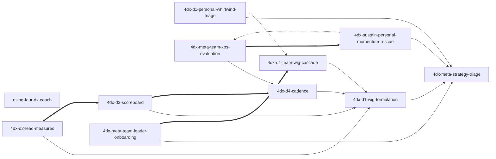

# four-dx-coach — Skill Index

> Distilled by `tsundoku:book-distill` (RIA-TV++ pipeline). **11** skills total: 1 plugin router + 5 multi-file scope-flex skills + 5 single-file scope-specific skills. Source distillation 2026-04-29 / 2026-04-30; **Plan U merge 2026-04-30** consolidated 20 atomic + 5 topic-routers into 5 multi-file scope-flex skills (each bundles 2-4 internal protocols), keeping 5 single-file skills that the source book treats as single-scope. Industry grounding (`references/industry-grounding.md` + `### Industry-experience addendum`) preserved in every multi-file and single-file skill.

## Plugin metadata

- **Source book**: *The 4 Disciplines of Execution* (2nd ed., 2021) — Chris McChesney, Sean Covey, Jim Huling, Scott Thele, Beverly Walker; Simon & Schuster
- **One-line thesis**: Strategic goals that require behavioral change die under the daily operational "whirlwind" unless leaders install a four-step operating system — narrow focus to one Wildly Important Goal, act on a few influenceable lead measures, keep a players-style scoreboard, and run a weekly cadence of peer commitments — applied as a **matched set, not a menu**.
- **Scope statement**: This plugin covers three actor scopes — **personal** (solo individual coaching), **team-leader** (manager / leader-of-team installation + cadence + audit), and **team-member** (individual contributor inside someone else's 4DX cadence). Enterprise / multi-team rollout (book chapters 6-10 — Leader-of-Leaders) is out of scope; route to the book directly.
- **Source language**: English; trigger phrasings multilingual (EN / JP / zh-TW).
- **Architecture**: 11 skills in three categories — 1 plugin router (cold-start dispatcher), 5 multi-file **scope-flex** skills (one topic, multiple internal scope variants, auto-route via Socratic disambiguation), 5 single-file **scope-specific** skills (book has no cross-scope variant for these topics).

---

## Skills by category

### 1. Plugin router (1)

| Slug | Role |
|---|---|
| [`using-four-dx-coach`](./skills/using-four-dx-coach/SKILL.md) | Cold-start / cross-topic / out-of-4DX dispatcher across the 10 topical skills. Defers to multi-file skills for in-topic disambiguation; declines if 4DX doesn't fit (habit-stacking / OKR / agile / burnout). |

### 2. Multi-file scope-flex skills (5)

Each multi-file skill carries one `SKILL.md` orchestrator + 2-4 protocol files under `protocols/` covering personal / team-leader / team-member variants. The orchestrator self-routes via internal scope disambiguation when needed. Industry grounding lives in `references/industry-grounding.md`; book-strict standards in `standards/`.

| Slug | Topic | Internal protocols |
|---|---|---|
| [`4dx-meta-strategy-triage`](./skills/4dx-meta-strategy-triage/SKILL.md) | Pre-D1 fit gate (6-verdict triage: APPLICABLE / habit / portfolio-bet / emergency / creative / no-time-sovereignty) | `personal-mode.md`, `team-mode.md` |
| [`4dx-d1-wig-formulation`](./skills/4dx-d1-wig-formulation/SKILL.md) | Write / select / decode a *From X to Y by When* WIG | `personal-define.md`, `team-select.md`, `member-comprehend.md` |
| [`4dx-d2-lead-measures`](./skills/4dx-d2-lead-measures/SKILL.md) | Discover / facilitate / map sphere-of-influence on lead measures (predictive AND influenceable) | `personal-discover.md`, `team-facilitate.md`, `member-influence.md` |
| [`4dx-d3-scoreboard`](./skills/4dx-d3-scoreboard/SKILL.md) | Design / facilitate / read a players' scoreboard (≤4 elements, 5-second test) | `personal-design.md`, `team-lead-design.md`, `member-read.md` |
| [`4dx-d4-cadence`](./skills/4dx-d4-cadence/SKILL.md) | Run / facilitate / prep / debrief the weekly WIG Session (Account → Review → Plan) | `solo-session.md`, `team-leader-session.md`, `member-prep.md`, `member-debrief.md` |

### 3. Single-file scope-specific skills (5)

These topics live in one scope only — the source book has no cross-scope variant — so they remain single-file `SKILL.md` skills with no internal `protocols/` split.

| Slug | Scope | Role |
|---|---|---|
| [`4dx-d1-personal-whirlwind-triage`](./skills/4dx-d1-personal-whirlwind-triage/SKILL.md) | Personal | 7-day time audit; surface 80/20 BAU-vs-WIG split; protect ~20% slot. (No team variant — team whirlwind is implicit and addressed in `team-leader-session.md` instead.) |
| [`4dx-d1-team-wig-cascade`](./skills/4dx-d1-team-wig-cascade/SKILL.md) | Team-leader | Translate Primary WIG into Battle WIGs for sub-teams (single-tier cascade — Targets-not-Plans). Multi-team-only concept. |
| [`4dx-meta-team-leader-onboarding`](./skills/4dx-meta-team-leader-onboarding/SKILL.md) | Team-leader | Get direct-report leaders bought in; social precondition for cascade. Commitment vs compliance framing. |
| [`4dx-meta-team-xps-evaluation`](./skills/4dx-meta-team-xps-evaluation/SKILL.md) | Team-leader | Post-quarter XPS audit (0-4 scale; C1 cadence / C2 commitment / C3 leads / C4 scoreboard). |
| [`4dx-sustain-personal-momentum-rescue`](./skills/4dx-sustain-personal-momentum-rescue/SKILL.md) | Personal | Diagnose where the 4-discipline stack broke and route to the matching restart. Currently no team / member variant; team rescue is folded into `meta-team-xps-evaluation`. |

---

## Reference graph

**Legend**:
- `-->` solid arrow — `depends-on` (A presupposes B)
- `===>` thick arrow — `composes-with` (typically used together)
- `-.->` dotted arrow — `contrasts-with` (alternative-choice; same domain, different scope/phase)

Edge count: **13** (9 depends-on + 4 composes-with + 2 contrasts-with). Within the 10-15 empirical band for an 11-skill plugin. Plugin-router edges (1 → 10) intentionally omitted from the diagram — the router defers to every topical skill.

(Node labels are English skill slugs for graph stability across languages.)

**Topology notes**:

- **`4dx-meta-strategy-triage` is the universal pre-gate** — every multi-file topical skill chain begins here in the personal walk-through; team-leader and team-member chains also pass through it before scope-specific specialization.
- **`4dx-d1-wig-formulation` is the formulation hub** — D2 / D3 / D4 / cascade all depend on a well-formed WIG. Inside the multi-file skill, `personal-define.md` / `team-select.md` / `member-comprehend.md` share the same X-Y-When grammar.
- **`4dx-d4-cadence` is the cross-scope cadence node** — solo / team-leader / member protocols all live inside the same multi-file skill so the agent can switch role without leaving the cadence topic.
- **`xps-evaluation` and `momentum-rescue` are the matched diagnostic pair** — leader-side audit vs solo-side rescue. Both run *after* a cadence has been established and stress-tested. They contrast across scope (team vs solo).
- **Plan U merge**: 5 multi-file scope-flex skills replaced 15 atomic + 5 topic-routers, reducing surface area while preserving every protocol. 5 single-file keepers retained because the book treats those topics as single-scope.

---

## Recommended progression by scope

### Solo user (personal — 7 steps)

1. `4dx-meta-strategy-triage` (→ enter `personal-mode.md`)
2. `4dx-d1-personal-whirlwind-triage` — protect a ~20% WIG slot via 7-day audit.
3. `4dx-d1-wig-formulation` (→ `personal-define.md`)
4. `4dx-d2-lead-measures` (→ `personal-discover.md`)
5. `4dx-d3-scoreboard` (→ `personal-design.md`)
6. `4dx-d4-cadence` (→ `solo-session.md`)
7. `4dx-sustain-personal-momentum-rescue` — load on demand when the cadence breaks.

### Team leader (5 steps)

1. `4dx-meta-strategy-triage` (→ `team-mode.md`)
2. `4dx-d1-wig-formulation` (→ `team-select.md`) and / or `4dx-d1-team-wig-cascade` if multi-tier.
3. `4dx-meta-team-leader-onboarding` — get direct-report leaders bought in.
4. `4dx-d4-cadence` (→ `team-leader-session.md`) — facilitate the live cadence.
5. `4dx-meta-team-xps-evaluation` — post-quarter audit; routes back to the broken layer.

### Team member (3 steps weekly loop)

1. `4dx-d1-wig-formulation` (→ `member-comprehend.md`) — orientation (one-time per quarter / per WIG change).
2. `4dx-d4-cadence` (→ `member-prep.md`) — before each weekly session.
3. `4dx-d4-cadence` (→ `member-debrief.md`) — after each weekly session; closes the loop.

---

## Cross-scope routing matrix

The plugin router (`using-four-dx-coach`) uses scope signals in user phrasing to dispatch. Multi-file skills then self-route to the correct internal protocol via a one-question Socratic check.

| User signal | Likely scope | First skill to load | Internal protocol |
|---|---|---|---|
| "*my* goal / *I* want / personal habit" | Personal | `4dx-meta-strategy-triage` | `personal-mode.md` |
| "should *I* use 4DX for X" | Personal (gate) | `4dx-meta-strategy-triage` | `personal-mode.md` |
| "*my team* / *we* / I'm a manager / 部下 / 下屬" | Team-leader | `4dx-meta-strategy-triage` | `team-mode.md` |
| "cascade / split into sub-teams / Battle WIG" | Team-leader (multi-tier) | `4dx-d1-team-wig-cascade` | (single-file) |
| "post-quarter audit / XPS / why is execution stalling" | Team-leader | `4dx-meta-team-xps-evaluation` | (single-file) |
| "*my* team has a WIG, what does it mean for me" | Team-member | `4dx-d1-wig-formulation` | `member-comprehend.md` |
| "what do I say in tomorrow's WIG Session" | Team-member | `4dx-d4-cadence` | `member-prep.md` |
| "I missed last week's commitment, what now" | Team-member | `4dx-d4-cadence` | `member-debrief.md` |
| "the cadence broke / I gave up / momentum died" (solo) | Personal | `4dx-sustain-personal-momentum-rescue` | (single-file) |
| Enterprise rollout / cascading across departments | OUT OF SCOPE | book chapters 6-10 directly | — |
| Habit / OKR / GTD / atomic-habits / pure creative | OUT OF SCOPE | decline; recommend fitter framework | — |

---

## Provenance

- Source EPUB: 9781982156992 (Simon & Schuster, 2021 2nd ed.)
- Chapter MD path: `~/.tsundoku/cache/markdown/The-4-Disciplines-of-Execution/`
- Distillation cache: `~/.tsundoku/cache/distilled/The-4-Disciplines-of-Execution/`
- Pipeline: `tsundoku:book-distill` (RIA-TV++ — Adler analytical reading + verification triplet)
- Plan U merge audit: 26 → 11 skills, 2026-04-30
- See [`ATTRIBUTION.md`](./ATTRIBUTION.md) for upstream credits.
