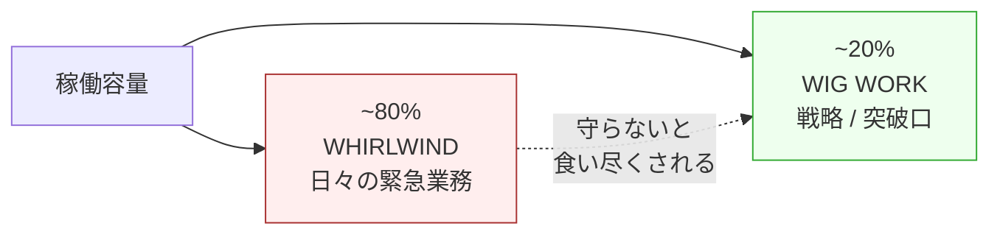
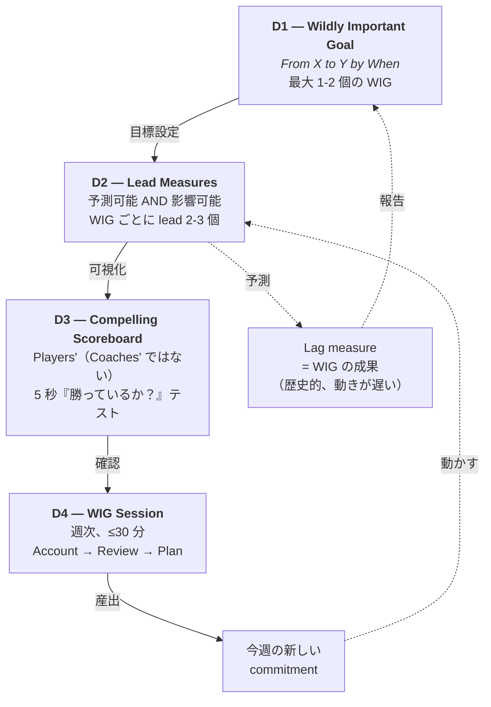
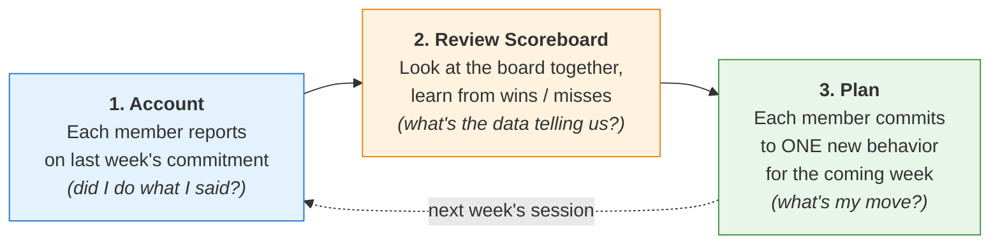
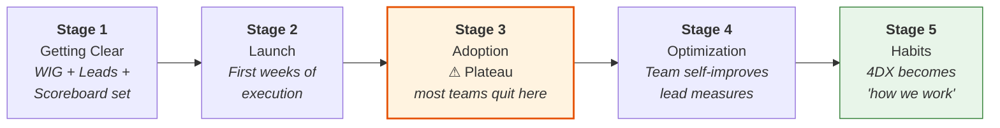

# four-dx-coach

> 『The 4 Disciplines of Execution』のマルチ scope coach —— personal solo・team-leader 主催・team-member 参加の 3 つの scope を全部カバー。Agent は scope によって役割が変わる：solo では peer-witness、leader 相手では consultant、member には personal coach（他人が決めた WIG の中で動く状況のための）。

言語：[English](README.md) | **日本語** | [繁體中文](README.zh-TW.md)

**Version**：0.9.1
**所属**：[monkey-skills](https://github.com/kouko/monkey-skills)
**License**：MIT

## 背景

『The 4 Disciplines of Execution』（McChesney / Covey / Huling / Thele / Walker、第 2 版 2021）は FranklinCovey の consultant chain がまとめた execution methodology で、約 4,000 の client engagement で検証されている。処方：

1. **D1 — Wildly Important Goal に focus**（一つの WIG、`From X to Y by When` 形式）
2. **D2 — Lead measure に行動**（predictive AND influenceable）
3. **D3 — Compelling scoreboard を維持**（players' scoreboard、coach's dashboard ではない）
4. **D4 — Cadence of accountability を構築**（weekly WIG Session、peer commitment）

書籍は基本的に「multi-team rollout を主導する leader」向けに書かれている。このプラグインは書籍がカバーしきれない 2 つの scope に methodology を拡張する：

- **Personal** —— 一人の user が個人目標で 4DX を導入する。Agent が書籍の前提する peer-witness 役を埋める。
- **Team-leader** —— 一つの team の中で 4DX を回す leader（multi-team rollout ではない）。Agent は consultant。
- **Team-member** —— team の contributor で、leader がもう WIG を決めている状況。Agent は「うまく参加する」のを助ける。System を再設計する話ではない。

## 4DX の仕組み（90 秒で理解）

### 実行 gap 問題

戦略目標の多くは「戦略が間違っている」のではなく、**日々の業務（『竜巻 / Whirlwind』）が稼働容量の約 80% を消費し、戦略的な仕事が注意を奪われる**ことで失敗する。4DX は、その小さな戦略 slice（~20%）を守り、予測可能な行動変容に変換する閉ループ system。



### 閉ループ（D1 → D2 → D3 → D4 → D2 へ戻る）



### 週次 cadence —— D4 が実際にやっていること

D4 は実装上もっとも省略されやすい discipline で、これを欠くと D1-D2-D3 は「一回限りの計画」に退化し、数週間で whirlwind に飲まれる。WIG Session は系全体を支える engine であり、毎週固定の 3 ステップ順で進む：



この cycle は意図的に短く（≤30 分）、意図的に反復的。狙いは「戦略立案」ではなく、**個人 commitment が peer に witness される** こと —— それを実行が習慣になるまで毎週繰り返す。

### 各 discipline の役割と典型的な失敗 mode

| Discipline | 中核 idea | 最頻出の失敗 mode |
|---|---|---|
| **D1 — Focus** | WIG は **一つ**（多くて二つ）。*From X to Y by When* 文型で表記。Lag 測定可、deadline 明示。 | 「売上目標を達成するのは仕事であって WIG ではない」。「重要事項」を 5 つ以上並べて結局どれも実行されない。 |
| **D2 — Lead Measures** | **今週できる行動** で lag を予測するものを track。書籍で「最も誤解された discipline」と呼ばれ、実装でも最頻出の失敗点。 | Lag 寄りの「先行指標」（NPS 上昇など）を採用してしまい、週次で動かせないため形骸化。または既存 KPI dashboard を流用する。 |
| **D3 — Scoreboard** | team が自分で作る；可視；一目で「勝っているか」が分かる。Lead + Lag + Pacing line を含む。 | 12 の metrics が並ぶ受動的な dashboard 化、誰も開かない。あるいは name-and-shame の道具になる。 |
| **D4 — Cadence** | 週次 30 分 session：member 全員が先週の commitment を account、scoreboard を review、新しい commitment を Plan。 | Session が 1 時間に伸びる、member が無準備で来る、leader が performance review として運用（commitment ではなく compliance）。 |

### 時間経過で何が起きるか —— 5 段階 progression

4DX は即効性のある手法ではない。原書は team が 5 つの異なる stage を通過することを記録しており、実装失敗の最頻出原因は **Stage 3 で諦めること** —— plateau にぶつかり「効果がなくなった」と判断して、breakthrough の直前で system を放棄する。



Stage 3 で「効いていない」と感じている場合、それは予期された形であり、失敗の signal ではない。Plateau は team member が新しい行動を internalize する期間であり、諦めなければ Stage 4 が自然に続く。Agent の `4dx-sustain-momentum-rescue` skill はこの stage を狙って設計されている。

### 主要語彙（plugin 全体で使用）

- **Lag measure** —— outcome（売上、NPS、retention）。Historical で動きが遅く、今週直接影響できない。
- **Lead measure** —— 行動（週あたりの sales call、code review 提出数、walk-through 実施回数）。動きが速く、直接影響でき、lag を *predict* する。
- **Players' scoreboard** —— team が所有 + 構築；一目読み；lead + lag + pacing line を含む。"Coach's dashboard"（経営層 read-only の 50+ 指標 board）とは別物。
- **WIG Session** —— 週次 accountability ミーティング。**Account → Review → Plan** の順：member が先週の commitment を報告、team が scoreboard の動きを review、member が今週の新しい行動を commit。
- **Whirlwind** —— 稼働容量の約 80% を食う日常業務の緊急度。4DX は除去できないと前提し、~20% を守ることに専念する。

## 二つのモード：coach と audit（v0.8.0 dual-mode architecture）

各 topic skill は **両モードを内蔵** し、専用の protocol ファイルで切り替える。モードは手動で選ばない —— skill の activation signal または router がどちらを load するか判断する。

- **Coach モード**（`protocols/coach-mode.md`）—— Socratic 対話・fit-check 込み・ゼロから step-by-step。断片から始めて*一決断ごとに*方法論を辿りたいときに最適。
- **Audit モード（single-layer）**（`protocols/audit-mode.md`）—— その topic の layer に対応する**単一 artifact** を診断（例：既存 WIG → `4dx-d1-wig-formulation` audit-mode；12-metric dashboard → `4dx-d3-scoreboard` audit-mode；4 週の WIG-Session log → `4dx-d4-cadence` audit-mode）。layer 標準と照合し、修正版 artifact + fix list を出力。
- **`4dx-audit`（cross-layer aggregator）**—— **5 layer のうち ≥2 layer に跨る** artifact がある場合、または layer がどこ壊れたか分からない場合のみ起動。複数 artifact を 5-layer モデルに対応付け、layer ごとに状態を診断、cross-layer の順序ギャップを surface し、対応する topic-skill audit-mode / coach-mode に route。

モードの選び方：

| 手元にあるもの | 使うもの |
|---|---|
| 漠然とした意図（「4DX を使い始めたい」） | `using-four-dx-coach` router → coach モード |
| Stage 特定の質問（「WIG どう書く？」） | Topic skill coach-mode 直接（例：`4dx-d1-wig-formulation`） |
| 1 layer の 1 artifact（「うちの WIG を診断して」） | Topic skill **audit-mode**（例：`4dx-d1-wig-formulation` audit-mode） |
| Scoreboard / cadence log を批評 | Topic skill audit-mode（`4dx-d3-scoreboard` / `4dx-d4-cadence`） |
| ≥2 layer に跨る artifact（戦略 doc + OKR + dashboard + meeting notes） | `4dx-audit` cross-layer aggregator |
| 4DX が壊れたが、どの layer か特定できない | `4dx-audit` cross-layer aggregator |

`4dx-audit` の出力は具体的な topic-skill audit-mode / coach-mode に route される —— roadmap であって、topic skill の代替ではない。Topic-skill audit-mode は単一 layer の深さを担当し、aggregator は cross-layer の幅を担当する。

## Architecture

12 個の skill を 3 種類に分類（v0.8.0）：

- **1 個の plugin router**（`using-four-dx-coach`）—— cold-start / cross-topic / 4DX 圏外 query を捌く dispatcher。
- **10 個の dual-mode topic skill** —— 各 topic skill は `protocols/coach-mode.md`（Socratic walk-through）と `protocols/audit-mode.md`（その layer の単一 artifact を診断）を備える。Multi-file scope-flex（1 topic + 2-4 scope variant × 2 mode）が 5 個、single-file scope-specific（topic で scope locked × 2 mode）が 5 個。Multi-file skill は personal / team-leader / team-member scope を Socratic な 1 問で自動判定し、対応する scope+mode protocol を load。
- **1 個の cross-layer aggregator**（`4dx-audit`）—— ≥2 layer に跨る multi-artifact、または layer 不明の故障のみで起動。5-layer 状態を診断し、対応する topic-skill audit-mode / coach-mode に route。

Topic skill は scope 重複の表面積を縮小しつつ primary-source grounding を完全保持：各 protocol は依然 `### Industry-experience addendum` を備え、parent skill の `references/industry-grounding.md` を共有。Dual-mode 分割（coach vs audit）は、各 4DX layer に「ゼロから組む」path（coach）と「既にあるものを診る」path（audit）の両方が存在することを反映 —— v0.8.0 はこの区別を first-class に格上げし、すべての audit を 1 つの universal aggregator に押し込めるのを止めた。

## Skills（合計 12 個）

### 1. Entry point skill（2）

| Skill | 役割 | 機能 |
|---|---|---|
| [`using-four-dx-coach`](skills/using-four-dx-coach/) | Router | Entry point —— cold-start / cross-topic / 4DX 圏外 query；scope triage（personal / team-leader / team-member）、artifact 有無で coach-mode vs audit-mode を選択、4DX 非適用時は hand-off |
| [`4dx-audit`](skills/4dx-audit/) | Cross-layer aggregator | **≥2 layer に跨る** artifact、または layer 不明の故障のみで起動。複数 artifact を 4DX 5-layer モデル（WIG / Lead / Lag+Scoreboard / Cadence / Substrate）に対応付け、layer ごとに状態を診断、優先順位付き推奨を出力 + 対応する topic-skill audit-mode / coach-mode に route。Single-layer audit は topic skill 自身の audit-mode に渡す |

### 2. Multi-file scope-flex topic skills（5）—— dual-mode

各 skill は内部で Socratic な 1 問で scope を自動判定し、対応する scope+mode protocol を load。各 scope に coach + audit 両モードを用意。

| Skill | Topic | Coach-mode protocols（Socratic） | Audit-mode protocol（single-layer） |
|---|---|---|---|
| [`4dx-meta-strategy-triage`](skills/4dx-meta-strategy-triage/) | Pre-D1 fit gate（6-verdict triage） | `personal-mode.md`、`team-mode.md` | `audit-mode.md` |
| [`4dx-d1-wig-formulation`](skills/4dx-d1-wig-formulation/) | *From X to Y by When* WIG を書く / 選ぶ / 解読する | `personal-define.md`、`team-select.md`、`member-comprehend.md` | `audit-mode.md` |
| [`4dx-d2-lead-measures`](skills/4dx-d2-lead-measures/) | Lead measure を発見 / facilitate / sphere-of-influence をマップ | `personal-discover.md`、`team-facilitate.md`、`member-influence.md` | `audit-mode.md` |
| [`4dx-d3-scoreboard`](skills/4dx-d3-scoreboard/) | Players' scoreboard を design / facilitate / 読む | `personal-design.md`、`team-lead-design.md`、`member-read.md` | `audit-mode.md` |
| [`4dx-d4-cadence`](skills/4dx-d4-cadence/) | Weekly WIG Session を運営 / 主催 / prep / debrief | `solo-session.md`、`team-leader-session.md`、`member-prep.md`、`member-debrief.md` | `audit-mode.md` |

### 3. Single-file scope-specific topic skills（5）—— dual-mode（適用箇所のみ）

書籍に cross-scope 対応 variant が無い topic は single-file のまま保持。v0.8.0 で artifact-rich start が頻出する topic に audit-mode protocol を追加；xps-evaluation と sustain-momentum-rescue は本質的に audit-shaped なので別途 audit-mode 不要。

| Skill | Scope | Coach-mode | Audit-mode | 役割 |
|---|---|---|---|---|
| [`4dx-meta-whirlwind-triage`](skills/4dx-meta-whirlwind-triage/) | Personal | `protocols/coach-mode.md` | `protocols/audit-mode.md` | 7 日間 time audit；BAU vs WIG 衝突を可視化；~20% WIG slot を確保 |
| [`4dx-d1-wig-cascade`](skills/4dx-d1-wig-cascade/) | Team-leader | `protocols/coach-mode.md` | `protocols/audit-mode.md` | Primary WIG を Battle WIG に翻訳（Targets-not-Plans）；multi-team 場面のみ |
| [`4dx-meta-team-leader-onboarding`](skills/4dx-meta-team-leader-onboarding/) | Team-leader | `protocols/coach-mode.md` | `protocols/audit-mode.md` | Direct-report leader の本気の buy-in（commitment vs compliance） |
| [`4dx-meta-xps-evaluation`](skills/4dx-meta-xps-evaluation/) | Team-leader | （audit-shaped） | （intrinsic） | Post-quarter XPS audit（0-4 scale；C1-C4 layer）—— skill 自体が audit |
| [`4dx-sustain-momentum-rescue`](skills/4dx-sustain-momentum-rescue/) | Personal | （diagnostic） | （intrinsic） | 4-discipline stack のどの layer で破綻したかを diagnose し、対応する restart に route —— skill 自体が diagnostic |

## Scope 検出の仕組み

Scope は手動で選ばない。3 通り：

1. **Plugin router**（`using-four-dx-coach`）が query 中の scope signal（「我が team」「joined」「*my own* goal」）を読んで dispatch。
2. **Multi-file scope-flex skill** は flow の冒頭で Socratic な 1 問を投げて曖昧さを解消し、対応 protocol を auto-load —— 手動選択は不要。
3. **Single-file scope-specific skill** は signal が既に scope を制約している場合のみ activate（例：cascade → team-leader、whirlwind triage → personal）。

迷ったらそのまま状況を伝えれば router が判定。

## 使うべき場面

activation signal：

- 「この目標に 4DX 使える？」 / 「Should I use 4DX for X?」 / 「4DX 適合我嗎？」
- 「日常業務に追われて目標に手がつかない」
- 「目標がぼんやりしている / 優先順位が多すぎる」
- 「目標はあるが日々何をすれば結果に繋がるか分からない」
- 「ダッシュボードが複雑すぎて見ない」
- 「毎週の振り返りで進捗を保ちたい」
- 「WIG Session が続かなくなった、どう再開すればいい？」
- 「team の Primary WIG を選びたい / org WIG を cascade したい」
- 「leader を本気で buy-in させるには？表面的な compliance ではなく」
- 「team の WIG Session を主催する」
- 「4DX を回している team に加わった、どう参加する？」
- 「明日の WIG Session 用の commitment を準備したい」

hand-off 対象：

- 多 team への enterprise rollout → 書籍 Part 2（第 6-10 章）を直接読むか、FranklinCovey に相談
- Habit formation → atomic habits / habit stacking が正解
- Portfolio bet / multi-startup founder → OKR か lean experimentation
- ER 医師・消防士など firefighting that *is* strategic work
- 純粋な creative output（novelist / artist）—— Goodhart 効果で lead measure が腐食
- Clinical burnout / depression → professional support、4DX ではない

## Install

```bash
# Claude Code 内
/plugin marketplace add kouko/monkey-skills
/plugin install four-dx-coach@monkey-skills
```

Router skill `using-four-dx-coach` が generic query で activate；個別 skill は自身の signal で activate。

## Industry-grounded boundaries

Topical skill（5 個 multi-file + 5 個 single-file = 10 個 atomic-equivalent）の Boundary section に `### Industry-experience addendum` を備え、書籍以外の academic / regulatory / credentialed-author primary source を引用 —— 書籍の selection bias と member-POV ギャップを補強。各 skill の `references/industry-grounding.md` に検証済 citation を列挙：

- D2 lead-measure-discovery：Goodhart 1975 / Strathern 1997 / CFPB 2016（Wells Fargo）/ VA OIG 2014 / GBI 2011（Atlanta APS）—— Goodhart 失敗事例
- D1 personal-define：Christensen 1997 / March 1991 / Dweck 2006 —— 過集中リスク + exploration vs exploitation
- D3 personal-scoreboard：Tufte 1983 / Few 2006 / Ware 2012 —— 5 秒 test の知覚科学根拠
- D4 solo + team WIG-Session：Rogelberg 2019 / Lencioni 2004 / Edmondson 2012 —— 会議科学の実証
- Member protocols：Edmondson 2018 / Grant 2016 / Meyer 2014 / Pfeffer 2010 / Drucker 1999 / Cialdini 1984 / Eurich 2017 / Wiseman 2010 —— 書籍 leader-POV ギャップ補完
- Team-leader skills：Akao 1991 / Doerr 2018 / Kaplan-Norton 2001 / Ryan-Deci 2017 / Argyris 1991 / Kotter 1996 / Galbraith / Schein / Rumelt / Porter / Mintzberg / Hambrick-Fredrickson / CMMI / McKinsey OHI / Gallup Q12
- Consultant モード（`4dx-audit`）：Block 2011『Flawless Consulting』/ Schein 1999『Process Consultation』/ Maister 2000『The Trusted Advisor』—— consultant-craft posture（artifact から合成、診断してから処方、深い作業へ route）は consulting craft 由来であり 4DX 由来ではない（書籍は dialogue-coaching POV）

Plan U merge 後も 48 件の verified primary-source citation を保持；v0.7.0 で `4dx-audit` 用に consultant-craft 文献を追加。

## 多言語 trigger

Skill の `description` と trigger signal は **English / 日本語 / 繁體中文** に対応 —— 三言語のいずれでも問える。Skill body（Interpretation / Execution / Boundary）は portability のため English で統一。

## 推奨 progression

### Personal（solo）—— ゼロから始める場合

1. `4dx-meta-strategy-triage` → `personal-mode.md` —— 4DX が目標に合うかを確認（or hand-off）
2. `4dx-meta-whirlwind-triage` —— BAU vs WIG 仕事を明確化
3. `4dx-d1-wig-formulation` → `personal-define.md` —— WIG を書く（X → Y → When）
4. `4dx-d2-lead-measures` → `personal-discover.md` —— 2-3 個の lead measure を発見
5. `4dx-d3-scoreboard` → `personal-design.md` —— 一目で分かる scoreboard を design
6. `4dx-d4-cadence` → `solo-session.md` —— weekly cadence を始動
7. `4dx-sustain-momentum-rescue` —— momentum が落ちたら on-demand load

### Team-leader —— ゼロから始める場合

1. `4dx-meta-strategy-triage` → `team-mode.md` —— 4DX が team の進む道か確認
2. `4dx-d1-wig-formulation` → `team-select.md` —— Battles 2x2 で Primary WIG を選定
3. `4dx-d1-wig-cascade` —— Targets-not-Plans で org WIG を team WIG に cascade
4. `4dx-meta-team-leader-onboarding` —— Direct report から commitment（compliance ではなく）を獲得
5. `4dx-d4-cadence` → `team-leader-session.md` —— facilitator として weekly WIG Session を運営
6. `4dx-meta-xps-evaluation` —— team の 4DX 実装を定期的に audit

### Team-member —— 既に 4DX を回している team に加わる場合

1. `4dx-d1-wig-formulation` → `member-comprehend.md` —— 与えられた team WIG を理解
2. `4dx-d4-cadence` → `member-prep.md` —— 次の session 用の commitment を準備
3. `4dx-d4-cadence` → `member-debrief.md` —— session 後で正直に self-account

## 出典

『The 4 Disciplines of Execution』（第 2 版 2021）—— Chris McChesney / Sean Covey / Jim Huling / Scott Thele / Beverly Walker（Simon & Schuster）から蒸留。Pipeline：`tsundoku:book-distill`（RIA-TV++、kangarooking/cangjie-skill から adapt、MIT）。Plan U merge（2026-04-30）で 26 skill を 11 に統合；v0.7.0 で consultant-mode entry point 追加；v0.8.0 で dual-mode topic skill 導入 + `4dx-audit` を cross-layer aggregator に再配置。詳細は [ATTRIBUTION.md](ATTRIBUTION.md)。

## 関連 plugin

- [`tsundoku`](../tsundoku/) —— 本 plugin を産出した book→skill 蒸留 pipeline
- [`philosophers-toolkit`](../philosophers-toolkit/) —— 姉妹「個人思考 method」プラグイン
