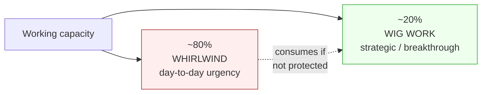
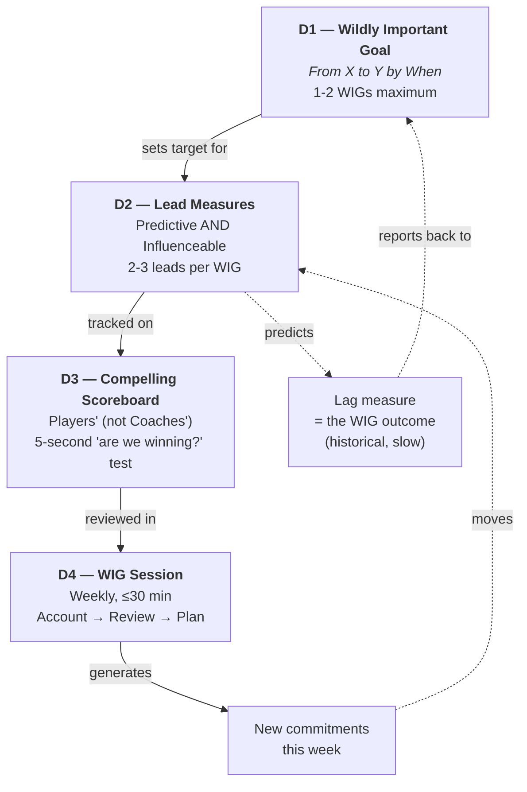
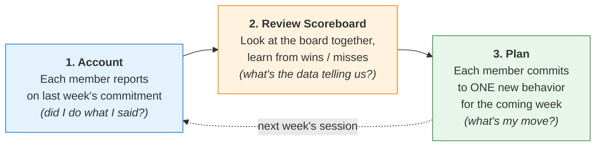
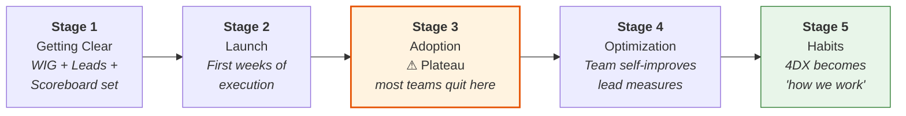

# four-dx-coach

> Multi-scope coach for *The 4 Disciplines of Execution* — personal solo use, team-leader facilitation, AND team-member participation. The agent shape-shifts: peer-witness for solo, consultant for leaders, personal coach for members operating inside someone else's WIG.

Read this in: **English** | [日本語](README.ja.md) | [繁體中文](README.zh-TW.md)

**Version**: 0.8.0
**Part of**: [monkey-skills](https://github.com/kouko/monkey-skills)
**License**: MIT

## Background

*The 4 Disciplines of Execution* (McChesney / Covey / Huling / Thele / Walker, 2nd ed., 2021) is a corporate-execution methodology validated across ~4,000 client engagements. Its prescription:

1. **D1 — Focus on the Wildly Important Goal** (one WIG, expressed as *From X to Y by When*)
2. **D2 — Act on the Lead Measures** (predictive AND influenceable)
3. **D3 — Keep a Compelling Scoreboard** (players' scoreboard, not coach's dashboard)
4. **D4 — Create a Cadence of Accountability** (weekly WIG Session of peer commitments)

The book is written primarily for **leaders rolling 4DX out across teams**. This plugin extends the methodology to two additional scopes the book under-serves:

- **Personal** — a single user adopting 4DX for an individual goal; agent fills the peer-witness role the book assumes is a colleague.
- **Team-leader** — a leader running 4DX inside a single team (not multi-team rollout); agent acts as consultant.
- **Team-member** — a contributor on a team where the leader has already chosen a WIG; agent helps you participate well, not redesign the system.

## How 4DX works (mechanism in 90 seconds)

### The execution-gap problem

Most strategic goals fail not because the strategy is wrong but because **the day-job (the "whirlwind") consumes ~80% of working capacity**, leaving strategic work starved of attention. 4DX is a closed-loop system designed to defend a small slice of strategic capacity (~20%) and convert it into predictable behavior change.



### The closed loop (D1 → D2 → D3 → D4 → back to D2)



### The weekly cadence — what D4 actually does

D4 is the most-skipped discipline in practice; without it, D1-D2-D3 collapse into a one-time plan that the whirlwind erodes within weeks. The WIG Session is the engine that defends the system. Each weekly meeting follows three steps in this fixed order:



The cycle is intentionally short (≤30 min) and intentionally repetitive. The point isn't strategic planning — it's **personal commitment witnessed by peers**, repeated weekly until execution becomes habit.

### Why each discipline matters (and how each fails)

| Discipline | Core idea | Most common failure |
|---|---|---|
| **D1 — Focus** | Pick **one** WIG (no more than two). Express in *From X to Y by When* sentence form. Lag-measurable, fixed deadline. | "Hitting the sales number is your job, not a WIG." Teams declare 5+ "priorities" and execute none. |
| **D2 — Lead Measures** | Track **behaviors you can do this week** that *predict* the lag. The book calls this "the most-misunderstood discipline" — and it's the most-failed in practice. | Picking lag-shaped "leads" (e.g. "increase NPS") that aren't weekly-influenceable. Or reusing existing KPI dashboards. |
| **D3 — Scoreboard** | The team builds it; it's visible; you can tell at a glance if you're winning. Has lead + lag + pacing line. | Becomes a passive dashboard with 12 metrics nobody opens. Or weaponized as name-and-shame. |
| **D4 — Cadence** | Weekly 30-min session: each member accounts for last week's commitment, reviews scoreboard, makes a new commitment for this week. | Sessions creep to 1 hour, members arrive unprepared, leaders run it as performance review (compliance instead of commitment). |

### What to expect over time — the 5-stage progression

4DX is not instant. The source book documents that teams pass through five distinct stages, and the most common reason implementations fail is that **teams quit at Stage 3** — they hit a plateau, conclude "it stopped working," and abandon the system right before the breakthrough.



If you're at Stage 3 and feel "this isn't working," that's the expected shape — not a failure signal. The plateau is when team members internalize the new behaviors; Stage 4 follows naturally if you don't quit. The agent's `4dx-sustain-momentum-rescue` skill exists specifically for this stage.

### Key vocabulary (used throughout this plugin)

- **Lag measure** — outcome (sales, NPS, retention). Historical, slow to move, can't be influenced directly this week.
- **Lead measure** — behavior (sales calls per week, code reviews delivered, walk-throughs completed). Fast to move, directly influenceable, *predictive* of the lag.
- **Players' scoreboard** — team owns + builds it; glance-readable; has lead + lag + pacing line. Distinct from a "coach's dashboard" (executive-only board with 50+ metrics).
- **WIG Session** — weekly accountability meeting following **Account → Review → Plan**. Each member reports last week's commitment, team reviews scoreboard movement, each member commits to one new behavior for this week.
- **Whirlwind** — the day-job urgency that consumes ~80% of capacity. 4DX assumes you can't eliminate it — only protect ~20% from it.

## Two modes: coach vs audit (v0.8.0 dual-mode architecture)

Every topic skill in this plugin supports **both modes internally** via dedicated protocol files. You don't pick the mode manually — the skill's activation signals or the router decide which protocol to load.

- **Coach mode** (`protocols/coach-mode.md`) — Socratic dialogue, fit-check inclusive, walks you step-by-step from zero. Best when you're starting from a fragment and want to *think through* the methodology one decision at a time.
- **Audit mode (single-layer)** (`protocols/audit-mode.md`) — synthesis from one existing artifact at that topic's layer (e.g. an existing WIG → `4dx-d1-wig-formulation` audit-mode; a 12-metric dashboard → `4dx-d3-scoreboard` audit-mode; a 4-week WIG-Session log → `4dx-d4-cadence` audit-mode). Diagnoses against that layer's standards and outputs revised artifact + fix list.
- **`4dx-audit` (cross-layer aggregator)** — reserved for artifacts spanning **≥2 of the 5 D-layers** OR cases where the user can't yet name which layer is broken. Maps multi-artifact context to all 5 layers, diagnoses per-layer status, surfaces cross-layer sequencing gaps, and routes back to topic-skill audit-mode or coach-mode for deep work.

How to choose mode:

| You have… | Use… |
|---|---|
| A vague intent ("I want to start using 4DX") | `using-four-dx-coach` router → coach-mode |
| A stage question ("how do I write a WIG?") | Topic skill coach-mode directly (e.g. `4dx-d1-wig-formulation`) |
| One artifact at one layer ("here's our WIG, audit it") | Topic skill **audit-mode** (e.g. `4dx-d1-wig-formulation` audit-mode) |
| One scoreboard / one cadence log to critique | Topic skill audit-mode (`4dx-d3-scoreboard` / `4dx-d4-cadence` audit-mode) |
| Artifacts spanning ≥2 layers (strategy doc + OKR + dashboard + meeting notes) | `4dx-audit` cross-layer aggregator |
| 4DX is broken but you can't name the broken layer | `4dx-audit` cross-layer aggregator |

`4dx-audit` ends by routing into specific topic-skill audit-mode or coach-mode protocols — it's a roadmap, not a substitute. Topic-skill audit-mode handles single-layer depth; the aggregator handles cross-layer breadth.

## Architecture

12 skills in three categories (v0.8.0):

- **1 plugin router** (`using-four-dx-coach`) — cold-start dispatcher for ambiguous, cross-topic, or out-of-4DX queries.
- **10 dual-mode topic skills** — every topic skill ships a `protocols/coach-mode.md` (Socratic walk-through) and a `protocols/audit-mode.md` (single-layer synthesis from an existing artifact at that layer). Split as 5 multi-file scope-flex skills (one topic + 2-4 scope variants × 2 modes) + 5 single-file scope-specific skills (one scope locked by topic × 2 modes). Multi-file skills auto-detect personal / team-leader / team-member scope via internal Socratic disambiguation, then load the matching scope+mode protocol.
- **1 cross-layer aggregator** (`4dx-audit`) — reserved for multi-artifact cases spanning ≥2 D-layers OR layer-unknown failures. Diagnoses 5-layer status, then routes back into the topic-skill audit-mode / coach-mode protocols for deep work.

Topic skills consolidate scope-overlap surface area without losing primary-source grounding: every protocol still carries its `### Industry-experience addendum` and shares the parent skill's `references/industry-grounding.md`. The dual-mode split (coach vs audit) reflects that every 4DX layer has both a "build from scratch" path (coach) and a "diagnose what's already there" path (audit) — and v0.8.0 makes that distinction first-class instead of bundling all audit into one universal aggregator.

## Skills (12 total)

### 1. Entry points (2)

| Skill | Role | What it does |
|---|---|---|
| [`using-four-dx-coach`](skills/using-four-dx-coach/) | Router | Entry point for cold-start / cross-topic / out-of-4DX queries — scope-triages to personal / team-leader / team-member, picks coach-mode vs audit-mode based on whether the user has artifacts, or hands off if 4DX doesn't fit |
| [`4dx-audit`](skills/4dx-audit/) | Cross-layer aggregator | For artifacts spanning **≥2 D-layers** OR layer-unknown failures only. Maps multi-artifact context to the 4DX 5-layer model (WIG / Lead / Lag+Scoreboard / Cadence / Substrate), diagnoses per-layer status, outputs prioritized recommendations routed back to topic-skill audit-mode / coach-mode. Single-layer audits go to the topic skill's own audit-mode instead. |

### 2. Multi-file scope-flex topic skills (5) — dual-mode

Each skill below auto-detects scope via internal Socratic disambiguation, then loads the matching scope+mode protocol from `protocols/`. Both modes (coach + audit) are available for every scope.

| Skill | Topic | Coach-mode protocols (Socratic) | Audit-mode protocol (single-layer) |
|---|---|---|---|
| [`4dx-meta-strategy-triage`](skills/4dx-meta-strategy-triage/) | Pre-D1 fit gate (6-verdict triage) | `personal-mode.md`, `team-mode.md` | `audit-mode.md` |
| [`4dx-d1-wig-formulation`](skills/4dx-d1-wig-formulation/) | Write / select / decode a *From X to Y by When* WIG | `personal-define.md`, `team-select.md`, `member-comprehend.md` | `audit-mode.md` |
| [`4dx-d2-lead-measures`](skills/4dx-d2-lead-measures/) | Discover / facilitate / map sphere-of-influence on lead measures | `personal-discover.md`, `team-facilitate.md`, `member-influence.md` | `audit-mode.md` |
| [`4dx-d3-scoreboard`](skills/4dx-d3-scoreboard/) | Design / facilitate / read a players' scoreboard | `personal-design.md`, `team-lead-design.md`, `member-read.md` | `audit-mode.md` |
| [`4dx-d4-cadence`](skills/4dx-d4-cadence/) | Run / facilitate / prep / debrief the weekly WIG Session | `solo-session.md`, `team-leader-session.md`, `member-prep.md`, `member-debrief.md` | `audit-mode.md` |

### 3. Single-file scope-specific topic skills (5) — dual-mode where applicable

These topics live in one scope only because the source book has no cross-scope variant. v0.8.0 ships audit-mode protocol files for the topics where artifact-rich starts are common; xps-evaluation and sustain-momentum-rescue are inherently audit-shaped already (no separate audit-mode needed).

| Skill | Scope | Coach-mode | Audit-mode | What it does |
|---|---|---|---|---|
| [`4dx-meta-whirlwind-triage`](skills/4dx-meta-whirlwind-triage/) | Personal | `protocols/coach-mode.md` | `protocols/audit-mode.md` | 7-day time audit; surface BAU vs WIG conflict; protect ~20% WIG slot |
| [`4dx-d1-wig-cascade`](skills/4dx-d1-wig-cascade/) | Team-leader | `protocols/coach-mode.md` | `protocols/audit-mode.md` | Translate Primary WIG into Battle WIGs (Targets-not-Plans); multi-team-only concept |
| [`4dx-meta-team-leader-onboarding`](skills/4dx-meta-team-leader-onboarding/) | Team-leader | `protocols/coach-mode.md` | `protocols/audit-mode.md` | Direct-report leader buy-in (commitment vs compliance) |
| [`4dx-meta-xps-evaluation`](skills/4dx-meta-xps-evaluation/) | Team-leader | (audit-shaped) | (intrinsic) | Post-quarter XPS audit (0-4 scale; C1-C4 layers) — the skill itself IS the audit |
| [`4dx-sustain-momentum-rescue`](skills/4dx-sustain-momentum-rescue/) | Personal | (diagnostic) | (intrinsic) | Diagnose where the 4-discipline stack broke and route to the matching restart — the skill itself IS the diagnostic |

## How scope detection works

You don't pick a scope manually. Three ways scope gets resolved:

1. **The plugin router** (`using-four-dx-coach`) detects clear scope signals ("my team", "I joined", "*my* goal") and dispatches to the right skill.
2. **Multi-file scope-flex skills** ask one Socratic question at top of flow when scope is unclear, then auto-load the matching protocol — no manual selection.
3. **Single-file scope-specific skills** activate only on signals that already constrain scope (e.g. cascade → team-leader, whirlwind triage → personal).

If you're not sure where to start, just describe the situation and the router will figure it out.

## When to use this plugin

Activates on signals like:

- "Should I use 4DX for X?" / 「4DX 適合我嗎？」 / 「この目標に 4DX 使える？」
- "I'm always firefighting" / 「日常業務に追われて目標に手がつかない」
- "Goal too vague / too many priorities"
- "I have a goal but don't know what daily action drives it"
- "I track the wrong thing / dashboard too complex"
- "Want a weekly cadence to keep my goal momentum"
- "WIG cadence broke — how do I restart?"
- "Pick our team's Primary WIG / cascade the org WIG"
- "How do I get my leaders bought in (not just complying)?"
- "Run a WIG Session for my team"
- "I joined a team running 4DX — how do I participate?"
- "Prep my commitment for tomorrow's WIG Session"

Hands off for:

- Enterprise rollout across multiple teams → read the book's Part 2 (Ch 6-10) directly, or contact FranklinCovey consulting
- Habit formation → atomic habits / habit stacking is the right tool
- Portfolio bets / multi-startup founders → OKR or lean experimentation
- Emergency-responder roles where firefighting *is* the strategic work
- Pure creative output (novelist, artist) where Goodhart effects corrupt lead measures
- Clinical burnout / depression → seek professional support, not 4DX

## Install

```bash
# In Claude Code
/plugin marketplace add kouko/monkey-skills
/plugin install four-dx-coach@monkey-skills
```

The router skill `using-four-dx-coach` activates on generic queries; specific skills activate on their own signals.

## Industry-grounded boundaries

Every topical skill (5 multi-file + 5 single-file = 10 atomic-equivalents) carries an `### Industry-experience addendum` in its Boundary section, citing primary academic + regulatory + credentialed-author sources **beyond** the source book — to address the book's selection-bias and member-POV gaps. Each skill's `references/industry-grounding.md` lists the verified citations:

- D2 lead-measure-discovery: Goodhart 1975 / Strathern 1997 / CFPB 2016 (Wells Fargo) / VA OIG 2014 (Phoenix) / GBI 2011 (Atlanta APS) — Goodhart failure-mode evidence
- D1 personal-define: Christensen 1997 / March 1991 / Dweck 2006 — over-focus risk + exploration vs exploitation
- D3 personal-scoreboard: Tufte 1983 / Few 2006 / Ware 2012 — perception-design grounding for the 5-second test
- D4 solo + team WIG-Session: Rogelberg 2019 / Lencioni 2004 / Edmondson 2012 — meeting-science empirical warrant
- Member protocols: Edmondson 2018 / Grant 2016 / Meyer 2014 / Pfeffer 2010 / Drucker HBR 1999 / Cialdini 1984 / Eurich 2017 / Wiseman 2010 — fills the book's leader-POV gap
- Team-leader skills: Akao 1991 / Doerr 2018 / Kaplan & Norton 2001 / Ryan & Deci 2017 / Argyris HBR 1991 / Kotter 1996 / Galbraith / Schein / Rumelt / Porter / Mintzberg / Hambrick & Fredrickson / CMMI / McKinsey OHI / Gallup Q12
- Consultant-mode (`4dx-audit`): Block 2011 *Flawless Consulting* / Schein 1999 *Process Consultation* / Maister 2000 *The Trusted Advisor* — consultant-craft posture (synthesize-from-artifacts, diagnose-then-prescribe, route to deep work) is derived from consulting-craft sources, not 4DX-craft (book is dialogue-coaching POV)

48 verified primary-source citations preserved through the Plan U merge; consultant-craft references added in v0.7.0 for the `4dx-audit` skill.

## Multilingual triggers

Skill `description` and trigger signals support **English / 日本語 / 繁體中文** — you can ask in any of the three. Skill body content (Interpretation, Execution steps, Boundary) is in English for portability.

## Recommended progression

### Personal (solo) — starting from zero

1. `4dx-meta-strategy-triage` → `personal-mode.md` — verify 4DX fits your goal (or get redirected)
2. `4dx-meta-whirlwind-triage` — clarify BAU vs WIG-work
3. `4dx-d1-wig-formulation` → `personal-define.md` — formulate the WIG (X → Y → When)
4. `4dx-d2-lead-measures` → `personal-discover.md` — find your 2-3 lead measures
5. `4dx-d3-scoreboard` → `personal-design.md` — design a glance-readable scoreboard
6. `4dx-d4-cadence` → `solo-session.md` — start the weekly cadence
7. `4dx-sustain-momentum-rescue` — load on demand when momentum slips

### Team-leader — starting from zero

1. `4dx-meta-strategy-triage` → `team-mode.md` — confirm 4DX is the right move for your team
2. `4dx-d1-wig-formulation` → `team-select.md` — Battles 2x2 to pick the Primary WIG
3. `4dx-d1-wig-cascade` — cascade to team WIGs as Targets-not-Plans
4. `4dx-meta-team-leader-onboarding` — secure commitment (not compliance) from direct reports
5. `4dx-d4-cadence` → `team-leader-session.md` — run the weekly WIG Session as facilitator
6. `4dx-meta-xps-evaluation` — periodically audit your team's 4DX implementation

### Team-member — joining a team that already runs 4DX

1. `4dx-d1-wig-formulation` → `member-comprehend.md` — understand the team WIG you've been given
2. `4dx-d4-cadence` → `member-prep.md` — prep your commitment for the next session
3. `4dx-d4-cadence` → `member-debrief.md` — honest self-account after each session

## Attribution

Distilled from *The 4 Disciplines of Execution* (2nd ed., 2021) by Chris McChesney, Sean Covey, Jim Huling, Scott Thele, Beverly Walker (Simon & Schuster). Pipeline: `tsundoku:book-distill` (RIA-TV++ adapted from kangarooking/cangjie-skill, MIT). 26 → 11 skill consolidation via Plan U merge (2026-04-30); v0.7.0 added consultant-mode entry point; v0.8.0 introduced dual-mode topic skills + repositioned `4dx-audit` as cross-layer aggregator. See [ATTRIBUTION.md](ATTRIBUTION.md).

## Related plugins

- [`tsundoku`](../tsundoku/) — the book→skill distillation pipeline that produced this plugin
- [`philosophers-toolkit`](../philosophers-toolkit/) — sibling personal-thinking-method plugin
