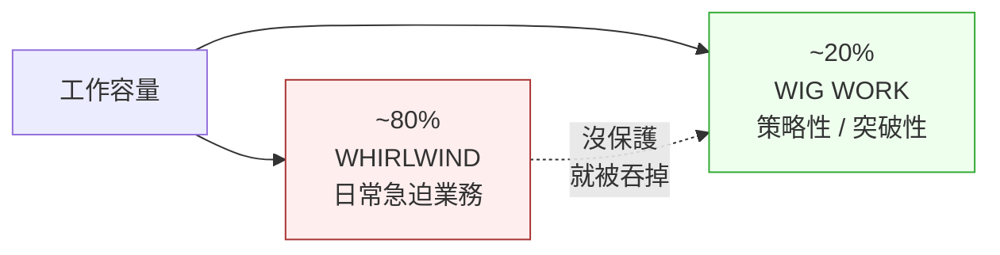
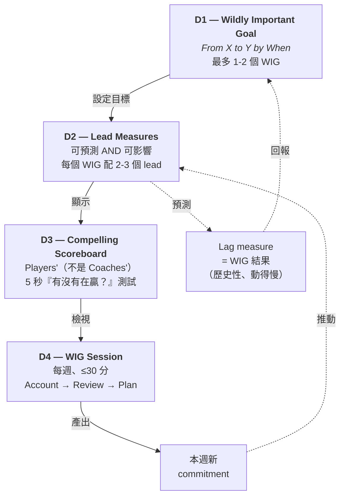

# four-dx-coach

> 多 scope 的《執行的 4 個修練》顧問 —— 個人 solo、team-leader 主持、team-member 參與三種尺度都涵蓋。Agent 會切換角色：solo 時當 peer-witness，leader 時當 consultant，member 時當你自己的 personal coach（在別人定的 WIG 下工作）。

語言：[English](README.md) | [日本語](README.ja.md) | **繁體中文**

**版本**：0.8.0
**所屬於**：[monkey-skills](https://github.com/kouko/monkey-skills)
**License**：MIT

## 背景

《The 4 Disciplines of Execution》（McChesney / Covey / Huling / Thele / Walker，第 2 版 2021 年）是 FranklinCovey 顧問群整理的 execution methodology，跨約 4,000 個 client engagement 驗證。它的處方：

1. **D1 — 聚焦 Wildly Important Goal (WIG)**（一個 WIG，以 `From X to Y by When` 表達）
2. **D2 — 行動於 lead measure**（兼具 predictive AND influenceable）
3. **D3 — 維持 compelling scoreboard**（players' scoreboard，不是 coach's dashboard）
4. **D4 — 建立 cadence of accountability**（每週 peer commitment 的 WIG Session）

書本主要寫給「在多個 team 推行 4DX 的 leader」。這個 plugin 把 methodology 延伸到書本沒充分服務的兩個 scope：

- **Personal** —— 單一 user 為個人目標導入 4DX；agent 扮演書中假設的同儕 peer-witness 角色。
- **Team-leader** —— 在單一 team 內部跑 4DX 的 leader（不是跨 team rollout）；agent 當 consultant。
- **Team-member** —— team 上的 contributor，leader 已經選好 WIG 了；agent 幫你「好好參與」，不是去重新設計 system。

## 4DX 怎麼運作（90 秒看懂）

### 執行落差問題

策略目標多半不是「策略錯」，而是 **日常業務（"竜捲 / Whirlwind"）吞掉約 80% 工作容量**，讓策略性工作失去關注。4DX 是一個閉環 system，專門保護那一小片策略容量（~20%），把它轉化為可預測的行為改變。



### 閉環（D1 → D2 → D3 → D4 → 回到 D2）



### 每個規律的角色 + 最常見失敗

| Discipline | 核心 idea | 最常見的失敗模式 |
|---|---|---|
| **D1 — Focus** | 只挑 **一個** WIG（最多兩個）。用 *From X to Y by When* 句型寫。Lag 可量測、deadline 明確。 | 「達成業績本來就是工作，不是 WIG。」團隊宣告 5+ 個「優先事項」結果一個都沒做。 |
| **D2 — Lead Measures** | 追蹤 **本週可以做的行為**，而且這個行為要 *能預測* lag。書中稱這是「最被誤解的規律」—— 實作上也是最常崩的點。 | 挑了 lag 形狀的「lead」（如「提升 NPS」），但週次根本動不了。或者直接套用既有 KPI dashboard。 |
| **D3 — Scoreboard** | 團隊自己做；公開可見；一眼看出輸贏。包含 lead + lag + pacing line。 | 退化成 12 個指標的被動 dashboard，沒人在看。或被當成羞辱工具。 |
| **D4 — Cadence** | 每週 30 分鐘 session：每個成員報告上週 commitment、看 scoreboard、為這週做出新 commitment。 | Session 拖到 1 小時、成員沒準備就來、leader 把它當績效面談（變成 compliance 而不是 commitment）。 |

### 關鍵詞彙（這個 plugin 通用）

- **Lag measure** —— 結果（業績、NPS、留存率）。歷史性、慢、本週直接影響不了。
- **Lead measure** —— 行為（每週業務拜訪數、交付的 code review 數、walk-through 完成數）。動得快、可直接影響、能 *預測* lag。
- **Players' scoreboard** —— 團隊自有 + 自建；一眼看懂；含 lead + lag + pacing line。跟「coach's dashboard」（經營層 read-only 的 50+ 指標 board）是兩回事。
- **WIG Session** —— 每週 accountability 會議，依 **Account → Review → Plan** 三步：成員報告上週 commitment、團隊看 scoreboard 變化、成員為這週承諾一個新行為。
- **Whirlwind** —— 吞掉約 80% 容量的日常業務急迫性。4DX 假設你消除不了它，只能保護 ~20% 不被吞掉。

## 兩種模式：coach 與 audit（v0.8.0 dual-mode 架構）

每個 topic skill 都 **內建兩種模式**，透過專屬的 protocol 檔案切換。模式不需要手動選 —— skill 的 activation signal 或 router 決定要載入哪個 protocol。

- **Coach 模式**（`protocols/coach-mode.md`）—— Socratic 對話、含 fit-check、從零 step-by-step。適合從片段開始，想要*一個決策一個決策地*走過方法論。
- **Audit 模式（single-layer）**（`protocols/audit-mode.md`）—— 從該 topic 對應 layer 的**單一 artifact** 做合成診斷（例：既有 WIG → `4dx-d1-wig-formulation` audit-mode；12-metric dashboard → `4dx-d3-scoreboard` audit-mode；4 週 WIG-Session log → `4dx-d4-cadence` audit-mode）。對照該 layer 的標準診斷，輸出修正後的 artifact + fix list。
- **`4dx-audit`（cross-layer aggregator）**—— 只在 artifact **跨 ≥2 個 D-layer** 或 layer 不明的故障時起動。將多個 artifact 對應到 5-layer 模型，逐 layer 診斷狀態，找出跨 layer 的順序缺口，再路由回對應的 topic-skill audit-mode / coach-mode 做深度工作。

選模式的方法：

| 你手上有的是… | 用… |
|---|---|
| 模糊的意圖（「我想開始用 4DX」） | `using-four-dx-coach` router → coach 模式 |
| 階段問題（「WIG 怎麼寫？」） | Topic skill coach-mode 直接（例：`4dx-d1-wig-formulation`） |
| 一層的一份 artifact（「我們的 WIG，幫我診斷」） | Topic skill **audit-mode**（例：`4dx-d1-wig-formulation` audit-mode） |
| Scoreboard / cadence log 要批評 | Topic skill audit-mode（`4dx-d3-scoreboard` / `4dx-d4-cadence`） |
| 跨 ≥2 個 layer 的 artifact（策略 doc + OKR + dashboard + meeting notes） | `4dx-audit` cross-layer aggregator |
| 4DX 卡住，但講不清是哪一層斷掉 | `4dx-audit` cross-layer aggregator |

`4dx-audit` 結尾會路由到具體的 topic-skill audit-mode / coach-mode —— 它是 roadmap，不取代 topic skill。Topic-skill audit-mode 負責單一 layer 的深度，aggregator 負責跨 layer 的廣度。

## Architecture

12 個 skill，分三類（v0.8.0）：

- **1 個 plugin router**（`using-four-dx-coach`）—— 處理冷啟動 / 跨 topic / 非 4DX query 的 dispatcher。
- **10 個 dual-mode topic skill** —— 每個 topic skill 都備有 `protocols/coach-mode.md`（Socratic walk-through）與 `protocols/audit-mode.md`（針對該 layer 單一 artifact 做合成診斷）。其中 5 個是 multi-file scope-flex（1 topic + 2-4 個 scope variant × 2 mode），另 5 個是 single-file scope-specific（topic 鎖定一個 scope × 2 mode）。Multi-file skill 透過 Socratic 一句問句自動偵測 personal / team-leader / team-member scope，再載入對應的 scope+mode protocol。
- **1 個 cross-layer aggregator**（`4dx-audit`）—— 只在 multi-artifact 跨 ≥2 個 D-layer 或 layer 不明的故障時起動。診斷 5-layer 狀態，再路由到對應的 topic-skill audit-mode / coach-mode。

Topic skill 收斂了 scope 重疊面但完全保留 primary-source grounding：每個 protocol 仍掛 `### Industry-experience addendum`，共用 parent skill 的 `references/industry-grounding.md`。Dual-mode 拆分（coach vs audit）反映每個 4DX layer 都有「從零打造」（coach）與「診斷既有」（audit）兩條路徑 —— v0.8.0 把這個區別提升到 first-class，不再把所有 audit 塞進一個 universal aggregator。

## Skills（共 12 個）

### 1. 入口 skill（2）

| Skill | 角色 | 功能 |
|---|---|---|
| [`using-four-dx-coach`](skills/using-four-dx-coach/) | Router | 入口路由 —— cold-start / cross-topic / 非 4DX query；scope triage 到 personal / team-leader / team-member、根據是否有 artifact 決定 coach-mode vs audit-mode、4DX 不適用時轉介 |
| [`4dx-audit`](skills/4dx-audit/) | Cross-layer aggregator | **只在 artifact 跨 ≥2 個 D-layer** 或 layer 不明時起動。把多個 artifact 對應到 4DX 五層模型（WIG / Lead / Lag+Scoreboard / Cadence / Substrate），逐層診斷狀態，輸出排序過的建議 + 路由到對應 topic-skill audit-mode / coach-mode。Single-layer audit 改丟給 topic skill 自己的 audit-mode |

### 2. Multi-file scope-flex topic skills（5）—— dual-mode

以下每個 skill 都會在內部用 Socratic 問題自動偵測 scope，再載入對應的 scope+mode protocol。每個 scope 都備有 coach + audit 兩種模式。

| Skill | Topic | Coach-mode protocols（Socratic） | Audit-mode protocol（single-layer） |
|---|---|---|---|
| [`4dx-meta-strategy-triage`](skills/4dx-meta-strategy-triage/) | Pre-D1 fit gate（6-verdict triage） | `personal-mode.md`、`team-mode.md` | `audit-mode.md` |
| [`4dx-d1-wig-formulation`](skills/4dx-d1-wig-formulation/) | 寫 / 選 / 解讀 *From X to Y by When* WIG | `personal-define.md`、`team-select.md`、`member-comprehend.md` | `audit-mode.md` |
| [`4dx-d2-lead-measures`](skills/4dx-d2-lead-measures/) | 發現 / 引導 / 找 sphere-of-influence on lead measures | `personal-discover.md`、`team-facilitate.md`、`member-influence.md` | `audit-mode.md` |
| [`4dx-d3-scoreboard`](skills/4dx-d3-scoreboard/) | 設計 / 引導 / 讀 players' scoreboard | `personal-design.md`、`team-lead-design.md`、`member-read.md` | `audit-mode.md` |
| [`4dx-d4-cadence`](skills/4dx-d4-cadence/) | 跑 / 主持 / 準備 / debrief 每週 WIG Session | `solo-session.md`、`team-leader-session.md`、`member-prep.md`、`member-debrief.md` | `audit-mode.md` |

### 3. Single-file scope-specific topic skills（5）—— dual-mode（適用之處）

書本對這些 topic 只有單一 scope 的處理，所以保留為 single-file。v0.8.0 為 artifact-rich start 常見的 topic 加了 audit-mode protocol；xps-evaluation 與 sustain-momentum-rescue 本身就是 audit-shaped，不需要再分 audit-mode。

| Skill | Scope | Coach-mode | Audit-mode | 功能 |
|---|---|---|---|---|
| [`4dx-meta-whirlwind-triage`](skills/4dx-meta-whirlwind-triage/) | Personal | `protocols/coach-mode.md` | `protocols/audit-mode.md` | 7 天時間稽核；釐清 BAU vs WIG 衝突；保留 ~20% WIG slot |
| [`4dx-d1-wig-cascade`](skills/4dx-d1-wig-cascade/) | Team-leader | `protocols/coach-mode.md` | `protocols/audit-mode.md` | 把 Primary WIG 翻譯成 Battle WIG（Targets-not-Plans）；只在多 team 場景出現 |
| [`4dx-meta-team-leader-onboarding`](skills/4dx-meta-team-leader-onboarding/) | Team-leader | `protocols/coach-mode.md` | `protocols/audit-mode.md` | 讓 direct-report leader 真心 buy-in（commitment vs compliance） |
| [`4dx-meta-xps-evaluation`](skills/4dx-meta-xps-evaluation/) | Team-leader | （audit-shaped） | （intrinsic） | Post-quarter XPS audit（0-4 scale；C1-C4 layer）—— skill 本身就是 audit |
| [`4dx-sustain-momentum-rescue`](skills/4dx-sustain-momentum-rescue/) | Personal | （diagnostic） | （intrinsic） | 診斷 4-discipline stack 哪裡斷掉，路由到對應 restart —— skill 本身就是 diagnostic |

## Scope 偵測怎麼運作

你不需要手動選 scope。三種解法：

1. **Plugin router**（`using-four-dx-coach`）讀 query 中的 scope signal（「我們 team」「我加入了」「*我自己的*目標」）後 dispatch。
2. **Multi-file scope-flex skill** 在 flow 開頭用一句 Socratic 問題消除歧義，自動載入對應 protocol —— 不用手選。
3. **Single-file scope-specific skill** 只在 signal 已經鎖定 scope 時 activate（例：cascade → team-leader、whirlwind triage → personal）。

不確定就直接描述情境，router 會幫你判斷。

## 何時使用

觸發訊號：

- 「4DX 適合我嗎？」 / "Should I use 4DX for X?" / 「この目標に 4DX 使える？」
- 「我每天都在救火，重要的事都沒做」
- 「目標太模糊 / 想做的事太多」
- 「我有目標，但不知道每天該做什麼才有效果」
- 「我的追蹤工具太複雜，沒在看」
- 「想要每週固定 review 維持目標進度」
- 「我的 4DX 已經幾週沒做了，要怎麼重啟？」
- 「幫我們 team 選 Primary WIG / cascade org WIG」
- 「怎麼讓我的 leader 真的 buy-in，不是表面 compliance？」
- 「幫我主持 team 的 WIG Session」
- 「我加入了一個在跑 4DX 的 team，我要怎麼參與？」
- 「幫我準備明天 WIG Session 的 commitment」

轉介情境：

- 跨多個 team 的 enterprise rollout → 直接讀書的 Part 2（第 6-10 章）或聯繫 FranklinCovey 顧問
- Habit formation → atomic habits / habit stacking 才是對的工具
- 多賭注 / 多新創 → OKR 或精實實驗
- 急診醫師 / 消防員等以救火為策略本身的角色
- 純創作產出（小說家、藝術家）—— Goodhart 效應會破壞 lead measure
- 臨床 burnout / 憂鬱 → 尋求專業協助，而非 4DX

## 安裝

```bash
# 在 Claude Code 中
/plugin marketplace add kouko/monkey-skills
/plugin install four-dx-coach@monkey-skills
```

Router skill `using-four-dx-coach` 在通用查詢時觸發；特定 skill 在自己的 signal 上觸發。

## Industry-grounded boundaries

每個 topical skill（5 個 multi-file + 5 個 single-file = 10 個 atomic-equivalent）的 Boundary section 都帶 `### Industry-experience addendum`，引用書本之外的學術 / 監管 / 業界文獻原始來源 —— 補書本的 selection bias 與 member-POV 缺漏。每 skill 的 `references/industry-grounding.md` 列出全部已驗證引用：

- D2 lead-measure-discovery：Goodhart 1975 / Strathern 1997 / CFPB 2016（Wells Fargo）/ VA OIG 2014 / GBI 2011（Atlanta APS）—— Goodhart 失敗案例
- D1 personal-define：Christensen 1997 / March 1991 / Dweck 2006 —— 過度聚焦風險 + 探索 vs 利用
- D3 personal-scoreboard：Tufte 1983 / Few 2006 / Ware 2012 —— 5 秒 test 的感知科學基礎
- D4 solo + team WIG-Session：Rogelberg 2019 / Lencioni 2004 / Edmondson 2012 —— 會議科學的實證依據
- Member protocols：Edmondson 2018 / Grant 2016 / Meyer 2014 / Pfeffer 2010 / Drucker 1999 / Cialdini 1984 / Eurich 2017 / Wiseman 2010 —— 補書本 leader-POV 偏差
- Team-leader skills：Akao 1991 / Doerr 2018 / Kaplan-Norton 2001 / Ryan-Deci 2017 / Argyris 1991 / Kotter 1996 / Galbraith / Schein / Rumelt / Porter / Mintzberg / Hambrick-Fredrickson / CMMI / McKinsey OHI / Gallup Q12
- Consultant 模式（`4dx-audit`）：Block 2011《Flawless Consulting》/ Schein 1999《Process Consultation》/ Maister 2000《The Trusted Advisor》—— consultant-craft posture（從 artifact 合成、先診斷再開處方、路由到深度工作）來自 consulting craft 文獻，不是 4DX 本身（書本是 dialogue-coaching POV）

Plan U merge 後仍保留 48 個已驗證 primary-source 引用；v0.7.0 為 `4dx-audit` 加入 consultant-craft 引用。

## 多語言觸發

Skill 的 `description` 和 trigger signal 支援 **英文 / 日文 / 繁體中文** —— 三種語言都可以問。Skill body（Interpretation / Execution / Boundary）統一英文以維持 portability。

## 建議學習順序

### Personal（solo）—— 從零開始

1. `4dx-meta-strategy-triage` → `personal-mode.md` —— 確認 4DX 適合你的目標（或被轉介）
2. `4dx-meta-whirlwind-triage` —— 釐清 BAU vs WIG 工作
3. `4dx-d1-wig-formulation` → `personal-define.md` —— 寫出 WIG（X → Y → When）
4. `4dx-d2-lead-measures` → `personal-discover.md` —— 找到 2-3 個 lead measure
5. `4dx-d3-scoreboard` → `personal-design.md` —— 設計一眼可讀的 scoreboard
6. `4dx-d4-cadence` → `solo-session.md` —— 啟動每週 cadence
7. `4dx-sustain-momentum-rescue` —— momentum 下滑時依需求載入

### Team-leader —— 從零開始

1. `4dx-meta-strategy-triage` → `team-mode.md` —— 確認 4DX 是 team 該走的路
2. `4dx-d1-wig-formulation` → `team-select.md` —— Battles 2x2 選 Primary WIG
3. `4dx-d1-wig-cascade` —— 以 Targets-not-Plans 把 org WIG cascade 成 team WIG
4. `4dx-meta-team-leader-onboarding` —— 從 direct report 拿到 commitment（不是 compliance）
5. `4dx-d4-cadence` → `team-leader-session.md` —— 以 facilitator 主持每週 WIG Session
6. `4dx-meta-xps-evaluation` —— 定期審視 team 內部 4DX 實作

### Team-member —— 加入一個已在跑 4DX 的 team

1. `4dx-d1-wig-formulation` → `member-comprehend.md` —— 理解被指派的 team WIG
2. `4dx-d4-cadence` → `member-prep.md` —— 為下次 session 準備 commitment
3. `4dx-d4-cadence` → `member-debrief.md` —— 每次 session 後做誠實 self-account

## 出處

蒸餾自《The 4 Disciplines of Execution》（第 2 版 2021）—— Chris McChesney / Sean Covey / Jim Huling / Scott Thele / Beverly Walker（Simon & Schuster）。Pipeline：`tsundoku:book-distill`（RIA-TV++，改編自 kangarooking/cangjie-skill，MIT）。Plan U merge（2026-04-30）把 26 個 skill 整併為 11；v0.7.0 加上 consultant-mode entry point；v0.8.0 引入 dual-mode topic skill + 把 `4dx-audit` 重新定位為 cross-layer aggregator。詳見 [ATTRIBUTION.md](ATTRIBUTION.md)。

## 相關 plugins

- [`tsundoku`](../tsundoku/) —— 產出本 plugin 的 book→skill 蒸餾 pipeline
- [`philosophers-toolkit`](../philosophers-toolkit/) —— 姊妹「個人思考方法」plugin
