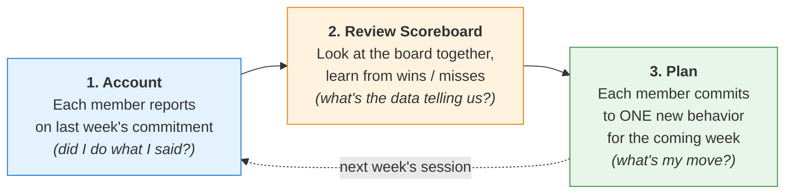

# 4dx-d4-cadence — Weekly cadence across all roles (multi-scope)

## Mission

Coach the user through the D4 weekly Cadence of Accountability — the WIG
Session — in whichever of four roles they occupy this week: running their
own solo session as participant + agent-as-peer; facilitating a team
session as leader; preparing as a member before the session; or
self-accounting as a member after the session. Same Account → Review →
Plan grammar; different voice per role; one shared standard for what
counts as a session, what counts as a commitment, what counts as cadence.

## When this skill activates

### Multilingual trigger phrasings (covering all 4 modes)

**Solo (personal session, agent = peer-witness):**
- EN: "Run my weekly WIG Session", "Help me stay on track with my goal each week", "I want a weekly review for my [goal/WIG/project]"
- JP: 「毎週の振り返りで進捗を保ちたい」「毎週の WIG Session を回したい」
- zh-TW: 「想要每週固定 review 維持目標進度」「每週檢查 WIG 進度」

**Team-leader (facilitator):**
- EN: "Run my team's weekly WIG Session", "Facilitate our team WIG meeting", "Walk me through how to lead this week's session", "Someone on my team didn't keep their commitment — what do I do?"
- JP: 「チームの WIG Session を運営する」「うちの WIG ミーティングを進めたい」
- zh-TW: 「帶我們團隊的 weekly WIG Session」「協助我主持團隊 WIG 會議」

**Team-member, before session (commitment prep):**
- EN: "Help me prepare my commitment for next WIG Session", "What should I commit to at this week's WIG Session?", "My last commitment was too vague — help me sharpen this week's"
- JP: 「次の WIG Session の commitment を準備したい」「来週のミーティングで何をコミットすべきか相談したい」
- zh-TW: 「我要為下次 WIG Session 準備 commitment」「下週的 commitment 我想先想清楚再去開會」

**Team-member, after session (account debrief):**
- EN: "I missed my commitment last week — how do I show up at the session?", "I half-did what I said I'd do; what do I say tomorrow?", "I want to walk into the session clean about last week"
- JP: 「先週のコミットメント果たせなかった、どう振り返る？」「セッションで何て言えばいい？」
- zh-TW: 「上週 commitment 沒達成，這次 session 怎麼面對？」「半完成的承諾要怎麼講？」

**Audit-mode (diagnose running-but-malformed cadence from artifacts):**
- EN: "Audit our weekly WIG meetings — here are 4 weeks of notes", "Team says meetings are pointless — what's wrong?", "Got feedback our weekly review isn't quite working — diagnose", "Stakeholder wants to revisit the WIG Session format", "Manager flagged we should sharpen the cadence", "Here's our session log — diagnose what's malformed", "Boss says weekly review is pointless, help me see why"
- JP: 「うちの WIG Session 機能してない、診断して」「会議録を見て何がダメか教えて」「過去 4 週分の議事録 audit して」「上司にフィードバックされた、WIG ミーティング見て」「マネージャーから方向性を直したいと言われた、cadence チェックして」
- zh-TW: 「我們的 weekly meeting 沒效果，幫看哪裡有問題」「主管覺得週會要調整，幫看哪裡」「review 後 stakeholder 想討論週會方向」「老闆說週會浪費時間，幫我診斷」「過去四週會議記錄，幫我看 4DX 角度哪裡走樣了」

### Non-activation signals (DO NOT fire when…)

- Cadence has already broken (multiple skipped weeks, engagement collapsed) → `4dx-sustain-momentum-rescue` first **(this overrides audit-mode — audit-mode requires cadence to still be running)**
- Pre-D4 (no WIG defined, no lead measure picked, no scoreboard built) → D1 / D2 / D3 first
- Out of 4DX — sprint review / PI planning / OKR check-in / 1-on-1 / status report / agile retro / GTD weekly review → hand off via `using-four-dx-coach`
- Cross-layer audit (WIG / leads / scoreboard / cadence diagnosed together from artifacts) → `4dx-audit` (this skill's audit-mode is **D4-layer-only**)
- Annual / quarterly / monthly retrospective → wrong cadence scope (WIG Session is weekly only)
- Daily standup / scrum daily → wrong cadence (daily ≠ weekly), wrong format (status three-questions ≠ Account/Review/Plan)
- Reactive / on-call / emergency-response work where the whirlwind IS the strategic value → see `4dx-meta-strategy-triage`
- Member doesn't yet know the team's WIG / lead measure → route to `4dx-d1-wig-formulation` first
- Three-or-more misses in a row by a member → that's a commitment-design problem, redesign via member-prep mode (not debrief mode)

## Scope detection

When this skill activates:

1. Determine **interaction shape first**: **coach-mode** (Socratic, live dialogue, single-week scope) vs **audit-mode** (synthesis from provided artifacts — past minutes / commitment logs / cadence pattern, often + stakeholder critique). Audit signals: user pastes/attaches/references "past notes", "minutes", "last 4 weeks", "boss says...", "team says meetings are pointless".
2. **Audit-mode pre-check** — before loading audit-mode, screen for **multi-week consecutive skip** (>2 weeks). If present, route to `4dx-sustain-momentum-rescue` instead — audit-mode assumes cadence is currently *running* but malformed.
3. If coach-mode: determine **role** (solo / team-leader-facilitator / team-member) and **timing** for member (before/after session).
4. Load the matching protocol file from `protocols/`.
5. Follow that protocol's E section step-by-step.

If ambiguous after reading the user's query, ask ONE Socratic question:

> EN: "Two quick checks: (a) **what's your role at this session** — solo (just you), facilitator (you lead a team), or member (your team has a leader)? (b) if member: **what timing** — before the session (prep) or after (debrief)? I'll route to the right protocol."
>
> JP: 「2 点確認: (a) **session での役割** — solo（自分のみ）、facilitator（team を率いる側）、member（leader がいる team の参加者）のどれ？ (b) member の場合 **タイミング** — 前（prep）、後（debrief）のどれ？適切な protocol に振り分けます。」
>
> zh-TW: 「兩個快速確認：(a) **你在 session 的角色** — solo（只有你自己）、facilitator（你帶 team）、member（team 有 leader）？(b) 如果是 member：**時機** — 開會前（prep）還是開會後（debrief）？我幫你導到對的 protocol。」

If the signal in the original query is strong, skip the question and load the protocol directly.

## Protocol routing table

| Detected mode | Load protocol | Agent voice |
|---|---|---|
| Solo, during session (coach) | `protocols/solo-session.md` | peer-witness |
| Team-leader, during session (coach) | `protocols/team-leader-session.md` | consultant-to-leader |
| Team-member, before session (coach) | `protocols/member-prep.md` | personal coach to member |
| Team-member, after session (coach) | `protocols/member-debrief.md` | personal coach to member |
| Audit (artifacts + critique, cadence running) | `protocols/audit-mode.md` | consultant-from-artifacts |

After loading the protocol, follow its E section step-by-step. Each protocol carries its own R / I / A1 / A2 / E / B sections; this orchestrator does not run any session content directly.

### Edge-case routing

- **Member + during session** — member doesn't have a separate during-session skill; the leader runs the agenda. Suggest member-prep ahead of the next session, OR member-debrief for the just-ended one.
- **Solo + before / after** — `solo-session.md` is single-protocol (covers prep + agenda + close internally). Fire it directly.
- **Facilitator + before / after** — `team-leader-session.md` handles the full lifecycle (pre-session check + agenda + post-session reminders) within its protocol. Fire it directly.
- **Cadence broken multiple weeks** — fire `4dx-sustain-momentum-rescue` first; do NOT pretend a fresh cadence works on top of a broken one. Also overrides audit-mode (audit-mode requires running cadence).
- **WIG / lead measure / scoreboard not yet set** — fire D1 / D2 / D3 skills first; D4 has nothing to operate on without upstream.
- **Audit request without artifacts** — if user asks for an audit but provides no minutes / log / agenda, ask once for artifacts; if none available, decline audit-mode and route to a coach-mode protocol to set up cadence properly.
- **Cross-layer audit (WIG + leads + scoreboard + cadence)** — that's `4dx-audit`, not D4 audit-mode. Audit-mode here is **D4-only**.

## The WIG Session cycle (canonical mechanism)

The WIG Session is a fixed 3-step cycle, repeated weekly. The cycle (not strategic planning) is the engine that defends the system from the whirlwind. Source: McChesney et al. 2021, p 256.

The cycle is intentionally short (≤30 min) and intentionally repetitive. The point is **personal commitment witnessed by peers**, repeated weekly until execution becomes habit.

## Shared standards

Each protocol references these standards (load on demand):

- `standards/account-review-plan-agenda.md` — the 3-segment session grammar (~7-10 min Account, ~5-7 min Review, ~8-10 min Plan; Plan is the centre of gravity, not Account)
- `standards/commitment-shape.md` — every commitment must be specific + lead-measure-moving + within own control + self-chosen + capped at 1-2; rejects compliance-mode / dependency / vague / boss-pleasing forms
- `standards/whirlwind-exclusion.md` — no operational discussion in session; whirlwind drama gets parked, not narrated; the rule is the rule, applied without apology
- `standards/sacred-cadence.md` — same day, same time, same length, every week; cancel-and-reschedule, never skip; if leader is travelling, dial in or delegate the chair, never cancel

## Cross-skill relations

- **Upstream (D1/D2/D3 prerequisites)** — `4dx-d1-wig-formulation` defines the WIG; `4dx-d2-lead-measures` picks the lever this cadence drives; `4dx-d3-scoreboard` is the artifact Segment 2 (Review) reads from. D4 has nothing to operate on if any of these is missing.
- **Compose-with neighbour** — `4dx-sustain-momentum-rescue` runs *after* this cadence has broken. The boundary is sharp: this skill runs the *live* cadence; sustain-rescue *re-engages* a collapsed one.
- **Compose-with team-context** — `4dx-meta-team-leader-onboarding` is upstream of the leader running this cadence; `4dx-meta-xps-evaluation` audits this cadence's C1 (Cadence) component. Both treat the WIG Session as the artifact this skill produces.
- **Plugin-router fallback** — `using-four-dx-coach` handles cold-start triage and out-of-4DX queries (sprint review, OKR check-in, 1-on-1, status report); not a substitute for this skill, but the right hand-off when the user's question turns out not to be 4DX D4.

## Boundary (cross-mode common)

The mode-specific boundary lives in each protocol's B section. The cross-mode common boundary:

- **WIG Session is a specific artifact**, not a generic "weekly check-in". Three fixed segments, whirlwind-excluded, peer-commitment (not status-update), 20-30 min. Don't let the request collapse the artifact into a status meeting.
- **Cadence is sacred across all four modes** — a leader who skips, a member who no-shows, a solo user who postpones — all collapse the mechanism within 3-4 weeks. Hold the cadence regardless of mode.
- **Commitment ownership is the load-bearing mechanism** — the agent (solo) / the leader (facilitator) / the member's coach (prep) never *dictates* the commitment. Push back on weak commitments, never substitute. If you find yourself naming the commitment, stop and re-ask the canonical question.
- **Honest signal beats clean signal** — across all modes, an honestly-named "missed" beats a story-mode "kind-of kept". Trust currency runs on integrity of the account, not optics.
- **Lead measure is the only target** — segment 3 (Plan) commitments must move *the lead*, not the most-urgent whirlwind task. If the commitment doesn't move the lead, it's whirlwind in disguise — reject regardless of mode.

## Audit metadata

- **Skill type**: multi-file orchestrator (Plan U merged from 5 source skills — 4 atomic D4 + 1 topic-router); + audit-mode protocol (path B refactor) for artifact-synthesis diagnosis of running-but-malformed cadence
- **Verification status**: V1 ✓ for solo + team-leader modes (both leader-POV in source book); V1 ⚠️ partial for member-prep + member-debrief modes (book authors leader side of dialogue; member-side protocol = symmetric inverse, anchored on P-22 specific-deliverable test, P-39 ≥90% fulfillment bar, CE-22/23/24 self-applied, with industry grounding from Pfeffer / Drucker / Cialdini / Eurich / Edmondson / Wiseman)
- **Created**: 2026-04-30
- **Output language**: SKILL.md body + protocols/standards in English; description + scope-detection prompts multilingual EN/JP/zh-TW; member-debrief protocol's Step 7 spoken-script register cue is multilingual
