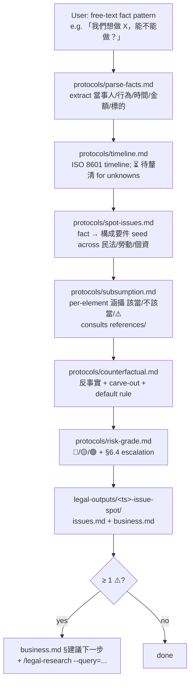

# legal-issue-spot

In-house legal toolkit **IRAC issue-spotting** skill for Taiwan SME →
上市櫃 法務. Takes a business-language fact pattern (e.g. "我們想送一份
員工生日禮物給客戶聯絡人，能不能做？") and produces a structured legal
analysis: issue 矩陣 → 構成要件 涵攝 → 反事實 → 風險分級 → escalation
建議. Pure-LLM workflow — no external fetches, no `legal-playbook/`
profile dependency. The skill is **disclaimer-driven** (§6.3 inherited
from v0.4.x: every output ships with the Mandatory Disclaimer footer)
and **escalation-driven** (§6.4 inherited: low-confidence or 🔴 risk
hard-wires a 律師 escalation banner, regardless of business pressure).

## Language Policy

- Skill instructions (this file, `protocols/`): English
- Domain content (citations, 構成要件 names, baseline references): zh-TW (preserve original)
- User-facing output (`issues.md` + `business.md`): zh-TW (Traditional Chinese)
- Mixed-language is **by design** — do NOT translate domain terms
  (構成要件 / 涵攝 / 不完全給付 / 委託-受託 etc.) into English; do NOT
  translate dispatch keywords (「能不能做」/「是否合法」/「我們想做」)
  into anything else either — the router scans the surface form.

## Workflow



The pipeline is **deterministic** (each protocol runs once; no looping
outside the `subsumption ↔ counterfactual` consultation of references/),
**reference-driven** (`subsumption.md` + `counterfactual.md` look up
element lists in `references/`), and **audience-shaped** at the tail
(2 files: one for 法務, one for 業務).

## Protocols

LLM reads ONE protocol per workflow step; each protocol writes to a
named section in `issues.md` and/or `business.md`.

| Step | File | Purpose |
|---|---|---|
| 1 | [`protocols/parse-facts.md`](protocols/parse-facts.md) | Extract 當事人 / 行為 / 時間 / 金額 / 標的 from raw fact pattern → `issues.md §事實摘要` |
| 2 | [`protocols/timeline.md`](protocols/timeline.md) | Build chronological timeline (ISO 8601; `⏳ 待釐清` for unknown anchors) → `issues.md §時間軸` |
| 3 | [`protocols/spot-issues.md`](protocols/spot-issues.md) | Map facts to 構成要件 seeds across 3 statute domains (民法 / 勞動 / 個資) → `issues.md §Issue 矩陣` |
| 4 | [`protocols/subsumption.md`](protocols/subsumption.md) | Per-element 涵攝 (該當 / 不該當 / ⚠️) using `references/` → `issues.md §構成要件涵攝` |
| 5 | [`protocols/counterfactual.md`](protocols/counterfactual.md) | 反事實 + carve-out + default rule sweep → `issues.md §反事實` |
| 6 | [`protocols/risk-grade.md`](protocols/risk-grade.md) | 🔴/🟡/🟢 grade + §6.4 escalation rules + §6.3 Disclaimer footer → `issues.md §風險分級` + `business.md` synthesis |

Each protocol uses the `halt + ask user` fallback when input is
ambiguous (e.g. `parse-facts.md` halts if pattern < 30 chars or
contains internal contradictions).

## Reference files

Consumed by `subsumption.md` and `counterfactual.md`. Each file
ships with a `<!-- [draft — for 法務 review; Phase 4.5 GC outreach
validation] -->` header per `feedback_legal_toolkit_defer_legal_domain.md`
— controller drafts grounded in obsidian SoT + canonical
`legal-sources.json` + training; 法務 SME validation deferred.

| File | Scope |
|---|---|
| [`references/請求權基礎-民法.md`](references/請求權基礎-民法.md) | 民法 §184 (侵權行為) / §227 (不完全給付) / §767 (物上請求權) / §179 (不當得利). Per element: 1-line 白話 + typical 反例 + typical carve-out. |
| [`references/構成要件-勞動.md`](references/構成要件-勞動.md) | 勞基法 §11 (合法解雇事由) / §14 (勞工終止事由) / §16 (預告期間) + 性平法 §13 (性騷擾雇主責任). |
| [`references/構成要件-個資.md`](references/構成要件-個資.md) | 個資法 §5 (蒐集原則) / §8-9 (告知義務) / §27 (適當安全措施) / §29 (損害賠償). Path A: 委託/受託 not controller/processor; 即時 not 72hr. |

References are **中厚 B** density per spec §5.5 — element list +
1-line 白話 + 反例 + carve-out. They do NOT duplicate 條文 text;
that lives in `legal-toolkit/scripts/canonical/legal-sources.json`
(SP1 SSOT). When a reference needs the 條文 itself, link to canonical
rather than copy.

## Inputs

- **Required at session**: free-text fact pattern (a short business
  scenario, typically 1-3 paragraphs, e.g. "我們想做 X，能不能做？")
- **No structured schema** — the input is free text; `parse-facts.md`
  extracts the structured facts in Step 1
- **No `profile.yml` dependency** — the skill is profile-independent;
  the analysis is fact-pattern-driven, not company-identity-driven
  (router Q4-fact bypasses the profile prerequisite check that
  Q2/Q3 use for `legal-document-draft` / `legal-incident-response`)

## Outputs

Per session, writes to `<cwd>/legal-outputs/<YYYY-MM-DD-HHmm>-issue-spot/`:

| File | Audience | Sections |
|---|---|---|
| `issues.md` | 法務 / GC / 內部簽核 | §事實摘要 / §時間軸 / §Issue 矩陣 / §構成要件涵攝 / §反事實 / §風險分級 / §Disclaimer |
| `business.md` | 非法務 (CEO / BD / 業務 / PM) | §TL;DR / §可以做的部分 / §不能做的部分 / §注意點 / §風險分級 / §Disclaimer (+ §建議下一步 conditional + §Escalation conditional) |

`business.md` conditional sections:

- **§建議下一步** — REQUIRED when `issues.md §構成要件涵攝` contains
  ≥ 1 ⚠️ in the 涵攝結論 column. Body: per-issue handoff query strings
  in the format `` `/legal-research --query="<NL query>"` `` (one
  per ⚠️ row). Soft handoff — user copies the command and invokes;
  no auto-dispatch. See §Cross-skill handoff below.
- **§Escalation** — REQUIRED when 風險分級 = 🔴 OR ≥ 2 ⚠️ in
  §構成要件涵攝. Body: explicit recommendation to engage 律師
  (external counsel) before proceeding. See §6.4 Escalation Override
  below — this is hard-wired, not an LLM judgement call.

Schema validation: both files have JSON Schema contracts in
`assets/output-schema-issues.json` + `assets/output-schema-business.json`,
consumed by `scripts/grade_issue_spot.py` (Task 5).

## §6.3 Mandatory Disclaimer footer

Every output file MUST end with the §6.3 Disclaimer footer.
**This skill produces 法律意見 (legal opinion) — disclaimer is
mandatory, not optional.**

The verbatim canonical disclaimer text lives in
[`protocols/risk-grade.md`](protocols/risk-grade.md) §6.3 Disclaimer text section
(do NOT duplicate the text here to avoid drift). risk-grade.md is
the SoT; this section only describes the contract:

- Both `issues.md` and `business.md` MUST end with the boilerplate
  block (leading `---` separator + `## §Disclaimer` heading + body)
- Body covers: AI-tool attribution / not formal legal opinion /
  current TW in-force law scope / recommendation to consult 律師 for
  litigation, contract signing, criminal liability, cross-border, or
  high-stakes decisions
- The grader (`scripts/grade_issue_spot.py` `disclaimer_footer`
  check) greps for the canonical sentinel substring; missing
  footer → exit 1 (FAIL)

## §6.4 Escalation Override

When the subsumption table contains **≥ 2 ⚠️** OR risk_grade is
**🔴**, `business.md` MUST recommend 律師 escalation regardless of
business pressure. This is **hard-wired**: `protocols/risk-grade.md`
Step 3 emits the §Escalation block with a fixed-format banner; the
LLM does not get to "soften" or skip it. Rationale (inherited from
v0.4.x SoT §6.4): when low confidence intersects high stakes,
disclaimer alone is insufficient — the user audience (often
non-lawyer) needs an explicit "stop and talk to a lawyer" signal.

Grader rule (`grade_issue_spot.py` `escalation_when_red` check):
if `issues.md §風險分級` = 🔴 OR ≥ 2 ⚠️ in §構成要件涵攝, then
`business.md` must contain `§Escalation` section with a 律師
keyword. Missing → exit 1 (FAIL).

## Cross-skill handoff

When the subsumption table contains **≥ 1 ⚠️** (any low-confidence
element), `business.md` ends with a `## §建議下一步` block listing
concrete query strings for `/legal-research` (Phase 3 SP3-b
v0.5.2). Format:

```markdown
## §建議下一步

⚠️ 以下構成要件信心不足，建議跑 research 釐清：

- §227 不完全給付的 carve-out 認定
  → `/legal-research --query="不完全給付 §227 carve-out 民國 110 年後判決趨勢"`

- 個資法 §27 適當安全措施的「適當」標準
  → `/legal-research --query="個資法 §27 適當安全措施 PDPC 函釋"`
```

This is a **soft handoff** — the user copies the command and invokes
`/legal-research` themselves; no auto-dispatch. Rationale (Q8
locked): user controls the token budget; auto-dispatch would
silently burn cost on a query the user might not need.

Reverse handoff (research → issue-spot) is **NOT implemented** —
research input ≠ fact pattern, so there is no reliable signal source.
Router Q4 dispatch logic catches misrouted queries.

Grader rule (`grade_issue_spot.py` `handoff_when_yellow` check):
if any ⚠️ in §構成要件涵攝, then `business.md §建議下一步` must
contain regex match `` `/legal-research --query="[^"]+"` ``. The
query string content itself is treated as opaque (no brittle
keyword alignment with research-side schema).

## Path A discipline

This skill follows **Path A** (current Taiwan in-force law) per
SP2 verify run + v0.4.x convention. Concretely:

- **No GDPR phrases** — no 72hr breach notification timer; no
  controller / processor 二分; no DPO terminology lifted from
  EU GDPR. Taiwan 個資法 uses 「即時」 reporting language +
  委託/受託 model.
- **民法 §12-13 minor age** — not PDPA-specific minor age; the
  baseline is the 民法 limited-capacity / no-capacity threshold,
  consistent across statutes.
- **條文 text** — defer to canonical
  `legal-toolkit/scripts/canonical/legal-sources.json` for §
  references; do NOT inline-quote 條文 text in protocols or
  references (avoids drift if 條文 amends).

Grader rule (`grade_issue_spot.py` `path_a_antipatterns` check):
the byte-identical `PATH_A_ANTIPATTERNS` bank (drift-verified
across 4 graders by `legal-toolkit/scripts/verify-drift.py`)
fires on any GDPR-style phrase in either output file. Hits → exit 1.

## When to use

- User describes a business scenario in fact-pattern form
  ("我們想做 X，能不能做？" / "如果客戶請求 Y，我們要怎麼回？")
  and wants legal analysis
- Multi-statute issue spotting needed (e.g. one fact triggers both
  民法 §184 + 個資法 §27)
- 構成要件 涵攝 needed (the user wants per-element 該當/不該當
  reasoning, not just a yes/no answer)
- Risk grade + escalation guidance wanted (🔴/🟡/🟢 + 律師 trigger)

## When NOT to use

- **Literal law-text lookup** — if the user asks "§227 是什麼?" or
  "查 §184 條文", route to `legal-research` (Phase 3 SP3-b v0.5.2),
  which does plan-first WebFetch + triangulation
- **Contract review** — if the user provides a contract file or
  pasted contract text, route to `legal-contract-review` (7-layer
  pipeline + L7 playbook evaluation)
- **Document drafting** — if the user wants a 通知函 / 警示函 /
  終止合約信 drafted, route to `legal-document-draft` (skeleton +
  LLM fill)
- **Incident response** — if the user describes a *post-event*
  scenario (already-happened breach / 已收到 主管機關 函 / 已違約),
  route to `legal-incident-response` (3-path classifier; auto-handles
  違約 via handoff to contract-review)

The router (`using-legal-toolkit/SKILL.md` Q4-fact branch) makes
this routing decision; this skill is the dispatch target for
fact-pattern-style queries.

## References

- Plugin spec: [`legal-toolkit/PRODUCT-SPEC.md`](../../PRODUCT-SPEC.md)
- ROADMAP: [`legal-toolkit/ROADMAP.md`](../../ROADMAP.md)
- Design spec (this skill): [`docs/superpowers/specs/2026-05-15-legal-toolkit-phase3-irac-cluster-design.md`](../../../docs/superpowers/specs/2026-05-15-legal-toolkit-phase3-irac-cluster-design.md) §5
- Implementation plan: [`docs/superpowers/plans/2026-05-15-legal-toolkit-v0.5.0-issue-spot.md`](../../../docs/superpowers/plans/2026-05-15-legal-toolkit-v0.5.0-issue-spot.md)
- Canonical 條文 SoT: [`legal-toolkit/scripts/canonical/legal-sources.json`](../../scripts/canonical/legal-sources.json)
- Sibling skills: `legal-contract-review` (Playbook) / `legal-document-draft` (Template) / `legal-incident-response` (Runbook) / `legal-research` (IRAC Research, v0.5.2)
- Inherited conventions: §6.3 + §6.4 from v0.4.x SoT design ledger; 2-file audience-shaped output from SP3a (PR #277) + SP3b (PR #286); grader self-contained + bank duplication from SP3a + SP3b
