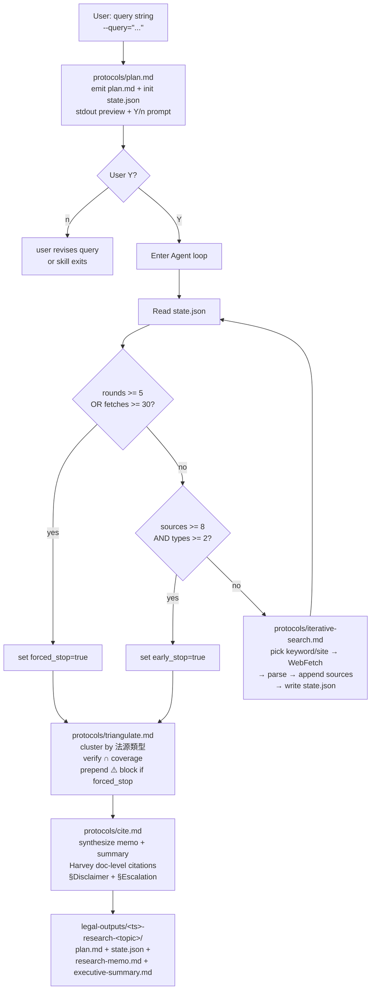

# legal-research

In-house legal toolkit **IRAC research** skill for Taiwan SME → 上市櫃
法務. Takes a 法律問題 / 條文號 / 判例編號 query and runs a plan-first
半互動 Agent loop (LLM plans search → user Y/n confirms → autonomous
WebFetch + triangulation + Harvey doc-level citation), producing a
4-file artifact set: `plan.md` + `state.json` + `research-memo.md` +
`executive-summary.md`. Loop is bounded by hard cap (≤ 5 rounds OR
≤ 30 fetches) with early-stop on ≥ 8 sources + ≥ 2 法源類型 covered;
when the cap is reached without early-stop, the skill emits a forced
`⚠️ 覆蓋未達 triangulation` warning marker rather than silently
under-delivering. The skill is **disclaimer-driven** (§6.3 inherited
from v0.4.x: every memo + summary ships with the Mandatory Disclaimer
footer) and **escalation-driven** (§6.4 inherited: forced_stop OR
high-stakes query domain hard-wires a 律師 escalation banner in
`executive-summary.md`, regardless of business pressure).

## Language Policy

- Skill instructions (this file, `protocols/`): English
- Domain content (citations, 條文 名 / 判決 字號 / 函釋 編號): zh-TW (preserve original)
- User-facing output (`plan.md` / `research-memo.md` / `executive-summary.md`): zh-TW (Traditional Chinese)
- `state.json` keys: English (machine-readable); values: zh-TW where they hold domain content (`type: "判決"` etc.)
- Mixed-language is **by design** — do NOT translate domain terms
  (條文 / 判決 / 函釋 / 學說 / 法源類型 / 覆蓋未達) into English; do
  NOT translate dispatch keywords (「查 §」/「判例」/「找判決」) either
  — the router scans the surface form.

## Workflow



The pipeline is **plan-gated** (user must confirm `plan.md` before
fetch budget burns), **state-tracked** (`state.json` is the single
deterministic checkpoint across LLM iterations), and **stop-bounded**
(hard cap + early-stop + forced_stop ⚠️ marker, no silent
under-delivery). Python only persists state; the loop is LLM-driven.

## Protocols

LLM reads ONE protocol per workflow step; each protocol either writes
to a checkpoint file (`plan.md` / `state.json`) or to a named section
in the final outputs.

| Step | File | Purpose |
|---|---|---|
| 1 | [`protocols/plan.md`](protocols/plan.md) | Emit `plan.md` (search keywords ≥ 3 + target sites ≥ 2 + 法源類型 plan + budget block) + initialize `state.json` (rounds=0 / fetches=0 / sources=[] / types_covered={} / early_stop=false / forced_stop=false / timestamps); stdout preview + "Plan OK 嗎? Y/n" |
| 2 | [`protocols/iterative-search.md`](protocols/iterative-search.md) | Single-round LLM-driven loop: read `state.json` → check budget (cap → forced_stop; early-stop met → exit) → pick keyword/site from plan → WebFetch → parse → append source candidates → increment counters → write `state.json` |
| 3 | [`protocols/triangulate.md`](protocols/triangulate.md) | Read sources from `state.json`, cluster by 法源類型 (條文 / 判決 / 函釋 / 學說), verify ∩ coverage. If `forced_stop=true`, prepend ⚠️ `覆蓋未達 triangulation` block above `§問題` in memo. |
| 4 | [`protocols/cite.md`](protocols/cite.md) | Synthesize `research-memo.md` (full analysis + inline citations + `## §Citations` manifest with Harvey doc-level reference + 1-line relevance per source) + `executive-summary.md` (TL;DR + ✅/⚠️/❌ + 依據 + escalation note). Owns the canonical §6.3 Disclaimer footer text + §6.4 Escalation block boilerplate. |

Each protocol uses the `halt + ask user` fallback when input is
ambiguous (e.g. `plan.md` halts if query < 10 chars or non-legal
content; `iterative-search.md` halts if `state.json` corrupt or plan
exhausted before early-stop).

## Reference files

Consumed by protocols (controller-drafted; `[draft — for 法務 review;
Phase 4.5 GC outreach validation]` header per
`feedback_legal_toolkit_defer_legal_domain.md`).

| File | Scope |
|---|---|
| [`references/webfetch-targets.md`](references/webfetch-targets.md) | Target sites (`law.moj.gov.tw` 全國法規 / `judicial.gov.tw` 判決系統 / `mojlaw.moj.gov.tw` 主管法規 / `pdpc.gov.tw` 個資) + URL patterns + crawl etiquette + Google cache + archive.org Wayback fallback chain. Consumed by `protocols/plan.md` (site selection) + `protocols/iterative-search.md` (fetch URL construction + fallback dispatch). |
| [`references/citation-format.md`](references/citation-format.md) | Harvey doc-level citation format worked examples for the 4 法源類型 (條文 / 判決 / 函釋 / 學說). Each example shows full reference (官方來源 + 識別字號 + 引用日期) plus 1-line relevance pinpoint. Consumed by `protocols/cite.md` (manifest synthesis). |
| [`references/triangulation-rules.md`](references/triangulation-rules.md) | 法源類型 classification heuristics + ∩ rules (early_stop ≥ 2 types floor; type promotion when 判決 cites 函釋; type demotion when 判決 outdated + 學說 反對). Consumed by `protocols/triangulate.md`. |

References are **operational**, not pedagogical — they encode
dispatcher logic + format templates rather than legal pedagogy.

## Plan-first 半互動 contract

Before any fetch budget burns, the skill emits `plan.md` and asks the
user to confirm. This is **mandatory**, non-skippable, and patterned
after the v0.4.2 SP3b `classify-path` Y/n precedent.

Concretely (per `protocols/plan.md`):

1. LLM parses `--query=...` argument
2. LLM emits `plan.md` to disk + prints the full content to stdout
3. LLM prompts: `Plan OK 嗎? (Y/n)` — exact zh-TW string, no
   variations (router log matches on this surface form)
4. **Y** → Step 1 of `protocols/iterative-search.md` begins
5. **n** (or any non-Y) → skill exits with `plan.md` on disk; user
   revises query and re-invokes (or hand-edits `plan.md` and
   re-invokes with `--plan-from plan.md` reserved for v0.5.x patch)

Rationale (Q5 locked): `plan.md` is a cheap reproducibility
checkpoint before the expensive 30-fetch budget is committed. User
controls token cost; auto-dispatch would silently burn budget on a
plan the user might not need.

## Agent loop spec

The loop is **LLM-driven** with deterministic state tracking via
`state.json`. Python is used only for state persistence; the LLM
re-reads `state.json` + this section + `protocols/iterative-search.md`
at the start of each iteration and decides whether to continue,
early-stop, or force-stop.

**Cap parameters** (centralized in
[`assets/triangulation-config.json`](assets/triangulation-config.json),
v0.5.3 patch room reserved for tuning):

| Parameter | Value | Meaning |
|---|---|---|
| `max_rounds` | **5** | Maximum number of loop iterations before forced_stop |
| `max_fetches` | **30** | Maximum WebFetch tool calls before forced_stop |
| `early_stop_min_sources` | **8** | `len(sources)` floor for early_stop dispatch |
| `early_stop_min_types` | **2** | `len(types_covered)` floor for early_stop (4-type ∩ too strict for new-domain queries; 2-type is realistic) |

**Loop logic** (executed at the top of every iteration; written
verbatim into `protocols/iterative-search.md`):

```
Read state.json
if rounds >= max_rounds OR fetches >= max_fetches:
    state.forced_stop = true → write state.json → break to triangulate
if len(sources) >= early_stop_min_sources AND len(types_covered) >= early_stop_min_types:
    state.early_stop = true → write state.json → break to triangulate
# Otherwise — pick next keyword/site combination from plan
# Call WebFetch tool → parse result → extract 0-N source candidates
# Append to state.sources (each: url_or_cite / type / captured_at / relevance_snippet)
# Update state.types_covered counters
# Increment rounds + fetches → write state.json → repeat
```

**Forced stop is NOT a failure mode** — it is the **safety net**.
When the cap is reached without early-stop, the memo is still produced
but with a prepended ⚠️ block warning the user that coverage is
insufficient and the conclusion confidence is degraded. The grader
(Task 5 in plan) treats forced_stop + ⚠️ marker as exit code 2
(`PASS_WITH_NOTES`), NOT exit 1 (`FAIL`).

## Output contract

Per session, writes to `<cwd>/legal-outputs/<YYYY-MM-DD-HHmm>-research-<topic>/`:

| File | Audience | Sections |
|---|---|---|
| `plan.md` | 法務 + 業務 (reproducibility checkpoint) | §問題 / §關鍵字 / §目標 site / §法源類型 plan / §Budget |
| `state.json` | 機器 (grader + LLM loop) | rounds / fetches / sources[] / types_covered{} / early_stop / forced_stop / started_at / updated_at |
| `research-memo.md` | 法務 / GC / 內部簽核 | §問題 / §搜尋摘要 / §法源分析 / §結論 / §Citations / §Disclaimer (+ conditional ⚠️ block prepended) |
| `executive-summary.md` | 非法務 (CEO / BD / 業務 / PM) | §問題 / §結論 (✅/⚠️/❌) / §依據 / §風險提示 / §Disclaimer (+ conditional §Escalation) |

`research-memo.md` conditional sections:

- **⚠️ 覆蓋未達 triangulation 警告 block** — REQUIRED when
  `state.json.forced_stop == true`. PREPENDED above §問題 (not
  appended). Body: explicit statement that the cap was reached
  without ≥ 8 sources + ≥ 2 法源類型, what the actual coverage was,
  and a recommendation to either rerun with refined plan or escalate.
  See `protocols/triangulate.md` for the template.

`executive-summary.md` conditional sections:

- **§Escalation** — REQUIRED when `state.json.forced_stop == true`
  OR when the query domain involves 刑事 / 訴訟 / 跨境 / 重大金額.
  Body: explicit recommendation to engage 律師 (external counsel)
  before relying on the memo. See §6.4 Escalation Override below —
  this is hard-wired, not an LLM judgement call.

Schema validation: `plan.md` / `research-memo.md` / `executive-summary.md`
have JSON Schema contracts in `assets/plan-schema.json` /
`assets/output-schema-memo.json` / `assets/output-schema-summary.json`;
`state.json` has `assets/state-schema.json`. All consumed by
`scripts/grade_research.py` (Task 5).

## §6.3 Mandatory Disclaimer footer

Every output `.md` file MUST end with the §6.3 Disclaimer footer.
**This skill produces law-source research — not formal legal opinion —
so the disclaimer explicitly scopes what the output is and is not.**

The verbatim canonical disclaimer text lives in
[`protocols/cite.md`](protocols/cite.md) §6.3 Disclaimer text section
(do NOT duplicate the text here to avoid drift; pattern mirrors
v0.5.0 `legal-issue-spot/protocols/risk-grade.md` ownership). cite.md
is the SoT; this section only describes the contract:

- Both `research-memo.md` and `executive-summary.md` MUST end with
  the boilerplate block (leading `---` separator + `## §Disclaimer`
  heading + body)
- `plan.md` SHOULD also carry the footer (it is user-readable too;
  reproducibility audits may surface it; grader does not enforce on
  plan.md in v0.5.2 — defer to v0.5.3 if needed)
- Body covers: AI-tool attribution / not formal legal opinion /
  current TW in-force law scope / recommendation to consult 律師
  for litigation, contract signing, criminal liability, cross-border,
  or high-stakes decisions
- The grader (`scripts/grade_research.py` `disclaimer_footer` check)
  greps for the canonical sentinel substring; missing footer → exit 1

## §6.4 Escalation Override

When `state.json.forced_stop == true` OR the query domain involves
**刑事 / 訴訟 / 跨境 / 重大金額**, `executive-summary.md` MUST contain
a `## §Escalation` section with explicit 律師 consultation
recommendation + transparent reasoning. This is **hard-wired**, not
an LLM judgement call. `protocols/cite.md` Step 3 emits the
§Escalation block with a fixed-format banner; the LLM does not get
to "soften" or skip it.

Rationale (inherited from v0.4.x SoT §6.4): when low confidence
(forced_stop) intersects user audience (non-lawyer reader of
executive-summary), or when stakes are high (刑事 / 訴訟 / 跨境 /
重大金額) regardless of confidence, disclaimer alone is insufficient —
the user needs an explicit "stop and talk to a lawyer" signal that
survives quick-skim reading.

Grader rule (`grade_research.py` `escalation_when_forced_stop` check):
if `state.json.forced_stop == true`, then `executive-summary.md` must
contain `§Escalation` section with a 律師 keyword. Missing → exit 1.
High-stakes domain detection is LLM-driven (the grader cannot reliably
classify domain), so the structural rule only enforces the
forced_stop trigger; high-stakes-domain enforcement is documented as
a SHOULD in `protocols/cite.md`.

## Cross-skill handoff (INBOUND only)

`legal-issue-spot/business.md` may emit a `## §建議下一步` block when
its 構成要件 涵攝 table contains ≥ 1 ⚠️ (low-confidence). Each
entry in that block hands off via the form:

```markdown
- §227 不完全給付的 carve-out 認定
  → `/legal-research --query="不完全給付 §227 carve-out 民國 110 年後判決趨勢"`
```

(Already documented in v0.5.0 `legal-issue-spot/SKILL.md`.) The
handoff is **soft** — user copies the command and invokes
`/legal-research` themselves; no auto-dispatch.

This skill treats the incoming `--query=...` string as **opaque
input**. `plan.md` parses keywords from it but does NOT validate
against any issue-spot-side schema. Rationale (Q6 + Q8 locked):
brittle alignment with issue-spot vocabulary would coupling the two
skills' vocabularies; opaque-input lets issue-spot evolve query
strings without breaking research.

**Reverse handoff (research → issue-spot) is NOT implemented** per Q8
design lock. Research input ≠ fact pattern, so there is no reliable
signal source. Router Q4 dispatch (fact vs law-lookup) catches
misrouted queries upstream.

## Path A discipline

This skill follows **Path A** (current Taiwan in-force law) per SP2
verify run + v0.4.x convention, inherited identically from
legal-issue-spot. Concretely:

- **No GDPR phrases** — no 72hr breach notification timer; no
  controller / processor 二分; no DPO terminology lifted from EU
  GDPR. Taiwan 個資法 uses 「即時」 reporting language + 委託/受託 model.
- **民法 §12-13 minor age** — not PDPA-specific minor age; the
  baseline is the 民法 limited-capacity / no-capacity threshold,
  consistent across statutes.
- **條文 text** — defer to canonical
  `legal-toolkit/scripts/canonical/legal-sources.json` for § references;
  do NOT inline-quote 條文 text in protocols, references, or fetched
  citations (avoids drift if 條文 amends).

Grader rule (`grade_research.py` `path_a_antipatterns` check): the
byte-identical `PATH_A_ANTIPATTERNS` bank (drift-verified across 4
graders by `legal-toolkit/scripts/verify-drift.py` in Task 7) fires
on any GDPR-style phrase in `plan.md` / `research-memo.md` /
`executive-summary.md`. Hits → exit 1.

## WebFetch crawl etiquette

WebFetch is the ONLY resource layer (Q1 locked: no Python scrapers).
`protocols/iterative-search.md` MUST observe:

- **User-Agent declaration** — identify as `legal-toolkit/0.5.2
  (Claude Code; in-house TW legal research)` in the fetch
- **Rate-limit awareness** — at most 1-2 fetches per second; if a
  site returns 429, back off + record the site as throttled in
  `state.json` (custom field `throttled_sites`)
- **robots.txt respect** — if a target path is disallowed, downgrade
  to fallback chain
- **Fallback chain** — primary URL → Google cache (`cache:URL`) →
  archive.org Wayback (`https://web.archive.org/web/*/URL`); if all
  three fail, log the failure in `state.json.sources` with
  `type: "unreachable"` and continue
- **403 / anti-bot handling** — treat as soft fail; do not retry the
  same primary URL; advance to next plan item

Target sites + URL patterns live in
[`references/webfetch-targets.md`](references/webfetch-targets.md);
do NOT inline the site list here to avoid drift.

## When to use

- Literal law-text lookup — "§227 是什麼?" / "民法 §184 構成要件"
- 判例 / 判決 趨勢 search — "民國 110 年後 不完全給付 carve-out 判決"
- 函釋 lookup — "個資法 §27 適當安全措施 PDPC 函釋"
- 學說 reference search — "王澤鑑 不完全給付 通說"
- Cross-skill handoff target from `legal-issue-spot` ⚠️ items

## When NOT to use

- **Fact-pattern analysis** — "我們想做 X，能不能做?" / "如果客戶請求
  Y，我們要怎麼回?" — route to `legal-issue-spot` (v0.5.0+), which
  does IRAC issue spotting + 構成要件 涵攝 + 風險分級
- **Contract review** — if the user provides a contract file or
  pasted contract text, route to `legal-contract-review` (7-layer
  pipeline + L7 playbook evaluation)
- **Document drafting** — if the user wants a 通知函 / 警示函 /
  終止合約信 drafted, route to `legal-document-draft` (skeleton +
  LLM fill)
- **Incident response** — if the user describes a *post-event*
  scenario (already-happened breach / 已收到 主管機關 函 / 已違約),
  route to `legal-incident-response` (3-path classifier)

The router (`using-legal-toolkit/SKILL.md` Q4-law-lookup branch,
unlocked in this PR per Task 6) makes this routing decision; this
skill is the dispatch target for law-lookup-style queries.

## Inputs

- **Required at session**: `--query="<NL query>"` — a free-text
  legal lookup question (typically 1-3 lines, e.g. `--query="不完全
  給付 §227 carve-out 民國 110 年後判決趨勢"`)
- **Opaque input** — the query string is treated as opaque to the
  skill (parsed for keywords in `protocols/plan.md`; no schema
  validation against any caller-side vocabulary)
- **No structured schema** — the input is free text; `plan.md`
  extracts ≥ 3 keywords + ≥ 2 target sites + 法源類型 plan in Step 1
- **No `profile.yml` dependency** — the skill is profile-independent;
  the analysis is query-driven, not company-identity-driven (router
  Q4-law-lookup bypasses the profile prerequisite check that Q2/Q3
  use for `legal-document-draft` / `legal-incident-response`)

## Outputs

4 files in `<cwd>/legal-outputs/<YYYY-MM-DD-HHmm>-research-<topic>/`:

- `plan.md` — search strategy (keywords + sites + 法源類型 + budget)
- `state.json` — Agent loop checkpoint (counters / sources / flags / timestamps)
- `research-memo.md` — full analysis for 法務 (with `## §Citations`
  manifest; ⚠️ block prepended when forced_stop)
- `executive-summary.md` — TL;DR for 業務 (with ✅/⚠️/❌ marker;
  `§Escalation` appended when forced_stop OR high-stakes domain)

## References

- Plugin spec: [`legal-toolkit/PRODUCT-SPEC.md`](../../PRODUCT-SPEC.md)
- ROADMAP: [`legal-toolkit/ROADMAP.md`](../../ROADMAP.md)
- Design spec (this skill): [`docs/superpowers/specs/2026-05-15-legal-toolkit-phase3-irac-cluster-design.md`](../../../docs/superpowers/specs/2026-05-15-legal-toolkit-phase3-irac-cluster-design.md) §6
- Implementation plan: [`docs/superpowers/plans/2026-05-15-legal-toolkit-v0.5.2-research.md`](../../../docs/superpowers/plans/2026-05-15-legal-toolkit-v0.5.2-research.md)
- Sibling skill (cross-skill handoff source): [`legal-issue-spot/SKILL.md`](../legal-issue-spot/SKILL.md)
- Canonical 條文 SoT: [`legal-toolkit/scripts/canonical/legal-sources.json`](../../scripts/canonical/legal-sources.json)
- Other sibling skills: `legal-contract-review` (Playbook) / `legal-document-draft` (Template) / `legal-incident-response` (Runbook)
- Inherited conventions: §6.3 + §6.4 from v0.4.x SoT design ledger; 2-file audience-shaped output from SP3a (PR #277) + SP3b (PR #286) + v0.5.0 (PR #291); grader self-contained + bank duplication from SP3a + SP3b + v0.5.0
