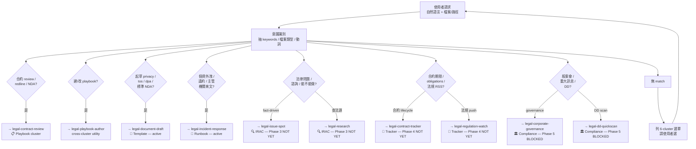

# using-legal-toolkit

The entry point. Listens to the user's natural-language request,
identifies which of the 6 functional clusters the task belongs to,
and dispatches to the appropriate sub-skill — or lists a menu when
the intent is ambiguous.

The router itself does **no domain work**: it never reads contracts,
never writes playbook entries, never produces legal findings. It is
a pure dispatch primitive (Harvey "Model System" layer).

## Language Policy

- Skill instructions (this file): English
- User-facing prompts (menu / clarification questions): zh-TW
- Mixed-language is by design — do NOT translate dispatch keywords.

## 6-cluster identification



## Decision logic

When invoked, the router reads the user's request and applies the
following sequence of checks. **First match wins** — the router
does not run multiple branches; it picks one.

### Step 1 — Extract intent signals

From the user's request, extract:

- **Keywords** (in both English and zh-TW): contract, review, redline, NDA, 合約, 審查, 紅線, 建 playbook, 起草, privacy, 個資外洩, 法規, 股東會, DD, etc.
- **File types** (if user attached / pointed at files): `.md` / `.docx` / `.pdf` of a contract → strong signal for Q1
- **Verbs**: "審" / "改" / "建" / "查" / "監看" / "起草" — each maps to a different cluster
- **Subjects**: contract / playbook / privacy policy / 個資事故 / 法規 / 股東會 / DD report

### Step 2 — Apply Q1-Q7 in order

| Q | If matched, dispatch to | Cluster | Status |
|---|---|---|---|
| Q1 — review a contract | `legal-contract-review` | 📋 Playbook | **MVP** |
| Q7 — author/extend/revise playbook | `legal-playbook-author` | utility | **MVP** |
| Q2 — draft privacy/tos/dpa/nda | `legal-document-draft` | 📝 Template | **active (v0.4.0+)** |
| Q3 — incident response (PII breach / 主管機關 / 違約) | `legal-incident-response` | 🚨 Runbook | **active (v0.4.2+)** |
| Q4 (fact pattern) — issue spot | `legal-issue-spot` | 🔍 IRAC | Phase 3 (not yet) |
| Q4 (law lookup) — research | `legal-research` | 🔍 IRAC | Phase 3 (not yet) |
| Q5 (contract lifecycle) — tracker | `legal-contract-tracker` | 📅 Tracker | Phase 4 (not yet) |
| Q5 (regulation feed) — watch | `legal-regulation-watch` | 📅 Tracker | Phase 4 (not yet) |
| Q6 (shareholders/board/disclosure) — governance | `legal-corporate-governance` | 🏛️ Compliance | **Phase 5 BLOCKED** on prerequisite research |
| Q6 (DD scan) — dd quickscan | `legal-dd-quickscan` | 🏛️ Compliance | **Phase 5 BLOCKED** on prerequisite research |

**Q1 / Q7 are MVP — actually dispatch. Q2 is active in v0.4.0+ — actually dispatch. Q3 is active in v0.4.2+ — actually dispatch.** Q4-Q6 are **not yet available** — see Step 4.

### Q2 — Document drafting (active in v0.4.0+)

**Keyword triggers**: 起草 / draft / 寫一份 / write a / 草擬 / generate / create a (followed by) 隱私權 / privacy / ToS / 服務條款 / DPA / 委託處理 / NDA / 保密協議

**Disambiguation**: if the user does not explicitly name a mode, ask:

> 哪種文件？1) 隱私權政策 (privacy)  2) 服務條款 (tos)  3) 委託處理協議 (dpa)  4) 保密協議 (nda)

Once mode is determined → hand off to `legal-document-draft` skill with the mode flag.

**Prerequisite check before handoff**: confirm `legal-playbook/profile.yml` exists in the working directory. If absent, surface to user:

> 起草前需要 `legal-playbook/profile.yml`（公司基本資料）。建議：
> 1) 看 `legal-toolkit/skills/legal-document-draft/assets/profile-schema.yml` schema
> 2) 在 `legal-playbook/` 下新建 `profile.yml`，填入公司名稱 / 統編 / 地址 / DPO 聯絡 / 一般聯絡 email
> 3) 完成後重新呼叫此 skill

Boilerplate keywords that should NOT route to draft (route to review instead): 看一下 / 審 / review / redline / 修改 (followed by) 我們收到 / 對方 / counterparty.

### Q3 — Incident response (active in v0.4.2+)

**Keyword triggers**: 個資外洩 / 資料外洩 / data breach / breach incident / 主管機關 / 函覆 / 來文 / 收到公文 / 應變 / 事件 / 違約 / 對方違約 / 客戶違約 / breach of contract / 賠償.

**Auto-classification**: `legal-incident-response` runs `protocols/classify-path.md` to dispatch among 3 paths:

- **個資外洩 (pii-breach)** — skeleton + LLM-fill 3-document bundle (PDPC 通報文 / 當事人通知文 / 內部記錄)
- **主管機關函覆 (authority-letter)** — pure-LLM 函覆 drafting with canonical-§-gated citations
- **合約違約 (contract-breach)** — thin classifier + handoff JSON to `legal-contract-review` (soft delegation; user manually 接力)

User confirms the auto-classified path before sub-protocol dispatch. → hand off to `legal-incident-response` skill.

**Prerequisite check before handoff**: same as Q2 — confirm `legal-playbook/profile.yml` exists (schema v2 — adds optional `external_counsel` + `regulatory_authorities`; backward-compat v1).

### Step 3 — Multi-intent handling

When the request matches multiple Q's (common: "review this contract AND update the playbook for it"):

**Priority order**:
1. Run the main task first
2. Then offer to follow up with the secondary

Example: user says "review this MSA, and the LoL fallback was wrong last time, let's fix it":
- First: dispatch to `legal-contract-review` for the actual review
- After review completes: prompt "Would you like to now revise the `limitation-of-liability` entry? `/legal-playbook-author revise limitation-of-liability`"

Why: running both in parallel costs context and may produce inconsistent state. Sequential with clear hand-off is cleaner.

### Step 4 — Phase 3-5 "not yet available" path

For Q4-Q6 matches, the router:

1. **Acknowledge** the intent — tell the user "I see you want to <X>"
2. **Inform** that the relevant skill is on the roadmap but not built yet:
   ```
   The skill for that task is planned for Phase <N> per the roadmap
   at legal-toolkit/ROADMAP.md. It is not yet available in this version.
   ```
3. **Offer alternatives** when possible:
   - For Q4 (issue-spot / research) — "For a basic fact-pattern question, you can describe the scenario to a Claude conversation directly; the structured `legal-issue-spot` skill is on the roadmap"
   - For Q5 (lifecycle / regulation) — "No substitute yet; manual tracking + periodic re-review is the current path"
   - For Q6 (governance / DD) — "BLOCKED on the upstream prerequisite research note for 上市櫃 in-house Compliance. Estimated availability per ROADMAP §Phase 5"
4. **Do not dispatch** — the not-yet-built skill doesn't exist as an installable resource; pretending to dispatch would fail loudly

### Step 5 — Ambiguous intent (no Q matches)

If none of Q1-Q7 match clearly, **do not guess**. Present the 6-cluster menu:

```
我不確定你要做什麼。可能屬於以下哪個 cluster？

📋 合約議價 (Playbook)
   → 我想 review / redline / 比對一份合約

📝 文件起草 (Template)
   → 我想起草 privacy policy / ToS / DPA / NDA  ✅ active (v0.4.0+)

🚨 事件應變 (Runbook)
   → 個資外洩 / 主管機關來文 / 客戶違約我要回應  ✅ active (v0.4.2+)

🔍 法律諮詢 (IRAC)
   → 我有 fact pattern 想知道法律分析 / 想查特定法條 / 判例  [Phase 3 — 還沒上]

📅 生命週期追蹤 (Tracker)
   → 合約到期 alert / 主管機關 RSS 訂閱  [Phase 4 — 還沒上]

🏛️ 公司治理 (Compliance)
   → 股東會 / 董事會 / 重大訊息 / 配合 DD  [Phase 5 — BLOCKED on research]

🔧 建 / 改 playbook
   → 我想建立或修改自家公司的合約議價規則

請告訴我屬於哪一類，或重述一下你的需求。
```

After the user picks, route to the corresponding sub-skill (or to the not-yet-available message).

## When to use

- User says anything legal-toolkit related without specifying which skill
- First-time install: user types `/using-legal-toolkit` to see what's available
- User wants to know whether a particular task is supported

## When NOT to use

- User already typed a specific sub-skill (`/legal-contract-review`, `/legal-playbook-author`) — they know what they want
- The task is non-legal (translation / coding / design) — route back to the correct plugin's `using-*` router

## Inputs

- `user_request`: string (natural language; may include file paths)

## Outputs

One of:

- **Dispatch decision**: `{ target: "legal-<sub-skill>", brief: <summary>, paths: [<extracted paths>] }`
- **Menu prompt**: 6-cluster menu (when intent is ambiguous)
- **Not-yet-available notice**: explanation + alternative routing where possible

The router does NOT execute the sub-skill; it produces the dispatch + brief and lets the host runtime invoke the chosen sub-skill.

## Output contract

```
✅ using-legal-toolkit complete.
   Dispatched to: <sub-skill name> / "no dispatch (Phase 3-5 not yet)" / "asked clarification"
   Intent recognised: <Q1-Q7 or unmatched>
   Brief: <1-sentence summary of what the sub-skill should do>
```

## Cold-start onboarding

First-time install path:

```
使用者: /using-legal-toolkit
(沒附其他資訊)

使用者: 我剛裝好這個 plugin，下一步幹嘛？

Router 回:
   歡迎！legal-toolkit v0.4.2 ships 5 個 active skill：
   - using-legal-toolkit (router，你正在用)
   - legal-playbook-author (建立你公司的議價 playbook)
   - legal-contract-review (跑 7 層合約審查 pipeline)
   - legal-document-draft (起草 privacy policy / ToS / DPA / NDA)
   - legal-incident-response (個資外洩 / 主管機關函覆 / 合約違約 三路應變)

   常見起手路徑：

   👉 如果你已經有想要 review 的合約：
      /legal-contract-review <path>
      （沒有自訂 playbook 也能跑 — 內建 4 條 baseline fallback）

   👉 如果你想先建立自家公司的 playbook：
      /legal-playbook-author
      （三選一：seed from bundled fallback / 5-題 interview / read-only）

   👉 如果你想起草隱私權政策 / ToS / DPA / NDA：
      /legal-document-draft --mode privacy|tos|dpa|nda
      （需要 legal-playbook/profile.yml；沒有的話 router 會引導你建立）

   👉 如果你遇到事件 (個資外洩 / 收到主管機關函 / 對方違約)：
      /legal-incident-response
      （3-path 自動分類 + 確認；需要 legal-playbook/profile.yml schema v2）

   👉 如果你想看完整的 plugin 全景：
      閱讀 README.md / ROADMAP.md

   你想怎麼開始？
```

## Reference

- Plugin spec: [`PRODUCT-SPEC.md`](../../PRODUCT-SPEC.md) / [`TECH-SPEC.md`](../../TECH-SPEC.md)
- Roadmap: [`ROADMAP.md`](../../ROADMAP.md) — full v0.1.0 → v1.0.0 plan, Phase 2-5 sub-skill ETA
- Active sub-skills:
  - [`legal-playbook-author`](../legal-playbook-author/SKILL.md)
  - [`legal-contract-review`](../legal-contract-review/SKILL.md)
  - [`legal-document-draft`](../legal-document-draft/SKILL.md)
  - [`legal-incident-response`](../legal-incident-response/SKILL.md)
