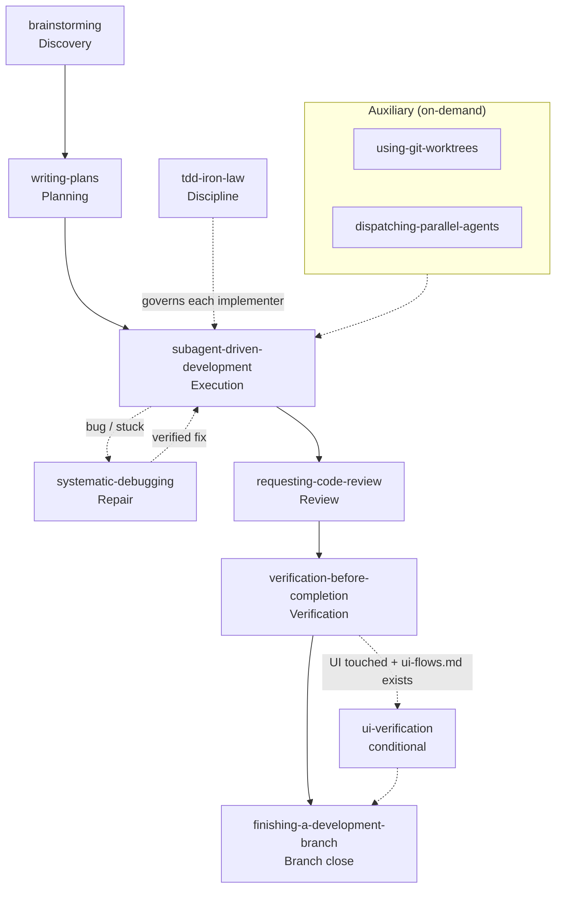

# loom-code

> **Process-discipline + canon-grounded coding workflow for Claude Code (+ Codex CLI).** A 12-skill plugin that auto-injects a SessionStart router charter so the agent stops rationalizing and starts deferring — every rule grounded in a primary source (Beck on TDD, Martin on naming, Fowler on refactoring, Feathers on legacy code, OWASP ASVS on security, 徳丸本 on encoding security).

**Status**: v0.22.0 — 12 skills; full Superpowers parity since v0.3.0. Per-version detail (rule-sheet injection, reviewer-discipline, parallel dispatch, spec→code seam, memory verify gate, …) lives in [CHANGELOG.md](CHANGELOG.md).
**Languages**: [English](README.md) | [日本語](README.ja.md) | [繁體中文](README.zh-TW.md)
**Repository**: part of [`monkey-skills`](https://github.com/kouko/monkey-skills)

---

## The 30-second example

Paste this into a fresh Claude Code session (after install — see below):

```
I want to add a feature flag system to our codebase so we can gate
new features. We don't have one yet. Just build the basic version:
env var checks + a hardcoded enabled list. No need to brainstorm,
the design is obvious.
```

**What happens** (with loom-code installed):

The router auto-injected at SessionStart fires Rule #1 (*"Brainstorm before implementing"*). The `brainstorming` skill activates with the 5-axis HARD-GATE measure. It refuses to skip discovery, articulates the JTBD framing, surfaces the alternatives (do nothing / single env var only / full flag system), and ends with `dev-workflow:complexity-critique` as the recommended next-step delegation — because feature-flag systems are the canonical PAGNI smell.

**What you didn't get**: 200 lines of premature feature-flag infrastructure for a problem that hasn't surfaced yet.

See [`docs/examples/`](docs/examples/) for 3 fully-worked end-to-end flows (Python / TypeScript / Swift).

---

## Install

### Claude Code

```bash
# One-time: add the marketplace
claude plugin marketplace add https://github.com/kouko/monkey-skills.git

# Install
claude plugin install loom-code@monkey-skills

# Verify
claude plugin list | grep loom-code       # expect: enabled
claude plugin details loom-code           # expect: 12 skills + 1 SessionStart hook
```

### Codex CLI (build complete; live verification deferred)

⚠️ Codex CLI manifest is built and bumped through v0.22.0 alongside the
Claude Code variant, but a live install + verification ritual on a real
Codex CLI instance is still deferred per user direction. See
[`tests/codex-cli/README.md`](tests/codex-cli/README.md) for the install
+ verify procedure when ready.

### Local development (for contributors)

```bash
# Clone monkey-skills + register as local marketplace
git clone https://github.com/kouko/monkey-skills.git
cd monkey-skills

# Add as local-scope marketplace (for testing loom-code changes)
claude plugin marketplace add . --scope local
claude plugin install loom-code@monkey-skills --scope local
```

---

## The 12 skills

| # | Skill | Stage | What it does |
|---|---|---|---|
| Router | [`using-loom-code`](skills/using-loom-code/) | Always-on | Auto-injected at SessionStart; 5 load-bearing rules + Skill Priority table |
| 1 | [`brainstorming`](skills/brainstorming/) | Discovery | HARD-GATE 5-axis exploration (Problem / Users / Smallest End State / Alternatives / What Becomes Obsolete); refuses skip-discovery rationalizations |
| 2 | [`writing-plans`](skills/writing-plans/) | Planning | ≤5-task plan with per-task RED-GREEN acceptance; BLOCKED → child-test fallback (Beck Part II §Child Test); v0.8.0 adds `Independent` + `Files touched` markup for parallel-dispatch eligibility |
| 3 | [`subagent-driven-development`](skills/subagent-driven-development/) | Execution | Per-task triad dispatch (implementer + spec-reviewer + code-quality-reviewer) |
| 4 | [`tdd-iron-law`](skills/tdd-iron-law/) | Discipline | "NO PRODUCTION CODE WITHOUT A FAILING TEST FIRST" (Beck 2002 Preface, ISBN 978-0321146533); §Feathers (2004) legitimate legacy-code backfill distinction |
| 5 | [`systematic-debugging`](skills/systematic-debugging/) | Repair | 4-phase REPRODUCE → ISOLATE → HYPOTHESIZE → VERIFY; HARD-GATE "NO FIXING WITHOUT REPRODUCING" |
| 6 | [`requesting-code-review`](skills/requesting-code-review/) | Review | Whole-branch review with 7-dimension scoring (cross-task-coherence as branch-only dimension); push-as-trigger |
| 7 | [`verification-before-completion`](skills/verification-before-completion/) | Verification | "NO DONE WITHOUT PACKAGE-LEVEL TEST INVOCATION"; 20+ stack canonical commands |
| 7b | [`ui-verification`](skills/ui-verification/) | Verification (conditional) | Drives the rendered app through `ui-flows.md`'s enumerated states via host browser/device automation; N/A-loud when conditions/tooling absent; token conformance excluded (parked) |
| 8 | [`finishing-a-development-branch`](skills/finishing-a-development-branch/) | Branch close | 7-step orchestrator (review → verify → git-memory mandatory → commit → push → optional PR + worktree cleanup) |
| Aux | [`using-git-worktrees`](skills/using-git-worktrees/) | Lateral | Native `git worktree` workflow; `.worktrees/<slug>/` convention |
| Aux | [`dispatching-parallel-agents`](skills/dispatching-parallel-agents/) | Lateral (v0.8.0+) | Across-domain `Agent` dispatch in one assistant message when 2+ problem domains are independent (disjoint files, no shared symbol, no sequential data dep); TDD iron-law applies per branch; verdict aggregation at this skill's layer |

Execution flow at skill granularity (solid = linear stage flow, dotted = conditional / on-demand):



---

## Quickstart — the linear flow

The intended user flow on a non-trivial task:

```
You: "I want to add feature X"
  ↓ (SessionStart hook router auto-fires)
brainstorming → 5-axis brief → docs/loom/specs/<topic>.md
  ↓
writing-plans → ≤5-task plan → docs/loom/plans/<topic>.md
  ↓
subagent-driven-development → per-task triad dispatch
  ↓ (per implementer subagent)
  tdd-iron-law → RED-GREEN-REFACTOR
  ↓ (if implementer returns BLOCKED with decomposition signal)
  writing-plans (re-invoked) → Child Test child decomposition
  ↓ (per task DONE)
SDD orchestrator continues
  ↓ (when all tasks DONE)
finishing-a-development-branch
  ↓ Step 1: requesting-code-review (cross-task-coherence dimension)
  ↓ Step 2: verification-before-completion (npm test / pytest / etc.)
  ↓ Step 3: dev-workflow:git-memory (Decision: / Learning: / Gotcha: trailers)
  ↓ Step 4: git commit (after user approval)
  ↓ Step 5: git push (after user re-authorization)
  ↓ Step 6: gh pr create (optional, opt-in)
  ↓ Step 7: git worktree remove (optional, confirm)
```

Plus on-demand:
- **`systematic-debugging`** fires when you hit a bug that's not "obvious one-line fix" — intermittent, "works on my machine", race conditions, etc.
- **`using-git-worktrees`** fires when you need parallel branches (this very plugin is developed on a worktree).

---

## Compatibility

| Harness | Status |
|---|---|
| **Claude Code** | ✅ Verified end-to-end through multiple ritual cycles — Phase 3 orchestrator (v0.3.0), Phase 4 prep (v0.4.0), multilingual research (v0.5.1), plugin-level agent dispatch (v0.5.2 + v0.6.0), whole-branch code-review with cross-task-coherence dimension (v0.6.0), reviewer-discipline SSOT extraction + Current State Evidence section (v0.7.0) |
| **Codex CLI** | ⚠️ Manifest built + tracked at v0.22.0; live install + verification ritual deferred per user (see `tests/codex-cli/README.md`) |

The SessionStart hook emits a portable JSON shape covering Claude Code's `hookSpecificOutput.additionalContext`, Codex CLI's `additional_context`, and legacy `additionalContext` keys — same hook serves both harnesses.

---

## Coexistence

This plugin is designed to coexist with related plugins, not compete:

| Plugin | Relationship |
|---|---|
| **[`domain-teams:code-team`](https://github.com/kouko/monkey-skills/tree/main/domain-teams/skills/code-team)** | Passive-gate compliance reviewer. loom-code is the active-build orchestrator that uses code-team's standards as its knowledge layer (byte-identical functional-copied via `scripts/distribute.py`, drift-checked by `scripts/verify-drift.py`). Same primary sources, different invocation mode. |
| **[`dev-workflow:git-memory`](https://github.com/kouko/monkey-skills/tree/main/dev-workflow/skills/git-memory)** | Mandatory delegation target in `finishing-a-development-branch` Step 3 per P3-D. Decides commit-trailer decisions (Decision: / Learning: / Gotcha:); loom-code does NOT duplicate. |
| **[`dev-workflow:complexity-critique`](https://github.com/kouko/monkey-skills/tree/main/dev-workflow/skills/complexity-critique)** | Optional delegation from `brainstorming` Axis 3 when complexity smell surfaces. Same SSOT-and-functional-copy mindset framing. |
| **[`obra/superpowers`](https://github.com/obra/superpowers)** | Design inspiration; coexists via `LOOM_CODE_MODE=off` escape hatch (set env var to disable loom-code hook; only superpowers fires). Both plugins can be installed; switch via env var. |

Cross-plugin behavior is verified by 5 integration test scripts in [`tests/integration/`](tests/integration/).

---

## Why this plugin exists

`monkey-skills` already had two related plugins:

- **`domain-teams:code-team`** — primary-source-grounded standards / rubrics / checklists (8 books from Beck to 徳丸本). Strong knowledge layer. Weak invocation: agent must remember to call it.
- **`obra/superpowers` (separate repo)** — SessionStart hook + measure rhetoric ("Delete it. Start over."). Strong invocation. Weak grounding: rules cite themselves, not canon.

`loom-code` is the synthesis: Superpowers-style auto-injection + code-team-style canon-grounded measures. Each rule is BOTH structurally enforced (via SKILL.md HARD-GATE + Red Flags refusal patterns) AND substantively justified (via primary-source citation with ISBN / URL / chapter reference).

---

## Documentation

- [PRODUCT-SPEC.md](PRODUCT-SPEC.md) — design intent, target users, Q-lock decisions
- [TECH-SPEC.md](TECH-SPEC.md) — architecture, SSOT mechanism, hook contracts
- [ROADMAP.md](ROADMAP.md) — phase plan, decision ledger, Phase 1.5 rolling backlog
- [CHANGELOG.md](CHANGELOG.md) — Journey overview + per-version detail
- [docs/examples/](docs/examples/) — 3 worked end-to-end examples (Python / TypeScript / Swift)
- [docs/announcement/v1.0.0-announcement.md](docs/announcement/v1.0.0-announcement.md) — public announcement draft (publishes at v1.0.0)
- [research/grounding-v0.1.0.md](research/grounding-v0.1.0.md) — per-version grounding audit

---

## Contributing

Issues + PRs welcome at https://github.com/kouko/monkey-skills/issues with `loom-code:` prefix.

For real-use dogfood notes (the v1.0.0-blocking P15-5 backlog item), drop them at `research/dogfood-YYYY-MM-DD-<topic>.md` — even short notes help calibrate the toolkit's measure strength.

---

## License

MIT — see [LICENSE](../LICENSE) at repo root.
