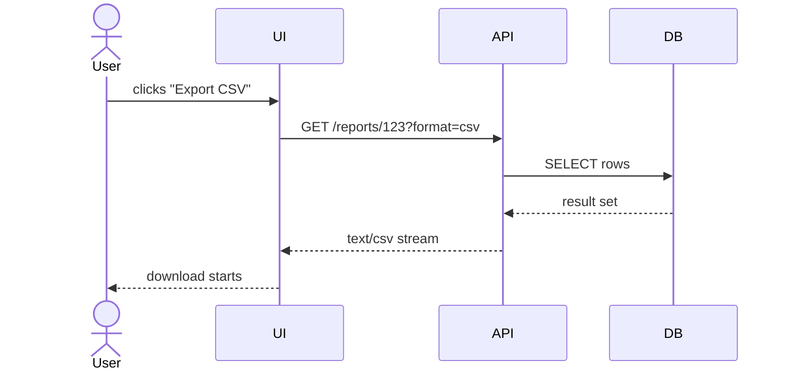
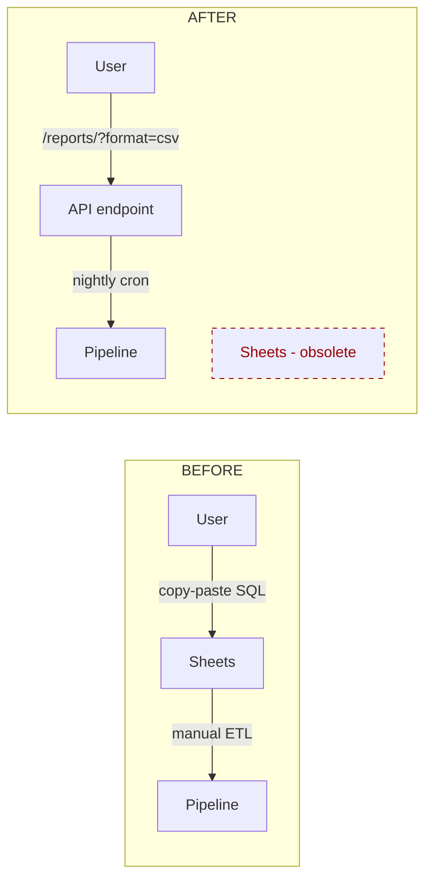
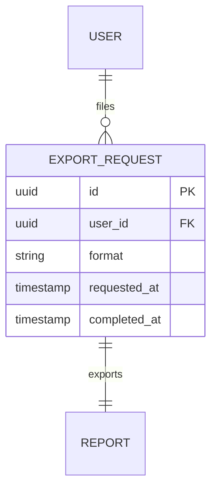

# Visual companion — when text isn't enough

> Companion to [`../SKILL.md`](../SKILL.md). Use when one of the axes — including Axis 0 — is **easier to think through visually than verbally**. Diagrams are not decoration — they are a different reasoning surface that catches errors prose hides.

## When a diagram pays for itself

| Axis | Diagram type | Pays off when |
|---|---|---|
| Axis 1 — Problem | (text usually fine) | Rarely needs a diagram — the problem is one sentence. |
| Axis 2 — Users + flow | **Sequence diagram** (Mermaid `sequenceDiagram`) | More than 2 actors involved (user + system + downstream); ordering matters; existing flow is being changed. |
| Axis 3 — Smallest end state | **Before / after architecture diagram** (Mermaid C4 / flowchart) | The smallest end state differs structurally from the first-proposed solution and the difference is hard to articulate in prose. |
| Axis 3 — Smallest end state (data side) | **ER diagram** (Mermaid `erDiagram`) | The change touches a database / schema; relationships between entities are the design point. |
| Axis 4 — Alternatives | **Decision tree** (Mermaid `flowchart TD` with branches) | 3+ alternatives with cascading consequences; the trade-off space is multi-dimensional. |
| Axis 5 — What becomes obsolete | **Two architecture diagrams side-by-side** ("before" vs "after") | Removal scope is non-obvious; the diff is structural not just textual. |

If you can finish the discovery in a paragraph, **do not draw a diagram**. The cost of switching modes is real.

## Diagram venues — pick the cheapest that works

| Need | Tool | Why |
|---|---|---|
| Inline in the brief markdown | **Mermaid** (renders in GitHub / Obsidian / VS Code preview) | Zero install; lives in the same file as the brief; survives `git diff`. **Default choice.** |
| Whiteboard-feel sketching | **Excalidraw** (`*.excalidraw` files, or pasted PNG) | When ideas are still moving and the structure is fuzzy; do not commit until they stabilize. |
| Formal architecture C4 | **Mermaid C4** (`C4Context`, `C4Container`) | When the diagram needs to live as a long-term reference, not a discovery artifact. |
| Cross-system sequence with many actors | **PlantUML** in repo, rendered to SVG | When Mermaid's sequence-diagram syntax gets cramped (>5 actors, complex grouping). |

## Mermaid quick reference for the 5 axes

### Sequence diagram (Axis 2 — user flow)



### Flowchart (Axis 4 — alternatives + decision tree)

```mermaid
flowchart TD
    Start[User asks "export to CSV"] --> Q1{Does report URL exist?}
    Q1 -- Yes --> A1[Add ?format=csv query param<br/>~20 LOC; no UI work]
    Q1 -- No --> Q2{Is this 1-time export?}
    Q2 -- Yes --> A2[Run ad-hoc SQL + paste to CSV<br/>0 LOC]
    Q2 -- No --> A3[Build /reports endpoint + ?format param<br/>~150 LOC]

    style A1 fill:#9f9
    style A2 fill:#9f9
    style A3 fill:#fcc
```

(Color note: `#9f9` = preferred; `#fcc` = rejected / more costly. Keep colors consistent across the brief.)

### Before / after architecture (Axis 5 — what becomes obsolete)



(Dashed border + red color signals **removed in this change**. Reviewer should grep for the obsoleted artifact in the same PR and confirm deletion.)

### ER diagram (Axis 3 — schema-touching changes)



## Channel-aware degradation

Mermaid/Excalidraw/PlantUML above assume a rendering host. Apply channel-aware degradation in a plain-text channel (terminal chat, PR text, Slack):

| Channel | Comparisons (Axis 4, ≥2 options) | Flows/states (Axis 2, Axis 5) |
|---|---|---|
| Terminal / PR text / Slack | markdown table | `ascii-graph-toolkit` (CJK-width-aware; verify alignment with its oracle, don't hand-draw) |
| Rendering host (GitHub / Obsidian / VS Code) | Mermaid/Excalidraw as above | Mermaid/Excalidraw as above |

Diagram labels always match the live conversation language.

## Anti-patterns

- ❌ **Diagram for its own sake.** If prose covers the axis in 2 sentences, draw nothing. A diagram is a tool for catching errors prose hides; if there's nothing to catch, the diagram is decoration.
- ❌ **Three diagrams for one axis.** Pick one venue per axis. If you find yourself needing multiple, the axis isn't sufficiently scoped — return to Axis 1 and split the problem.
- ❌ **Diagrams without legend / color discipline.** A flowchart with 10 boxes and no rejected-vs-preferred signal is just a sketch, not a decision aid.
- ❌ **Committing fuzzy whiteboard sketches as artifacts.** Excalidraw scratch is for thinking; once a decision is made, redraw as clean Mermaid in the brief. The brief survives 6 months; the whiteboard does not.

## How this fits with `dev-workflow`

- `dev-workflow:complexity-critique` — when you draw an architecture diagram and the "after" side is meaningfully bigger than the "before" side without proportional value, that is the deletion-first triage trigger. Delegate.
- `dev-workflow:proposal-critique` — when your alternatives flowchart has 3+ leaves and each has its own consequences, that is the multi-item triage trigger. Delegate.

## See also

- [`../SKILL.md`](../SKILL.md) — the 5-axis framework these diagrams support.
- [`handoff-brief-format.md`](handoff-brief-format.md) — where to embed the chosen diagram(s) in the structured brief.
- `obsidian:obsidian-mermaid-visualizer` — when the diagram lives in an Obsidian vault note (uses Mermaid v11.4.1+ syntax, portable to GitHub / VS Code / Notion / HackMD).
