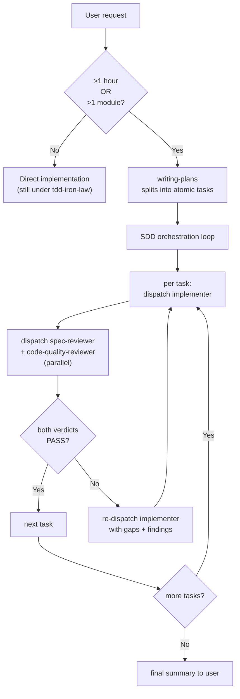

## Continuous execution

**Do not pause to check in between tasks.** When the orchestrator (this skill) receives a plan, it dispatches the first task's three subagents, waits for their verdicts, applies the resolution rule below, and immediately dispatches the next task. The user is not in the loop on a per-task basis — that is the loop SDD exists to remove.

Pause points the user **does** see:

- The plan itself, before any task is dispatched (user approves the task list).
- A `NEEDS_CONTEXT` from any implementer that survives the step-2 triage (orchestrator surfaces the question, waits for an answer; task-scoped checkable facts are resolved and re-dispatched without pausing).
- A `BLOCKED` from any implementer that the orchestrator cannot unblock by re-dispatch (e.g. missing dependency the user must install).
- The final summary after all tasks `DONE` (or `DONE_WITH_CONCERNS` triaged). At this pause point the orchestrator **proactively recommends [`finishing-a-development-branch`](../finishing-a-development-branch/SKILL.md) as the default next step** — it covers review + verification + push in one pass. Surface peer alternatives (keep iterating, hand off, leave the branch open) only if the user explicitly defers close-out.

Everything else — RED-GREEN-REFACTOR cycles, reviewer rounds, re-dispatch on `NEEDS_REVISION` — runs without user intervention.

**Subagent capacity errors (usage limit / "529 Overloaded").** If a subagent dispatch fails with a monthly-limit or 529 error mid-run: (1) do not silently retry in a loop; (2) finish and commit any tasks already `DONE` in the current wave; (3) surface ONE recovery question to the user with three options: wait for capacity to recover; proceed with explicit B2 orchestrator self-review (mark every verdict "[self-review — confirmation bias risk]"); or push the branch as-is and rely on CI. Phrase this per [§Asking the user](#asking-the-user). **After capacity recovers / 恢復後:** once the user confirms capacity is back, retrospectively dispatch the blocked reviewers on the already-committed artifacts (same subagent types, same inputs) — the commits are durable, so no work is lost. Treat any returned `NEEDS_REVISION` as a **new fix commit** (not a revert of the committed work), then proceed as if the verdicts had arrived on time.

## Asking the user

When you surface one of those pause points — the「下一步？」hand-off after a task DONE, a `NEEDS_CONTEXT` question, a `BLOCKED`, or the 4th-retry escalation — run the decision through three gates: **① whether to ask at all**, **② what to bring when you do ask**, and **③ how to phrase it**. The reader is a warm-but-interrupted human, not the reviewer subagent. The anchor for all three gates is Horvitz, *Principles of Mixed-Initiative User Interfaces* (CHI 1999): scale the act-vs-ask threshold by the cost of being wrong, and scope each question's precision to your confidence.

### ① Whether to ask — tier by reversibility × cost

Asking has a cost. Every low-stakes confirmation teaches the user that confirmations are noise, and then the asks that actually matter lose their signal (confirmation fatigue). Tier by reversibility × cost, not by habit:

- **Reversible + inferable from context** (edits, running tests, saving a memory, advancing to the next task) → just do it, mention it after. Under a standing "一路做完 / just finish it" authorization, do **not** re-confirm these per step.
- **Irreversible / outward-facing / costly** (`git push`, `gh pr create`, `gh pr merge`, deploy, delete, a paid pipeline run) → always confirm. The standing authorization does **not** cover these (`using-loom-code` router rule #4).
- **Genuine taste / scope / un-inferable intent** → run the **three-way triage** (the SSOT for this vocabulary): fact checkable within the task's own sources → look it up, never ask; user-fact, preference, or irreversible/outward-facing confirmation → ask directly, freely; researchable design fork → research first, then ask with a cited recommendation (research protocol: gate ②). A fact whose in-scope sources conflict, or whose reading is genuinely ambiguous in practice, is not "checkable" — treat it as a user-fact (a one-line clarification is legitimate).
- **Implementation-discovered engineering decision** (an implementer report surfaces it mid-task, not at kickoff): apply the two-axis test — product consequence × reversal cost — from `writing-plans/references/kickoff-briefing.md` (interface SSOT; pointer, not copy). A hit escalates in the SAME briefing format as the kickoff briefing — one interface, two firing points (design SSOT: `docs/loom/design/2026-07-10-designer-pm-loop-architecture.md` §2 / :227). Below-threshold decisions are **not** asked — they are **logged** (see §Decision Log maintenance below).

### ② What to bring — a recommendation, not an open question

When you ask a technical decision (a bug-fix approach, a design choice, error handling), bring your judgment, not the raw problem. An open-ended "how should I fix this?" with no options makes the user think *for* you — that is forbidden. Research industry practice first (`using-loom-code` router rule #5 / `brainstorming`'s Axis-4 — point to them, do not re-implement the protocol here), then lead with a scoped `(Recommended)` option plus one line of why. The less familiar the domain, the **more** research you owe; unfamiliarity must not collapse into an open question.

**Complex fork → brief before you ask.** When the fork is genuinely complex (≥3 trade-offs, ≥2 implementation paths, or architectural blast radius), a `(Recommended)` option alone still hands the user a choice they cannot evaluate — run `dev-workflow:brief-before-asking` (6-block briefing, Mental Model first) **before** firing the `AskUserQuestion`. Same trigger as `brainstorming`'s rule — `brainstorming` carries the canonical trigger rule; `dev-workflow:brief-before-asking` owns the 6-block format. This is a floor, not politeness: an unbriefed complex fork is the "technical choices I can't really evaluate" failure mode.

*(Grounded: Horvitz, Principles of Mixed-Initiative User Interfaces, CHI 1999 — scope precision to your confidence; "do less but correctly" beats punting wide.)*

### ③ How to phrase

1. **Outcome, not mechanism.** Each option describes what the user *gets* ("you'll get the two skills edited and tests green"), not the internal machinery ("uses SDD triad dispatch").
2. **Translate jargon; expand acronyms on first use.** Replace or gloss internal terms (`implementer`, `spec-reviewer`, 🟡/🟢, `Wave 1 = T1+T3`). **Exception**: terms the user introduced *this session* are fine as-is.
3. **Numbers carry their meaning.** `PASS 12/12` → "all 5 tasks checked out"; let the mechanism detail (`12/12`) sink to a sub-line, not the headline.
4. **Open with a one-line state anchor** (一句話現況): *we just did X; now Y needs deciding.* Reuse recap-state's Block-1 "Situation" idea — never ask a bare decision verb with zero context (「下一步？」alone is the failure). Put the anchor **inside the `AskUserQuestion` `question` field**, not only in chat prose above the call — the user reads the rendered question, not your preamble. **Never use internal vocabulary in the anchor** — phrases like "T3+T4+T5 reviewer verdicts" or "whole-branch review passed" mean nothing to the user; translate them ("three automated checks passed" / "the full-branch quality review passed"). And never list a slash command or CLI subcommand as an option without first confirming it exists (e.g. `claude --help`).
5. **≤4 options** (AskUserQuestion hard cap). Never add an explicit "Other" — the tool auto-injects it. End **open** design questions with a free-form invite; for **closed** factual questions, don't.
6. **Compound asks only when sub-questions share one topic** or are jointly judgeable. Split unrelated decisions into separate rounds.

**Worked example — the built-in `/recap` style is the target:**

```
✅ Standard (outcome-framed, no jargon, plain status, term-explained-on-use):
   "The first three pieces are done and checked out clean — the parser, the new flag, and the
    error path. The next one needs a call from you: when a tag is malformed, should the build
    just warn, or stop and fail?"

❌ Avoid (jargon-dense status-report style):
   "Wave 1 DONE: T1/T3/T4 PASS 3/3, reviewers green. T5 BLOCKED — NEEDS_CONTEXT on malformed-tag policy. Independent:false. 下一步？"
```

This ✅ example is the calibration target for every question and hand-off the orchestrator surfaces below.

**Delivery form.** Every per-wave status report and checkpoint sign-off surfaced under this gate is delivered as the user-rollup card, filled in the live conversation language — see `loom-pipeline/hooks/family-relay.md §Family relay discipline`. Never copy the card template body here; point at it. Internal machine traffic (verdict tokens, wave labels) stays precise below the card.

## When to use

Auto-routed by [`using-loom-code`](../using-loom-code/SKILL.md) when **either** trigger fires:

- The user's task is estimated to take **>1 hour**.
- The task touches **>1 module / >1 file boundary**.



If neither trigger fires, the user goes straight to `tdd-iron-law` for implementation. SDD's overhead is not free; do not dispatch three subagents for a one-line change.

## Process — per-task triad

Dispatch every subagent call below as a one-shot, blocking call that waits for and returns its result directly — see your host's tool-mapping reference under `using-loom-code/references/` (`claude-code-tools.md` / `codex-tools.md`) for the exact call shape, and [environment-gotchas](../using-loom-code/references/environment-gotchas.md) §A1 for a Claude-Code-specific naming pitfall to avoid (Codex has no equivalent).

For each atomic task in the plan:

1. **Dispatch an `implementer` subagent** (role identifier `loom-code:implementer`; input contract defined in the plugin-level agent at [`loom-code/agents/implementer.md`](../../agents/implementer.md), which also carries the 12-rule engineering baseline from [`loom-code/scripts/_baseline.md`](../../scripts/_baseline.md)) with the task description + context paths + resource paths. Before dispatching, the orchestrator resolves the project's test command once via `verification-before-completion`'s declared-first rule (consult the declared surface; trust only if it runs and emits a test count; else fall back to detection), caches it **session-scoped** (re-resolve across sessions because declarations rot), and passes it into the implementer dispatch as a **`Resolved test command`** line so the implementer runs the project's real test command instead of re-detecting. (Optional optimization: invalidate the session cache mid-session if the declaring file's content-hash changes.) Relevant `Kickoff decision:` lines from the plan's `## Notes` ride the implementer's task packet. Wait for return.
2. **Read the implementer's output.** If `status: NEEDS_CONTEXT` → do not dispatch reviewers; triage the relayed question FIRST per gate ①: a task-scoped checkable fact → resolve it yourself and re-dispatch the implementer (no user ask); a researchable design fork → research per gate ②, then surface with the cited recommendation; otherwise surface directly, phrased per [§Asking the user](#asking-the-user). A surfaced question with product stakes also applies gate ①'s two-axis framing to decide the escalation format. If `status: BLOCKED` → apply the unblock step or surface to user.
3. **If `status: DONE` or `DONE_WITH_CONCERNS`**, dispatch **`spec-reviewer`** and **`code-quality-reviewer`** **in parallel** (same fan-out step — see `dispatching-parallel-agents` §3) — both plugin-level agents (v0.6.0 / P15-12 Phase 2), role identifiers `loom-code:spec-reviewer` and `loom-code:code-quality-reviewer`. See [`loom-code/agents/spec-reviewer.md`](../../agents/spec-reviewer.md) + [`loom-code/agents/code-quality-reviewer.md`](../../agents/code-quality-reviewer.md) for input/output contracts. Wait for both.
4. **Resolve verdicts** per the rule below.
5. **Move to the next task** unless the resolution requires re-dispatch.

**Parallel dispatch for independent tasks.** Tasks marked `Independent: true` with disjoint file sets → dispatch all their implementers in ONE fan-out step (see `dispatching-parallel-agents` §3 for the host-specific shape). When the wave completes, commit each task's `PASS` artifacts immediately — do not hold a passing task's commit while a `NEEDS_REVISION` sibling in the same wave is re-dispatched. Keeping commits atomic makes the diff bisectable.

**Mechanical review-weight exemption.** When a task's plan entry declares `Review-weight: mechanical` and the implementer returns `DONE`, the orchestrator SKIPS the step-3 `spec-reviewer` + `code-quality-reviewer` dispatch entirely and instead runs a deterministic **self-check** with two concrete parts, both required:

1. **Content match.** The task's `Description` names an exact-spec target, in one of two shapes:
   - **Literal target** — a literal string (grep it: it must be PRESENT in each file listed in `Files touched`; for a "replace X with Y" description, the grep target is Y, the post-edit state) or a literal diff block (per Check 16's "literal string/diff" co-condition — apply the same match, verbatim, via `git diff` against the stated before/after rather than a plain grep).
   - **Deterministic sync-script target** (see `plan-format.md`'s matching worked example) — the Description names a script + its SSOT instead of a literal string. **Before trusting a re-run, first confirm the script itself is untampered**: `git status --porcelain <script-path>` must be clean AND the script must not appear in the task's own `Files touched` — a script that is itself uncommitted, newly added, or edited by this task cannot be re-run as a trust anchor, since that makes the "zero diff" check tautological (the output would trivially match a script the implementer just modified). If the script isn't clean-and-untouched, this shape's Content match FAILS outright — fall back to the full triad, do not attempt the sub-checks below. Once the script is confirmed untampered: re-run it yourself and confirm the committed `Files touched` content has **zero diff** against the fresh run's output, OR — if the script ships a paired drift-detection test (as `sync-primitives.sh` / `sync_codex_manifests.py` do) — run that test and require exit 0. Either sub-check satisfies Content match for this shape; a mismatch or nonzero exit falls back to the full triad exactly like a failed literal-target match.
2. **Scope match.** `git diff --name-only` for the task's commit MUST be a subset of the task's declared `Files touched` — no additional file, and no line outside what the exact-spec target names, may appear in the diff.

Both parts passing resolves the task as `DONE` with no reviewer verdict (this exemption bypasses the §Verdict resolution table below entirely — no spec-reviewer/code-quality-reviewer verdicts exist on this path). Either part failing (content absent, extra files touched, or any ambiguity in applying either check) falls back to the full triad — fail-closed toward review, never toward silently skipping on ambiguity. This exemption is gated upstream by `plan-document-reviewer` Check 16 (see `writing-plans/references/plan-document-reviewer-prompt.md`): a plan setting the field without satisfying Check 16 never reaches SDD, so the orchestrator trusts the marker's presence without re-validating it here.

**Progress ledger — maintain `Status` per task + resume from it (v0.10.0+, optional).** When the plan carries the optional per-task `Status` field (see `writing-plans/references/plan-format.md` §Progress ledger), the orchestrator **writes it back into the plan as it executes** so the plan becomes a durable, shared progress record:

- On dispatch → set `Status: claimed(@<agent>)` (`<agent>` = the worktree branch name, unique per agent; for a single-orchestrator run use the current branch).
- On resolved DONE (both reviewers PASS / PASS_WITH_NOTES **— or, on the `Review-weight: mechanical` path above, the self-check passing in place of reviewer verdicts**) **after committing** → set `Status: done(<sha>)` with that task's commit sha.
- On `BLOCKED` / NEEDS_CONTEXT / the 3-round cap → set `Status: blocked`.

Commit the ledger update **per task** (lean: keep it maximally current so a crash loses at most the one in-flight task). The plan file is the SSOT for progress; the per-task code commits are the durable artifacts the ledger points at.

**Resume after interruption:** on re-entry, **read the plan ledger first** — skip every `done(<sha>)` task (its work is committed), redo only **your own** in-flight `claimed(@<this-agent>)` task, and continue. (In mode (b), leave a sibling agent's live `claimed(@other)` alone — it owns that slice; see `dispatching-parallel-agents` §Multiple concurrent sessions.) This is the continuous, finer-grained complement to `dev-workflow:handoff` (which stays for the cross-session narrative + verification commands). A plan with no `Status` fields → behaves exactly as before (the ledger is opt-in by presence).

**Decision Log maintenance — append during execution.** When the orchestrator or an implementer report surfaces an agent-decided engineering choice that was classified by the §Asking the user two-axis test and did **not** escalate to a briefing (any non-briefed, classified decision — both two-way-door cells, per `kickoff-briefing.md` §a/§e), append one entry to the plan's `## Decision Log` per `writing-plans/references/plan-format.md`'s record spec (pointer — do not restate the format). Write it into the plan document itself, the same artifact the Progress ledger lives in. Commit the entry with that task's ledger update — same per-task cadence as `Status`, above. **Appetite read**: before applying the threshold, check the target repo's `docs/loom/PRINCIPLES.md` Engineering Principles section for an `escalation appetite` entry (landing shape: `loom-product-principles/skills/product-principles/references/principles-rules.md` §Escalation appetite — landing shape) and tune the bar accordingly, read once, never re-ask; absent → default to the threshold as written.

**Read-before-Edit is non-negotiable for the orchestrator.** When the orchestrator applies post-review fixes, renames files, or edits files located via **any Bash inspection** — `grep` / `jq` / `sed` / `cat` / `head` / etc.: call `Read` on each target file before `Edit`. The precondition is tool-level — only the `Read` tool satisfies it, never shell stdout. grep/jq/sed/cat output and subagent-created files do NOT satisfy the Edit read-precondition. Skipping this produces cascading "File has not been read yet" errors across every subsequent edit. For the full set of harness gotchas, see [environment-gotchas](../using-loom-code/references/environment-gotchas.md).

**Environment hygiene.** Commands the orchestrator (or its subagents) run directly:

- Prefix every `pytest` invocation with `PYTHONDONTWRITEBYTECODE=1` — without it, Python writes `__pycache__` directories that trip the skill-folder structure hook.
- Resolve `git worktree add` paths from the **repo root**; a relative path issued from inside a subdirectory nests the worktree inside a skill folder, triggering the same hook.
- Issue branch-push and `gh pr create` as **two separate Bash calls** — chaining them with `&&` triggers the dcg "push to main" guard pattern.
- Before every per-task commit **in a parallel wave**, run `git status --short` and confirm **only that task's files are staged** — sibling implementers in the same wave may have staged their files into the shared index, and `git add <specific-file>` does not unstage them.

**Version / semver work in implementer tasks.** Before importing a package for version parsing or manifest handling, the implementer must confirm it is stdlib (e.g. `importlib.metadata`, plain `tuple(int(x) for x in v.split('.'))`) rather than third-party (e.g. `packaging`). Third-party imports in new code fail the code-quality-reviewer's external-surface-grounding check and return `NEEDS_REVISION`.

### Verdict resolution

| spec-reviewer | code-quality-reviewer | Resolution |
|---|---|---|
| `PASS` | `PASS` | Task DONE. Next task. |
| `PASS` | `PASS_WITH_NOTES` | Task DONE. 🟡 / 🟢 findings surfaced in final summary as debt; do not block. |
| `PASS` | `NEEDS_REVISION` | Re-dispatch implementer with `findings`. Up to **3 rounds** then escalate to user. |
| `NEEDS_REVISION` | (any) | Re-dispatch implementer with `gaps` + (if any) `findings`. Same 3-round cap. |

A 3-round cap prevents infinite loops on ambiguous specs. On the 4th retry, surface to the user — likely the spec is wrong, not the implementer. Phrase that escalation per [§Asking the user](#asking-the-user): lead with a state anchor and say what's actually stuck in plain words, not `NEEDS_REVISION ×3`.

## Red Flags — refuse these rationalizations

| Agent / user says | Reality | Correct response |
|---|---|---|
| *"This is basically mechanical, I'll skip review even though the plan didn't mark it."* | The `Review-weight: mechanical` marker is `plan-document-reviewer`-validated (Check 16), never an on-the-fly implementer/orchestrator judgment call. | Refuse. Run the full triad unless the plan itself declares `Review-weight: mechanical`. |
| 「這基本上是機械式的,計畫沒標我也自己跳過審查吧 / これは機械的だからレビューを省略しよう」 | Same rationalization, localized. | Same refusal — the marker must come from the plan, not an improvised call. |

## Definition of Done — command-surface accretion

A task that introduces a **new runnable capability** (a new test suite, build step, lint target, e2e suite, `migrate` command, etc.) must have that verb **declared in the command surface** (the project's declared commands — `AGENTS.md` commands section, `make`/`just` recipes, `package.json` scripts) **AND verified to run** before the implementer reports `DONE`. This is **accretion**: it binds "add a capability" to "declare it in the surface" exactly as TDD binds "add behaviour" to "add a test". Enforcement lives in the **implementer's task-completion contract** (verify-before-declare + declare in the managed block, as specified in [`loom-code/agents/implementer.md`](../../agents/implementer.md)) — it is the implementer that self-enforces this obligation, not the orchestrator's verdict-resolution table.

**Event-driven — not per-task polling.** A task that adds *no* new runnable capability triggers *no* surface change. The clause is a no-op for the common case. It is **not** a per-task audit of the whole surface, and it is **not** a build-once bootstrap. *Negative example:* a task that adds only a helper function, an internal class, or a private module — with no new top-level runnable verb — does NOT trigger this.

**Moving target.** "Complete" is relative to the project's *current* capabilities. Never pre-declare a verb that does not yet exist (no `deploy` entry before deployment exists; no `migrate` entry before a migration runner exists).

**Mechanics.** The implementer reuses the declared-first resolution from `verification-before-completion` to locate the surface. Full mechanics (managed block, shim pattern, verify-before-declare discipline) are in the implementer contract at [`loom-code/agents/implementer.md`](../../agents/implementer.md).

## Model selection

Pick the cheapest model that meets the task's actual reasoning load.

| Task category | Model class | Examples |
|---|---|---|
| Mechanical | cheap (Haiku / equivalent) | Rename a symbol across files; add a simple test fixture; format / lint cleanup |
| Integration | standard (Sonnet / equivalent) | Wire a new endpoint; add a feature flag check; refactor a function while preserving tests |
| Architecture | most capable (Opus / equivalent) | Introduce a new module boundary; design an interface; non-trivial security-sensitive logic |

Reviewers usually run at one tier below the implementer — they grade against fixed rubrics, which is cheaper than producing the artifact. **Exception**: when the implementer ran at the most-capable tier on an architectural task, the code-quality-reviewer also runs at most-capable (subtle design errors need the same horsepower to catch).

## Status handling — implementer states

```
DONE                 → dispatch reviewers
DONE_WITH_CONCERNS   → dispatch reviewers; surface concerns to user in final summary
NEEDS_CONTEXT        → surface specific question to user; do NOT dispatch reviewers
BLOCKED              → apply unblock_step if orchestrator can; else surface to user
```

The orchestrator never silently dismisses a `BLOCKED` — even if the unblock step is trivial, log what was done so the final summary names it. A `NEEDS_CONTEXT` question with product stakes goes through the same two-axis framing (§Asking the user ①) before it reaches the user.

Whatever the user sees at this seam — a wave sign-off, a `DONE_WITH_CONCERNS` summary — is the rollup card in the live conversation language, per `loom-pipeline/hooks/family-relay.md §Family relay discipline`; this table's states are internal routing, not user-facing copy.

## Prompt templates

Three role-defined plugin-level subagents (v0.6.0 / P15-12 complete); all carry the 12-rule engineering baseline ([`loom-code/scripts/_baseline.md`](../../scripts/_baseline.md)) baked into their system prompts. Dispatch each one as a one-shot blocking call — see your host's tool-mapping reference for the exact shape, and [environment-gotchas](../using-loom-code/references/environment-gotchas.md) §A1 for the Claude-Code-specific naming pitfall (Codex has no equivalent).

- **implementer** — worker; produces code + tests + status. [`loom-code/agents/implementer.md`](../../agents/implementer.md). Role identifier `loom-code:implementer`. Shipped v0.5.2 / P15-12 Phase 1.
- **spec-reviewer** — evaluator; produces `PASS` / `NEEDS_REVISION` + gap list. [`loom-code/agents/spec-reviewer.md`](../../agents/spec-reviewer.md). Role identifier `loom-code:spec-reviewer`. Promoted v0.6.0 / P15-12 Phase 2.
- **code-quality-reviewer** — evaluator; produces three-valued verdict + seven-dimension scores + findings. [`loom-code/agents/code-quality-reviewer.md`](../../agents/code-quality-reviewer.md). Role identifier `loom-code:code-quality-reviewer`. Promoted v0.6.0 / P15-12 Phase 2.

Reviewer prompts intentionally constrain scope: spec-reviewer **cannot** evaluate code quality; code-quality-reviewer **cannot** evaluate spec coverage. Mixing the two collapses the signal at the orchestrator level.

## Cross-skill contract

- **[`tdd-iron-law`](../tdd-iron-law/SKILL.md)** — implementer prompts must load this skill before writing code. The reviewer's `tests` dimension scores against `standards/tdd-standard.md` (functional copy of code-team SSOT).
- **`writing-plans`** — produces the task list SDD consumes.
- **`finishing-a-development-branch`** — runs after the last task is DONE; delegates to `dev-workflow:git-memory` for commit-message memory.
- **`domain-teams:code-team`** — passive gate; not invoked by SDD directly. The knowledge layer here is a functional copy of code-team's standards / rubrics / checklists, kept byte-identical by `scripts/distribute.py` + `scripts/verify-drift.py`.

## Knowledge layer

`standards/`, `rubrics/`, `checklists/` under this skill are byte-identical functional copies (plus a 5-line SSOT header) of the canonical `code-team` knowledge layer (which lives in the sibling `domain-teams` plugin). To edit a rule:

1. Land the edit in the canonical `code-team` source.
2. In the same commit, run `python3 loom-code/scripts/distribute.py`.
3. CI's `verify-drift.py` enforces byte-identity.

See [`../../scripts/canonical/README.md`](../../scripts/canonical/README.md) for the full pointer table (canonical paths + functional-copy destinations).

## What this skill does NOT do

- Does **not** write code itself. It dispatches implementer subagents.
- Does **not** produce gate verdicts itself. Reviewer subagents do.
- Does **not** decide whether SDD applies. `using-loom-code` routes; this skill assumes the trigger fired.
- Does **not** edit the spec. If the implementer returns `NEEDS_CONTEXT` pointing at a spec gap, the orchestrator surfaces to the user; the user (or `writing-plans`) updates the spec.
- Does **not** produce the plan. `writing-plans` does — SDD consumes the plan.

## See also

- [`loom-code/agents/implementer.md`](../../agents/implementer.md) — plugin-level implementer (v0.5.2+).
- [`loom-code/agents/spec-reviewer.md`](../../agents/spec-reviewer.md) — plugin-level spec-reviewer (v0.6.0+).
- [`loom-code/agents/code-quality-reviewer.md`](../../agents/code-quality-reviewer.md) — plugin-level code-quality-reviewer (v0.6.0+).
- [`loom-code/scripts/_baseline.md`](../../scripts/_baseline.md) — SSOT for the 12-rule engineering baseline embedded in every plugin-level agent.
- [`../tdd-iron-law/SKILL.md`](../tdd-iron-law/SKILL.md)
- [`../using-loom-code/SKILL.md`](../using-loom-code/SKILL.md)
- [`../../TECH-SPEC.md`](../../TECH-SPEC.md) §3.3–3.4 — interface contracts.
