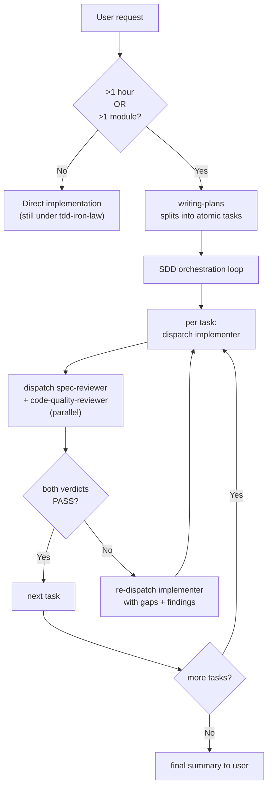

# Dispatch hygiene notes

Companion file to `SKILL.md`, kept out of the body to stay under the
CHK-SKL-010 word cap. It carries two kinds of section, and each is
referenced from a skill body by a one-line pointer: worked-out
illustrations of rules the body already states (§Worked example, §SDD
flow diagram — the pointer's rule is authoritative, the section only
illustrates it), and standing dispatch guidance stated in full here
(§Capacity-error recovery, §Worktree-isolated reviewer dispatch,
§Environment hygiene, §Dispatch-packet context — the section itself is
the rule; the body pointer is the route to it).

## Capacity-error recovery

**Subagent capacity errors (usage limit / "529 Overloaded").** If a
subagent dispatch fails with a monthly-limit or 529 error mid-run: (1)
do not silently retry in a loop; (2) finish and commit any tasks
already `DONE` in the current wave; (3) surface ONE recovery question
to the user with three options: wait for capacity to recover; proceed
with explicit B2 orchestrator self-review (mark every verdict
"[self-review — confirmation bias risk]"); or push the branch as-is
and rely on CI. Phrase this per §Asking the user in `SKILL.md`.
**After capacity recovers / 恢復後:** once the user confirms capacity
is back, retrospectively dispatch the blocked reviewers on the
already-committed artifacts (same subagent types, same inputs) — the
commits are durable, so no work is lost. Treat any returned
`NEEDS_REVISION` as a **new fix commit** (not a revert of the
committed work), then proceed as if the verdicts had arrived on time.

## Worktree-isolated reviewer dispatch

- **The worktree may be detached at the default-branch tip** — when the
  orchestrator's working tree already holds the branch under review,
  `isolation: worktree` cannot check that branch out a second time, so
  the new worktree lands detached at the default branch's tip instead.
  The dispatch packet must tell the reviewer to address the artifact
  via `git show <branch>:<path>` or `git show <sha>:<path>` (both
  resolve through the shared object DB regardless of what the worktree
  has checked out; bare `git show <sha>` prints the commit itself,
  which suits diff review) and never assume the checked-out `HEAD` is
  the artifact under review.
- **Name known environmental test failures in the packet** — a suite
  run from a flat extracted copy or a foreign checkout can fail tests
  the branch itself did not break (live: `test_codex_git_guard_shim.py`
  needs a real `.git` directory). Naming these once in the dispatch
  packet saves every reviewer arm from independently rediscovering and
  re-proving the same environmental failure.
- **`standards_version` comes from the REVIEWED BRANCH's manifest**
  (`git show <branch>:loom-code/.claude-plugin/plugin.json`), never
  the worktree's own checkout — a detached worktree otherwise stamps
  the wrong version (live: 0.50.0 stamped on a 0.51.0 branch).
- **Never `git checkout` / `git switch` in the orchestrator's main
  working tree** — the dispatch packet names absolute paths under the
  main repo, so a worktree-isolated agent can still run git there and
  detach the tree the orchestrator is about to commit on (live: a
  close-out commit landed on a detached HEAD this way). Read other
  revisions via `git show`; run anything that needs a different
  checkout inside your OWN worktree. The main tree's checkout state
  belongs to the orchestrator alone.

## Worked example — the built-in `/recap` style is the target

```
✅ Standard (outcome-framed, no jargon, plain status, term-explained-on-use):
   "The first three pieces are done and checked out clean — the parser, the new flag, and the
    error path. The next one needs a call from you: when a tag is malformed, should the build
    just warn, or stop and fail?"

❌ Avoid (jargon-dense status-report style):
   "Wave 1 DONE: T1/T3/T4 PASS 3/3, reviewers green. T5 BLOCKED — NEEDS_CONTEXT on malformed-tag policy. Independent:false. 下一步？"
```

This ✅ example is the calibration target for every question and
hand-off the orchestrator surfaces in `SKILL.md`.

## SDD flow diagram



This visualizes the same trigger + per-task loop described in
`SKILL.md` §When to use and §Process — per-task triad; it adds no
rule beyond what those sections already state in prose.

## Environment hygiene

Commands the orchestrator (or its subagents) run directly:

- Prefix every `pytest` invocation with `PYTHONDONTWRITEBYTECODE=1` — without it, Python writes `__pycache__` directories that trip the skill-folder structure hook.
- Resolve `git worktree add` paths from the **repo root**; a relative path issued from inside a subdirectory nests the worktree inside a skill folder, triggering the same hook.
- Issue branch-push and `gh pr create` as two separate Bash calls — see [environment-gotchas](../../using-loom-code/references/environment-gotchas.md) §S2(a) for why (dcg "push to main" guard pattern), rather than restating it here.
- Before every per-task commit **in a parallel wave**, run `git status --short` and confirm **only that task's files are staged** — sibling implementers in the same wave may have staged their files into the shared index, and `git add <specific-file>` does not unstage them.

## Dispatch-packet context

Rules for the context the orchestrator composes into any dispatch
packet — worker or reviewer:

- **Anchor by string, never by line number alone.** Site inventories
  and exact target strings ride the packet, anchored by verbatim
  string or stable heading — never by line number alone. Line numbers
  rot within a single branch — twice during the 2026-08-06
  dispatch-efficiency arc a span pinned in a dispatch packet had shifted
  by the time the packet was dispatched
  (`docs/loom/specs/2026-08-06-dispatch-efficiency-trio.md` §Problem).
- **Every fact names its source.** Every fact in a packet names its
  source inline — the file the orchestrator read or the command it
  ran. A statement without a named source is a guess and must be
  labeled as one; the checkable surface feature is the presence of a
  provenance marker, never the agent's self-assessment. Packet
  provenance is deliberately open-form — a file or command named
  inline. It does not govern plan-format §Reuse-adequacy blocks, whose
  closed three-marker vocabulary stays authoritative there.
- **Count consumers before mapping.** When ≥3 downstream dispatches
  will consume the same map, dispatch a locate arm first and amortize
  its cost across them. Below that threshold, use knowledge already in
  hand — never Read files into the main conversation just to quote
  them. With fewer than three consumers and no knowledge in hand, the
  worker locates the target itself in its own context — the
  orchestrator neither Reads nor guesses. A map serving many workers or
  exceeding ~10 lines may live in a FILE the locate arm writes; packets
  then carry only the path, so the map costs the main conversation
  nothing but that path.
- **Reviewer packets carry claims-to-verify, never
  conclusions-to-adopt.** Worker packets optimize for trust; reviewer
  packets optimize for independence — hand a reviewer the claims to
  check, never the conclusion to confirm.
