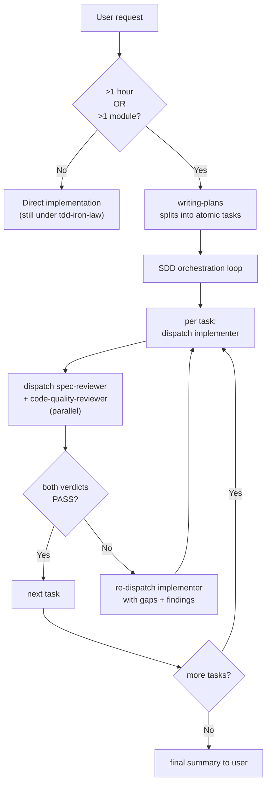

# Dispatch hygiene notes

Illustrative material extracted from `SKILL.md` to stay under the
CHK-SKL-010 word cap. Both sections below are referenced from the body
by a one-line pointer; nothing here changes the rules those pointers
summarize — this file only carries the full worked-out illustration.

## Capacity-error recovery

**Subagent capacity errors (usage limit / "529 Overloaded").** If a
subagent dispatch fails with a monthly-limit or 529 error mid-run: (1)
do not silently retry in a loop; (2) finish and commit any tasks
already `DONE` in the current wave; (3) surface ONE recovery question
to the user with three options: wait for capacity to recover; proceed
with explicit B2 orchestrator self-review (mark every verdict
"[self-review — confirmation bias risk]"); or push the branch as-is
and rely on CI. Phrase this per §Asking the user in `SKILL.md`.
**After capacity recovers / 恢復後:** once the user confirms capacity
is back, retrospectively dispatch the blocked reviewers on the
already-committed artifacts (same subagent types, same inputs) — the
commits are durable, so no work is lost. Treat any returned
`NEEDS_REVISION` as a **new fix commit** (not a revert of the
committed work), then proceed as if the verdicts had arrived on time.

## Worked example — the built-in `/recap` style is the target

```
✅ Standard (outcome-framed, no jargon, plain status, term-explained-on-use):
   "The first three pieces are done and checked out clean — the parser, the new flag, and the
    error path. The next one needs a call from you: when a tag is malformed, should the build
    just warn, or stop and fail?"

❌ Avoid (jargon-dense status-report style):
   "Wave 1 DONE: T1/T3/T4 PASS 3/3, reviewers green. T5 BLOCKED — NEEDS_CONTEXT on malformed-tag policy. Independent:false. 下一步？"
```

This ✅ example is the calibration target for every question and
hand-off the orchestrator surfaces in `SKILL.md`.

## SDD flow diagram



This visualizes the same trigger + per-task loop described in
`SKILL.md` §When to use and §Process — per-task triad; it adds no
rule beyond what those sections already state in prose.
