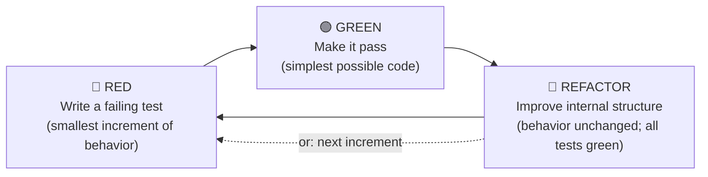

## The Iron Law

> **NO PRODUCTION CODE WITHOUT A FAILING TEST FIRST.**

This is not a guideline. It is the floor of the discipline. The Iron Law has exactly one consequence when violated:

> **Delete the code. Write the test. Start over.**

Not "add a test after the fact." Not "promise to add one later." Delete the production code, write the failing test you should have written, then re-derive the implementation under the Red-Green-Refactor cycle. The deletion is not punishment — it is restoration of the feedback loop that the violation disabled.

## Grounding (primary sources)

- Beck (2002), *Test-Driven Development: By Example*, Preface and Ch.1: "Write the test you wish you had. Make it fail. Make it pass. Make it clean." Part II supplies the ordered patterns.
- Martin (2008), *Clean Code* Ch.9: write only enough test to fail, then only enough production code to pass.
- 和田卓人 訳『テスト駆動開発』(2017) is the Japanese primary reference: tests concretize specification and supply design feedback.

Together these define TDD as design feedback, not tests-after coverage.

## Red-Green-Refactor — the only cycle

**Three steps. In order. Every time.**

- **RED**: write the smallest test expressing the next increment of behavior. Run it. **It MUST fail.** If a test passes on first run without any production code change, either the behavior already exists (no new test needed) or the test is not actually testing anything (false green — see Red Flag below).
- **GREEN**: write the simplest code that makes the failing test pass. *Simplest* does not mean *sloppy* — it means no speculative generality, no premature abstraction. Ugly duplication at GREEN is acceptable; you remove it in REFACTOR.
- **REFACTOR**: with all tests green, improve internal structure without changing behavior. If a test goes red during refactor, **revert and take a smaller step**. Skipping refactor is "tests-first," which is not TDD — see Beck (2002) Preface.

## When NOT to Use

The Iron Law has a narrow, enumerated exception list. If your work is **not** on this list, the Iron Law applies. Do not invent new exceptions.

| Exempt category | What qualifies | What does NOT qualify |
|---|---|---|
| **Throwaway / spike** | Code you will delete within the same session, never commit, never reference again. | "I'll clean it up later." That's not throwaway — that's tests-last. |
| **Pure code generation** | Output of a generator that is regenerated from a spec (protobuf, OpenAPI stubs, ORM migrations). | Hand-written code in a generated-looking style. |
| **Trivial getter / setter / pure delegation** | One-line field exposure or a method whose body is `return other.method(args)`. | Anything with branching, validation, or transformation. |
| **Pure configuration** | A `.toml` / `.yaml` / `.env` with no executable behavior. | A "config" file with embedded Python / shell / Jinja logic — that's code. |
| **Explicit user override** | User says *literally* "skip TDD for this task" AND the task matches one of the above categories. | User says *"I just want a quick fix"* — that's the rationalization the Iron Law is for. |

When uncertain, ask: *"Would I be comfortable if this code shipped to production and broke silently?"* If the answer is no, you are on the critical path — TDD applies.

## Red Flags — refuse these rationalizations

| Agent / user says | Reality | Correct response |
|---|---|---|
| "I'll write the code first, tests second." | Tests-after rationalization. The feedback loop is lost. | Refuse. Cite Beck (2002) Preface: *"Write the test you wish you had."* |
| "Just this once — it's a small change." | Iron Law violation. Small changes accumulate. | Refuse. Write the failing test. |
| "Tests are slow / flaky / annoying." | The pain is the message. (Beck 2002 Preface: *"If it's hard to test, it's probably hard to use."*) | Refactor production code until tests are fast. Do not skip. |
| "I already wrote the code. Now what?" | Iron Law violation. Distinct from legitimate legacy-code backfill; age does not convert it. | **Delete the code. Write the test. Start over.** |
| "The test passed on first run — done!" | False green. The test was not actually testing the change. | Force RED first: comment out the production code, confirm the test fails, restore the code, confirm it passes. |
| "Subagents add too much overhead." | Context-window argument, not quality argument. | If the task warrants SDD (see `subagent-driven-development`), it warrants TDD inside each subagent. |
| 「ちょっと試すだけ / 我先快速試一下」 | Same rationalization, localized. | Same refusal. テストを先に書く。先寫測試。 |
| "User said skip TDD." | Valid only if user is explicit AND the work matches §When NOT to Use. | Quote §When NOT to Use back. Ask for explicit confirmation. |

## Legitimate legacy-code backfill (Feathers 2004) — NOT the same as Iron Law violation

Feathers (2004), *Working Effectively with Legacy Code*, defines legacy code as code without tests. Use **Characterization Tests** to pin current behavior, including bugs; new behavior still follows the Iron Law.

### The line — what qualifies as Feathers legacy vs Iron Law violation

| Case | Category |
|---|---|
| Inherited untested code | ✅ Characterize touched modules, then TDD new behavior. |
| Code predating this discipline | ✅ Characterize, then use TDD. |
| `payment_processor.py` you wrote while test-first was available | ❌ Iron Law violation regardless of age: delete and restart. |
| A coverage gap in otherwise-tested code | ✅ Write the failing case, then fix. |

The decisive test: **was the test-first opportunity available when this code was written?** If yes and skipped, it is a violation.

### Don't conflate "old" with "legacy"

Age is irrelevant; how the code was written is the axis.

## False-green diagnostic

If a test passes on first run:

1. **Comment out the production code change** that the test is supposed to cover.
2. **Re-run the test.** It must fail.
3. **If it still passes**, the test is not actually testing what you think. Rewrite the test until it can fail.
4. **Restore the production code.** Re-run. It must pass.

Skipping this diagnostic is how tests-pass-but-bug-still-ships happens. Beck (2002) Ch.1 walks through exactly this discipline on the Multi-Currency Money example.

## Cross-skill contract

- **`subagent-driven-development`** dispatches implementer subagents that work under this Iron Law. The implementer prompt loads this skill before writing any code.
- **`verification-before-completion`** (Phase 3) runs the current package-level suite and requires nonzero passing test evidence. It does not reconstruct RED→GREEN history; that evidence belongs to this skill's implementation cycle.
- **`domain-teams:code-team`** evaluator subagent applies `tdd-standard.md` as one dimension of `rubrics/quality-gate.md` scoring. This skill's `standards/tdd-standard.md` is a byte-identical functional copy of that file plus a SSOT header — see [`../../scripts/canonical/README.md`](../../scripts/canonical/README.md) for the canonical source location.

## Reference

- `standards/tdd-standard.md` — functional copy of code-team SSOT (full F.I.R.S.T properties, Three Laws, anti-patterns, JP anchor). Read this for the longer-form discipline.
- `references/testing-anti-patterns.md` — enumerated anti-patterns with primary-source citations.
- `../../scripts/canonical/README.md` — SSOT pointer for the functional-copy mechanism.
- `../using-loom-code/SKILL.md` — router; explains how this skill is invoked in the larger flow.
- [environment-gotchas](../using-loom-code/references/environment-gotchas.md) — when doing direct TDD (no SDD) batch refactors, the orchestrator harness gotchas (esp. the Read-tool precondition before Edit) apply.
