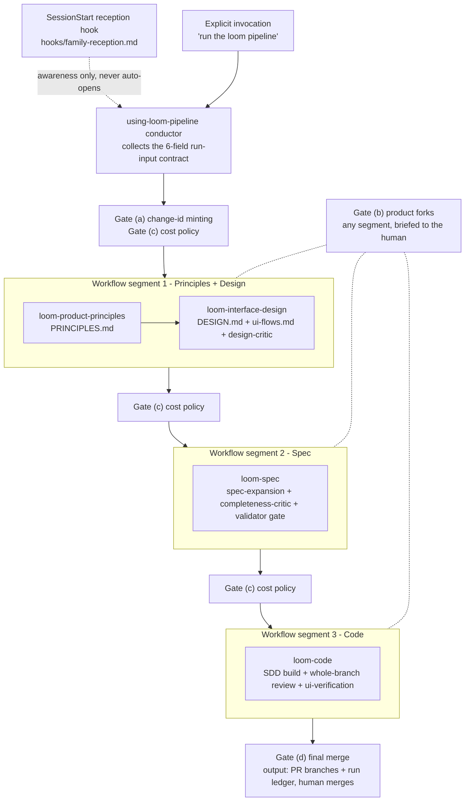

# loom-pipeline

The **conductor** plugin for the loom suite. It never authors an
artifact and never produces a verdict — it only sequences four of the
five loom station plugins (`loom-product-principles`,
`loom-interface-design`, `loom-spec`, `loom-code`) through the
principles→design→spec→code pipeline, one deterministic `Workflow`
invocation per segment, and stops for the human at 4 fixed gates in
between. The fifth station, `loom-discovery` (the problem-space entry,
upstream of principles), is v0.1 **interactive-only** — the conductor
does not drive it as a Workflow segment; pipeline runs still start at
principles.

## What it is — the human, plus a 3-layer execution stack

```
 Human — decision authority: between-segment gates (a-d);
         each gate is a stop, not a notification
   |
   v
+------------------------------------------------------------+
| Main session  supervisor — collects the run-input          |
|               contract, resolves the driver asset path,    |
|               reports segment results and gate prompts     |
+------------------------------------------------------------+
| Workflow      deterministic skeleton — one invocation      |
| script        per segment (assets/loom-pipeline.js);       |
|               never edits artifacts, never verdicts,       |
|               never merges                                 |
+------------------------------------------------------------+
| Station       judgment — principles / design / spec / code |
| agents        + their critics and reviewers, each owning   |
|               its own standards and gates                  |
+------------------------------------------------------------+
```

Judgment stays in the four Workflow-driven station plugins and in
`loom-discovery`, the fifth, interactive-only station (cross-plugin
delegation contract, repo `CLAUDE.md`); this plugin only orchestrates
and records.

## Execution flow

Three `Workflow` invocations — one per segment, never one call for the
whole run — carry four of the five station plugins in order (principles →
interface-design → spec → code); `loom-discovery`, the fifth station,
sits upstream of principles and is v0.1 interactive-only, not a Workflow
segment. The human gates (a)–(d) sit around the three Workflow-driven
segments:



Each segment delegates all judgment (drafts, critic panels, verdicts,
validator/review gates) to its station plugin; the on-ramp criteria the
reception hook injects live in `hooks/family-reception.md` (the SSOT),
not here.

## Install + requirements

Install from the monkey-skills marketplace like any other plugin.
Requirements, checked before the entry skill fires:

- The four station plugins the conductor drives, installed:
  `loom-product-principles`, `loom-interface-design`, `loom-spec`,
  `loom-code`. (`loom-discovery`, the fifth loom station, sits upstream
  of principles and is v0.1 interactive-only — not required by the
  conductor and never driven as a Workflow segment.)
- A Claude Code host that exposes the **Workflow** primitive (a tool
  accepting an arbitrary `scriptPath`). No Workflow tool → the skill
  reports `loom-pipeline: N/A` with the reason and stops; it never
  fakes the orchestration by hand-driving the stations one call at a
  time.

## Run inputs

The driver takes a 6-field run-input contract: **change-id**, **target
project path**, **token budgets** (`{ run: <number>, perStation: {
<stationName>: <number>, ... } }`), **model policy**, **skillsRoot**
(required once a run includes segment 2), and an optional
**resumeRunId** to resume a checkpointed run instead of starting over.

`skills/using-loom-pipeline/SKILL.md` §Run inputs is the authoritative
definition (field names, defaults, fail-loud rules) — this README only
summarizes it; do not let this section drift from that table.

## Human gates

Exactly 4 stops between segments — each waits for the human's answer
before the next `Workflow` call:

(a) **Change-id minting** — before Segment 1; the human names the
    per-change folder, the conductor never invents one.
(b) **Product forks** — whenever a station surfaces a genuine product
    decision; briefed per the #475 complex-fork escalation instead of
    letting the station improvise a default.
(c) **Cost policy** — before each segment; the human confirms or
    revises the token budgets and model-tier policy for the segment
    about to run.
(d) **Final merge** — after Segment 3; the pipeline never merges — its
    output is PR branches + the run ledger, and a human takes it from
    there.

## Codex hosts: N/A

The driver requires the Workflow primitive, which Codex does not
expose. On Codex this plugin is **N/A by definition** — report
`loom-pipeline: N/A (no Workflow primitive on this host)` and stop; do
not attempt an inline substitute. All five loom station plugins
(including `loom-discovery`) remain usable on Codex — run them
interactively, one station at a time, instead of through this
conductor.

## Family entries & naming convention

> **要用 loom-X, 就從 using-loom-X 開始.** Every plugin's entry point is its
> `using-loom-*` skill — start there, it routes you the rest of the way.

| Name pattern | Role | Examples |
|---|---|---|
| `using-loom-*` | **Entry** — the family-routing skill for one plugin. Fires on vague/goal-shaped asks, checks the on-ramp criteria, hands off to the right station. | `using-loom-discovery`, `using-loom-product-principles`, `using-loom-interface-design`, `using-loom-spec`, `using-loom-code`, `using-loom-pipeline` |
| plain artifact names | **Stations** — tuned to fire on direct, specific asks for their own artifact, without needing the entry skill first. | `product-principles`, `design-system`, `interaction-flows`, `spec-expansion`, `completeness-critic` |

`brainstorming` is loom-code's **discovery** skill, not an artifact
station — it explores intent before a brief exists, which is why
`using-loom-code` carries no duplicate `§Intake` heading of its own:
loom-code's family-entry intake work (steps 1–2, upstream/station
checks) already lives inside brainstorming as its **Axis 0**, run
before Axis 1. Giving `using-loom-code` a second, parallel `§Intake`
section would duplicate that check rather than reuse it, so the five
other entries carry `§Intake` and `using-loom-code` instead points into
brainstorming's Axis 0.

**Reception**: a `SessionStart` hook
(`loom-pipeline/hooks/family-reception.md`) injects the family map and
the on-ramp criteria table (the SSOT every `§Intake`/Axis 0 references)
at the start of every session. The **Workflow door remains
explicit-invocation only** — reception only describes it for awareness,
it never auto-opens the full pipeline run.

## G4 — Sonnet-vs-Fable gate A/B (open question)

v1 **records, not solves** G4: a documented **verdict-distribution comparison**
protocol, not an automated gate. Before trusting a cheaper judge tier
(e.g. Fable) as the default reviewer/critic model for a station, run
the same branch's review or critique through both model tiers and
compare:

1. **Verdict tokens** — do the two tiers land on the same
   PASS / PASS_WITH_NOTES / NEEDS_REVISION (or equivalent) verdict for
   the same artifact?
2. **Finding severity distributions** — do the two tiers surface
   findings at comparable severity (fatal / should-fix / nit) rates,
   or does the cheaper tier systematically under- or over-flag?
3. **A human review baseline** — compare both tiers' output against a
   human's own review of the same branch, not just against each
   other, since two cheap judges can agree and both be wrong.

Run this comparison before switching a station's default judge model
to a cheaper tier; a single anecdotal run is not sufficient evidence.

## Batch mode (v1.1)

A queue of **FROZEN** changes (change-folder form: loom-spec validator
exit-0; or brief+plan form: reviewer-PASSed plan — plan committed
either way) feeds an unattended segment-3 loop, one queued item at a
time, each in its own worktree/branch with its own pre-authorized
budget. Explicitly **time-agnostic** — no scheduler required; it runs
whenever invoked, foreground or background. Human gates move to
spec-freeze time (queue-entry authoring), they do not disappear —
merge stays human, and this is distinct from the parked full-autopilot
mode below.

**Intent/state separation**: the human-edited queue file
(`docs/loom/QUEUE.toml` in the target project, array-of-tables
`[[change]]` — `id` / `plan` / `budgets.run` / optional
`budgets.perStation` / optional `models`) is never written by the
tooling. Machine-owned state (`docs/loom/queue-state.json`) records
each entry's status (`QUEUED` / `RUNNING` / `DONE` / `FAILED` /
`SKIPPED`) and is written only by `batch_queue.py`.

**The loop** — `loom-pipeline/scripts/batch_queue.py`, pure stdlib,
sequential-only:

1. `batch_queue.py next --project <path> --skills-root <path>` picks
   the first `QUEUED` entry, checks the freeze predicate (change-folder
   form: validator exit-0; or brief+plan form: the plan carries a
   reviewer PASS line — plan committed either way), creates its
   worktree/branch, records
   `RUNNING`, and prints one JSON object with ready-to-use `Workflow`
   args (`{segment: 3, changeId, projectPath, planPath, budgets,
   models, skillsRoot, branch}`). Empty/exhausted queue prints
   `{"done": true}` and exits 0.
2. The main agent calls `Workflow(segment: 3, ...)` with exactly that
   JSON — it never parses the queue file, never composes git commands,
   never diagnoses failures mid-batch.
3. `batch_queue.py mark <change-id> done|failed --project <path>
   [--run-id <id>] [--reason <text>]` writes the outcome back to state.
4. Repeat from step 1.

**Failure isolation**: an ineligible entry (freeze predicate fails, or
its plan never got committed to the worktree) is marked `SKIPPED` with
a reason and the loop advances — one bad entry never stalls the queue.
2 consecutive `FAILED` entries trip a circuit breaker: `next` exits 3
with a HALT message naming both ids (`--override-halt` bypasses).
`batch_queue.py status --project <path>` prints a one-screen overview
(id, effective status, runId, reason) — the first thing a fresh
session reads to take over a batch.

Output is N ledgers + N `loom/<id>` PR branches; merge stays human.

## Parked items (with re-triggers)

- **Full autopilot** (agent-selected work, continuous ticks, no human
  gates) — parked. Re-trigger: segmented mode stable across ≥3 real
  runs AND a decision-ledger mechanism designed.
- **Codex shell driver via `codex exec`** — parked. Re-trigger: a real need to run the full pipeline on Codex arises.
- **git-commit dispatch lock** (for multi-change parallelism) —
  parked. Re-trigger: multi-change parallelism lands on the roadmap.
- **CHECK/ACT cheap-monitor watchdog implementation** (an optional
  richer alternative to the baked-in wall-clock watchdog) — parked.
  Re-trigger: the G6 watchdog proves insufficient in live runs.
- **G7 mutation-testing spot-check gate** — parked. Re-trigger: post-v1 backlog pickup.

## License

MIT.
