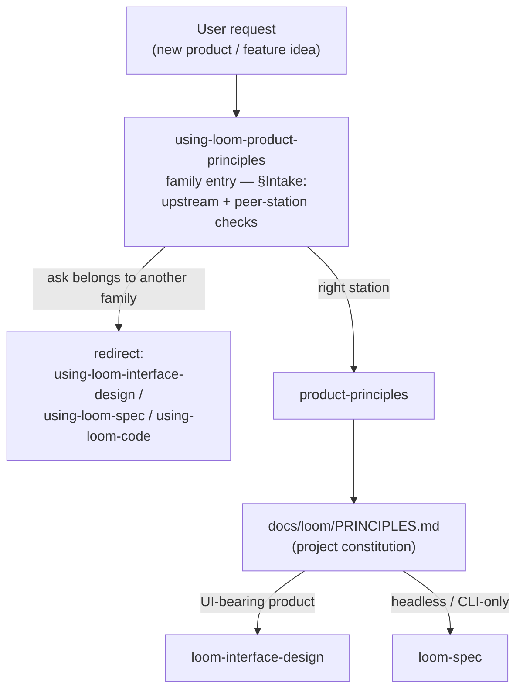

# loom-product-principles

The **cross-cutting constitution** layer that sits *above* the whole spec→code pipeline: turn a sparse product idea into a `PRINCIPLES.md` — a project constitution whose North Star and non-negotiable principles, organized by **jurisdiction** (Product / Design / Engineering), **govern every downstream station** (interface-design, spec, code).

```
                    PRINCIPLES.md  (this toolkit — the constitution)
                          │ governs ↓
  interface-design   →   spec   →   code
   (optional UI)        (GENERATE)   (VERIFY)
```

The constitution is **project-level** (one per project) and applies to **any** product — including pure-headless / library / CLI work that has no UI at all.

Agent-portable and key-free: the skill drives the host agent's own LLM — no external runtime, no API key, no install beyond the plugin.

## What it does

Two skills:

- **`using-loom-product-principles`** — the family entry: intake + routing. It runs the §Intake checks (upstream check against loom-pipeline's family-reception on-ramp criteria, plus a peer-station redirect when the ask belongs to another loom family), then hands off to `product-principles`. It does not author the constitution itself.
- **`product-principles`** — takes a sparse product idea and emits a single **`PRINCIPLES.md`** organized by jurisdiction:
  - **`## North Star`** — the product's original goal plus a concrete definition of "success".
  - **`## Product Principles`** (required) — **3–7 non-negotiable principles, each carrying a falsifiable check.** Platitudes are rejected at generation: ❌ "be delightful" → ✅ "primary task completes in ≤3 steps", "never block the primary flow with a modal", "offline-readable". The falsifiable check is what makes a principle usable as a downstream gate.
  - **`## Design Principles`** and **`## Engineering Principles`** (optional, 1–7 each, never empty if present) — the same falsifiable-check discipline, scoped to design and engineering trade-offs when the product warrants them.

Execution flow (skill level):



## What it's for

`PRINCIPLES.md` is the **supreme input** that governs the rest of the pipeline. Downstream stations read it as always-on steering context, so feature design, interface (UI/UX) design, spec, and code stay anchored to the product's original intent instead of drifting from it.

The gap it closes is **cross-cutting**: today product principles live in your head or in scattered prose, and there is nothing concrete to **check implementations against**. Because the constitution is project-level — not design-craft — it applies to **headless / CLI / TUI / GUI** alike. Folding it into a visual-design step would mis-scope it and make it dead weight on non-UI products; hence its own plugin.

The required `## Product Principles` jurisdiction is **product design principles + target user**, not a full market/business-model/strategy document. North Star is a lightweight decision filter, not a business plan. The optional `## Design Principles` and `## Engineering Principles` jurisdictions extend the same falsifiable-check discipline to design and engineering trade-offs, elicited only when the product warrants them.

## Output format

A single project-level file written into the **consumer project** under the established `docs/<toolkit>/` convention:

```
docs/loom/PRINCIPLES.md
  ## North Star                # original goal + concrete definition of success
  ## Product Principles        # required — 3–7 non-negotiable principles, each with a falsifiable check
  ## Design Principles         # optional — 1–7, never empty if present
  ## Engineering Principles    # optional — 1–7, never empty if present
```

`PRINCIPLES.md` is **key-free, in-repo, git-diffable**, and **project-level** (one per project, not per-feature). A `validate_*` script (mirroring `loom-spec/scripts/validate_spec_output.py`) is the executable format contract: it checks the required section exists, every present optional section is non-empty, and every principle carries a check (exit 0 = conformant).

## Honesty rails

A principle is only useful if it is **falsifiable / checkable** — otherwise it is dead text. The validator enforces a per-principle check at generation time, so a `PRINCIPLES.md` that *looks* authoritative but states unfalsifiable platitudes does not pass. Trust is earned by checkability, not by a document that looks decisive.

## Scope (v0.4)

In: the `using-loom-product-principles` family entry + the `product-principles` skill + the format validator. The constitution MAY ride the downstream seam as always-on steering context (it is just one more file path).

The writer≠judge **conformance gate** ("does this artifact violate a principle?") is now **live downstream** as a **lens** on the existing critics — `loom-interface-design:design-critic` (conditional PRINCIPLES lens), `loom-spec:completeness-critic` (lens 6), and loom-code's whole-branch `code-reviewer` (`principles-conformance` dimension D8) — not a new gate engine.

Out (deferred): a second `principles-conformance` skill; business/market/strategy framing (that stays `planning-team`'s `PRODUCT-SPEC.md` turf). See `docs/loom/specs/2026-06-14-product-principles-toolkit-mvp.md` (brief).

## License

MIT.
