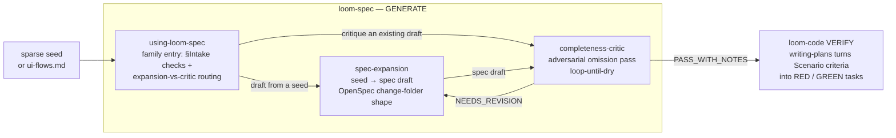

# loom-spec

The **GENERATE** layer of a three-layer spec→code pipeline: turn a sparse seed (a few lines of feature intent) into a **structured, verification-ready spec draft** that `loom-code`'s VERIFY layer consumes.

```
GENERATE (loom-spec)  →  DECLARE (OpenSpec change-folder)  →  VERIFY (loom-code)
 sparse seed → spec draft     persist / delta-track              TDD · review · execution-gate
```

At skill level, the flow through the plugin:



Agent-portable and key-free: the skills drive the host agent's own LLM — no external runtime, no API key, no install beyond the plugin.

## What it does

Three skills:

- **`using-loom-spec`** — routing-only family entry: §Intake upstream/peer checks plus the expansion-vs-critic disambiguation ("does a draft already exist to critique, or am I starting from a seed?"). Never drafts or critiques a spec itself.
- **`spec-expansion`** — three explicit phases, each announced and emitting a visible artifact:
  ① **USM** (journey backbone) → ② **OOUX** (per-object ORCA + state machines) → ③ **auto-expansion matrix** (`backbone × object × CTA × state` grid, pruned through state-transition / BVA / CRUD / permissions / empty-error-loading / NFR lenses). Emits candidate `#### Scenario:` acceptance criteria, every item tagged `seeded` / `inferred` / `critic-found`.
- **`completeness-critic`** — loop-until-dry adversarial pass that hunts **omissions** (not inconsistencies) via fixed multi-lenses, and **must emit its own blind spots** (the aspects no generator can resolve from the seed — they need human/field input). Critiques the spec only; never code, never TDD.

## What it's for (honest positioning)

Validated against a 7-seed A/B dogfood (loom-spec vs an unaided capable-model brainstorm, mutually blind — see `examples/AB-SUMMARY.md`):

- **Primary, reliable, domain-independent value — structured, verification-ready, honestly-tagged output.** On every seed it produced 16–27 testable `GIVEN/WHEN/THEN` acceptance criteria (directly consumable by `loom-code:writing-plans` as RED/GREEN), plus a non-empty source-tagged blind-spots section and provenance tags. A free brainstorm produces a thorough *prose* list — not verification-ready, not tagged.
- **Secondary, situational value — an omission-recall aid in object-deep, under-documented operational domains** (e.g. inventory ops, workforce rostering). In textbook domains (auth, billing, accounting) a capable model already brainstorms near-exhaustively, so the recall edge there is ≈zero.
- **Not claimed: "finds more than you would" in general.** 7 seeds don't support that framing; the scaffold never *dramatically* out-recalled a strong baseline.

## Output format (hybrid)

A directory in OpenSpec change-folder *shape* (plain markdown — no OpenSpec CLI dependency):

```
<output-dir>/
  proposal.md                  # ## USM backbone · ## OOUX object model · ## Path × edge matrix
                               # ## Cross-object combinations · ## Journey navigation
                               # ## Provenance · ## Blind spots — needs human/field input
  specs/<capability>/spec.md   # OpenSpec-pure delta: ## ADDED Requirements →
                               #   ### Requirement: (RFC-2119) → #### Scenario: GIVEN/WHEN/THEN
```

The `specs/` delta stays OpenSpec-pure (structure-only `openspec validate`-clean — zero migration when the OpenSpec CLI wires in); loom-spec's richness lives in `proposal.md`'s additive sections. `scripts/validate_spec_output.py <dir>` is the executable format contract (exit 0 = conformant).

## Honesty rails

The engine auto-expands (strong) but cannot auto-complete (a theoretical floor): the seed sets the ceiling; combinatorial coverage ≠ aspectual completeness; a filled grid that *looks* thorough is the most dangerous failure. So the output **never claims "complete"** — it states "coverage relative to seed + N lenses" and lists its blind spots. Trust is earned by execution (loom-code's gate), not by a spec that looks finished.

## Scope (v0.4.x)

In: the `using-loom-spec` family entry + `spec-expansion` + `completeness-critic` + the format validator. Out (still deferred): OpenSpec CLI wiring, `spec-discovery` / `spec-persist`, knowledge-layer SSOT sharing, cross-host testing.

**`using-loom-spec` thin entry — shipped in 0.4.0** (loom family connective-tissue): a routing-only family entry (§Intake upstream/peer checks + the expansion-vs-critic disambiguation), superseding the router PARK's "no entry at all" state. The **proportional-rigor tiering upgrade remains parked** (2026-07-02 audit close-out, reaffirming the MVP brief's v0.2 deferral): the tiering judgment ("decide whether to expand at all" — No-Spec / Lite / Full) depends on `spec-discovery` / `spec-persist` and the OpenSpec DECLARE layer, none of which exist yet. Re-trigger unchanged: the OpenSpec DECLARE layer lands, or `spec-discovery` / `spec-persist` are actually scheduled — the tiering-capable router ships **with** its tiering cargo, not before it.

See `docs/loom/specs/2026-06-11-spec-toolkit-mvp-critic-first.md` (brief; pre-rename filename kept per frozen-docs policy) and `docs/loom/research/2026-06-11-spec-toolkit-openspec-research-synthesis.md` (research).

## License

MIT.
