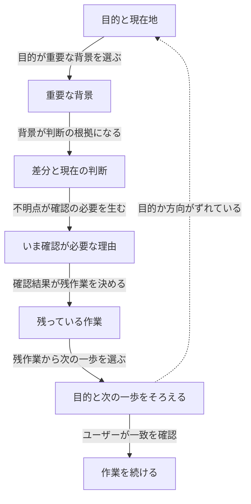

# Recap

[English](README.md) | **日本語** | [繁體中文](README.zh-TW.md)

> 会話の途中で流れを見失ったとき、このスキルが止まって
> 6 つの自然なセクションで整理する。1 分以内に今どこにいるかを
> 把握し直せる。

---

## 概要 — このスキルは何をするか

会話の途中にいる。長いツール出力が流れた、少し離席した、
エージェントが何かを聞いてきたが前提がもう思い出せない。
そういう「迷子」の状態のためのスキル。

「ちょっと振り返って」「今どこだっけ」と言うだけで発火する。
現在のセッションを 6 つのセクションで読み返す — 目的、現在地、
重要な判断、残っている差分、
まだ残っているタスクは何か — そして次のステップを確認してから
作業を続ける。

ファイルには何も書かない。まとめはチャットに出るだけ。

## Goal-Grounded Alignment Loop／目的起点の認識合わせループ

この recap は、目的を後続セクションの基準にする。直近の作業を報告する
だけでなく、現在地と次の一歩が、合意した目的に沿っているかを確認する。



現在の目的は会話の根拠から取る。上位の目的は、すでに明示されている場合
だけ表示し、不明な目的を agent が作らない。

---

## 使い分け — 組み込み `/recap` との違い

Claude Code には、**席を外していたセッションに戻ってきたとき**
に発火する組み込みの `/recap`（away summary）がある。
あれはセッションまたぎのツール。

このスキルは別物。**すでに会話中**に流れを見失ったときのもの。
席を外した後ではなく、会話の途中で混乱したときに使う。

| 状況 | 使うもの |
|---|---|
| 数時間ぶりにセッションを開いた | 組み込み `/recap`（away summary）|
| 会話の途中で迷子になった | このスキル |
| トークンを節約 / コンテキストを圧縮したい | 組み込み `/compact` |

両者は共存する。このスキルは組み込みの代わりではない。

---

## 呼び出しフレーズの例

以下のどれかを言えば発火する：

- 「ちょっと振り返って」
- 「今どこだっけ」
- 「振り返りをして」
- 「状況を整理して」
- 「迷子になった」
- 「いまどこ」
- 「振り返りお願い」
- 「今どこまで来た？」

まとめの最後に、次のステップを確認する質問が一つ来る。
答えるか（あるいは別の方向を示すか）すれば作業が続く。

---

## v0.2 に保留していること

v0.1 から意図的に外したもの：

- **タスク別バリアント** — デバッグ向け、設計向け、リサーチ向けの
  まとめ形式。v0.1 はすべての会話に同じ 6 セクションを使う。
- **自動トリガー** — ユーザーが言わなくても混乱を検知する機能。
  v0.1 は明示的な呼び出しが必要。
- **`test-prompts.json`** — まとめ品質を評価するプロンプト。
  実セッションでのドッグフードでベースラインが出てから追加予定。
- **スラッシュコマンド** — スキルコマンドとしての `/recap` 登録。
  ドッグフードで明確なニーズが確認されてから追加。フレーズ
  トリガーで今は動く。

---

## Files

```
recap/
├── README.md           <- English README
├── README.ja.md        <- 本ファイル（日本語）
├── README.zh-TW.md     <- 繁體中文 README
├── SKILL.md            <- 実行ファイル（Claude 向け）
└── references/
    └── seven-block-schema.md  <- 対応テンプレート + 系譜 + 5 共通核心原則
```
