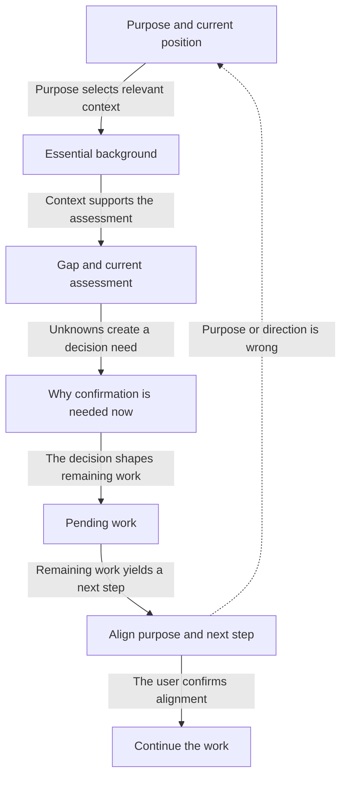

# Recap

**English** | [日本語](README.ja.md) | [繁體中文](README.zh-TW.md)

> When you lose the thread mid-conversation, this skill stops and
> produces a clear six-section summary so you can read yourself back
> into the work in under a minute.

---

## Overview — what this skill does

You are in the middle of a conversation. A long tool output just ran,
or you stepped away for a moment, or the agent asked something whose
premise you can no longer place. You are lost.

This skill fires when you say so. It reads back the current session
as a structured six-section recap — our purpose, where the work stands,
what shaped it, the remaining gap, and what is still pending — and
then asks you to confirm the next step before anything continues.

It writes nothing to disk. The recap appears in chat and nowhere else.

## Goal-Grounded Alignment Loop

The recap treats purpose as the anchor for every later section. It does not
merely report recent activity: it checks whether the current position and next
step still serve the purpose you established.



The current purpose must come from the conversation. Broader purposes appear
only when already established; the skill reports an unknown purpose instead of
inventing one.

---

## When to use vs the built-in `/recap`

Claude Code ships a built-in `/recap` command that fires when you
**return to a session after being away** (an "away summary"). That
tool handles cross-context return.

This skill is different. It handles the case where you are
**already in conversation** and have lost the thread. Use it
when you feel confused mid-session, not when coming back from
being away.

| Situation | What to use |
|---|---|
| You just opened a session you left hours ago | Built-in `/recap` (away summary) |
| You are mid-conversation and feel lost | This skill |
| You want to save tokens / compress context | Built-in `/compact` |

The two tools coexist. This skill does not replace the built-in.

---

## Example invocation phrases

Say any of these and the skill fires:

- "where were we"
- "I'm lost"
- "recap please"
- "remind me what we're doing"
- "bring me back"
- "what are we doing right now"
- "I lost track"
- "remind me where we are"

After the recap, the skill ends with a single question asking you to
confirm the next step. Answer it (or redirect) and the work continues.

---

## What's deferred to v0.2

These are deliberate omissions from v0.1:

- **Per-task variants** — a debug-mode recap, a design-mode recap,
  a research-mode recap. v0.1 uses one fixed six-section schema for all
  conversation types.
- **Auto-trigger** — detecting confusion without the user saying so.
  v0.1 requires explicit invocation.
- **`test-prompts.json`** — eval prompts for testing recap quality.
  Coming once real-session dogfood establishes a baseline.
- **Slash command** — `/recap` as a registered skill command.
  Deferred until dogfood signals clear demand; the phrase triggers
  already work.

---

## Files

```
recap/
├── README.md           <- English (this file)
├── README.ja.md        <- 日本語
├── README.zh-TW.md     <- 繁體中文
├── SKILL.md            <- operational file (for Claude)
└── references/
    └── seven-block-schema.md  <- alignment template + lineage + 5 core principles
```
