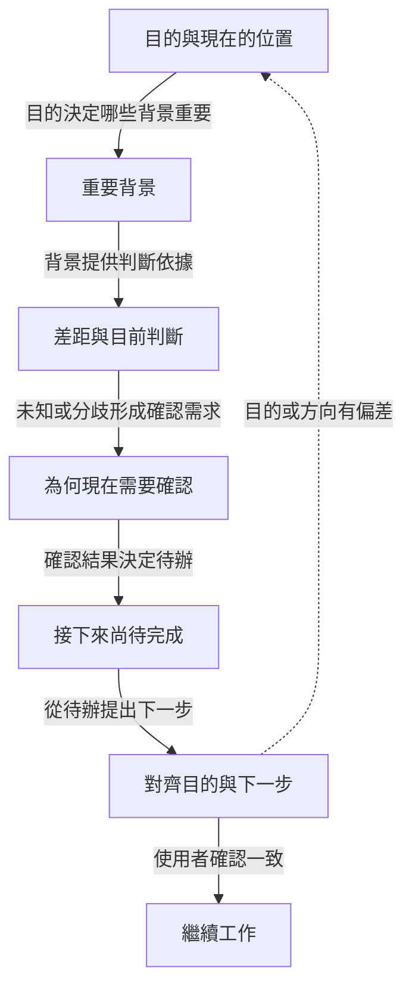

# Recap

[English](README.md) | [日本語](README.ja.md) | **繁體中文**

> 對話中途迷失方向時，這個 skill 會停下來，用六個自然段落把目前狀況
> 整理清楚，讓你一分鐘內重新上軌道。

---

## 概要 — 這個 skill 是什麼

你正在對話中。一段長長的工具輸出跑完了，或者你剛離開一會兒，
或者 agent 問了什麼但你已經想不起前提是什麼。你迷失了。

說一聲就能觸發這個 skill。它會把目前的 session 整理成六個段落
——我們的目的、目前位置、重要決定、尚存差距，以及還有什麼沒做
完——最後問你確認下一步，再繼續工作。

不會寫入任何檔案。整理結果只出現在對話中。

## Goal-Grounded Alignment Loop／目標錨定對齊閉環

這套 recap 以目的作為後續每段的基準。它不只報告最近做了什麼，還會
確認目前位置與下一步是否仍然服務於你已經說明的目的。



當前目的必須來自對話證據；只有已經明確建立時才顯示更上層目的。
如果目的仍不清楚，skill 會直接說明，而不自行補寫。

---

## 何時使用，以及與內建 `/recap` 的差異

Claude Code 內建了一個 `/recap` 指令，在你**回到一個離開很久的
session** 時觸發（away summary）。那是跨 session 的工具。

這個 skill 不一樣。它處理的是**你已經在對話中**、卻迷失方向的
情況。不是離開後回來，而是對話途中感到困惑的時候用。

| 情況 | 用什麼 |
|---|---|
| 剛打開一個幾小時前離開的 session | 內建 `/recap`（away summary）|
| 對話途中搞不清楚現在在哪 | 這個 skill |
| 想省 token / 壓縮 context | 內建 `/compact` |

兩者並存。這個 skill 不取代內建指令。

---

## 呼叫範例——怎麼說都行

說以下任何一句，skill 就會觸發：

- 「我們剛剛在幹嘛」
- 「剛剛講到哪」
- 「我跟丟了」
- 「帶我回到」
- 「我們在做什麼」
- 「幫我整理一下」
- 「我有點迷失」
- 「現在做到哪了？」

整理完之後，skill 會問你一個確認問題。回答（或給新方向）後，
工作就繼續。

---

## v0.2 暫不包含的功能

這些是 v0.1 刻意不做的部分：

- **任務別版本** — 偵錯專用、設計專用、研究專用的整理格式。
  v0.1 對所有對話類型用同一套 7 格式。
- **自動觸發** — 不需要使用者說話就偵測到迷失。
  v0.1 需要明確呼叫。
- **`test-prompts.json`** — 評估整理品質用的 prompt。
  等真實 session 累積出基準後再加。
- **斜線指令** — 把 `/recap` 登錄為 skill 指令。
  等 dogfood 確認需求後再加；現在用語句觸發就能運作。

---

## Files

```
recap/
├── README.md           <- English README
├── README.ja.md        <- 日本語 README
├── README.zh-TW.md     <- 本檔（繁體中文）
├── SKILL.md            <- 執行檔（給 Claude）
└── references/
    └── seven-block-schema.md  <- 對齊模板 + 歷史脈絡 + 5 共通核心原則
```
