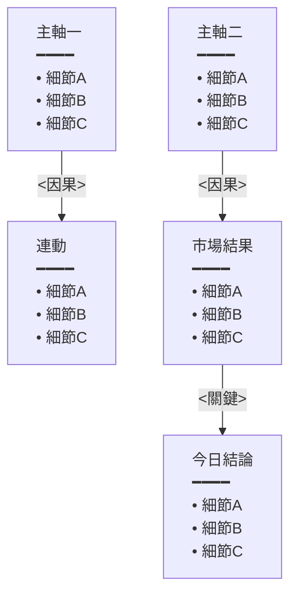
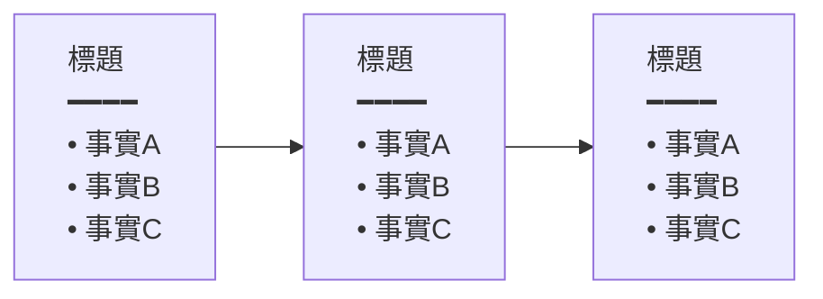
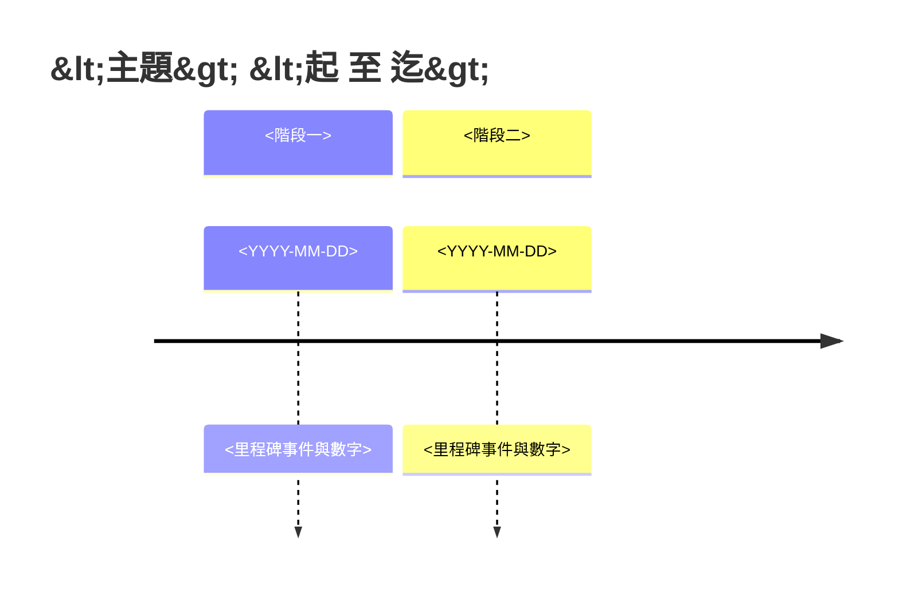
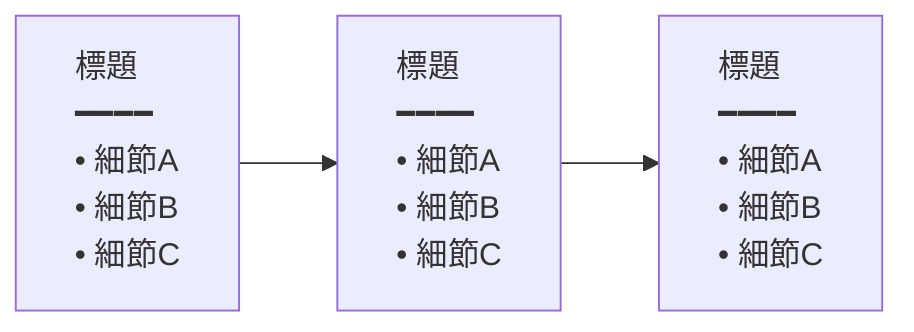
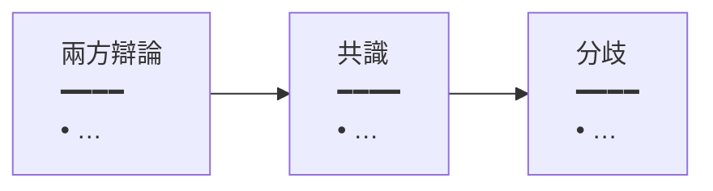

# Digest Format Reference

> Loaded at STEP 8 (writing the digest) — do NOT load earlier. This file holds
> the output template, the link-presentation rules, and the Mermaid house style.
> Keeping it out of SKILL.md's always-loaded body is deliberate.

## Link-presentation rules (READ FIRST — this is what keeps the note readable)

Source filenames in this vault are long (YouTube titles, 60+ chars) and the
frontmatter `title` is even longer **and differs from the filename**. Dumping
raw `[[long-stem]]` links inline destroys readability. So:

1. **Embed inline jump-links by wrapping an existing prose phrase — NOT a
   `(短標籤)` parenthetical.** The reader should jump to a source *while reading*,
   with the link being words that are already in the sentence (so it reads as
   normal prose, just clickable). Turn the natural phrase that the source backs
   into the link; the display text **is** that phrase:
   - 「[[<stem>|渡部恒雄]]則視之為…」 — wrap the analyst's name
   - 「[[<stem>|道指與羅素 2000 雙創歷史收盤新高]]、標普距前高不到 1%…」 — wrap the claim
   - 「**[[<stem>|NVDA 發行 250 億美元債券]]**正是…」 — bold + link is fine
   **Avoid** appending a `(…[[…|短標籤]])` parenthetical or a trailing
   `（來源:…）` — make the body words themselves the link instead. The display
   text after `|` is the existing phrase; the **target is still the stem**, never
   the title. You need not link every source inline (the end index is complete);
   wrap the phrase wherever a source is naturally referenced.
2. **ALSO collect ALL news citations into one `## 來源索引` at the end** — this
   coexists with the inline links (inline = convenience jumps on named refs; the
   index = the complete, exhaustive list). There it is a **standard reference
   list, NOT short labels**: a `###` sub-heading per story, then one
   **full-filename** link per line `- [[<stem>]]` (no `|短標籤`), so the reader
   sees exactly which note each is.
   ```markdown
   ## 來源索引

   ### 美伊停戰
   - [[2026-06-15 美伊簽屬協議石油類股 …]]
   - [[2026-06-15 …早晨財經速解讀…]]
   ```
3. **Knowledge / 其他觀察 items** are one-per-line `- [[<stem>|<短標籤>]] — <一行>`,
   so the short label *is* the inline form — that's fine.
4. **The link target is the filename stem** (collector's `wikilink` field), NEVER
   the `title`. The display label after `|` is yours to write short.
5. **Keep the anchor a key phrase, not a whole clause.** Wrap the *short* key
   term, not the entire sentence — `馬斯克[[…|拋出 2030 兆美元藍圖]]` not
   `[[…|馬斯克拋出 2030 年營收上看 1 兆美元的指引]]`; `[[…|道指、羅素創高]]` not
   `[[…|道指與羅素 2000 雙創歷史收盤新高]]`. A whole-clause link is visually heavy.

## TL;DR rule — a takeaway, NOT the COT steps restated

Every story gets a one-line TL;DR right after the heading. It must be the
**bottom-line takeaway / so-what** (what to remember, why it matters) — NOT a
re-listing of the causal steps, because the COT 小圖 right below already carries
the step sequence. TL;DR (conclusion) + COT 圖 (steps) + narrative (detail) are
three complementary layers, never three restatements of the same sequence.

```markdown
### 美伊簽署倒數:以色列成最大變數
> [!summary] TL;DR
> 停戰看似敲定,真正風險已轉到以色列攪局;日方甚至評估美國戰略比戰前更不利。
```
(The COT 圖 then shows the steps 川普宣布完成 → 伊朗稱MOU → 以色列突襲 → 以色列成變數.)

One sentence: **what happened + why it matters**. Lead with the fact.

## COT 推演 — two levels (both required)

The digest carries chain-of-thought reasoning at **two** levels, both as Mermaid:

1. **Day-level 總圖** — lives **inside the merged `## 🧭 當日總覽`** section (after
   the 目錄): the `> [!abstract]` overview text immediately followed by a
   `flowchart TD` causal web wiring the day's main stories into one logic
   (geopolitics → market → knock-on → conclusion). No separate 今日脈絡 heading.
2. **Per-story COT 小圖** — right after each story's TL;DR, a compact
   `flowchart LR` of that story's 3–4-hop causal chain. **No `推演` label or any
   caption before the diagram** — the diagram stands on its own. NOT the TL;DR
   repeated: TL;DR = *what happened*, the 圖 = *the logic / so-what*.

**Node style for BOTH — always a left-aligned bullet list** (prose detail renders
unevenly inside nodes, so don't use it): a title, the `━━━━` separator, then
**3–5 `• ` bullets** of specific facts/numbers, wrapped in
`<div style='text-align:left'>…</div>`:
`["<div style='text-align:left'>標題<br/>━━━━<br/>• 細節A<br/>• 細節B<br/>• 細節C</div>"]`
Pull bullets from real facts; don't pad past what the node supports (3 is the floor,
5 the ceiling). **Chain length is the story's real causal structure — 3–5 hops as
warranted, NOT a fixed 4** (觸發 → 機制 → 結果 → 含義 is a natural arc, but collapse
to 3 or extend to 5 when the story calls for it). Both diagrams go through
`obsidian:obsidian-mermaid-visualizer` + §Mermaid 房規 (no `()` → 「」, etc.).

**Colour every node by its role — one FIXED scheme across ALL CoT diagrams**
(news 小圖, 知識 CoT, day-level 總圖), so a reader decodes the chain at a glance:

| 角色 | 顏色 | `style` |
|---|---|---|
| 觸發 / 事實（起點） | 🟢 綠 | `fill:#d3f9d8,stroke:#2f9e44,stroke-width:2px` |
| 機制 / 為何 | 🟣 紫 | `fill:#e5dbff,stroke:#5f3dc4,stroke-width:2px` |
| 結果 | 🟠 橙 | `fill:#ffe8cc,stroke:#d9480f,stroke-width:2px` |
| 含義 / 結論（終點） | 🔵 青 | `fill:#c5f6fa,stroke:#0c8599,stroke-width:2px` |

For a **`flowchart LR` chain** the position is the role by default: first node 綠,
last node 青, the node before last 橙 (when ≥4 hops), the rest 紫. For the
**`flowchart TD` 總圖** assign each node its real role (source events 綠, market
results 橙, analysis/mechanism 紫, the day's conclusion 青). Emit one
`style <id> <fill…>` line per node.

## 多空對照/分歧點 房規 (multi-view block house style)

One shared spec for the structured multi-stance block **whenever one is
rendered** — the news-tier in-story 市場分歧 block (STEP 6) and, **when a
knowledge-tier `整合分析` is itself a genuine bull/bear debate**, that block too
(STEP 7). It governs the block's *shape* when it fires — it does **not** force
every 整合分析 into a table: a non-debate 整合分析 stays its default 2–3-sentence
prose. When the block form IS used (either tier), it uses this shape + the
mandatory 分歧點 row.

**Three names, one thing:** 多空對照/分歧點 = the name of *this spec*; 市場分歧 =
its rendered `**…**` header inside a news story; 整合分析 = its rendered form in
the knowledge tier. Same shape, three labels by where it appears.

**When it fires:** only when ≥2 sources take **materially-differing stances on
the same question** (judgment call — see SKILL STEP 6). Complementary angles on
one story are integration, not a debate — no block. Category is a hint, not a gate.

**Canonical 立場 enum (shared with arc-tracking §機構觀點 — use the same words in
both places):** **多**（看多／樂觀）· **空**（看空／悲觀）· **中性**（謹慎／條件式：
takes a position on the *risk balance* but renders no bull/bear verdict). Nothing
else — no ad-hoc labels like 「中性偏空」.

**Does a source count as a stance?** A source is a stance **only if it answers (or
takes a risk position on) the debate's question.** A cautious "I flag the
fragility but don't call a top" take **is** a `中性` stance (it positions on the
risk). A source that merely adds facts on a *different facet* of the story
(a supply-chain lens, a numbers reconciliation) is **integration, not a stance** —
give it narrative space, not a block row. **Count only actual stance slots** for
the form rule below.

**Test — "would removing this source change the answer-set?"** If it only adds a
supporting fact to a stance already present, it is integration (fold it into that
stance's 論據 or the narrative), not a new slot. Two calibration cases:
- **Fires (2 stances):** A = "修正是健康回檔,逢低買" · B = "泡沫破裂起點,清倉" —
  opposing *verdicts* on one question. Two slots → block.
- **Does NOT fire (1 stance):** A = "逢低買,因估值已修正" · B = "逢低買,因財報強勁" —
  **same verdict (多), different reasons.** ONE 多 slot; the two reasons merge into
  its 論據. Reasons differing ≠ stances differing. Likewise a supply-chain note
  ("晶片供給轉緊") is integration feeding whatever stance it supports — it becomes
  its own slot **only if it explicitly answers the question** ("…所以這波修正過頭
  了"), not from an implied lean.

**Form by stance count (of actual stances):** both forms use the **same 3
columns** `| 立場 | 誰 | 核心論據 |` + a final **分歧點** row — the only difference
is how many stance rows sit above 分歧點.
- **Exactly 2 stances** → 2 stance rows + 分歧點 (a tight 3-row table):

  | 立場 | 誰 | 核心論據 |
  |---|---|---|
  | 空 | [[<stem>\|<短標籤>]] | <一句> |
  | 多 | [[<stem>\|<短標籤>]] | <一句> |
  | **分歧點** | — | <爭點；是否真對稱> |
- **≥3 stances** → 3+ stance rows + 分歧點, same columns.

**立場 label:** use the canonical enum **多/空/中性** for sentiment/market debates.
For a non-sentiment debate where 多/空 doesn't fit (geopolitics, policy, a
factual dispute), use a **short position word** as the label instead
(e.g. 主戰／主和, 升息／降息, 樂觀／悲觀) — the column is the *side*, not forced into
market vocabulary.

**Mandatory rows/fields:**
- Each stance row: the stance label + the source as `[[<stem>|<短標籤>]]` (real
  wikilink stem, short label — same link rules as everywhere) + a one-line 論據.
- **分歧點 (mandatory, load-bearing):** names *what they actually disagree on* and
  **whether it is a genuine split or one side is consensus / the other a minority**.
  This is the **false-balance guard** — never present a lopsided dispute as
  symmetric. A block without a 分歧點 row is invalid. Judging consensus-vs-minority
  **may draw on context across the cluster's sources** (e.g. one source noting most
  banks disagree with the outlier) — that is the guard working, not editorializing;
  don't import facts from outside the cluster.

**Placement:**
- News tier: after the narrative, before any optional data table / Mermaid visual.
- Knowledge tier: as the `整合分析` block (its existing slot) — **only when the
  整合分析 is a real multi-stance debate**; otherwise 整合分析 stays 2–3-sentence
  prose and no block / mandatory 分歧點 row is required (note the divergence
  in-sentence instead).

**Sources → index:** every source named in a block MUST also appear in the story's
`## 來源索引` entry (zero 漏引).

## Output template

ALWAYS use this structure. There is no single "時效新聞" umbrella heading —
**the synthesized news stories are grouped under 2–4 thematic category `##`
headings** (chosen from the day's content, e.g. 國際・地緣政治 / 金融市場・總經 /
AI・科技 / 商業・產業), exactly the way 知識與觀點 is categorized. **Story headings
carry no number** (`### <故事標題>`); the 來源索引 references each story by its
short title. The **🧠 知識與觀點** tier is link + one-liner, NOT rewritten,
**except each sub-category leads with a ≥1-piece 2–3 sentence summary callout
(title = the piece's short name, no "精選摘要 —" prefix), then a `**其他相關文章**`
sub-label and the remaining one-liners**.

````markdown
---
title: <YYYY-MM-DD> Daily News
type: news-digest
date: <YYYY-MM-DD>
tags: [news, daily-digest]
source_count: <total source notes referenced across both tiers>
story_count: <number of synthesized 時效新聞 stories>
related_notes: []
---

# <YYYY-MM-DD> Daily News

## 目錄

<目錄放在標題正下方(在當日總覽之前)。頁內錨點目錄:新聞分類為清單群組、故事與知識子類用
[[#完整標題|短顯示文字]] 頁內連結;末尾列其他觀察/來源索引/附錄。錨點=完整 ### 標題,
顯示文字用短名。>

- 🌍 <新聞分類一>
    - [[#<故事一完整標題>|<故事一短名>]]
- 📈 <新聞分類二>
    - [[#<故事二完整標題>|<故事二短名>]]
    - [[#<故事三完整標題>|<故事三短名>]]
- 🤖 <新聞分類三>
    - [[#<故事四完整標題>|<故事四短名>]]
- 🧠 知識與觀點
    - [[#投資策略・市場觀點|投資策略・市場觀點]]
    - [[#AI・開發(教學・評測・產業)|AI・開發]]
    - [[#商業・設計・思維・長青|商業・設計・思維・長青]]
- [[#其他觀察|其他觀察]]
- [[#來源索引|來源索引]]
- [[#附錄:研究筆記|附錄:研究筆記]]

## 🧭 當日總覽

<當日總覽與「今日脈絡」總圖合併成一個段落,放在目錄之後。>

> [!abstract] 當日總覽
> <2–4 句:當天最重要的 2–3 條主軸 + 一句知識層亮點。抓重點,不流水帳。>



## <emoji 新聞分類一,例:🌍 國際・地緣政治>

### <故事一標題>

> [!summary] TL;DR
> <一句:發生什麼 + 影響>


<COT 小圖:緊接 TL;DR、**圖前不加任何標題文字**。**3–5 跳依故事而定**(此例 3 跳)。
每節點固定左對齊清單:標題 + ━━━━ + 3–5 條 `• 細節`(具體事實/數字,不用短文)。
講「所以呢/怎麼連動」,與 TL;DR 互補。節點內避免 () → 用「」;%、+ 可保留。>

<1–3 段整合改寫敘事:綜合該叢集所有來源的事實、數字、時間線。事實先行,點出機制與利害。
來源觀點分歧時並陳。不在敘事中插入長 wikilink。
**適當分段**:每段 ≈ 2–4 句、一段一個重點(框架/條款/市場反應/分歧…),段間空行,避免大塊文字牆。>

<**多空對照/分歧點區塊**——當叢集內 ≥2 來源對同一問題持實質對立立場才放(觸發=判斷有無真分歧,
非固定類別;見 SKILL STEP 6 與下方 §多空對照/分歧點 房規)。**分歧點列必填**。緊接敘事、可選視覺之前。
恰好 2 方用三行式;≥3 方用表格式。>

**市場分歧 — <爭點一句話,例:這波修正是健康回檔還是泡沫破裂?>**

| 立場 | 誰 | 核心論據 |
|---|---|---|
| 多 | [[<stem>\|<短標籤>]] | <一句> |
| 空 | [[<stem>\|<短標籤>]] | <一句> |
| 中性 | [[<stem>\|<短標籤>]] | <一句> |
| **分歧點** | — | <爭在哪、是否真五五開;若一方是共識另一方少數,明講,勿假平衡> |

<立場欄用標準列舉 多/空/中性(非市場辯論用短立場詞,見下方 §多空對照/分歧點 房規);
恰好 2 方=2 列立場+分歧點列(同三欄),≥3 方多加列。無定論的示警型算「中性」;
純補充另一面向的來源不算立場、走敘事。>

<可選:資料型表格>
| 指標 | 數值 | 說明 |
|------|------|------|
| … | … | … |

<可選:Mermaid 因果鏈/時間線/一因多果——見 §Mermaid 房規>

<演進型故事(地緣/油價/利率/指數軌跡)才加,見 SKILL STEP 5;一次性/前瞻事件略過>

#### <動態標題,描述實際軌跡——例:油價三個月 104 跌破 80 / 日經過山車 創高再修正 / 升息路徑 到31年高位。不要用固定的「事件進程」字樣>

<趨勢分析段:把今天放回數週脈絡,點出走勢與轉折;有 investing/ 自有分析時交叉引用。
出處直接寫在本段末尾(短連結 + 簡短敘述),不要用 [!note] callout——例:
「…走勢綜合 references/ 近月逐日財經筆記與 investing/ [[<stem>|<短標籤>]]。」>

<可選 timeline / xychart;若本故事已有機制圖,改用純文字段落避免視覺過載>


## <emoji 新聞分類二,例:📈 金融市場・總經>

### <故事二標題>

> [!summary] TL;DR
> <一句>

<敘事…>

### <故事三標題（同分類可有多則故事）>

> [!summary] TL;DR
> <一句>

<敘事…>

## 🧠 知識與觀點

### 投資策略・市場觀點

> [!example] <該篇短標題>
> <2–3 句:這篇的核心論點/方法/數據,寫到能直接吸收的程度>
> 來源:[[<stem>|<短標籤>]]



<每個精選摘要、整合分析也各加一張 CoT 小圖(同新聞 COT 樣式:清單節點、3–5 跳),
緊接在 callout 來源行 / 整合段之後,把該篇的論證邏輯視覺化。「其他相關文章」純連結不加圖。>

<同類有相關性時,直接整合分析(非各列一行);遵循 §多空對照/分歧點 房規——多空辯論型
用同一形制,**分歧點必填**、避免假平衡:>

**整合分析 — <主題,例:Nvidia 多空辯論>**

<2–3 句:綜合 ≥2 篇,點出共識與分歧(分歧點寫明是否真對稱),來源以短標籤 inline>[[<stem>|<短標籤>]]……



**其他相關文章**

- [[<stem>|<短標籤>]] — <一行:核心論點或方法,僅放彼此不相關的單篇>

### AI・開發(教學・評測・產業)

> [!example] <該篇短標題>
> <2–3 句>
> 來源:[[<stem>|<短標籤>]]

**其他相關文章**

- [[<stem>|<短標籤>]] — <一行>

### 商業・設計・思維・長青

> [!example] <該篇短標題>
> <2–3 句>
> 來源:[[<stem>|<短標籤>]]

**其他相關文章**

- [[<stem>|<短標籤>]] — <一行>

## 其他觀察

<dated 但難歸入主故事的單篇,一行帶過>
- [[<stem>|<短標籤>]] — <一行>

---

## 來源索引

### <故事一短名>

- [[<stem>]]
- [[<stem>]]

### <故事二短名>

- [[<stem>]]

## 附錄:研究筆記

> [!note] 我自己的研究(非消費內容,僅連結)
- [[<research stem>|<短標籤>]] — <一行>

## 附錄:手寫重點

- <daily Note 區塊的手寫內容,若有;空則整個附錄略過>
````

## Mermaid 房規 (vault house style)

Before writing any Mermaid block, invoke `obsidian:obsidian-mermaid-visualizer`
(the vault mandates it). Then follow this house style:

- **Arrows carry causal labels**, not just direction: `A -->|推高生產成本| B` — a
  4–10 字 verb phrase explaining *why*.
- **Nodes use two layers**: `X["標題<br/>事實或邏輯敘述"]` — concept name on top,
  the supporting fact/number below. Drop the lower line only when a single
  concept needs no elaboration.
- **No parens / special chars in node text** — `()` → `「」`, `"` → `『』`,
  avoid `>` (write 逾 / 破), no `number. space` pattern (Obsidian Mermaid quirk).
- Placement: `flowchart LR` after a transmission-logic paragraph; `graph TD` for
  one-cause-many-effects; a `mindmap` at the top only if the whole day needs a map.
- Keep diagrams compact (≲ 7 nodes). A 12-link chain means the story is really
  two stories — split it.

### When a visual earns its place

Most stories need 0–1 visual; add one **only** when it makes the story faster to
grasp, never as decoration.

- **markdown table** when the story has parallel/comparable data: prices/positions
  across assets, figures across companies, a who-said-what / before-after grid, a
  risk dashboard (層面 | 等級 | 觀察點).
- **Mermaid** when prose flattens structure: causal/transmission chain
  (`flowchart LR`), one-cause-many-effects (`graph TD`), sequence/countdown
  (`timeline`), decision branches (`{...}` nodes).
