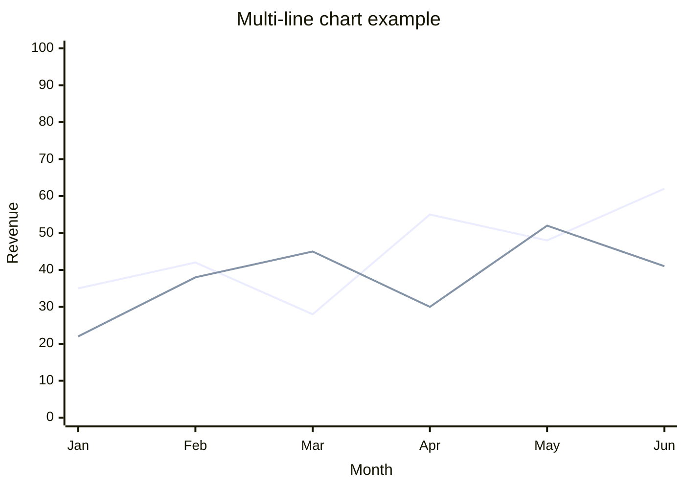

# Mermaid Visualizer

[English](README.md) | **日本語** | [繁體中文](README.zh-TW.md)

テキストコンテンツを **17 種類**の Mermaid 図に変換します — 主に Obsidian 11.4.1 のネイティブビューア向けに最適化していますが、出力は v11.4.1+ をサポートする任意の Mermaid 互換 renderer（GitHub、GitLab、Mermaid Live Editor、Notion、Confluence、HackMD、Docusaurus、MkDocs 等）に portable です。

## Why Obsidian-first?

この skill は最初から Obsidian ノート向けに設計されており — すべての syntax が Obsidian にバンドルされた Mermaid 11.4.1 に合わせて調整されており、Obsidian ネイティブビューア固有の quirk（例: architecture-beta の iconify CDN 依存）には専用の fallback policy が用意されています。v11.4.1 サブセットは**最も保守的な** Mermaid 方言です。新しい renderer は v11.4.1+ をベースラインとしてサポートしているため、出力はそのまま動作します。

## What this skill does

Obsidian のネイティブビューア（バンドル Mermaid 11.4.1）で正しく render される Mermaid 図を生成し、以下をカバーします：

- **Flow & conceptual**（6）: flowchart / circular flow / comparison / mindmap / sequence / state
- **Data visualization**（3）: xychart-beta / pie / quadrantChart
- **Structural**（6）: architecture-beta / block-beta / class / ER / C4 (Context/Container/Component) / gitgraph
- **Time**（2）: gantt / timeline

各タイプには `flow/`、`data-viz/`、`structural/`、`time/` 配下に専用 reference ファイルがあり、canonical syntax、設定オプション、Obsidian 11.4.1 互換性ノート、実例、タイプ別エラー予防策が含まれます。

## Obsidian 11.4.1 compatibility

この skill は **Obsidian にバンドルされた Mermaid 11.4.1**（2026 年 4 月時点）をターゲットにしており、これは Mermaid 最新版（11.14.0）から minor 約 10 バージョン遅れています。影響：

- Mermaid v11.5+ で追加された機能は**使用しない**（例: Neo look、`showDataLabelOutsideBar`、wardley-beta）
- `xychart-beta` の line `stroke-width: 0`（線が不可視）のような既知 bug には **fallback policy** が必要 — この skill が自動で適用
- タイプ別の完全な互換マトリクス: [`obsidian-compatibility.md`](obsidian-compatibility.md)

## Line chart の render に関するノート

折れ線グラフは named-line syntax を使えば **Obsidian 11.4.1 で正しく動作**します（2026 年 4 月にユーザー検証済み）：

```
line "series name" [values]
```



歴史的ノート: 2024 年の Obsidian Forum の報告では `stroke-width: 0` で線が不可視になるとされていましたが — これはむき出しの `line [values]` 形式（series name なし）に固有のもののようです。Named-line syntax（推奨デフォルト）は正しく render されます。

詳細: [`obsidian-compatibility.md § Line chart policy`](obsidian-compatibility.md)。

## Directory structure

```
obsidian-mermaid-visualizer/
├── SKILL.md                          # Router + Selection Tree + know-how
├── obsidian-common-quirks.md         # タイプ横断ルール (list syntax、subgraph 命名、バージョン地雷)
├── obsidian-compatibility.md         # 17 タイプ互換マトリクス + fallback policy
├── flow/                             # 6 個の flow/conceptual タイプファイル
├── data-viz/                         # 3 個の data-viz タイプファイル
├── structural/                       # 6 個の structural タイプファイル
├── time/                             # 2 個の time-viz タイプファイル
├── README.md
└── LICENSE
```

この構造は他の `obsidian/skills/*` で採用されている `references/` の慣例から**意図的に逸脱**しています。理由: 17 個のタイプ別ファイルは補助 reference ではなく、この skill のメインの route 対象コンテンツだからです。Anthropic の「reference は one level deep に保つ」ガイドラインに従い、単層 router（SKILL.md → タイプファイル）を採用。

## Quick reference — 17 タイプ一覧

| カテゴリ | Type | ファイル | Obsidian 11.4.1 |
|---|---|---|---|
| Flow | Flowchart | [flow/flowchart.md](flow/flowchart.md) | ✅ full |
| Flow | Circular flow | [flow/circular-flow.md](flow/circular-flow.md) | ✅ full |
| Flow | Comparison | [flow/comparison.md](flow/comparison.md) | ✅ full |
| Flow | Mindmap | [flow/mindmap.md](flow/mindmap.md) | ✅ full |
| Flow | Sequence | [flow/sequence.md](flow/sequence.md) | ✅ full |
| Flow | State | [flow/state.md](flow/state.md) | ✅ full |
| Data viz | XY Chart (bar) | [data-viz/xychart.md](data-viz/xychart.md) | ✅ full |
| Data viz | XY Chart (line) | [data-viz/xychart.md](data-viz/xychart.md) | ✅ full with named-line syntax |
| Data viz | Pie | [data-viz/pie.md](data-viz/pie.md) | ✅ full |
| Data viz | Quadrant | [data-viz/quadrant.md](data-viz/quadrant.md) | ✅ full |
| Structural | Architecture | [structural/architecture.md](structural/architecture.md) | 🟡 iconify CDN 依存 |
| Structural | Block | [structural/block.md](structural/block.md) | 🟡 テスト必要 |
| Structural | Class | [structural/class.md](structural/class.md) | ✅ full |
| Structural | ER | [structural/er.md](structural/er.md) | ✅ full |
| Structural | C4 | [structural/c4.md](structural/c4.md) | ✅ full |
| Structural | gitgraph | [structural/gitgraph.md](structural/gitgraph.md) | ✅ full |
| Time | Gantt | [time/gantt.md](time/gantt.md) | ✅ full |
| Time | Timeline | [time/timeline.md](time/timeline.md) | ✅ full |

## Original Source

- **Author**: [axtonliu](https://github.com/axtonliu)
- **Repository**: [axtonliu/axton-obsidian-visual-skills](https://github.com/axtonliu/axton-obsidian-visual-skills)
- **Plugin**: `obsidian-visual-skills`
- **Marketplace**: `axton-obsidian-visual-skills`

## Version history

- **v2.0.0**（2026-04-20）— 6 タイプから 17 タイプの図に拡張。data-viz（xychart / pie / quadrant）、structural（architecture / block / class / ER / C4 / gitgraph）、time-viz（gantt / timeline）の各カテゴリを追加。タイプ別ファイル + 単層 router 構造に再構成。Architecture-icon fallback policy をドキュメント化。すべての syntax を Mermaid 11.4.1（Obsidian バンドル版）に校正。Named-line syntax が xychart 折れ線グラフで正しく render されることをユーザー検証済み。
- **v1.x** — axtonliu によるオリジナル 6 タイプ版
