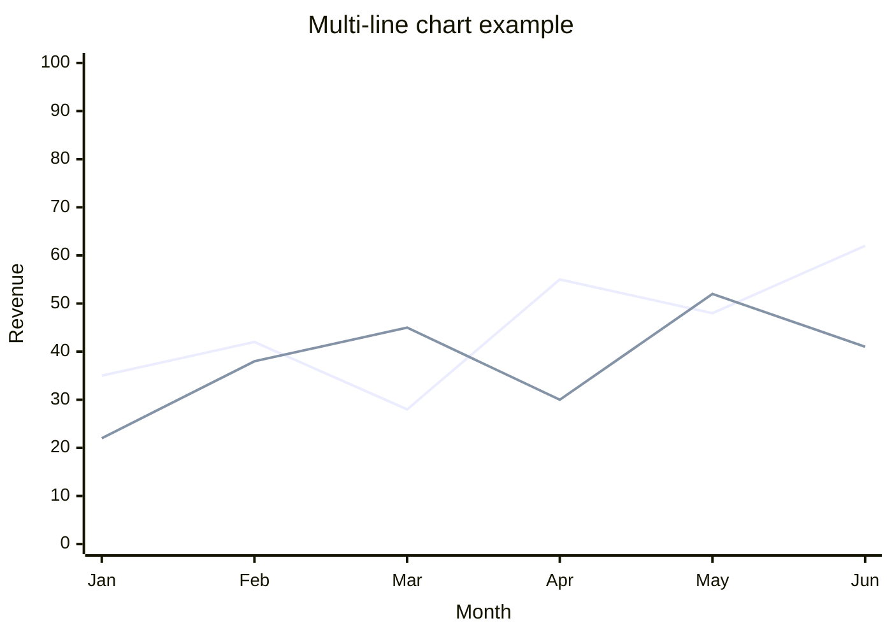

# Mermaid Visualizer

Transform text content into Mermaid diagrams across **17 diagram types** — primarily optimized for Obsidian 11.4.1 native viewer, but output is portable to any Mermaid-compatible renderer supporting v11.4.1+ (GitHub, GitLab, Mermaid Live Editor, Notion, Confluence, HackMD, Docusaurus, MkDocs, etc.).

## Why Obsidian-first?

This skill was designed from the ground up for Obsidian notes — all syntax is calibrated to Obsidian's bundled Mermaid 11.4.1, and quirks specific to Obsidian's native viewer (e.g., architecture-beta iconify CDN dependency) have dedicated fallback policies. The v11.4.1 subset is the **most conservative** Mermaid dialect; output works on newer renderers automatically since they support v11.4.1+ as a baseline.

## What this skill does

Produces Mermaid diagrams that render correctly in Obsidian's native viewer (bundled Mermaid 11.4.1), covering:

- **Flow & conceptual** (6): flowchart / circular flow / comparison / mindmap / sequence / state
- **Data visualization** (3): xychart-beta / pie / quadrantChart
- **Structural** (6): architecture-beta / block-beta / class / ER / C4 (Context/Container/Component) / gitgraph
- **Time** (2): gantt / timeline

Each type has a dedicated reference file under `flow/`, `data-viz/`, `structural/`, `time/` with canonical syntax, configuration options, Obsidian 11.4.1 compatibility notes, worked examples, and per-type error prevention.

## Obsidian 11.4.1 compatibility

This skill targets **Obsidian's bundled Mermaid 11.4.1** (as of April 2026), which lags about 10 minor versions behind Mermaid's latest (11.14.0). Implications:

- Features added in Mermaid v11.5+ are **not** used (e.g., Neo look, `showDataLabelOutsideBar`, wardley-beta)
- Known bugs like `xychart-beta` line `stroke-width: 0` (lines invisible) require **fallback policies** — implemented automatically by this skill
- Full compatibility matrix per diagram type: [`obsidian-compatibility.md`](obsidian-compatibility.md)

## Line chart rendering note

Line charts **work correctly in Obsidian 11.4.1** (user-verified April 2026) when using the named-line syntax:

```
line "series name" [values]
```



Historical note: a 2024 Obsidian Forum report suggested `stroke-width: 0` would make lines invisible — this appears specific to the bare `line [values]` form (without series name). Named-line syntax (recommended default) renders correctly.

Full details: [`obsidian-compatibility.md § Line chart policy`](obsidian-compatibility.md).

## Directory structure

```
obsidian-mermaid-visualizer/
├── SKILL.md                          # Router + Selection Tree + know-how
├── obsidian-common-quirks.md         # Cross-type rules (list syntax, subgraph naming, version landmines)
├── obsidian-compatibility.md         # 17-type compat matrix + fallback policies
├── flow/                             # 6 flow/conceptual type files
├── data-viz/                         # 3 data-viz type files
├── structural/                       # 6 structural type files
├── time/                             # 2 time-viz type files
├── README.md
└── LICENSE
```

This structure **intentionally deviates** from the `references/` convention used by other `obsidian/skills/*`. Rationale: the 17 per-type files are the skill's primary routed content, not auxiliary references. Single-layer router (SKILL.md → type file) per Anthropic's "keep references one level deep" guideline.

## Quick reference — 17 types at a glance

| Category | Type | File | Obsidian 11.4.1 |
|---|---|---|---|
| Flow | Flowchart | [flow/flowchart.md](flow/flowchart.md) | ✅ full |
| Flow | Circular flow | [flow/circular-flow.md](flow/circular-flow.md) | ✅ full |
| Flow | Comparison | [flow/comparison.md](flow/comparison.md) | ✅ full |
| Flow | Mindmap | [flow/mindmap.md](flow/mindmap.md) | ✅ full |
| Flow | Sequence | [flow/sequence.md](flow/sequence.md) | ✅ full |
| Flow | State | [flow/state.md](flow/state.md) | ✅ full |
| Data viz | XY Chart (bar) | [data-viz/xychart.md](data-viz/xychart.md) | ✅ full |
| Data viz | XY Chart (line) | [data-viz/xychart.md](data-viz/xychart.md) | ✅ full with named-line syntax |
| Data viz | Pie | [data-viz/pie.md](data-viz/pie.md) | ✅ full |
| Data viz | Quadrant | [data-viz/quadrant.md](data-viz/quadrant.md) | ✅ full |
| Structural | Architecture | [structural/architecture.md](structural/architecture.md) | 🟡 iconify CDN dependency |
| Structural | Block | [structural/block.md](structural/block.md) | 🟡 needs testing |
| Structural | Class | [structural/class.md](structural/class.md) | ✅ full |
| Structural | ER | [structural/er.md](structural/er.md) | ✅ full |
| Structural | C4 | [structural/c4.md](structural/c4.md) | ✅ full |
| Structural | gitgraph | [structural/gitgraph.md](structural/gitgraph.md) | ✅ full |
| Time | Gantt | [time/gantt.md](time/gantt.md) | ✅ full |
| Time | Timeline | [time/timeline.md](time/timeline.md) | ✅ full |

## Original Source

- **Author**: [axtonliu](https://github.com/axtonliu)
- **Repository**: [axtonliu/axton-obsidian-visual-skills](https://github.com/axtonliu/axton-obsidian-visual-skills)
- **Plugin**: `obsidian-visual-skills`
- **Marketplace**: `axton-obsidian-visual-skills`

## Version history

- **v2.0.0** (2026-04-20) — Expanded from 6 to 17 diagram types. Added data-viz (xychart / pie / quadrant), structural (architecture / block / class / ER / C4 / gitgraph), and time-viz (gantt / timeline) categories. Restructured into per-type files with single-layer router. Architecture-icon fallback policy documented. Calibrated all syntax to Mermaid 11.4.1 (Obsidian's bundled version). User-verified named-line syntax renders correctly for xychart line charts.
- **v1.x** — Original 6-type version by axtonliu
