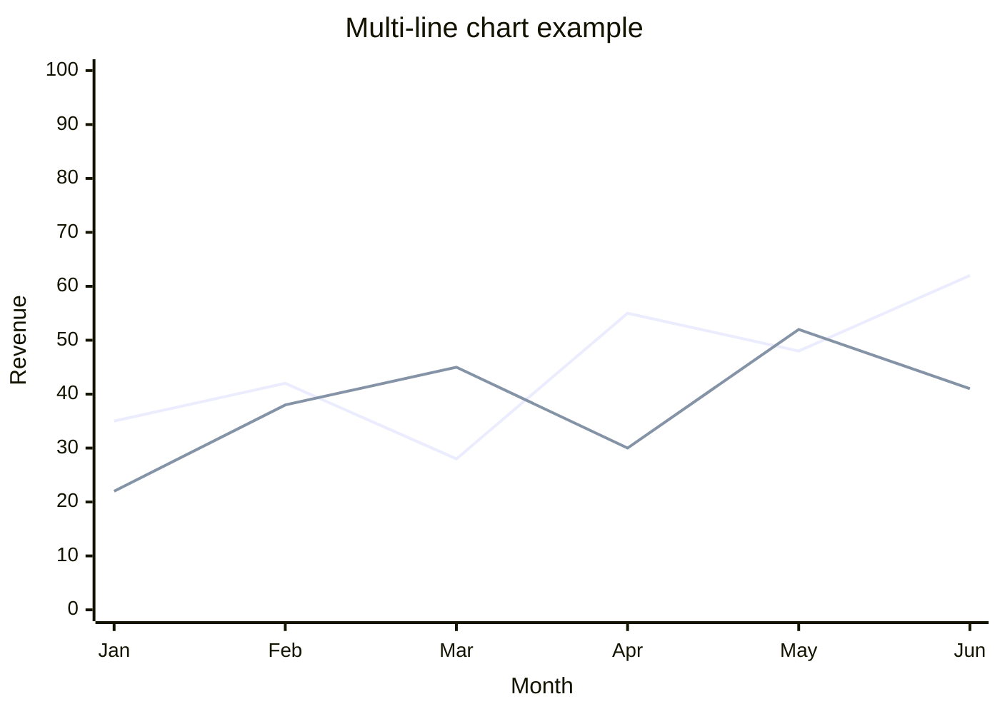

# Mermaid Visualizer

[English](README.md) | [日本語](README.ja.md) | **繁體中文**

將文字內容轉換為 **17 種類型**的 Mermaid 圖表 — 主要針對 Obsidian 11.4.1 原生檢視器最佳化，輸出亦可移植至任何支援 v11.4.1+ 的 Mermaid 渲染器（GitHub、GitLab、Mermaid Live Editor、Notion、Confluence、HackMD、Docusaurus、MkDocs 等）。

## Why Obsidian-first?

本 skill 從一開始就為 Obsidian 筆記設計 — 所有 syntax 皆針對 Obsidian 內建的 Mermaid 11.4.1 校準，且 Obsidian 原生檢視器特有的 quirk（例如 architecture-beta 對 iconify CDN 的相依性）皆有專屬的 fallback policy。v11.4.1 子集是**最保守**的 Mermaid 方言；輸出可在較新版渲染器自動運作，因為它們以 v11.4.1+ 為基準支援。

## What this skill does

產生可在 Obsidian 原生檢視器（內建 Mermaid 11.4.1）正確渲染的 Mermaid 圖表，涵蓋：

- **Flow & conceptual**（6）：flowchart / circular flow / comparison / mindmap / sequence / state
- **Data visualization**（3）：xychart-beta / pie / quadrantChart
- **Structural**（6）：architecture-beta / block-beta / class / ER / C4 (Context/Container/Component) / gitgraph
- **Time**（2）：gantt / timeline

每種類型在 `flow/`、`data-viz/`、`structural/`、`time/` 下皆有專屬參考檔，內含 canonical syntax、設定選項、Obsidian 11.4.1 相容性註記、實作範例與每類型的錯誤防範。

## Obsidian 11.4.1 compatibility

本 skill 鎖定 **Obsidian 內建的 Mermaid 11.4.1**（截至 2026 年 4 月），落後 Mermaid 最新版（11.14.0）約 10 個 minor 版本。影響：

- Mermaid v11.5+ 新增的功能**不**使用（例如 Neo look、`showDataLabelOutsideBar`、wardley-beta）
- 已知 bug 如 `xychart-beta` 折線 `stroke-width: 0`（線條不可見）需要 **fallback policy** — 由本 skill 自動套用
- 各類型完整相容性矩陣：[`obsidian-compatibility.md`](obsidian-compatibility.md)

## Line chart 渲染註記

折線圖在使用 named-line syntax 時**可在 Obsidian 11.4.1 正確運作**（2026 年 4 月經使用者驗證）：

```
line "series name" [values]
```



歷史註記：2024 年 Obsidian Forum 有報告指出 `stroke-width: 0` 會導致線條不可見 — 此問題似乎只發生在裸寫的 `line [values]` 形式（無 series name）。Named-line syntax（建議的預設寫法）渲染正常。

完整細節：[`obsidian-compatibility.md § Line chart policy`](obsidian-compatibility.md)。

## Directory structure

```
obsidian-mermaid-visualizer/
├── SKILL.md                          # Router + Selection Tree + know-how
├── obsidian-common-quirks.md         # 跨類型規則（list syntax、subgraph 命名、版本地雷）
├── obsidian-compatibility.md         # 17 類型相容矩陣 + fallback policy
├── flow/                             # 6 個 flow/conceptual 類型檔
├── data-viz/                         # 3 個 data-viz 類型檔
├── structural/                       # 6 個 structural 類型檔
├── time/                             # 2 個 time-viz 類型檔
├── README.md
└── LICENSE
```

此結構**刻意偏離**其他 `obsidian/skills/*` 採用的 `references/` 慣例。理由：17 個按類型切分的檔案是本 skill 主要被 route 的內容，而非輔助參考。依 Anthropic 的「reference 維持 one level deep」指引，採用單層 router（SKILL.md → 類型檔）。

## Quick reference — 17 種類型一覽

| 類別 | Type | 檔案 | Obsidian 11.4.1 |
|---|---|---|---|
| Flow | Flowchart | [flow/flowchart.md](flow/flowchart.md) | ✅ full |
| Flow | Circular flow | [flow/circular-flow.md](flow/circular-flow.md) | ✅ full |
| Flow | Comparison | [flow/comparison.md](flow/comparison.md) | ✅ full |
| Flow | Mindmap | [flow/mindmap.md](flow/mindmap.md) | ✅ full |
| Flow | Sequence | [flow/sequence.md](flow/sequence.md) | ✅ full |
| Flow | State | [flow/state.md](flow/state.md) | ✅ full |
| Data viz | XY Chart (bar) | [data-viz/xychart.md](data-viz/xychart.md) | ✅ full |
| Data viz | XY Chart (line) | [data-viz/xychart.md](data-viz/xychart.md) | ✅ full with named-line syntax |
| Data viz | Pie | [data-viz/pie.md](data-viz/pie.md) | ✅ full |
| Data viz | Quadrant | [data-viz/quadrant.md](data-viz/quadrant.md) | ✅ full |
| Structural | Architecture | [structural/architecture.md](structural/architecture.md) | 🟡 iconify CDN 相依 |
| Structural | Block | [structural/block.md](structural/block.md) | 🟡 待測試 |
| Structural | Class | [structural/class.md](structural/class.md) | ✅ full |
| Structural | ER | [structural/er.md](structural/er.md) | ✅ full |
| Structural | C4 | [structural/c4.md](structural/c4.md) | ✅ full |
| Structural | gitgraph | [structural/gitgraph.md](structural/gitgraph.md) | ✅ full |
| Time | Gantt | [time/gantt.md](time/gantt.md) | ✅ full |
| Time | Timeline | [time/timeline.md](time/timeline.md) | ✅ full |

## Original Source

- **Author**：[axtonliu](https://github.com/axtonliu)
- **Repository**：[axtonliu/axton-obsidian-visual-skills](https://github.com/axtonliu/axton-obsidian-visual-skills)
- **Plugin**：`obsidian-visual-skills`
- **Marketplace**：`axton-obsidian-visual-skills`

## Version history

- **v2.0.0**（2026-04-20）— 從 6 種擴充至 17 種圖表類型。新增 data-viz（xychart / pie / quadrant）、structural（architecture / block / class / ER / C4 / gitgraph）與 time-viz（gantt / timeline）類別。重構為 per-type 檔案配單層 router。Architecture-icon fallback policy 已記錄。所有 syntax 校準至 Mermaid 11.4.1（Obsidian 內建版本）。經使用者驗證 named-line syntax 在 xychart 折線圖可正確渲染。
- **v1.x** — 由 axtonliu 製作的原始 6 類型版本
