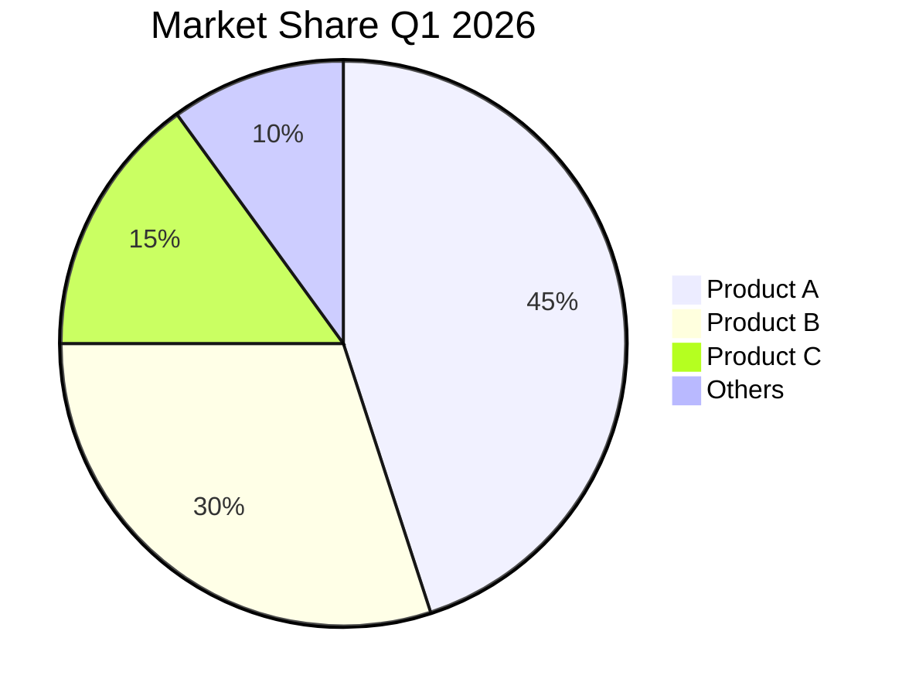
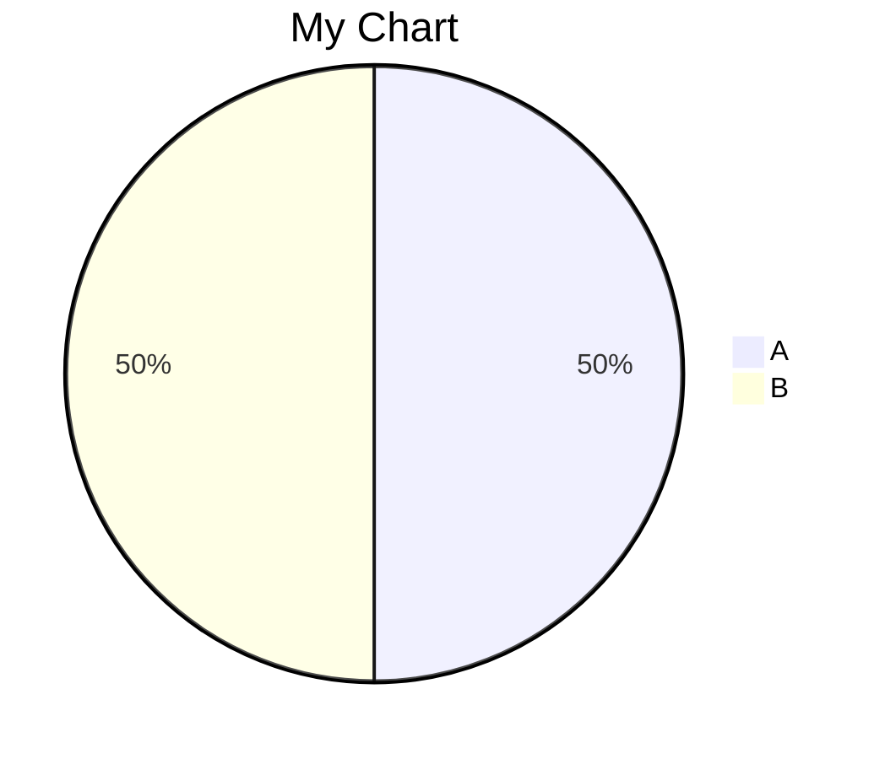
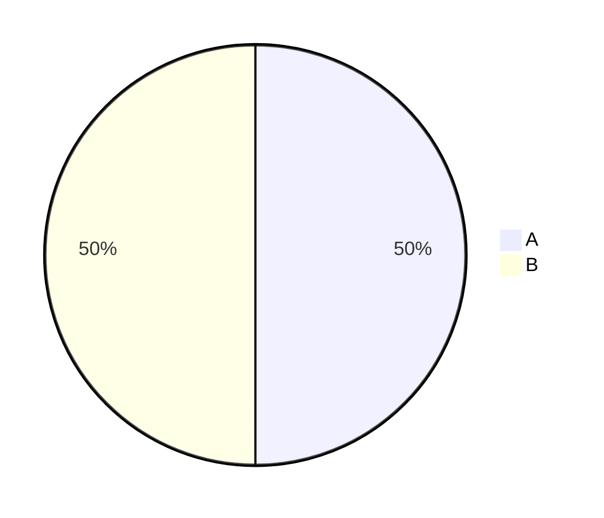
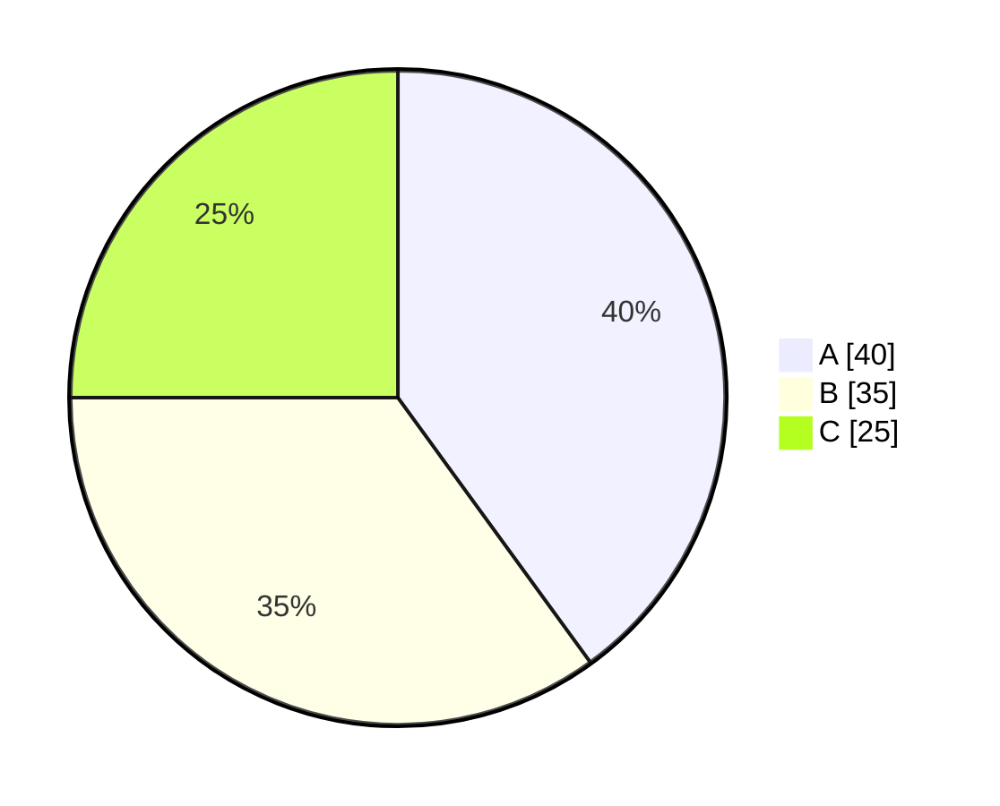
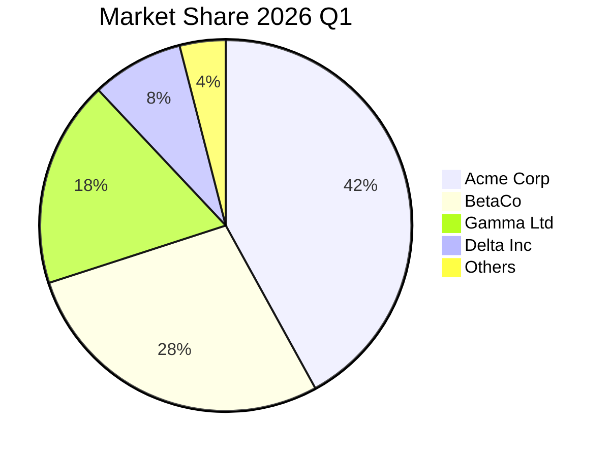
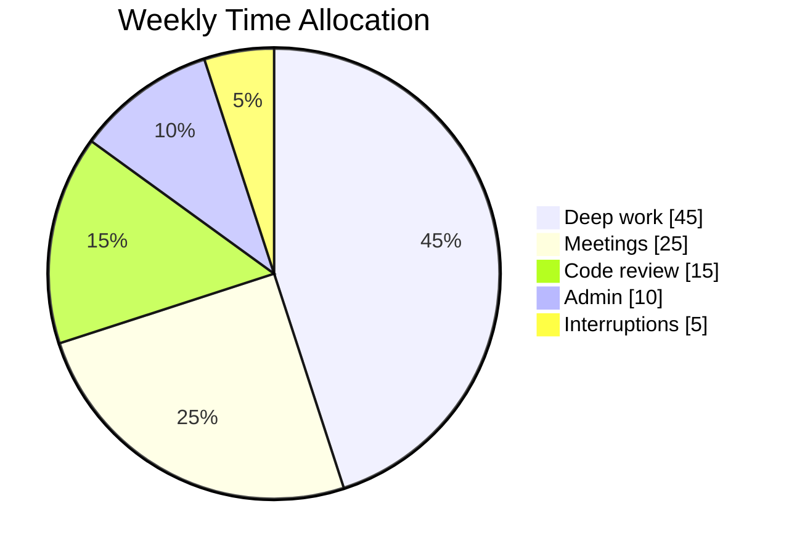
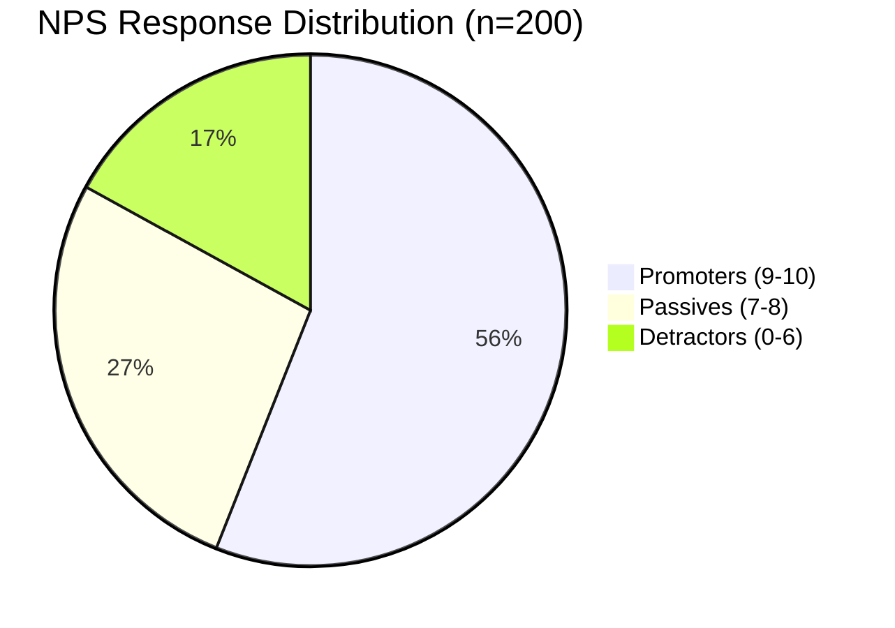
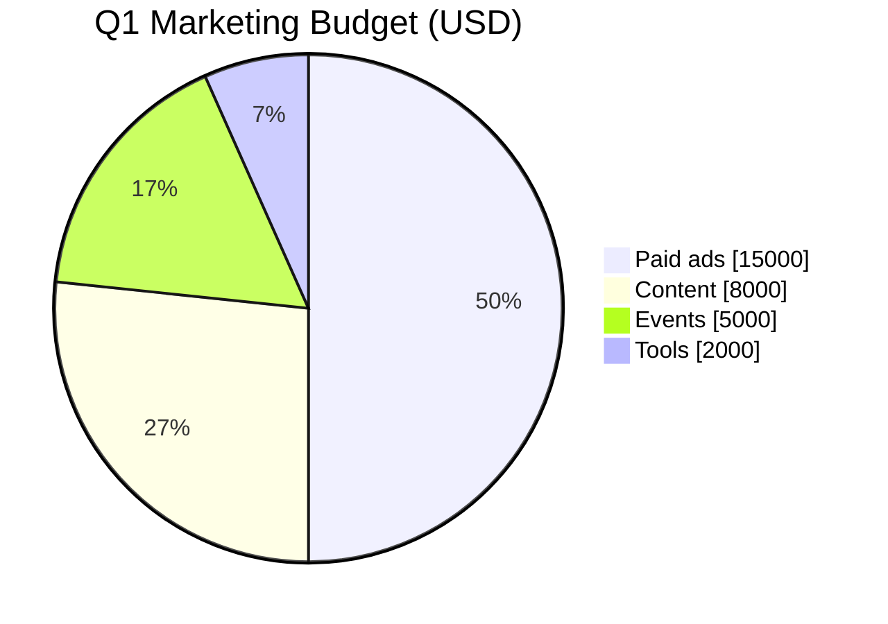

# Pie Chart

Proportion of a whole — market share, survey responses, time allocation.

## When to use

**Best for**:
- Proportion / percentage breakdown of a total (≤6 categories for readability)
- Market share, budget allocation, time spent, survey response distribution
- When the absolute values matter less than the relative ratios

**User query 關鍵字**: pie / pie chart / proportion / 比例 / 圓餅圖 / percentage / distribution / 分布

**Not for**: trends over time (use `data-viz/xychart.md`), >6 categories (legend becomes unreadable — use bar chart), cross-category comparisons (use `data-viz/xychart.md`).

## Canonical syntax

**Minimum required**:
- `pie` directive on line 1
- At least one `"Label" : value` line

Values can be any numeric — Mermaid normalizes to percentages automatically. `45` is interpreted as 45% if the total is 100, or 45/n if the total is n.

## Configuration options

### With / without title

Or no title:

### Show data on slices

`showData` adds numeric values on each slice (in addition to the legend).

## Obsidian 11.4.1 compatibility

- **Status**: ✅ Full support — pie is one of Mermaid's oldest / most stable types
- **Known quirks**:
  - Slice-label quoting: slice labels with spaces or special characters require `"..."` quotes
  - **Title must NOT be quoted** — the pie title is free-form text to end of line; wrapping it in `"..."` prints the quote characters literally (same bug class as the quadrant title). Leave it bare.
  - Too many slices (>6) makes the legend hard to read — not a technical limit but a design recommendation
- **Workaround**: none needed

## Quote rule for pie

Pie has **opposite quoting rules for slices vs the title** — verified with mermaid-cli (2026-06):

- **Slice labels** (always quote): `"Label" : value` — quotes are stripped, render clean; required for spaces / CJK.
- **Title** (never quote): `pie title 市場佔有率` / `pie title Market Share Q1 2026`. The title reads to end of line, so multi-word and CJK titles work bare. ⚠️ Quoting it (`pie title "..."`) renders the `"` **literally** — confirmed for ASCII and CJK alike.

CJK is fine in both positions with this rule: quote the slices, leave the title bare.

## Worked examples

### Example 1: Market share

### Example 2: Time allocation (percentage)

### Example 3: Survey response distribution

### Example 4: Budget breakdown (dollar amounts)

## Error prevention

| ❌ Wrong | ✅ Right | Reason |
|---|---|---|
| `"Label" 50` (no colon) | `"Label" : 50` | Colon is required separator |
| Unquoted label with spaces | `"Label with spaces" : 50` | Quotes required for multi-word labels |
| Non-numeric value | Use integer or decimal `42` or `42.5` | Values must be numeric |
| >8 slices | Consider merging small categories into "Others" | Legend becomes cluttered |
| `pie title "My Chart"` (quoted title) | `pie title My Chart` | Quoting the title prints the `"` literally — title is free-form to end of line, never quote it |

### Pre-save validation

- [ ] `pie` declared on line 1
- [ ] Each data line uses `"Label" : value` format with colon
- [ ] Slice labels with spaces / CJK are quoted
- [ ] Title is NOT quoted (bare text to end of line; quoting prints literal `"`)
- [ ] Values are numeric
- [ ] ≤6 slices for readability (merge small ones into "Others" if needed)
- [ ] `showData` added if exact values are important to show

See also [obsidian-common-quirks.md](../obsidian-common-quirks.md) for universal rules.
