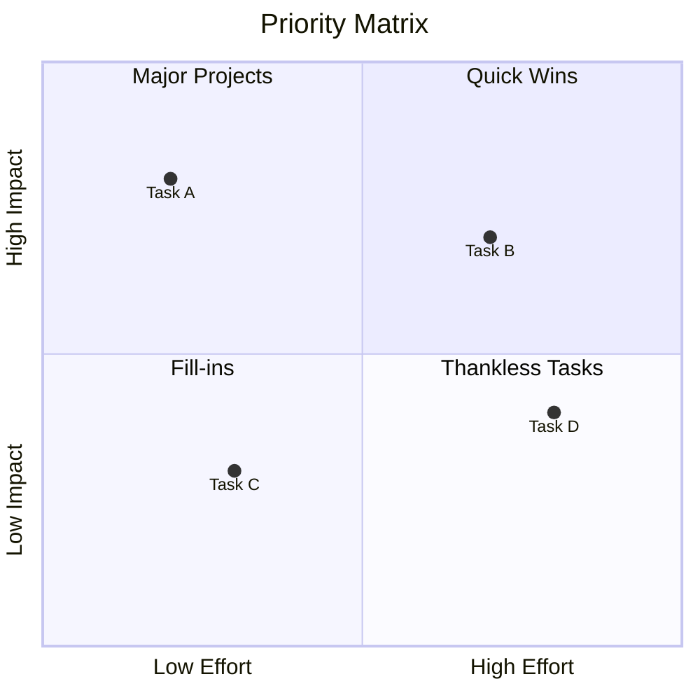
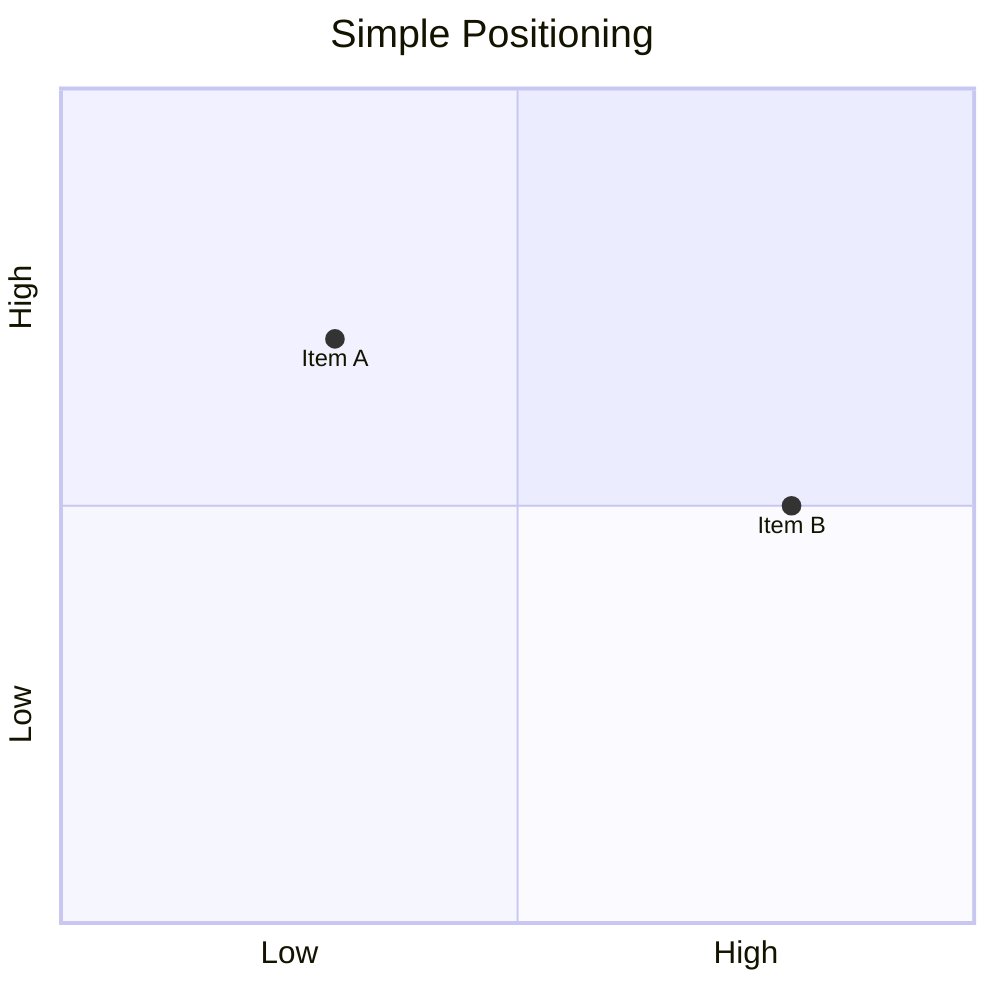
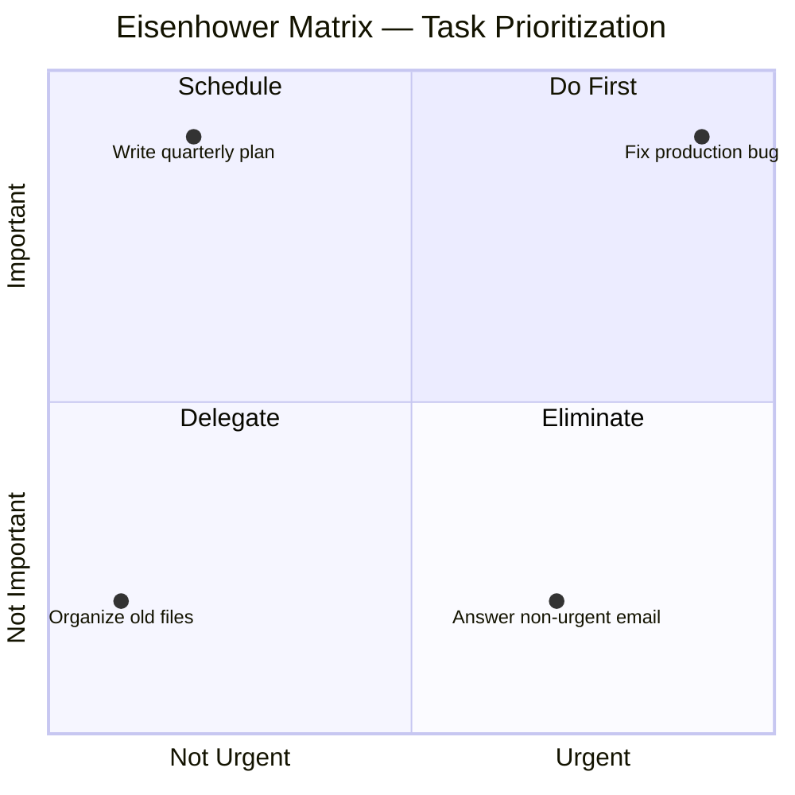
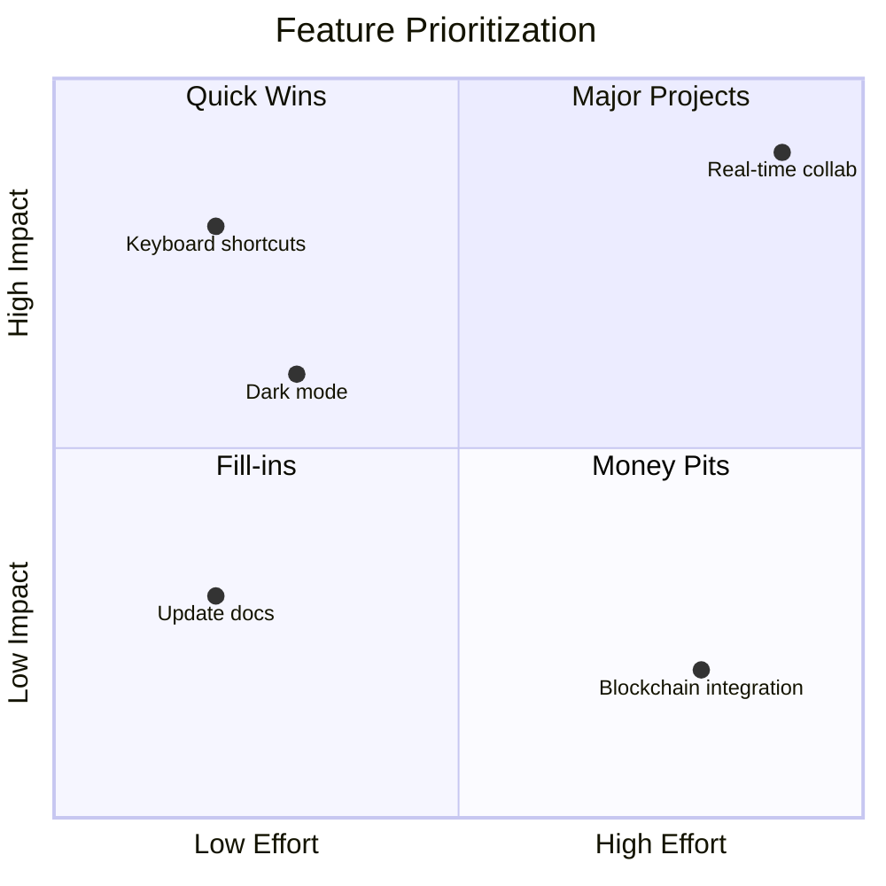
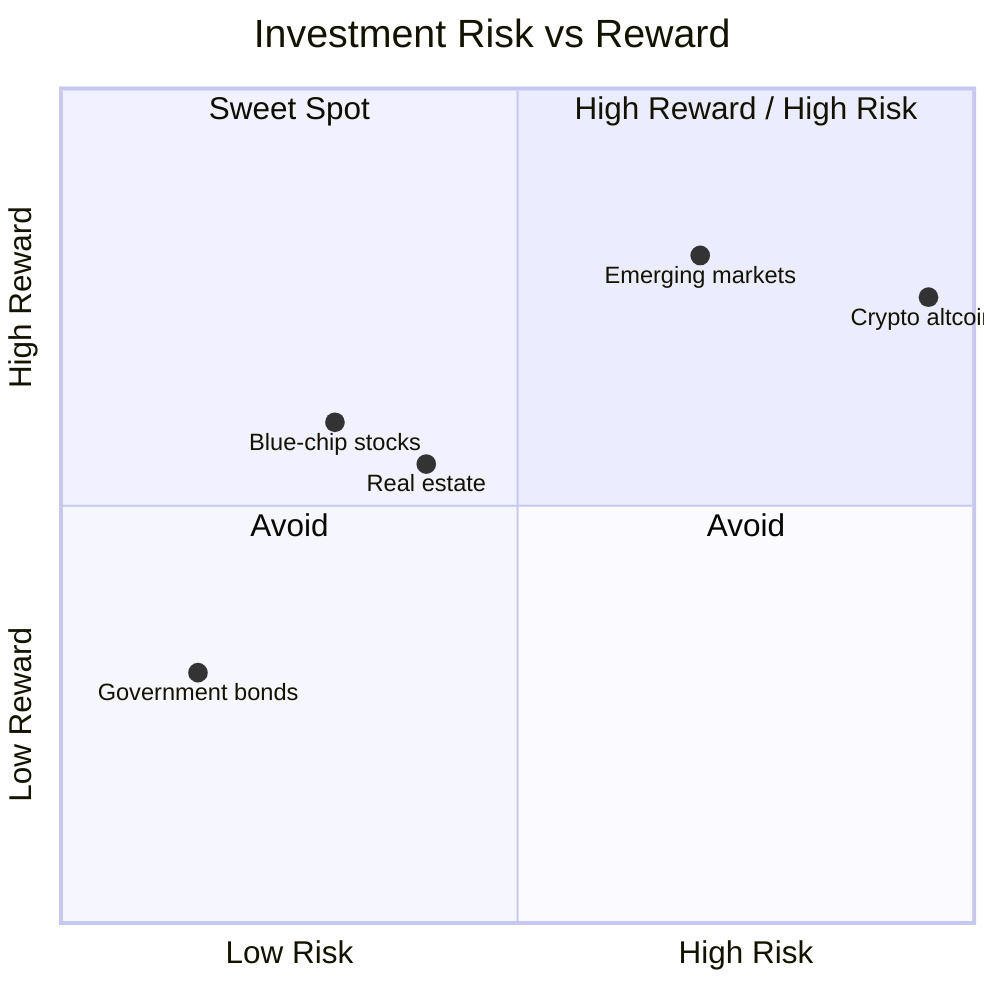
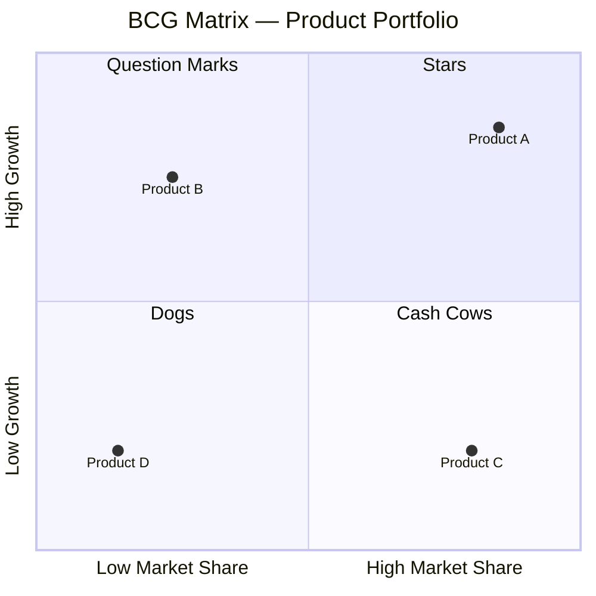

# Quadrant Chart (quadrantChart)

2×2 positioning analysis — Eisenhower matrix, risk/reward, impact/effort, BCG matrix.

## When to use

**Best for**:
- 2×2 strategic matrices (Eisenhower urgent/important, Ansoff matrix, BCG matrix)
- Impact / effort prioritization
- Risk / reward positioning
- Importance / urgency task classification
- Any two-axis continuous positioning with named quadrants

**User query 關鍵字**: quadrant / 2x2 matrix / Eisenhower / impact effort / risk reward / priority matrix / 象限 / 矩陣 / 優先度

**Not for**: single-axis ranking (use `data-viz/xychart.md`), >2 axes (use a table or multiple charts), discrete non-positional items (use `flow/mindmap.md`).

## Canonical syntax



**Minimum required**:
- `quadrantChart` directive
- `x-axis LEFT --> RIGHT` and `y-axis BOTTOM --> TOP` labels
- At least one data point `"Name": [x, y]`

**Coordinate system**: 0,0 = bottom-left corner; 1,1 = top-right corner. All values normalized 0–1.

**Quadrant numbering**: Mermaid's convention places `quadrant-1` in top-right (high-x, high-y), clockwise:
- `quadrant-1`: top-right (High x, High y)
- `quadrant-2`: top-left (Low x, High y)
- `quadrant-3`: bottom-left (Low x, Low y)
- `quadrant-4`: bottom-right (High x, Low y)

## Configuration options

### Without quadrant labels



Quadrant labels are optional; if omitted the 4 regions are unlabeled (still visually divided).

### Custom styling (Mermaid init block)

```mermaid
%%{init: {'quadrantChart': {'chartWidth': 600, 'chartHeight': 600}}}%%
quadrantChart
    ...
```

Width / height customization. Not all init options work reliably in Obsidian 11.4.1; test before relying.

## Obsidian 11.4.1 compatibility

- **Status**: ✅ Full support — quadrantChart added in v10.6, stable
- **Known quirks**:
  - Point labels overlapping when points are close together — spread coordinates manually
  - Long quadrant labels may get truncated — use concise phrasing (2-3 words)
- **Workaround**: none needed for standard use

## Quote rule for quadrant

Mixed quoting convention — only **data points** take quoted labels; axis / title / quadrant labels are unquoted free-form text (quoting them causes the quotes to render literally):

- **Data points** (always quote): `"Name": [x, y]` ✅
- **Title** (unquoted, free-form): `title Priority Matrix` ✅ — do NOT quote
- **Axis labels** (unquoted, free-form): `x-axis Low Effort --> High Effort` ✅ — do NOT quote
- **Quadrant labels** (unquoted, free-form): `quadrant-1 Quick Wins` ✅ — do NOT quote

This is the opposite of `xychart-beta` where title and axis names ARE quoted. The divergence is intentional per each diagram type's parser. Quadrant data-point labels follow the unified quote rule because they are the user-visible items whose quoting is required for spaces and CJK.

## Worked examples

### Example 1: Eisenhower matrix (urgent × important)



### Example 2: Impact / effort prioritization



### Example 3: Risk / reward assessment



### Example 4: BCG matrix (market share × growth)



## Error prevention

| ❌ Wrong | ✅ Right | Reason |
|---|---|---|
| `x-axis "Low" to "High"` | `x-axis Low --> High` | Must use `-->` arrow, not `to` |
| Point `"Name" (0.5, 0.5)` | `"Name": [0.5, 0.5]` | Colon + square brackets required |
| Coordinate outside `[0, 1]` range | Normalize to 0–1 scale | Values outside this range won't render |
| Mixing quadrant-N with skipping numbers | Define all 4 or none (for labeled quadrants) | Partial definitions may render inconsistently |
| Confusing quadrant numbering (thinking counter-clockwise from top-left) | Quadrant 1 is top-RIGHT; clockwise: top-right → top-left → bottom-left → bottom-right | Common mistake — verify against Mermaid docs |

### Pre-save validation

- [ ] `quadrantChart` declared on line 1
- [ ] x-axis and y-axis both defined with `-->` syntax
- [ ] All data points use `"Name": [x, y]` with coordinates in `[0, 1]` range
- [ ] Quadrant labels either all 4 defined or all 4 omitted (avoid partial)
- [ ] Quadrant labels ≤ 3 words to prevent truncation
- [ ] Point names quoted if contain spaces

See also [obsidian-common-quirks.md](../obsidian-common-quirks.md) for universal rules.
